R for Generalized Linear Regression Models
================
Eric R. Schuler, Ph.D.
2022-10-17

# R for Generalized Linear Regression Models

## Workshop Description

There are times in which our dependent variable is not a continuous
variable but rather binary, categorical, or count, which means we need
to use generalized linear models for regression. This workshop will
cover logistic/probit, multinomial, ordinal, and Poisson regressions. We
will cover how to run the models and assess assumptions. This workshop
assumes familiarity with R (if not, please see our On-Demand Workshop on
Using R). Additional resources will be provided.

## Learning Outcomes

At the end of this workshop, attendees will be able to:

- Implement code to assess assumptions for generalized linear models

- Analyze binary, multinomial, ordinal, and count data using generalized
  linear models

- Interpret the results from generalized linear models

**Please note:** Some of the code has been adapted from UCLA’s Office of
Advanced Research Computing (https://stats.oarc.ucla.edu/#).

Install libraries and set-up session

``` r
#Installation code
knitr::opts_chunk$set(echo = TRUE)

#install code
list.of.packages <- c("tidyverse","reshape2","sandwich","msm",
                      "MBESS","car", "sem", "performance","see",
                  "patchwork","DescTools","nnet","MASS","plyr",
                  "brant","Hmisc","janitor","psych","broom")
#If you do not already have the package installed, the package is retained
new.packages <- list.of.packages[!(list.of.packages %in% installed.packages()[,"Package"])]
#Install packages that are not previously installed
if(length(new.packages)) install.packages(new.packages,repos = "http://cran.us.r-project.org")

# load libraries
library(tidyverse)
```

    ── Attaching packages ─────────────────────────────────────── tidyverse 1.3.2 ──
    ✔ ggplot2 3.3.6     ✔ purrr   0.3.4
    ✔ tibble  3.1.6     ✔ dplyr   1.0.9
    ✔ tidyr   1.2.0     ✔ stringr 1.4.0
    ✔ readr   2.1.2     ✔ forcats 0.5.1
    ── Conflicts ────────────────────────────────────────── tidyverse_conflicts() ──
    ✖ dplyr::filter() masks stats::filter()
    ✖ dplyr::lag()    masks stats::lag()

``` r
library(janitor)
```


    Attaching package: 'janitor'

    The following objects are masked from 'package:stats':

        chisq.test, fisher.test

``` r
library(see)
library(performance)
library(psych)
```


    Attaching package: 'psych'

    The following objects are masked from 'package:ggplot2':

        %+%, alpha

``` r
library(MASS)
```


    Attaching package: 'MASS'

    The following object is masked from 'package:dplyr':

        select

``` r
library(broom)

# turn off scientific notations
options(scipen = 999)
```

Set working directory

``` r
setwd("C:/Users/eschuler/Desktop/R for Generalized Linear Regressions 2022/")
```

Dataset:

The Holzinger and Swineford (1939), or HS here, is a dataset that
consists of 301 participants who took 26 different tests to measure
spatial, verbal, mental speed, memory, and mathematical ability.
Participants were from two schools.

Load in the formatted R dataset

``` r
HS <- readRDS(file = "hs_glrm.rds")
```

# Logit/Probit Regression Models

Logistic regression or logit regression is a type of probabilistic
statistical classification model. It is used for predicting the outcome
of a categorical dependent variable, based on one or more predictor
variables. Frequently, logistic regression is used to refer specifically
to the problem in which the dependent variable is binary - that is, the
number of available categories is two. However, in problems with more
than two categories, the model is referred to as multinomial logistic
regression or, if the multiple categories are ordered, as ordered
logistic regression. Both of these extensions are covered later.

A probit model is a type of regression where the dependent variable can
usually only take two values. The purpose of the model is to estimate
the probability that an observation with particular characteristics will
fall into a specific one of the categories. It is a popular
specification for an ordinal or a binary response model. In this
capacity, it treats the same set of problems as does a logistic
regression and it employs similar techniques.

The difference between the probit and the logit models lies in the
assumptions they make about the distribution of the prediction errors.
The former assumes a normal distribution, while the latter assumes a
logistic probability distribution. Also, the logit and probit models
produce almost similar goodness-of-fit measures but their parameter
estimates differ.

<figure>

<figcaption aria-hidden="true">PDF of standard normal distributions
compared to standard logistic distributions</figcaption>
</figure>

Which one to choose? There is no right or wrong answer per se. Results
tend to be very similar and the preference for one over the other tends
to vary by discipline. It can be misleading to compare coefficients
across models because the variance of the underlying latent (prediction)
variable is not identified and can differ across models.

How are discrete choice models different from a linear regression

Probit/Logit regression is very similar to linear regression, however
linear regression uses a continuous variable as the dependent variable
in the model. In logistic/probit regression, the dependent variable is
binary (or categorical). For example, if you are interested in looking
at how race/ethnicity, education, and sex predict respondents’ answers
to a yes/no survey question, logistic/probit regression would be a great
method to use. Keep in mind that while the dependent variable is always
binary (categorical), the independent, or predictor, variables can be
either continuous or discrete.

<figure>
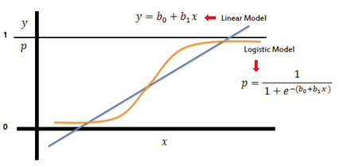
<figcaption aria-hidden="true">Comparing the linear regression line with
a logistic regression sigmoid</figcaption>
</figure>

<u>Before we continue, please NEVER EVER EVER DICHOTOMIZE A CONTINUOUS
VARIABLE!! There is honestly never a good reason for it, seriously, I
mean never!</u>

<div
fig-alt="A skeleton on a bench with the caption &quot;waiting for people to stop unnecessarily dichotomizing their variables&quot;"
fig-align="center">

[](https://twitter.com/ChelseaParlett/status/1578028805461090304)

Credit: @ChelseaParlett

</div>

First we will check the counts of the variables of interest

Descriptive statistics for our continuous variable

``` r
describe(HS[,"t4_lozenges"])
```

       vars   n mean   sd median trimmed   mad min max range skew kurtosis   se
    X1    1 301   18 9.05     17   17.59 10.38   2  36    34 0.38    -0.91 0.52

Frequency table for school

``` r
tabyl(HS$school)
```

       HS$school   n   percent
     Grant-White 145 0.4817276
         Pasteur 156 0.5182724

The goal of logit and probit regressions is different from OLS because
the dependent variable is not continuous. In discrete choice models, we
are predicting the likelihood that Y is equal to 1 (rather than 0),
given certain values of X. That is, if X and Y have a positive linear
relationship, the probability that a person will have a score of Y=1
will increase as values of X increase. So, instead of predicting the
scores of the dependent variable as we do with OLS regression, we are
instead predicting probabilities that an event will occur.

Logit syntax:

``` r
log_fit <- glm(visual_binary ~ t4_lozenges + school,
                   family = "binomial", data = HS)
```

Probit syntax:

``` r
probit_fit <- glm(visual_binary ~ t4_lozenges + school,
                  family = binomial(link = "probit"),
                  data = HS)
```

Model Fit

Instead of using R-square as the statistic for overall model fit in
logit/probit regression, we use a Chi-square test to get the deviation.
Chi-square is a test that measures the fit of the observed values to the
expected values. The bigger the difference of the observed from the
expected values, the poorer the fit of the model. Therefore we want a
small deviance.

Assess model fit

Logit Model Summary

``` r
summary(log_fit)
```


    Call:
    glm(formula = visual_binary ~ t4_lozenges + school, family = "binomial", 
        data = HS)

    Deviance Residuals: 
        Min       1Q   Median       3Q      Max  
    -1.9808  -1.0620   0.6066   1.0209   1.6175  

    Coefficients:
                  Estimate Std. Error z value     Pr(>|z|)    
    (Intercept)   -1.05039    0.29129  -3.606     0.000311 ***
    t4_lozenges    0.08939    0.01579   5.663 0.0000000149 ***
    schoolPasteur -0.30007    0.25644  -1.170     0.241937    
    ---
    Signif. codes:  0 '***' 0.001 '**' 0.01 '*' 0.05 '.' 0.1 ' ' 1

    (Dispersion parameter for binomial family taken to be 1)

        Null deviance: 408.59  on 300  degrees of freedom
    Residual deviance: 370.71  on 298  degrees of freedom
    AIC: 376.71

    Number of Fisher Scoring iterations: 4

Obtain pseudo-R-squared

``` r
DescTools::PseudoR2(log_fit, which = c("McFadden", "McFaddenAdj", "CoxSnell", "Nagelkerke"))
```

       McFadden McFaddenAdj    CoxSnell  Nagelkerke 
     0.09271934  0.07803475  0.11826312  0.15923765 

Another function for pseudo-R-squared

``` r
r2(log_fit)
```

    # R2 for Logistic Regression
      Tjur's R2: 0.122

More detailed version

``` r
model_performance(log_fit)
```

    # Indices of model performance

    AIC     |     BIC | Tjur's R2 |  RMSE | Sigma | Log_loss | Score_log | Score_spherical |   PCP
    ----------------------------------------------------------------------------------------------
    376.707 | 387.829 |     0.122 | 0.461 | 1.115 |    0.616 |  -170.015 |           0.003 | 0.573

provide detailed adds

``` r
log_results_diag <- augment(log_fit)
log_results_diag
```

    # A tibble: 301 × 9
       visual_binary t4_loze…¹ school  .fitted .resid .std.…²    .hat .sigma .cooksd
       <fct>             <int> <fct>     <dbl>  <dbl>   <dbl>   <dbl>  <dbl>   <dbl>
     1 No                    3 Paste… -1.08    -0.764  -0.770 0.0170    1.12 0.00199
     2 Yes                  17 Paste…  0.169    1.11    1.11  0.00772   1.12 0.00221
     3 No                   15 Paste… -0.00959 -1.17   -1.18  0.00838   1.12 0.00281
     4 Yes                  24 Paste…  0.795    0.863   0.867 0.00821   1.12 0.00126
     5 Yes                   7 Paste… -0.725    1.50    1.51  0.0139    1.11 0.00982
     6 Yes                  18 Paste…  0.259    1.07    1.07  0.00753   1.12 0.00197
     7 No                    8 Paste… -0.635   -0.922  -0.928 0.0131    1.12 0.00237
     8 Yes                  15 Paste… -0.00959  1.18    1.19  0.00838   1.12 0.00287
     9 No                   12 Paste… -0.278   -1.06   -1.07  0.0100    1.12 0.00258
    10 No                    6 Paste… -0.814   -0.856  -0.863 0.0147    1.12 0.00224
    # … with 291 more rows, and abbreviated variable names ¹​t4_lozenges,
    #   ²​.std.resid

Logistic Regression Model Checks

Quick visual

``` r
par(mfrow = c(2,2))
plot(log_fit)
```

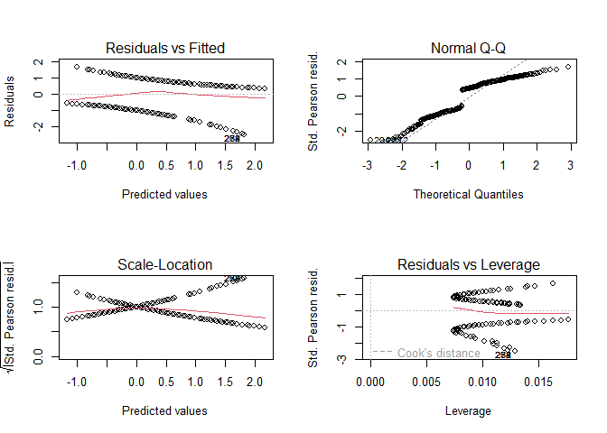

``` r
par(mfrow = c(1,1))
```

``` r
check_model(log_fit)
```

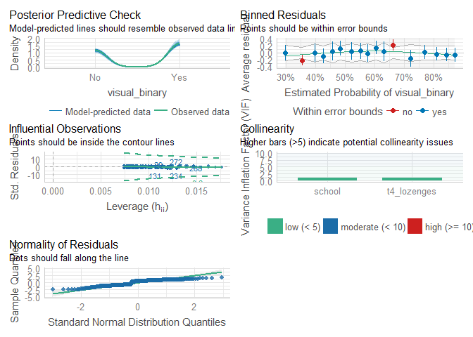

compare our model with an empty model

1.  Calculate difference in deviance

``` r
with(log_fit, null.deviance-deviance)
```

    [1] 37.88434

2.  Calculate degrees of freedom for the difference

``` r
with(log_fit, df.null - df.residual)
```

    [1] 2

3.  obtian the p-value

``` r
with(log_fit,pchisq(null.deviance-deviance, df.null - df.residual, lower.tail = FALSE))
```

    [1] 0.000000005936358

4.  Loglikelihood ratio test

``` r
logLik(log_fit)
```

    'log Lik.' -185.3536 (df=3)

Probit Model Summary

``` r
summary(probit_fit)
```


    Call:
    glm(formula = visual_binary ~ t4_lozenges + school, family = binomial(link = "probit"), 
        data = HS)

    Deviance Residuals: 
        Min       1Q   Median       3Q      Max  
    -1.9866  -1.0636   0.6096   1.0283   1.6091  

    Coefficients:
                   Estimate Std. Error z value      Pr(>|z|)    
    (Intercept)   -0.632832   0.175856  -3.599       0.00032 ***
    t4_lozenges    0.053677   0.009172   5.852 0.00000000485 ***
    schoolPasteur -0.182654   0.155682  -1.173       0.24070    
    ---
    Signif. codes:  0 '***' 0.001 '**' 0.01 '*' 0.05 '.' 0.1 ' ' 1

    (Dispersion parameter for binomial family taken to be 1)

        Null deviance: 408.59  on 300  degrees of freedom
    Residual deviance: 371.09  on 298  degrees of freedom
    AIC: 377.09

    Number of Fisher Scoring iterations: 4

Probit Regression Model Checks

Obtain pseudo-R-squared

``` r
DescTools::PseudoR2(probit_fit, which = c("McFadden", "McFaddenAdj", "CoxSnell", "Nagelkerke"))
```

       McFadden McFaddenAdj    CoxSnell  Nagelkerke 
     0.09178364  0.07709905  0.11714247  0.15772873 

Additional function for pseud-R-squared

``` r
r2(probit_fit)
```

    # R2 for Generalized Linear Regression
      Nagelkerke's R2: 0.158

More detailed version

``` r
model_performance(probit_fit)
```

    # Indices of model performance

    AIC     |     BIC | Nagelkerke's R2 |  RMSE | Sigma | Log_loss | Score_log | Score_spherical |   PCP
    ----------------------------------------------------------------------------------------------------
    377.090 | 388.211 |           0.158 | 0.461 | 1.116 |    0.616 |  -169.074 |           0.003 | 0.572

provide detailed adds

``` r
probit_results_diag <- augment(probit_fit)
probit_results_diag
```

    # A tibble: 301 × 9
       visual_binary t4_lozen…¹ school .fitted .resid .std.…²    .hat .sigma .cooksd
       <fct>              <int> <fct>    <dbl>  <dbl>   <dbl>   <dbl>  <dbl>   <dbl>
     1 No                     3 Paste… -0.654  -0.770  -0.777 0.0178    1.12 0.00212
     2 Yes                   17 Paste…  0.0970  1.11    1.12  0.00731   1.12 0.00212
     3 No                    15 Paste… -0.0103 -1.17   -1.18  0.00798   1.12 0.00266
     4 Yes                   24 Paste…  0.473   0.875   0.879 0.00782   1.12 0.00123
     5 Yes                    7 Paste… -0.440   1.49    1.50  0.0138    1.11 0.00960
     6 Yes                   18 Paste…  0.151   1.08    1.08  0.00712   1.12 0.00189
     7 No                     8 Paste… -0.386  -0.928  -0.934 0.0129    1.12 0.00237
     8 Yes                   15 Paste… -0.0103  1.18    1.19  0.00798   1.12 0.00275
     9 No                    12 Paste… -0.171  -1.06   -1.07  0.00963   1.12 0.00249
    10 No                     6 Paste… -0.493  -0.863  -0.869 0.0148    1.12 0.00229
    # … with 291 more rows, and abbreviated variable names ¹​t4_lozenges,
    #   ²​.std.resid

Probit Regression Model Checks

Quick visual

``` r
par(mfrow = c(2,2))
plot(probit_fit)
```

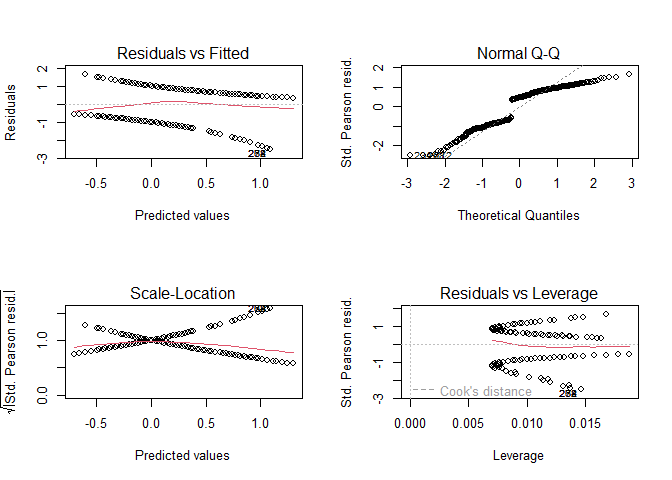

``` r
par(mfrow = c(1,1))
```

``` r
check_model(probit_fit)
```

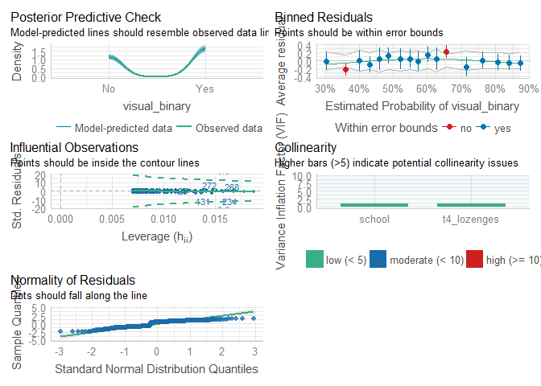

compare our model with an empty model

1.  Calculate difference in deviance

``` r
with(probit_fit, null.deviance-deviance)
```

    [1] 37.50202

2.  Calculate degrees of freedom for the difference

``` r
with(probit_fit, df.null - df.residual)
```

    [1] 2

3.  obtian the p-value

``` r
with(probit_fit,pchisq(null.deviance-deviance, df.null - df.residual, lower.tail = FALSE))
```

    [1] 0.000000007186862

4.  Loglikelihood ratio test

``` r
logLik(probit_fit)
```

    'log Lik.' -185.5448 (df=3)

Interpreting Coefficients

The coefficients in a logistic regression equation are somewhat
difficult to interpret. The saying in OLS, that b (beta) represents “the
change in Y with one unit change in X” is no longer applicable. Instead,
we have to translate the coefficient using the exponent function. When
we do that, we have a number that is pretty useful, called the odds
ratio. The odds ratio is equal to exp(B) or eb. For example, if your
results indicate the regression slope is 0.08, the odds ratio is 1.08
(because exp(.08)=1.08). This means that the probability that Y is equal
to 1 is about one times as likely as the value of X is increased by one
unit. If the odds ratios was say 2.06, then it would be about twice as
likely.

Logit Log-odds

``` r
glance(log_fit)
```

    # A tibble: 1 × 8
      null.deviance df.null logLik   AIC   BIC deviance df.residual  nobs
              <dbl>   <int>  <dbl> <dbl> <dbl>    <dbl>       <int> <int>
    1          409.     300  -185.  377.  388.     371.         298   301

Logit Log-odds

``` r
coef(log_fit)
```

      (Intercept)   t4_lozenges schoolPasteur 
      -1.05038877    0.08939174   -0.30007354 

*Interpretations* For every one unit increase in lozenges, the log odds
of “yes” for visual increases by .089, holding all other variables
constant. Being in Pasteur, compare to Grant-White school had a decrease
in the log odds (-.30) of being “yes” for visual, holding all other
variables constant.

95% Confidence intervals

``` r
confint(log_fit)
```

    Waiting for profiling to be done...

                        2.5 %     97.5 %
    (Intercept)   -1.63230924 -0.4876588
    t4_lozenges    0.05942037  0.1214807
    schoolPasteur -0.80791580  0.1990660

Confidence intervals using standard errors

``` r
confint.default(log_fit)
```

                        2.5 %     97.5 %
    (Intercept)   -1.62129933 -0.4794782
    t4_lozenges    0.05845084  0.1203326
    schoolPasteur -0.80268294  0.2025359

Odds Ratios

``` r
exp(coef(log_fit))
```

      (Intercept)   t4_lozenges schoolPasteur 
        0.3498017     1.0935089     0.7407637 

*Interpretations* For each unit increase in lozenges, the odds of being
“yes” for visual was 1.09 times more likely, holding all other variables
constant. We can convert this to a percentage by taking 1.09 - 1.00 so
9% higher odds of being “yes” for every increase in lozenges. However,
notice that Pasteur was below 1, so they are less likely compared to
Grant-White. A better approach to interpret this is to do 1/.74 which is
1.35 or 35% (after removing the 1) of higher odds of being “no” compared
to “yes” for visual (since we took the inverse, or 1/Odds ratio, we need
to flip the outcome).

Odds Ratios and 95% CI

``` r
exp(cbind(OR = coef(log_fit), confint(log_fit)))
```

    Waiting for profiling to be done...

                         OR     2.5 %    97.5 %
    (Intercept)   0.3498017 0.1954776 0.6140624
    t4_lozenges   1.0935089 1.0612213 1.1291676
    schoolPasteur 0.7407637 0.4457862 1.2202625

Predicted Probabilities for logistic

1.  create data frame

``` r
newlogdata <- with(HS, data.frame(t4_lozenges= rep(seq(from = 1, 
                                                       to = 40, 
                                                       length.out = 100), 2),
                                  school = factor(rep(c("Grant-White",
                                                        "Pasteur"), 
                                                      each =100))))
```

look at the data

``` r
glimpse(newlogdata)
```

    Rows: 200
    Columns: 2
    $ t4_lozenges <dbl> 1.000000, 1.393939, 1.787879, 2.181818, 2.575758, 2.969697…
    $ school      <fct> Grant-White, Grant-White, Grant-White, Grant-White, Grant-…

Bind the data with the predictions from the model

``` r
newlogdata <- cbind(newlogdata, predict(log_fit, newdata = newlogdata, type = "link",
                                    se = TRUE))
```

calculate the predicted probabilities and upper/lower bounds

``` r
newlogdata <- within(newlogdata, {
  PredictPROB <- plogis(fit)
  LL <- plogis(fit - (1.96 * se.fit))
  UL <- plogis(fit + (1.96 * se.fit))
})

head(newlogdata)
```

      t4_lozenges      school        fit    se.fit residual.scale        UL
    1    1.000000 Grant-White -0.9609970 0.2789418              1 0.3978884
    2    1.393939 Grant-White -0.9257821 0.2741758              1 0.4041031
    3    1.787879 Grant-White -0.8905672 0.2694691              1 0.4103768
    4    2.181818 Grant-White -0.8553523 0.2648248              1 0.4167096
    5    2.575758 Grant-White -0.8201373 0.2602461              1 0.4231013
    6    2.969697 Grant-White -0.7849224 0.2557368              1 0.4295522
             LL PredictPROB
    1 0.1812765   0.2766786
    2 0.1879835   0.2837812
    3 0.1948613   0.2909928
    4 0.2019085   0.2983113
    5 0.2091230   0.3057345
    6 0.2165024   0.3132600

Create a visual

``` r
p1 <- ggplot(newlogdata, aes(x = t4_lozenges, y = PredictPROB))+geom_ribbon(aes(
  ymin = LL, ymax = UL, fill = school), alpha = .2) + geom_line(
    aes(colour = school), size = 1)

p1
```

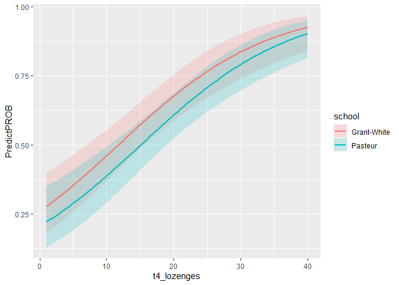

Interpretation of the coefficients in a probit regression is different
from the interpretation of the logit regression. The increase in
probability attributed to a one-unit increase in a given predictor is
dependent both on the values of the other predictors and the starting
value of the given predictors. However, there are limited ways in which
we can interpret the individual regression coefficients. A positive
coefficient means that an increase in the predictor leads to an increase
in the predicted probability. A negative coefficient means that an
increase in the predictor leads to a decrease in the predicted
probability.

``` r
coef(probit_fit)
```

      (Intercept)   t4_lozenges schoolPasteur 
      -0.63283153    0.05367679   -0.18265402 

``` r
confint(probit_fit)
```

    Waiting for profiling to be done...

                        2.5 %      97.5 %
    (Intercept)   -0.98170078 -0.28927081
    t4_lozenges    0.03605866  0.07180139
    schoolPasteur -0.48919724  0.12159941

Predicted Probabilities for Probit

1.  create data frame

``` r
newprobdata <- with(HS, data.frame(t4_lozenges= rep(seq(from = 1, 
                                                       to = 40, 
                                                       length.out = 100), 2),
                                  school = factor(rep(c("Grant-White",
                                                        "Pasteur"), 
                                                      each =100))))
```

Look at the data

``` r
glimpse(newprobdata)
```

    Rows: 200
    Columns: 2
    $ t4_lozenges <dbl> 1.000000, 1.393939, 1.787879, 2.181818, 2.575758, 2.969697…
    $ school      <fct> Grant-White, Grant-White, Grant-White, Grant-White, Grant-…

Bind the data and the predictions

``` r
newprobdata <- cbind(newprobdata, predict(probit_fit, newdata = newprobdata, type = "link",
                                    se = TRUE))
```

calculate the predicted probabilities and upper/lower bounds

``` r
newprobdata <- within(newprobdata, {
  PredictPROB <- plogis(fit)
  LL <- plogis(fit - (1.96 * se.fit))
  UL <- plogis(fit + (1.96 * se.fit))
})

head(newprobdata)
```

      t4_lozenges      school        fit    se.fit residual.scale        UL
    1    1.000000 Grant-White -0.5791547 0.1687317              1 0.4382073
    2    1.393939 Grant-White -0.5580093 0.1659803              1 0.4420891
    3    1.787879 Grant-White -0.5368639 0.1632625              1 0.4459941
    4    2.181818 Grant-White -0.5157185 0.1605800              1 0.4499230
    5    2.575758 Grant-White -0.4945731 0.1579346              1 0.4538762
    6    2.969697 Grant-White -0.4734277 0.1553282              1 0.4578541
             LL PredictPROB
    1 0.2870267   0.3591271
    2 0.2924881   0.3640082
    3 0.2979961   0.3689174
    4 0.3035488   0.3738539
    5 0.3091438   0.3788168
    6 0.3147789   0.3838053

Create a visual of the predicted probabilities

``` r
p2 <- ggplot(newprobdata, aes(x = t4_lozenges, y = PredictPROB))+geom_ribbon(aes(
  ymin = LL, ymax = UL, fill = school), alpha = .2) + geom_line(
    aes(colour = school), size = 1)

p2
```

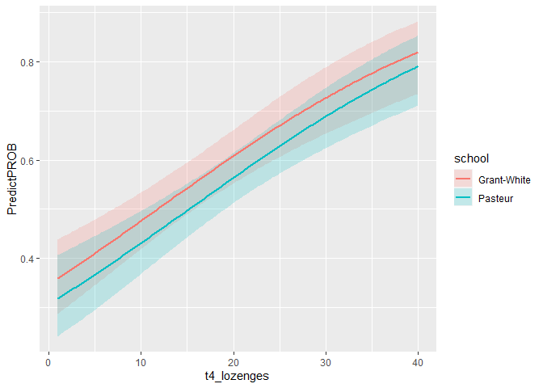

If we wanted to see the predicted probability from the logistic with the
probit we could use patchwork.

``` r
library(patchwork)
```


    Attaching package: 'patchwork'

    The following object is masked from 'package:MASS':

        area

``` r
p1+p2
```

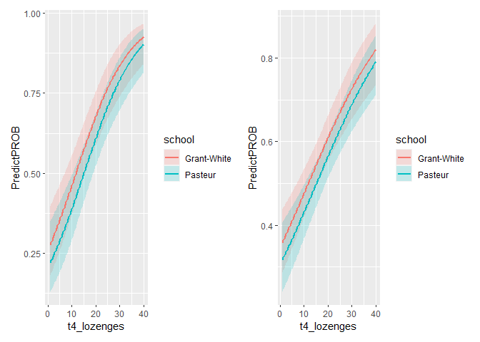

# Multinomial Logistic Regression Models

Multinomial logistic regression is used when the outcome variable is
more than two categories and there is not an ordered structure to the
outcome (i.e., not like the Olympic medals of bronze, silver, gold).
This alloes for the log odds of the outcomes to be modeled as a linear
combination of the independent variables. It is important to note what
the reference group for the outcome is though and that decision should
be made based on existing theory.

Let’s look at a table

``` r
with(HS, table(visual_mult, school))
```

               school
    visual_mult Grant-White Pasteur
              A          44      51
              B          50      52
              C          51      53

Look at the means and sd for each of the visual category groups

``` r
with(HS, do.call(rbind, tapply(t4_lozenges, visual_mult, function(x) c(M = mean(x), SD = sd(x)))))
```

             M       SD
    A 14.17895 8.216459
    B 16.58824 8.239428
    C 22.88462 8.409781

Run the multinomial model

``` r
library(nnet)
multinom_results <- multinom(visual_mult ~ t4_lozenges + school, data = HS)
```

    # weights:  12 (6 variable)
    initial  value 330.682299 
    iter  10 value 302.102596
    final  value 302.102458 
    converged

look at the output, the coefficients are log-odds

``` r
summary(multinom_results)
```

    Call:
    multinom(formula = visual_mult ~ t4_lozenges + school, data = HS)

    Coefficients:
      (Intercept) t4_lozenges schoolPasteur
    B  -0.4429902  0.04236102    -0.2599549
    C  -1.9447753  0.13036007    -0.6726880

    Std. Errors:
      (Intercept) t4_lozenges schoolPasteur
    B   0.3276877  0.01894771     0.2960707
    C   0.3829684  0.02008254     0.3248813

    Residual Deviance: 604.2049 
    AIC: 616.2049 

*Interpretation* For each unit increase in lozenge scores was related to
a increase in log-odds (.04) of being in B versus A, holding all other
variables constant. For each unit increase in lozenge scores was related
to a increase in log-odds (.13) of being in C versus A, holding all
other variables constant. Being in the Pasteur school (compared to
Grant-White) had a decrease in the log-odds of -.25 of being in B versus
A holding all other variables constant. Being in the Pasteur school
(compared to Grant-White) had a decrease in the log-odds of -.67 of
being in C versus A holding all other variables constant.

We can look at the overall fit

``` r
glance(multinom_results)
```

    # A tibble: 1 × 4
        edf deviance   AIC  nobs
      <dbl>    <dbl> <dbl> <int>
    1     6     604.  616.   301

test coefficients

``` r
z <- summary(multinom_results)$coefficients/summary(multinom_results)$standard.errors
z
```

      (Intercept) t4_lozenges schoolPasteur
    B   -1.351867    2.235680    -0.8780164
    C   -5.078162    6.491215    -2.0705651

calculate the 2-tailed z test

``` r
p <- (1 - pnorm(abs(z), 0, 1)) * 2
p
```

          (Intercept)       t4_lozenges schoolPasteur
    B 0.1764178876989 0.025372708477889    0.37993483
    C 0.0000003811037 0.000000000085147    0.03839946

Extract the coefficients from the model and exponentiate to create risk
ratios

``` r
exp(coef(multinom_results))
```

      (Intercept) t4_lozenges schoolPasteur
    B   0.6421135    1.043271     0.7710864
    C   0.1430194    1.139239     0.5103350

*Interpretation* For each unit increase in lozenge scores was related to
a increase in the relative risk ratio (1.04) of being in B versus A,
holding all other variables constant. The relative risk ratio for one
unit increase in lozenge scores was 1.13 for being in C versus A,
holding all other variables constant. The relative risk ratio of
switching from Pasteur school to Grant-White is .77 for being in B
versus A, holding all other variables constant. The relative risk ratio
of switching from Pasteur school to Grant-White is .51 for being in c
versus A, holding all other variables constant.

Create predicted probabilities

``` r
head(pp <- fitted(multinom_results))
```

              A         B          C
    1 0.5987529 0.3366309 0.06461625
    2 0.3721953 0.3786495 0.24915530
    3 0.4080822 0.3814344 0.21048332
    4 0.2477848 0.3390949 0.41312031
    5 0.5411799 0.3604430 0.09837718
    6 0.3541086 0.3758375 0.27005388

create a predicted dataframe, holding lozenges at the mean

``` r
predict_viscat_school <- data.frame(school = c("Grant-White","Pasteur"),
                   t4_lozenges = mean(HS$t4_lozenges))
```

predicted probabilities by group by school (1 = Grant-White, 2 =
Pasteur)

``` r
predict(multinom_results, newdata = predict_viscat_school, "probs")
```

              A         B         C
    1 0.2582869 0.3555692 0.3861439
    2 0.3540485 0.3758266 0.2701250

look at the averaged predicted probabilities for different values of
lozenges

create a new dataset

``` r
newmultdata <- data.frame(
  school = factor(rep(c("Grant-White","Pasteur"), 200)),
  t4_lozenges = rep(seq(from = 1, to = 6, length.out = 100), 2))
```

combine the datasets with the predicted probabilities

``` r
pp.multdata <- cbind(newmultdata, predict(multinom_results, 
                                          newmultdata, 
                                          type = "probs",
                                          se = TRUE))
```

View the first few rows

``` r
head(pp.multdata)
```

           school t4_lozenges         A         B          C
    1 Grant-White    1.000000 0.5456039 0.3654992 0.08889696
    2     Pasteur    1.050505 0.6244709 0.3232610 0.05226805
    3 Grant-White    1.101010 0.5441100 0.3660614 0.08982863
    4     Pasteur    1.151515 0.6231754 0.3239737 0.05285098
    5 Grant-White    1.202020 0.5426122 0.3666191 0.09076874
    6     Pasteur    1.252525 0.6218758 0.3246844 0.05343983

Calculate the mean probabilities within each level of school

``` r
by(pp.multdata[,3:5], pp.multdata$school, colMeans)
```

    pp.multdata$school: Grant-White
            A         B         C 
    0.5075149 0.3772284 0.1152567 
    ------------------------------------------------------------ 
    pp.multdata$school: Pasteur
             A          B          C 
    0.59113382 0.33975813 0.06910805 

Reshape the data to be able to plot all the predicted probabilities

``` r
library(reshape2)
```


    Attaching package: 'reshape2'

    The following object is masked from 'package:tidyr':

        smiths

``` r
l_newmultdata <- melt(pp.multdata, id.vars = c("school","t4_lozenges"),
                     value.name = "Probability")
head(l_newmultdata)
```

           school t4_lozenges variable Probability
    1 Grant-White    1.000000        A   0.5456039
    2     Pasteur    1.050505        A   0.6244709
    3 Grant-White    1.101010        A   0.5441100
    4     Pasteur    1.151515        A   0.6231754
    5 Grant-White    1.202020        A   0.5426122
    6     Pasteur    1.252525        A   0.6218758

Plot the predicted probabilities across lozenge scores for each school

Create a plot

``` r
ggplot(l_newmultdata, aes(x = t4_lozenges, y = Probability, colour = school))+
  geom_line()+facet_grid(variable ~., scales = "free")
```

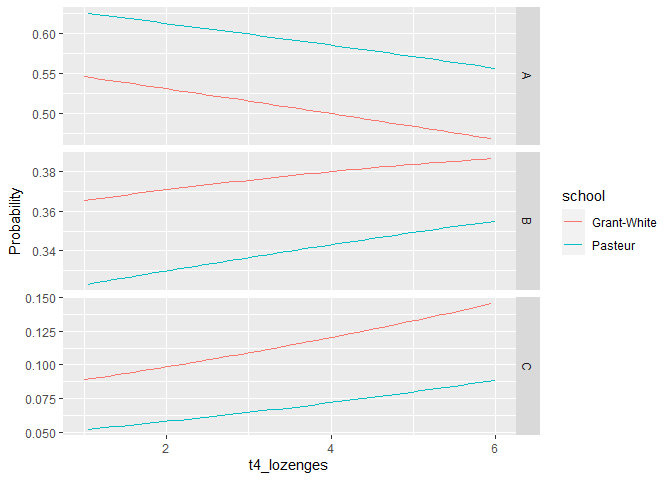

We need to put it all on the same metric though

``` r
ggplot(l_newmultdata, aes(x = t4_lozenges, y = Probability, colour = school))+
  geom_line()+facet_grid(variable ~.)
```

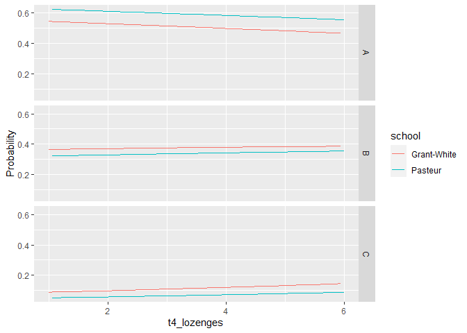

Change the reference group

``` r
HS$visual_mult2 <- relevel(HS$visual_mult, ref = "C")
```

We can rerun the model using a different reference group

``` r
multinom_results2 <- multinom(HS$visual_mult2~ t4_lozenges + school, data = HS)
```

    # weights:  12 (6 variable)
    initial  value 330.682299 
    iter  10 value 302.102496
    final  value 302.102458 
    converged

``` r
summary(multinom_results2)
```

    Call:
    multinom(formula = HS$visual_mult2 ~ t4_lozenges + school, data = HS)

    Coefficients:
      (Intercept) t4_lozenges schoolPasteur
    A    1.944770 -0.13035988     0.6726656
    B    1.501756 -0.08799721     0.4126927

    Std. Errors:
      (Intercept) t4_lozenges schoolPasteur
    A   0.3829674  0.02008252     0.3248803
    B   0.3686764  0.01777363     0.3066138

    Residual Deviance: 604.2049 
    AIC: 616.2049 

# Ordinal Regression Models

Ordinal logistic regression is when the outcome is ordinal in nature and
not interval. While OLS could be used, the assumptions will be violated.

First let’s check the frequencies of our ordinal outcome

``` r
tabyl(HS$visual_ord)
```

     HS$visual_ord   n   percent
               Low  95 0.3156146
            Medium 102 0.3388704
              High 104 0.3455150

Three way cross tabs (xtabs) and flatten the table

``` r
ftable(xtabs(~ school + visual_ord, data = HS))
```

                visual_ord Low Medium High
    school                                
    Grant-White             44     50   51
    Pasteur                 51     52   53

check categorical counts

``` r
table(HS$visual_ord, HS$school)
```

            
             Grant-White Pasteur
      Low             44      51
      Medium          50      52
      High            51      53

with lozenges to get a visual

``` r
ggplot(HS, aes(x = visual_ord, y = t4_lozenges)) + geom_boxplot(size = .75) + geom_jitter(alpha = .5) + facet_grid(. ~ school, margins = TRUE) + theme(axis.text.x = element_text(angle = 45, hjust = 1, vjust = 1))
```

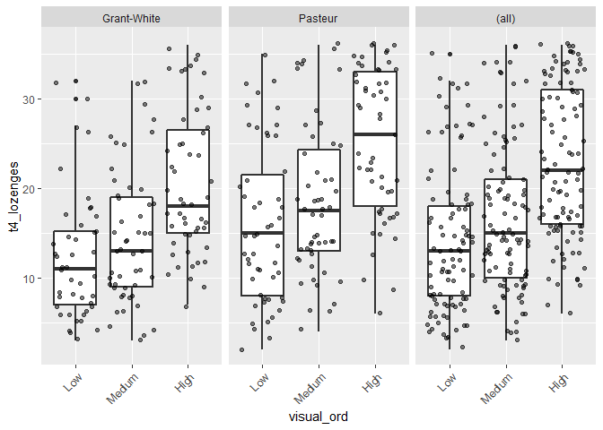

Run an ordinal logistic regression

``` r
ord_results <- polr(visual_ord ~ t4_lozenges + school, 
                     data = HS, 
                     Hess=TRUE)
```

view a summary of the model Note: coefficients are scaled in terms of
logs (log odds)

``` r
summary(ord_results)
```

    Call:
    polr(formula = visual_ord ~ t4_lozenges + school, data = HS, 
        Hess = TRUE)

    Coefficients:
                     Value Std. Error t value
    t4_lozenges    0.09574    0.01366   7.007
    schoolPasteur -0.46467    0.22726  -2.045

    Intercepts:
                Value   Std. Error t value
    Low|Medium   0.5532  0.2542     2.1763
    Medium|High  2.1889  0.2846     7.6908

    Residual Deviance: 605.9017 
    AIC: 613.9017 

``` r
glance(ord_results)
```

    # A tibble: 1 × 7
        edf logLik   AIC   BIC deviance df.residual  nobs
      <int>  <dbl> <dbl> <dbl>    <dbl>       <dbl> <dbl>
    1     4  -303.  614.  629.     606.         297   301

store table

``` r
(ctable <- coef(summary(ord_results)))
```

                        Value Std. Error   t value
    t4_lozenges    0.09573607 0.01366198  7.007481
    schoolPasteur -0.46466585 0.22726213 -2.044625
    Low|Medium     0.55320112 0.25419380  2.176297
    Medium|High    2.18893851 0.28461625  7.690842

Here we could say that for each unit increase in lozenge score we expect
a .095 increase in the expected visual perception categorized score,
holding all other variables constant. However it is much easier to
interpret using odds ratios.

calculate and store p values

``` r
p <- pnorm(abs(ctable[, "t value"]), lower.tail = FALSE)* 2
```

combined table

``` r
(ctable <- cbind(ctable, "p value" = p))
```

                        Value Std. Error   t value                p value
    t4_lozenges    0.09573607 0.01366198  7.007481 0.00000000000242647121
    schoolPasteur -0.46466585 0.22726213 -2.044625 0.04089183958659645818
    Low|Medium     0.55320112 0.25419380  2.176297 0.02953308087049924882
    Medium|High    2.18893851 0.28461625  7.690842 0.00000000000001461704

Confidence intervals

``` r
(ci <- confint(ord_results))
```

    Waiting for profiling to be done...

                        2.5 %     97.5 %
    t4_lozenges    0.06946845  0.1231136
    schoolPasteur -0.91365769 -0.0218104

report the 95% CI

``` r
confint.default(ord_results)
```

                        2.5 %      97.5 %
    t4_lozenges    0.06895908  0.12251306
    schoolPasteur -0.91009144 -0.01924025

Coefficients converted to proportional odds ratios

``` r
exp(coef(ord_results))
```

      t4_lozenges schoolPasteur 
         1.100469      0.628345 

*Interpretation* For students in Pasteur school the odds of being higher
in visual perception (high or medium versus low) was 37.2% lower (i.e.,
1-.628) than Grant-White students, holding all other variables constant.
For each unit increase in lozenge score, the odds of being higher in
visual perception (high or medium versus low) is multiplied 1.10 times,
holding all other variables constant.

Odds ratios and 95% CI

``` r
exp(cbind(OR = coef(ord_results), ci))
```

                        OR     2.5 %    97.5 %
    t4_lozenges   1.100469 1.0719382 1.1310129
    schoolPasteur 0.628345 0.4010546 0.9784257

Assess the proportional odds assumption/parallel regression assumption.
If this is not met the regressions are not parallel/ there are different
coefficients in the model for each pair of the outcomes. We would then
need to run each combination separately with logistic regressions

``` r
sf <- function(y) { c('Y>=1' = qlogis(mean(y >= 1)), 'Y>=2' = qlogis(mean(y >= 2)), 'Y>=3' = qlogis(mean(y >= 3))) }
```

Graph to test proportional odds assumption/parallel regression
assumption

``` r
library(Hmisc) 
```

    Loading required package: lattice

    Loading required package: survival

    Loading required package: Formula


    Attaching package: 'Hmisc'

    The following object is masked from 'package:psych':

        describe

    The following objects are masked from 'package:dplyr':

        src, summarize

    The following objects are masked from 'package:base':

        format.pval, units

``` r
s <- with(HS, summary(as.numeric(visual_ord) ~ t4_lozenges + school, fun=sf)) 
s
```

    as.numeric(visual_ord)      N= 301  

    +-----------+-----------+---+----+-----------+----------+
    |           |           |  N|Y>=1|       Y>=2|      Y>=3|
    +-----------+-----------+---+----+-----------+----------+
    |t4_lozenges|    [ 2,12)| 84| Inf|-0.04762805|-2.1202635|
    |           |    [12,18)| 80| Inf| 0.84729786|-0.6190392|
    |           |    [18,26)| 63| Inf| 1.44691898|-0.3528214|
    |           |    [26,36]| 74| Inf| 1.28785429| 0.2170645|
    +-----------+-----------+---+----+-----------+----------+
    |     school|Grant-White|145| Inf| 0.83093088|-0.6114691|
    |           |    Pasteur|156| Inf| 0.72213472|-0.6644371|
    +-----------+-----------+---+----+-----------+----------+
    |    Overall|           |301| Inf| 0.77399928|-0.6388128|
    +-----------+-----------+---+----+-----------+----------+

Run a series of binary logistic regressions

``` r
glm(I(as.numeric(visual_ord)>= 2) ~ school, family = "binomial", data =HS) 
```


    Call:  glm(formula = I(as.numeric(visual_ord) >= 2) ~ school, family = "binomial", 
        data = HS)

    Coefficients:
      (Intercept)  schoolPasteur  
           0.8309        -0.1088  

    Degrees of Freedom: 300 Total (i.e. Null);  299 Residual
    Null Deviance:      375.4 
    Residual Deviance: 375.2    AIC: 379.2

``` r
glm(I(as.numeric(visual_ord)>= 3) ~ school, family = "binomial", data =HS)
```


    Call:  glm(formula = I(as.numeric(visual_ord) >= 3) ~ school, family = "binomial", 
        data = HS)

    Coefficients:
      (Intercept)  schoolPasteur  
         -0.61147       -0.05297  

    Degrees of Freedom: 300 Total (i.e. Null);  299 Residual
    Null Deviance:      388.1 
    Residual Deviance: 388  AIC: 392

``` r
s[,4] <- s[,4]-s[,3] 
s[,3] <- s[,3]-s[,3] 
```

print out the visual for the proportional odds assumption/parallel
regression assumption

``` r
s
```

    as.numeric(visual_ord)      N= 301  

    +-----------+-----------+---+----+----+---------+
    |           |           |  N|Y>=1|Y>=2|     Y>=3|
    +-----------+-----------+---+----+----+---------+
    |t4_lozenges|    [ 2,12)| 84| Inf|   0|-2.072635|
    |           |    [12,18)| 80| Inf|   0|-1.466337|
    |           |    [18,26)| 63| Inf|   0|-1.799740|
    |           |    [26,36]| 74| Inf|   0|-1.070790|
    +-----------+-----------+---+----+----+---------+
    |     school|Grant-White|145| Inf|   0|-1.442400|
    |           |    Pasteur|156| Inf|   0|-1.386572|
    +-----------+-----------+---+----+----+---------+
    |    Overall|           |301| Inf|   0|-1.412812|
    +-----------+-----------+---+----+----+---------+

``` r
plot(s, which = 1:3, pch = 1:3, xlab = "logit", main = ' ', xlim = range(s[,3:4]))
```

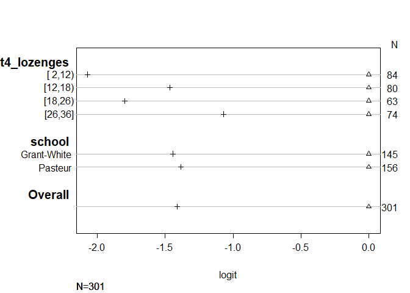

we can also calculate the Brant test for the parallel regression
assumption

``` r
library(brant) 
brant(ord_results)
```

    -------------------------------------------- 
    Test for    X2  df  probability 
    -------------------------------------------- 
    Omnibus     1.69    2   0.43
    t4_lozenges 1.69    1   0.19
    schoolPasteur   0.11    1   0.74
    -------------------------------------------- 

    H0: Parallel Regression Assumption holds

Since we didn’t violate the assumption we can go ahead and interpret the
results.

Predicted probabilities

create a new dataset

``` r
neworddata <- data.frame(school = factor(rep(c("Grant-White","Pasteur"), 200)), 
                         t4_lozenges = rep(seq(from = 1, to = 40, length.out = 100), 2)) 
```

combine the datasets with the predicted probabilities

``` r
neworddata <- cbind(neworddata, predict(ord_results, neworddata, type = "probs"))
```

view the first few rows

``` r
head(neworddata)
```

           school t4_lozenges       Low    Medium       High
    1 Grant-White    1.000000 0.6124126 0.2778281 0.10975927
    2     Pasteur    1.393939 0.7077366 0.2178060 0.07445733
    3 Grant-White    1.787879 0.5943642 0.2882864 0.11734936
    4     Pasteur    2.181818 0.6918939 0.2282810 0.07982511
    5 Grant-White    2.575758 0.5760571 0.2985525 0.12539039
    6     Pasteur    2.969697 0.6755860 0.2388699 0.08554410

reshape the data to be able to plot all the predicted probabilities

``` r
l_neworddata <- melt(neworddata, id.vars = c("school",
                                             "t4_lozenges"), 
                     variable.name = "Level", 
                     value.name = "Probability") 

head(l_neworddata)
```

           school t4_lozenges Level Probability
    1 Grant-White    1.000000   Low   0.6124126
    2     Pasteur    1.393939   Low   0.7077366
    3 Grant-White    1.787879   Low   0.5943642
    4     Pasteur    2.181818   Low   0.6918939
    5 Grant-White    2.575758   Low   0.5760571
    6     Pasteur    2.969697   Low   0.6755860

create a plot for the predicted probabilities

``` r
ggplot(l_neworddata, aes(x = t4_lozenges, y = Probability, colour = Level))+ geom_line()+facet_grid(.~school)
```

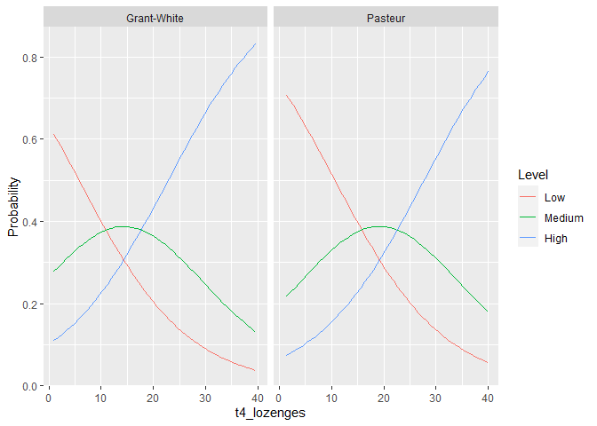

# Poisson Regression Models

A Poisson regression is used for modeling count data. There are several
extensions of Poisson that allow for excessive 0s in the data as well as
overdisperion of the count data.

``` r
library(sandwich)
library(msm)
```

Check the counts

``` r
plyr::count(HS$sentence_completion_count)
```

        x freq
    1   0   18
    2   1   39
    3   2   73
    4   3   51
    5   4   59
    6   5   31
    7   6   20
    8   7    4
    9   8    5
    10 10    1

Visual by School

``` r
with(HS, tapply(sentence_completion_count, school, function(x) {
  sprintf("M (SD) = %1.2f (%1.2f)", mean(x), sd(x))
}))
```

               Grant-White                Pasteur 
    "M (SD) = 2.99 (1.80)" "M (SD) = 3.17 (1.83)" 

``` r
ggplot(HS, aes(sentence_completion_count, fill = school)) +
  geom_histogram(binwidth=.5, position="dodge")
```

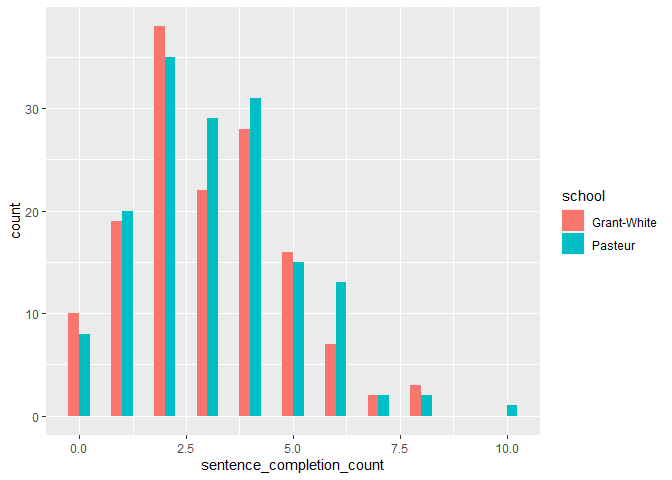

run a poisson regression

``` r
pois_results <- glm(sentence_completion_count ~ t4_lozenges + school,
                    family="poisson",
                    data=HS)
```

We can then look at the results, note that coefficients are expected log
counts

``` r
summary(pois_results)
```


    Call:
    glm(formula = sentence_completion_count ~ t4_lozenges + school, 
        family = "poisson", data = HS)

    Deviance Residuals: 
         Min        1Q    Median        3Q       Max  
    -2.54127  -0.70381  -0.07749   0.56252   3.04839  

    Coefficients:
                  Estimate Std. Error z value            Pr(>|z|)    
    (Intercept)   1.071766   0.076573  13.997 <0.0000000000000002 ***
    t4_lozenges   0.001389   0.003712   0.374               0.708    
    schoolPasteur 0.053199   0.067449   0.789               0.430    
    ---
    Signif. codes:  0 '***' 0.001 '**' 0.01 '*' 0.05 '.' 0.1 ' ' 1

    (Dispersion parameter for poisson family taken to be 1)

        Null deviance: 357.77  on 300  degrees of freedom
    Residual deviance: 356.84  on 298  degrees of freedom
    AIC: 1197

    Number of Fisher Scoring iterations: 5

*Coefficient Interpretation* A one unit increase in lozenge scores would
result in a expected log count of .001. The expected difference in log
count between Pasteur and the reference school of Grant-White is .053,
holding all other variables constant.

Check poisson fit more concisely

``` r
glance(pois_results)
```

    # A tibble: 1 × 8
      null.deviance df.null logLik   AIC   BIC deviance df.residual  nobs
              <dbl>   <int>  <dbl> <dbl> <dbl>    <dbl>       <int> <int>
    1          358.     300  -596. 1197. 1208.     357.         298   301

Check for overdispersion

**Note:** If overdispersion is detected will need to use a negative
binomial regression. If there are excessive 0s, then we would want to
use a zero-inflated regression model.

``` r
check_overdispersion(pois_results)
```

    # Overdispersion test

           dispersion ratio =   1.075
      Pearson's Chi-Squared = 320.490
                    p-value =   0.177

    No overdispersion detected.

using robust standard errors

``` r
cov.pois <- vcovHC(pois_results, type="HC0")
std.err <- sqrt(diag(cov.pois))
r.est <- cbind(Estimate= coef(pois_results), "Robust SE" = std.err,
               "Pr(>|z|)" = 2 * pnorm(abs(coef(pois_results)/std.err), lower.tail=FALSE),
               LL = coef(pois_results) - 1.96 * std.err,
               UL = coef(pois_results) + 1.96 * std.err)
```

print the coefficients with robust SE and 95% CI

``` r
r.est
```

                     Estimate   Robust SE
    (Intercept)   1.071766194 0.076868889
    t4_lozenges   0.001388705 0.003770748
    schoolPasteur 0.053198540 0.069890744
                                                              Pr(>|z|)           LL
    (Intercept)   0.00000000000000000000000000000000000000000003481003  0.921103172
    t4_lozenges   0.71266169234545495569932427315507084131240844726562 -0.006001961
    schoolPasteur 0.44655722562779753825878970019402913749217987060547 -0.083787318
                           UL
    (Intercept)   1.222429217
    t4_lozenges   0.008779371
    schoolPasteur 0.190184397

Goodness of fit test, if stat sig, the model does not fit well

``` r
with(pois_results, cbind(res.deviance = deviance, df = df.residual,
               p = pchisq(deviance, df.residual, lower.tail=FALSE)))
```

         res.deviance  df          p
    [1,]     356.8367 298 0.01088358

Calculate incident rate ratios, standard errors and 95% CI

``` r
incident_model <- deltamethod(list(~ exp(x1), ~ exp(x2), ~exp(x3)), 
                              coef(pois_results), cov.pois)
incident_model
```

    [1] 0.224498141 0.003775988 0.073709505

The incident rate for Pasteur school is .07 times the incident rate of
Grant-White school, holding all other variables constant.

Exponentiate old estimates dropping the p values

``` r
rexp.est <- exp(r.est[, -3])
```

Replace SEs with estimates for exponentiated coefficients

``` r
rexp.est[, "Robust SE"] <- incident_model 
```

Look at the results

``` r
rexp.est
```

                  Estimate   Robust SE        LL       UL
    (Intercept)   2.920533 0.224498141 2.5120601 3.395426
    t4_lozenges   1.001390 0.003775988 0.9940160 1.008818
    schoolPasteur 1.054639 0.073709505 0.9196268 1.209473

Expected Marginal Mean (holding lozenge scores constant)

Create a marginal mean dataframe

``` r
pois_mar <- data.frame(t4_lozenges = mean(HS$t4_lozenges), 
                       school = factor(1:2,levels = 1:2, 
                                       labels = levels(HS$school)))
```

print out the matrix

``` r
pois_mar
```

      t4_lozenges      school
    1    18.00332 Grant-White
    2    18.00332     Pasteur

predicted

``` r
predict(pois_results, pois_mar, type = "response", se.fit = TRUE)
```

    $fit
           1        2 
    2.994471 3.158086 

    $se.fit
            1         2 
    0.1455150 0.1440366 

    $residual.scale
    [1] 1

Store predicted scores

``` r
HS$pois_pred <- predict(pois_results, type = "response")
```

We can then graph th predicted number of sentence completion scores

``` r
ggplot(HS, aes(x = t4_lozenges, y = pois_pred, colour = school))+
  geom_point(aes(y = sentence_completion_count), 
             alpha = .4, 
             position = position_jitter(h=.3))+
  geom_line(size = 1) +
  labs(x = "Lozenge Scores", 
       y = "Expected number of Sentence Completions")
```

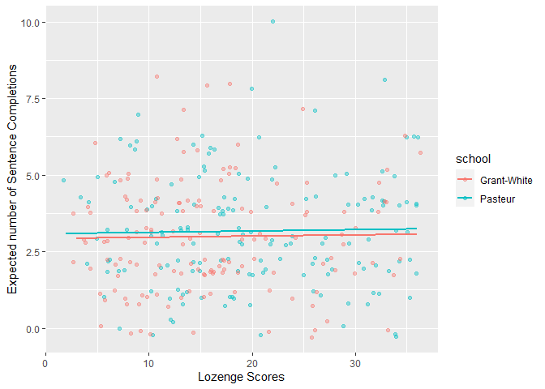

**Resources**

- https://stats.oarc.ucla.edu/r/dae/probit-regression/

- https://stats.oarc.ucla.edu/r/dae/ordinal-logistic-regression/

- http://www.sthda.com/english/wiki/one-way-anova-test-in-r

- http://www.sthda.com/english/wiki/two-way-anova-test-in-r

- https://www.datanovia.com/en/lessons/t-test-in-r/#effect-size-1

- https://stats.idre.ucla.edu/r/dae/poisson-regression/
