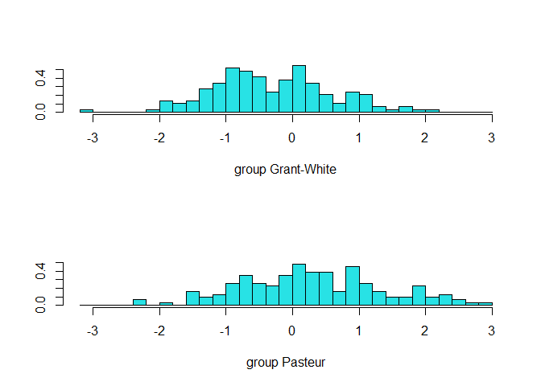
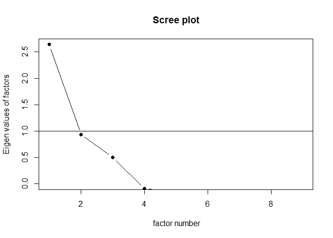
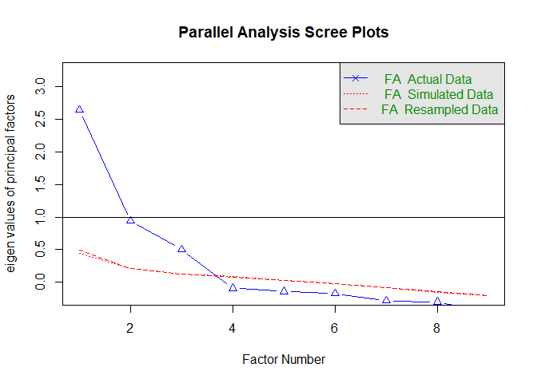
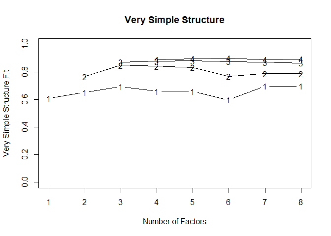
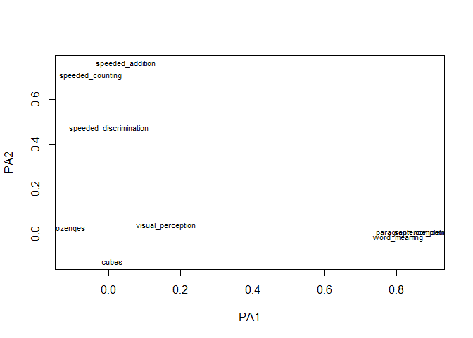
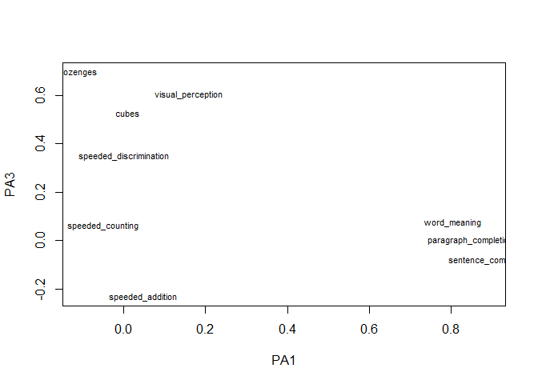
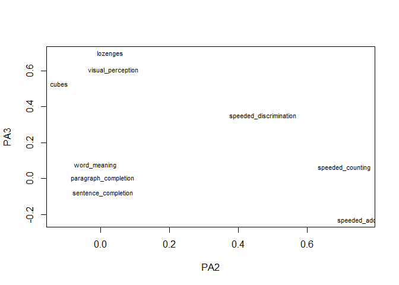
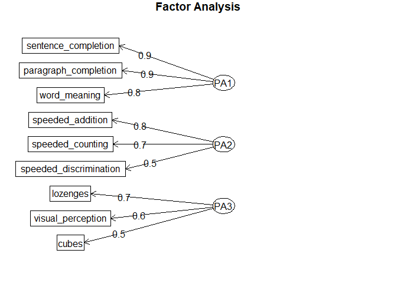
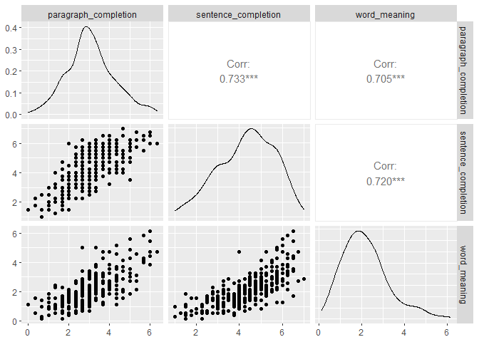
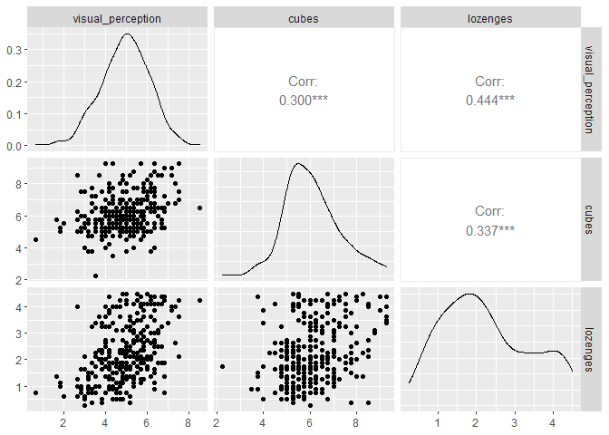

Module 4 Multivariate Statistics
================
Eric R. Schuler, Ph.D.
2022-09-16

In this module, we will cover how to run a:

- MANOVA
- Linear Discriminant Analysis
- Factor Analysis
- Canonical Correlation

\#Import data

``` r
hs1939 <- read.csv("hs1939_cleaned.csv")
hs1939 <- hs1939[-5,] #dropping case 5 that has some missing
```

we will change sex to a factor

``` r
hs1939$sex <- factor(hs1939$sex)
janitor::tabyl(hs1939$sex)
```

     hs1939$sex   n   percent
         Female 154 0.5133333
           Male 146 0.4866667

We will now make the variable grade into an ordinal variable

``` r
hs1939$grade <- ordered(hs1939$grade, labels = c("7th grade", "8th grade"))
```

Make school a factor

``` r
hs1939$school <- factor(hs1939$school)
```

# MANOVA

``` r
manova_res <- manova(cbind(cubes,visual_perception) ~ school, data = hs1939)
summary(manova_res)
```

               Df    Pillai approx F num Df den Df Pr(>F)
    school      1 0.0085718   1.2839      2    297 0.2785
    Residuals 298                                        

Follow-up ANOVAs

``` r
summary.aov(manova_res)
```

     Response cubes :
                 Df Sum Sq Mean Sq F value Pr(>F)
    school        1   3.24  3.2432  2.3522 0.1262
    Residuals   298 410.88  1.3788               

     Response visual_perception :
                 Df Sum Sq Mean Sq F value Pr(>F)
    school        1   0.00 0.00013  0.0001 0.9922
    Residuals   298 404.58 1.35767               

# Linear Discriminant Analysis (lda)

``` r
library(MASS)
```


    Attaching package: 'MASS'

    The following object is masked from 'package:dplyr':

        select

Run an lda

``` r
lda_res <- lda(school ~ cubes + lozenges + visual_perception, data = hs1939)
```

View the results

``` r
lda_res
```

    Call:
    lda(school ~ cubes + lozenges + visual_perception, data = hs1939)

    Prior probabilities of groups:
    Grant-White     Pasteur 
      0.4833333   0.5166667 

    Group means:
                   cubes lozenges visual_perception
    Grant-White 6.200000 1.995690          4.929885
    Pasteur     5.991935 2.497581          4.928573

    Coefficients of linear discriminants:
                             LD1
    cubes             -0.5098963
    lozenges           1.0079480
    visual_perception -0.2822991

We can then plot the model

``` r
plot(lda_res)
```



Factor Analysis Code adapted from: https://rpubs.com/pjmurphy/758265

We will be using the psych package for this.

``` r
library(psych)
```


    Attaching package: 'psych'

    The following objects are masked from 'package:ggplot2':

        %+%, alpha

Holzinger and Swineford 1939 data but dropping demographics and
variables we created

``` r
hs<-hs1939[,-c(1:6,16,17)]
```

Running a KMO test

``` r
KMO(hs)
```

    Kaiser-Meyer-Olkin factor adequacy
    Call: KMO(r = hs)
    Overall MSA =  0.75
    MSA for each item = 
         visual_perception                  cubes               lozenges 
                      0.80                   0.78                   0.74 
      paragraph_completion    sentence_completion           word_meaning 
                      0.76                   0.74                   0.81 
          speeded_addition       speeded_counting speeded_discrimination 
                      0.59                   0.68                   0.79 

Bartlett’s test of sphericity

``` r
cortest.bartlett(hs)
```

    R was not square, finding R from data

    $chisq
    [1] 907.4163

    $p.value
    [1] 0.00000000000000000000000000000000000000000000000000000000000000000000000000000000000000000000000000000000000000000000000000000000000000000000000000000000000000000000003870266

    $df
    [1] 36

Dimensionality

We will use a couple methods

Eigenvalue greater than 1

``` r
ev <- eigen(cor(hs))
ev$values
```

    [1] 3.2262726 1.6409588 1.3633800 0.6998538 0.5794487 0.4968477 0.4718241
    [8] 0.2852867 0.2361279

Here we can see three factors

Let’s examine a scree plot If pc=TRUE it will be for principle
components analysis (PCA)

``` r
scree(hs, pc=FALSE)
```



Better option is for parallel analysis If running a PCA, use “pc” rather
than “fa”

``` r
fa.parallel(hs,fa="fa")
```



    Parallel analysis suggests that the number of factors =  3  and the number of components =  NA 

Another good option is vss which also runs minimum average partial

``` r
vss(hs)
```




    Very Simple Structure
    Call: vss(x = hs)
    Although the VSS complexity 1 shows  8  factors, it is probably more reasonable to think about  3  factors
    VSS complexity 2 achieves a maximimum of 0.85  with  3  factors

    The Velicer MAP achieves a minimum of 0.06  with  2  factors 
    BIC achieves a minimum of  -45.29  with  3  factors
    Sample Size adjusted BIC achieves a minimum of  -9.37  with  4  factors

    Statistics by number of factors 
      vss1 vss2   map dof          chisq
    1 0.61 0.00 0.081  27 362.0101081974
    2 0.65 0.76 0.064  19 130.5051921312
    3 0.69 0.85 0.068  12  23.1556752662
    4 0.66 0.84 0.121   6   5.8193186033
    5 0.66 0.83 0.204   1   0.3123030904
    6 0.60 0.77 0.342  -3   0.0000032620
    7 0.70 0.79 0.443  -6   0.0000000015
    8 0.70 0.79 1.000  -8   0.0000000000
                                                                 prob sqresid  fit
    1 0.0000000000000000000000000000000000000000000000000000000000026     6.4 0.61
    2 0.0000000000000000011698678657601004489928475660320827955729328     3.9 0.76
    3 0.0264330084045386742852556949401332531124353408813476562500000     2.1 0.87
    4 0.4437316551141580744932468860497465357184410095214843750000000     1.8 0.89
    5 0.5762703438532744693034715055546257644891738891601562500000000     1.7 0.90
    6                                                              NA     1.4 0.91
    7                                                              NA     1.5 0.91
    8                                                              NA     1.5 0.91
      RMSEA   BIC SABIC complex                eChisq          SRMR eCRMS  eBIC
    1 0.203 208.0 293.6     1.0 469.89681754139689929 0.14749400765 0.170 315.9
    2 0.140  22.1  82.4     1.2 153.70667336896477195 0.08435668138 0.116  45.3
    3 0.056 -45.3  -7.2     1.3   7.90741153733277002 0.01913331826 0.033 -60.5
    4 0.000 -28.4  -9.4     1.4   1.75736414145228537 0.00901994739 0.022 -32.5
    5 0.000  -5.4  -2.2     1.5   0.10763534465905969 0.00223228981 0.013  -5.6
    6    NA    NA    NA     1.7   0.00000096327853953 0.00000667804    NA    NA
    7    NA    NA    NA     1.6   0.00000000046853265 0.00000014728    NA    NA
    8    NA    NA    NA     1.6   0.00000000000000033 0.00000000012    NA    NA

factor analysis

we will set the number of factors

``` r
Nfac <- 3
```

First we need to activate another package

``` r
library(GPArotation)
```

Here we have the dataset, number of factors, and we will use promax, an
oblique rotation, if we found a low correlation, we would change promax
to varimax to have it be an orthogonal rotation which makes it easier to
interpret.

``` r
fa.obl <- fa(cov(hs),fm="pa",Nfac,rotate="promax")
```

``` r
fa.obl
```

    Factor Analysis using method =  pa
    Call: fa(r = cov(hs), nfactors = Nfac, rotate = "promax", fm = "pa")
    Standardized loadings (pattern matrix) based upon correlation matrix
                             PA1   PA2   PA3   h2   u2 com
    visual_perception       0.16  0.04  0.60 0.49 0.51 1.1
    cubes                   0.01 -0.12  0.53 0.25 0.75 1.1
    lozenges               -0.11  0.03  0.70 0.45 0.55 1.1
    paragraph_completion    0.85  0.01  0.00 0.73 0.27 1.0
    sentence_completion     0.89  0.01 -0.08 0.75 0.25 1.0
    word_meaning            0.80 -0.02  0.07 0.69 0.31 1.0
    speeded_addition        0.05  0.76 -0.23 0.52 0.48 1.2
    speeded_counting       -0.05  0.71  0.06 0.52 0.48 1.0
    speeded_discrimination  0.00  0.47  0.35 0.46 0.54 1.8

                           PA1  PA2  PA3
    SS loadings           2.21 1.33 1.33
    Proportion Var        0.25 0.15 0.15
    Cumulative Var        0.25 0.39 0.54
    Proportion Explained  0.45 0.27 0.27
    Cumulative Proportion 0.45 0.73 1.00

     With factor correlations of 
         PA1  PA2  PA3
    PA1 1.00 0.26 0.39
    PA2 0.26 1.00 0.35
    PA3 0.39 0.35 1.00

    Mean item complexity =  1.2
    Test of the hypothesis that 3 factors are sufficient.

    The degrees of freedom for the null model are  36  and the objective function was  3.07
    The degrees of freedom for the model are 12  and the objective function was  0.08 

    The root mean square of the residuals (RMSR) is  0.02 
    The df corrected root mean square of the residuals is  0.03 

    Fit based upon off diagonal values = 1
    Measures of factor score adequacy             
                                                       PA1  PA2  PA3
    Correlation of (regression) scores with factors   0.94 0.86 0.85
    Multiple R square of scores with factors          0.89 0.74 0.72
    Minimum correlation of possible factor scores     0.78 0.48 0.44

Print the coefficients (path coefficients, pattern coefficients,
uniqueness, and communality)

``` r
print(fa.obl, digits=2, cutoff=.3, sort=TRUE)
```

    Factor Analysis using method =  pa
    Call: fa(r = cov(hs), nfactors = Nfac, rotate = "promax", fm = "pa")
    Standardized loadings (pattern matrix) based upon correlation matrix
                           item   PA1   PA2   PA3   h2   u2 com
    sentence_completion       5  0.89  0.01 -0.08 0.75 0.25 1.0
    paragraph_completion      4  0.85  0.01  0.00 0.73 0.27 1.0
    word_meaning              6  0.80 -0.02  0.07 0.69 0.31 1.0
    speeded_addition          7  0.05  0.76 -0.23 0.52 0.48 1.2
    speeded_counting          8 -0.05  0.71  0.06 0.52 0.48 1.0
    speeded_discrimination    9  0.00  0.47  0.35 0.46 0.54 1.8
    lozenges                  3 -0.11  0.03  0.70 0.45 0.55 1.1
    visual_perception         1  0.16  0.04  0.60 0.49 0.51 1.1
    cubes                     2  0.01 -0.12  0.53 0.25 0.75 1.1

                           PA1  PA2  PA3
    SS loadings           2.21 1.33 1.33
    Proportion Var        0.25 0.15 0.15
    Cumulative Var        0.25 0.39 0.54
    Proportion Explained  0.45 0.27 0.27
    Cumulative Proportion 0.45 0.73 1.00

     With factor correlations of 
         PA1  PA2  PA3
    PA1 1.00 0.26 0.39
    PA2 0.26 1.00 0.35
    PA3 0.39 0.35 1.00

    Mean item complexity =  1.2
    Test of the hypothesis that 3 factors are sufficient.

    The degrees of freedom for the null model are  36  and the objective function was  3.07 0.3
    The degrees of freedom for the model are 12  and the objective function was  0.08 
     0.3
    The root mean square of the residuals (RMSR) is  0.02 
    The df corrected root mean square of the residuals is  0.03 
     0.3
    Fit based upon off diagonal values = 1
    Measures of factor score adequacy             
                                                       PA1  PA2  PA3
    Correlation of (regression) scores with factors   0.94 0.86 0.85
    Multiple R square of scores with factors          0.89 0.74 0.72
    Minimum correlation of possible factor scores     0.78 0.48 0.44

plot factor 1 by 2

``` r
load1 <- fa.obl$loadings[,1:2]
plot(load1,type="n")
text(load1,labels=names(hs),cex=.7)
```



plot factor 1 by 3

``` r
load2 <- fa.obl$loadings[,c(1,3)]
plot(load2,type="n")
text(load2,labels=names(hs),cex=.7)
```



plot factor 2 by 3

``` r
load3 <- fa.obl$loadings[,c(2,3)]
plot(load3,type="n")
text(load3,labels=names(hs),cex=.7)
```



We can also inspect a diagram

``` r
loads <- fa.obl$loadings
fa.diagram(loads)
```



We can then run internal reliabilty

First we subset by factor

``` r
f1 <- hs[,c("visual_perception","cubes","lozenges")]
f2 <- hs[,c("paragraph_completion","sentence_completion","word_meaning")]
f3 <- hs[,c("speeded_addition","speeded_counting","speeded_discrimination")]
```

Then reliability

Factor 1

``` r
psych::alpha(f1)
```

    Number of categories should be increased  in order to count frequencies. 


    Reliability analysis   
    Call: psych::alpha(x = f1)

      raw_alpha std.alpha G6(smc) average_r S/N   ase mean   sd median_r
          0.63      0.63    0.54      0.36 1.7 0.037  4.4 0.88     0.34

        95% confidence boundaries 
             lower alpha upper
    Feldt     0.55  0.63  0.69
    Duhachek  0.55  0.63  0.70

     Reliability if an item is dropped:
                      raw_alpha std.alpha G6(smc) average_r  S/N alpha se var.r
    visual_perception      0.50      0.50    0.34      0.34 1.02    0.057    NA
    cubes                  0.62      0.62    0.44      0.44 1.60    0.044    NA
    lozenges               0.46      0.46    0.30      0.30 0.86    0.062    NA
                      med.r
    visual_perception  0.34
    cubes              0.44
    lozenges           0.30

     Item statistics 
                        n raw.r std.r r.cor r.drop mean  sd
    visual_perception 300  0.77  0.77  0.58   0.45  4.9 1.2
    cubes             300  0.73  0.72  0.47   0.37  6.1 1.2
    lozenges          300  0.78  0.78  0.62   0.48  2.3 1.1

Factor 2

``` r
psych::alpha(f2)
```

    Number of categories should be increased  in order to count frequencies. 


    Reliability analysis   
    Call: psych::alpha(x = f2)

      raw_alpha std.alpha G6(smc) average_r S/N   ase mean  sd median_r
          0.88      0.89    0.84      0.72 7.7 0.011  3.2 1.1     0.72

        95% confidence boundaries 
             lower alpha upper
    Feldt     0.86  0.88  0.90
    Duhachek  0.86  0.88  0.91

     Reliability if an item is dropped:
                         raw_alpha std.alpha G6(smc) average_r S/N alpha se var.r
    paragraph_completion      0.83      0.84    0.72      0.72 5.2    0.019    NA
    sentence_completion       0.83      0.83    0.71      0.71 4.8    0.020    NA
    word_meaning              0.84      0.85    0.73      0.73 5.5    0.018    NA
                         med.r
    paragraph_completion  0.72
    sentence_completion   0.71
    word_meaning          0.73

     Item statistics 
                           n raw.r std.r r.cor r.drop mean  sd
    paragraph_completion 300  0.90  0.90  0.82   0.78  3.1 1.2
    sentence_completion  300  0.92  0.91  0.84   0.79  4.3 1.3
    word_meaning         300  0.89  0.90  0.81   0.77  2.2 1.1

Factor 3

``` r
psych::alpha(f3)
```

    Number of categories should be increased  in order to count frequencies. 


    Reliability analysis   
    Call: psych::alpha(x = f3)

      raw_alpha std.alpha G6(smc) average_r S/N   ase mean   sd median_r
          0.69      0.69    0.61      0.43 2.2 0.031    5 0.82     0.45

        95% confidence boundaries 
             lower alpha upper
    Feldt     0.62  0.69  0.75
    Duhachek  0.63  0.69  0.75

     Reliability if an item is dropped:
                           raw_alpha std.alpha G6(smc) average_r S/N alpha se var.r
    speeded_addition            0.62      0.62    0.45      0.45 1.6    0.044    NA
    speeded_counting            0.51      0.51    0.34      0.34 1.0    0.057    NA
    speeded_discrimination      0.66      0.66    0.49      0.49 1.9    0.040    NA
                           med.r
    speeded_addition        0.45
    speeded_counting        0.34
    speeded_discrimination  0.49

     Item statistics 
                             n raw.r std.r r.cor r.drop mean  sd
    speeded_addition       300  0.79  0.78  0.59   0.49  4.2 1.1
    speeded_counting       300  0.82  0.82  0.69   0.57  5.5 1.0
    speeded_discrimination 300  0.75  0.76  0.55   0.46  5.4 1.0

# Cannonical Correlation

Code adapted from:
https://stats.oarc.ucla.edu/r/dae/canonical-correlation-analysis/

``` r
library(ggplot2)
library(GGally)
```

    Registered S3 method overwritten by 'GGally':
      method from   
      +.gg   ggplot2

``` r
library(CCA)
```

    Loading required package: fda

    Loading required package: splines

    Loading required package: fds

    Loading required package: rainbow

    Loading required package: pcaPP

    Loading required package: RCurl


    Attaching package: 'RCurl'

    The following object is masked from 'package:tidyr':

        complete

    Loading required package: deSolve


    Attaching package: 'fda'

    The following object is masked from 'package:graphics':

        matplot

    Loading required package: fields

    Loading required package: spam

    Spam version 2.8-0 (2022-01-05) is loaded.
    Type 'help( Spam)' or 'demo( spam)' for a short introduction 
    and overview of this package.
    Help for individual functions is also obtained by adding the
    suffix '.spam' to the function name, e.g. 'help( chol.spam)'.


    Attaching package: 'spam'

    The following objects are masked from 'package:base':

        backsolve, forwardsolve

    Loading required package: viridis

    Loading required package: viridisLite


    Try help(fields) to get started.


    Attaching package: 'fields'

    The following object is masked from 'package:psych':

        describe

We will now make a group of predictors

``` r
pred <- hs1939[,10:12]
```

And a group of outcomes

``` r
out <- hs1939[,7:9]
```

View the pairs of predictor variables

``` r
ggpairs(pred)
```



View the pairs of outcome variables

``` r
ggpairs(out)
```



Print out correlations of the sets

``` r
matcor(pred,out)
```

    $Xcor
                         paragraph_completion sentence_completion word_meaning
    paragraph_completion            1.0000000           0.7330973    0.7051606
    sentence_completion             0.7330973           1.0000000    0.7204997
    word_meaning                    0.7051606           0.7204997    1.0000000

    $Ycor
                      visual_perception     cubes  lozenges
    visual_perception         1.0000000 0.2996954 0.4444202
    cubes                     0.2996954 1.0000000 0.3367872
    lozenges                  0.4444202 0.3367872 1.0000000

    $XYcor
                         paragraph_completion sentence_completion word_meaning
    paragraph_completion            1.0000000          0.73309725    0.7051606
    sentence_completion             0.7330973          1.00000000    0.7204997
    word_meaning                    0.7051606          0.72049970    1.0000000
    visual_perception               0.3783694          0.29422035    0.3629340
    cubes                           0.1520008          0.13870055    0.1943307
    lozenges                        0.1576828          0.07632281    0.1996291
                         visual_perception     cubes   lozenges
    paragraph_completion         0.3783694 0.1520008 0.15768277
    sentence_completion          0.2942204 0.1387005 0.07632281
    word_meaning                 0.3629340 0.1943307 0.19962909
    visual_perception            1.0000000 0.2996954 0.44442015
    cubes                        0.2996954 1.0000000 0.33678721
    lozenges                     0.4444202 0.3367872 1.00000000

run a canonical correlation

``` r
cc_res <- cc(pred,out)
```

Look at the canonical correlation

``` r
cc_res$cor
```

    [1] 0.40933427 0.13656351 0.06040868

raw canonical correlation

``` r
cc_res[3:4]
```

    $xcoef
                               [,1]        [,2]       [,3]
    paragraph_completion -0.5417775  0.08761044  1.2449786
    sentence_completion   0.1188895  1.06622666 -0.6509211
    word_meaning         -0.5261754 -1.09344319 -0.7334399

    $ycoef
                             [,1]        [,2]       [,3]
    visual_perception -0.79181512  0.47762775  0.3096822
    cubes             -0.14497262  0.01369571 -0.9054184
    lozenges          -0.02602912 -0.98932887  0.2346144

compute and displate the canonical loadings

``` r
cc2 <- comput(pred, out, cc_res)

# display canonical loadings
cc2[3:6]
```

    $corr.X.xscores
                               [,1]       [,2]       [,3]
    paragraph_completion -0.9260807  0.2663979  0.2672202
    sentence_completion  -0.7253412  0.5885456 -0.3570634
    word_meaning         -0.9120062 -0.1348056 -0.3873914

    $corr.Y.xscores
                            [,1]         [,2]         [,3]
    visual_perception -0.4033070  0.008680284  0.009588097
    cubes             -0.1868860 -0.026479966 -0.052453175
    lozenges          -0.2031188 -0.118217369  0.004008625

    $corr.X.yscores
                               [,1]        [,2]        [,3]
    paragraph_completion -0.3790766  0.03638023  0.01614242
    sentence_completion  -0.2969070  0.08037385 -0.02156972
    word_meaning         -0.3733154 -0.01840953 -0.02340180

    $corr.Y.yscores
                            [,1]        [,2]        [,3]
    visual_perception -0.9852754  0.06356225  0.15872053
    cubes             -0.4565608 -0.19390221 -0.86830533
    lozenges          -0.4962175 -0.86565856  0.06635843

We can test the number of canonical dimensions

``` r
rho <- cc_res$cor
```

We will then define the number of observations, and variables in each
set

``` r
n <- dim(pred[1])
p <- length(pred)
o <- length(out)
```

Calculate the p-values

``` r
library(CCP)
p.asym(rho,n,p,o, tstat="Wilks")
```

    Warning in df2[rhostart] <- de * nu - df1[rhostart]/2 + 1: number of items to
    replace is not a multiple of replacement length

    Warning in df2[rhostart] <- de * nu - df1[rhostart]/2 + 1: number of items to
    replace is not a multiple of replacement length

    Warning in df2[rhostart] <- de * nu - df1[rhostart]/2 + 1: number of items to
    replace is not a multiple of replacement length

    Wilks' Lambda, using F-approximation (Rao's F):
                  stat   approx df1      df2            p.value
    1 to 3:  0.8139396 7.019164   9 715.6694 0.0000000009265975
    2 to 3:  0.9777693 1.667370   4 590.0000 0.1559832522869390
    3 to 3:  0.9963508 1.084122   1 296.0000 0.2986269986888377

``` r
p.asym(rho,n,p,o, tstat="Hotelling")
```

    Warning in df2[rhostart] <- minpq * (N - 2 - p - q + 2 * k) + 2: number of items
    to replace is not a multiple of replacement length

    Warning in df2[rhostart] <- minpq * (N - 2 - p - q + 2 * k) + 2: number of items
    to replace is not a multiple of replacement length

    Warning in df2[rhostart] <- minpq * (N - 2 - p - q + 2 * k) + 2: number of items
    to replace is not a multiple of replacement length

     Hotelling-Lawley Trace, using F-approximation:
                    stat   approx df1 df2            p.value
    1 to 3:  0.223946489 7.282408   9 878 0.0000000002871816
    2 to 3:  0.022666582 1.669772   4 884 0.1548948489080373
    3 to 3:  0.003662574 1.086564   1 890 0.2975169418035246

``` r
p.asym(rho,n,p,o, tstat="Pillai")
```

    Warning in df2[rhostart] <- minpq * (N - 1 + minpq - p - q + 2 * k): number of
    items to replace is not a multiple of replacement length

    Warning in df2[rhostart] <- minpq * (N - 1 + minpq - p - q + 2 * k): number of
    items to replace is not a multiple of replacement length

    Warning in df2[rhostart] <- minpq * (N - 1 + minpq - p - q + 2 * k): number of
    items to replace is not a multiple of replacement length

     Pillai-Bartlett Trace, using F-approximation:
                    stat   approx df1 df2           p.value
    1 to 3:  0.189853343 6.665914   9 888 0.000000002870806
    2 to 3:  0.022298800 1.673701   4 894 0.153955465986585
    3 to 3:  0.003649208 1.096096   1 900 0.295405610644670

Now we can standardize the coefficients for interpretation

Pred

``` r
s1 <- diag(sqrt(diag(cov(pred))))
s1 %*% cc_res$xcoef
```

               [,1]       [,2]       [,3]
    [1,] -0.6316246  0.1021396  1.4514430
    [2,]  0.1536620  1.3780743 -0.8413011
    [3,] -0.5773228 -1.1997325 -0.8047347

Out

``` r
s1 <- diag(sqrt(diag(cov(out))))
s1 %*% cc_res$xcoef
```

               [,1]      [,2]       [,3]
    [1,] -0.6302171  0.101912  1.4482086
    [2,]  0.1399172  1.254808 -0.7660484
    [3,] -0.5946118 -1.235661 -0.8288339

Resources:

- MANOVA:
  http://www.sthda.com/english/wiki/manova-test-in-r-multivariate-analysis-of-variance
- Factor Analysis: https://rpubs.com/pjmurphy/758265
- DDA:
  http://www.sthda.com/english/articles/36-classification-methods-essentials/146-discriminant-analysis-essentials-in-r/#:\~:text=Discriminant%20analysis%20is%20used%20to,and%2For%20categorical%20predictor%20variables.
- CCA: https://stats.idre.ucla.edu/r/dae/canonical-correlation-analysis/
