Module 5 Data Visualization
================
Eric R. Schuler, Ph.D.
2022-09-16

In this module we will cover: - How to use visualizations as part of
data screening - Box plots - Outlier detection (univariate) - Standard
scatter plots - Create a 3D scatter plot for three variables - Creating
plots - Bar charts - Histograms - Line graphs - Adding axis labels to
plots - How to add ticks to a plot - Changing color and size of points -
How to add error bars - Adding a legend and re-positioning - How to
stack figures - Heat maps - Correlations - Plotting time series data -
How to save figures and export out of R

Examples were adapted from:
http://r-statistics.co/Complete-Ggplot2-Tutorial-Part1-With-R-Code.html

Load the packages

``` r
library(psych)
library(reshape)
library(lubridate)
```


    Attaching package: 'lubridate'

    The following object is masked from 'package:reshape':

        stamp

    The following objects are masked from 'package:base':

        date, intersect, setdiff, union

``` r
library(MBESS)
```


    Attaching package: 'MBESS'

    The following object is masked from 'package:psych':

        cor2cov

``` r
library(ggplot2)
```


    Attaching package: 'ggplot2'

    The following objects are masked from 'package:psych':

        %+%, alpha

Most of the data for today will come from example data from the R
packages

# Working Directory —-

We also need to tell R where to look for and save files. You can also do
this from the “Session” Menu Go to -\> “Session” -\> “Set Working
Directory” -\> “Choose Directory” -\> Select the folder that you want
When you do this, copy and past the line of code that is run from the
consol to your scipt.

``` r
setwd("C:/Users/eschuler/Desktop/r short course/")
```

How to visualize data as part of the data screening Process (or how I
stopped worrying and trusted my gut)

# Boxplots for Univariate Outlier Detection

``` r
library(sem)
data(HS.data)
```

simple boxplot of arithmetic scores

``` r
boxplot(HS.data$arithmet)
```

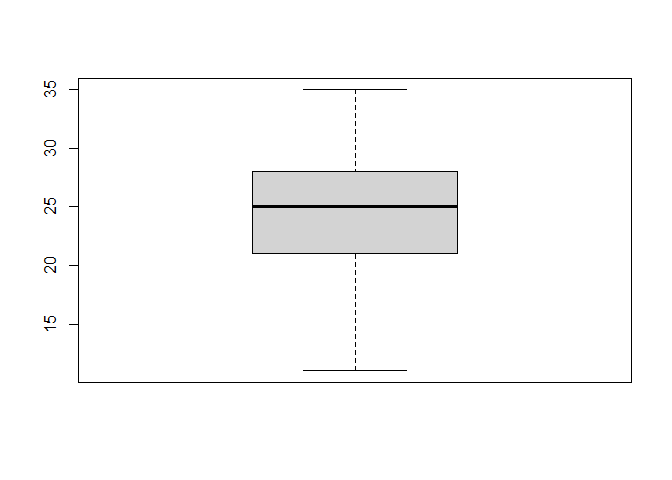

Let’s say we wanted to see the boxplots of arithmetic scores by age

convert agey to a factor

``` r
HS.data$agey <-factor(HS.data$agey)
```

Create boxplots for arithmetic scores by age groups

``` r
boxplots1 <- ggplot(HS.data, aes(x = agey, y = arithmet))+
              geom_boxplot()
boxplots1
```

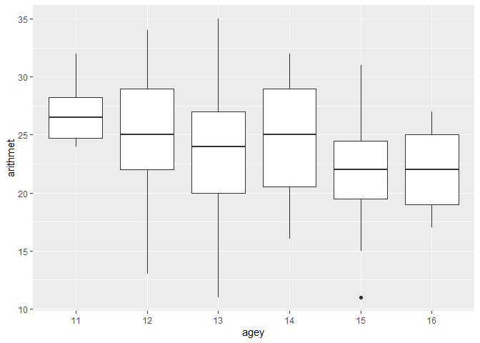

Let’s do it a different way so outliers are labeled from:
https://stackoverflow.com/questions/33524669/labeling-outliers-of-boxplots-in-r/33525389

``` r
library(dplyr)
```


    Attaching package: 'dplyr'

    The following object is masked from 'package:reshape':

        rename

    The following objects are masked from 'package:stats':

        filter, lag

    The following objects are masked from 'package:base':

        intersect, setdiff, setequal, union

This function will note any value that is past the whiskers of the
boxplot

``` r
is_outlier <- function(x) {
  return(x < quantile(x, 0.25) - 1.5 * IQR(x) | x > quantile(x, 0.75) + 1.5 * IQR(x))
}
```

We are going to use a bit of piping for the next code

``` r
boxplots1 <- HS.data %>%
  group_by(agey) %>%
  mutate(outlier = ifelse(is_outlier(arithmet), arithmet, as.numeric(NA))) %>%
  ggplot(., aes(x = factor(agey), y = arithmet)) +
  geom_boxplot() +
  geom_text(aes(label = outlier), na.rm = TRUE, hjust = -0.3)

boxplots1
```

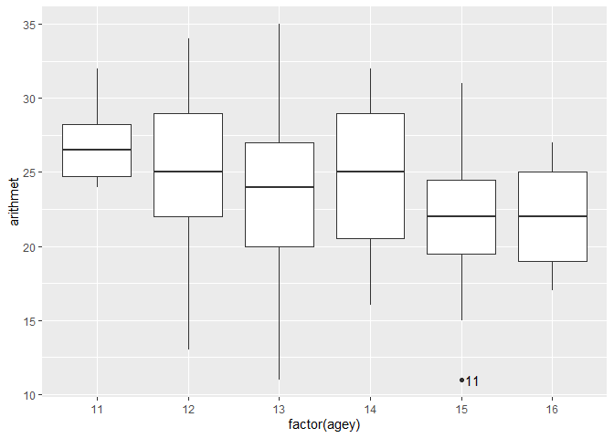

We can overlay by adding additional layers

``` r
boxplots1 <- boxplots1 + scale_y_continuous(name = "Score on Arithmetic Test", breaks = seq(0, 40, 2),
                                            limits = c(0, 40))
boxplots1
```

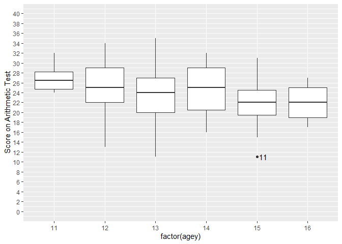

Add a title for the x-axis

``` r
boxplots1 <- boxplots1 + scale_x_discrete(name = "Age Groups of Students")
boxplots1
```

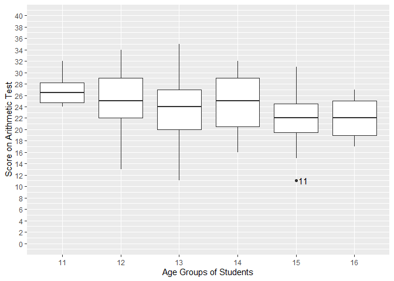

Add a title

``` r
boxplots1 <- boxplots1 + ggtitle("Boxplots of Arithmetic Scores by Age")
boxplots1
```

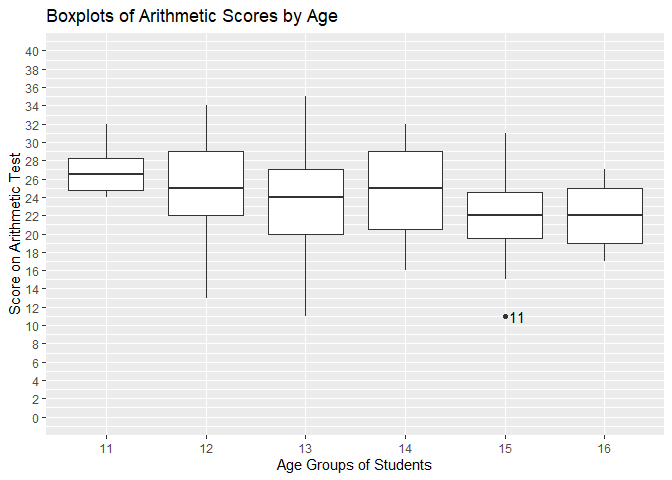

Change the color for each boxplot

``` r
boxplots1 <- boxplots1 + aes(x = agey, y = arithmet, fill = agey)
boxplots1
```

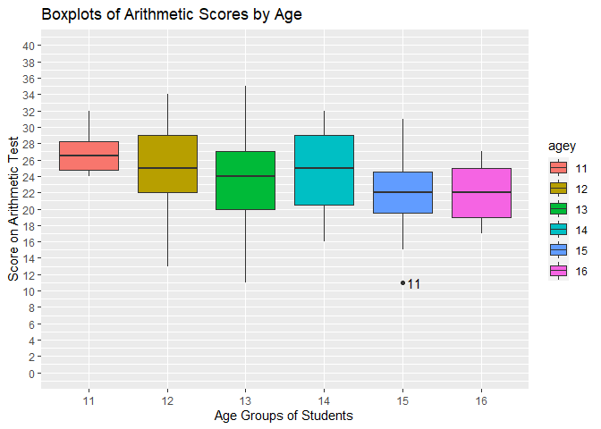

Change the background

``` r
boxplots1 <- boxplots1 + theme_bw()
boxplots1
```


Remove the background grid

``` r
boxplots1 <- boxplots1 +  theme(axis.line = element_line(colour = "black"),
                                panel.grid.major = element_blank(),
                                panel.grid.minor = element_blank(),
                                panel.border = element_blank(),
                                panel.background = element_blank()) 
boxplots1
```


Let’s add a reference line for the overall mean of student Arithmetic
Scores

``` r
boxplots2 <- boxplots1 + geom_hline(yintercept = mean(HS.data$arithmet), color = "dark red")
boxplots2
```

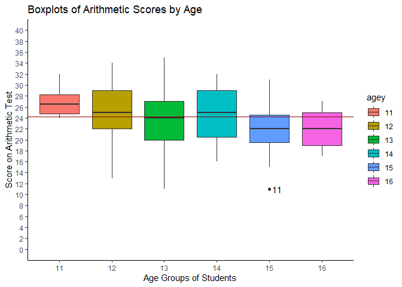

violin plots - combines a boxplot and a distribution visual

``` r
violin1 <- ggplot(HS.data, aes(x = agey, y = arithmet))+geom_violin()
violin1
```

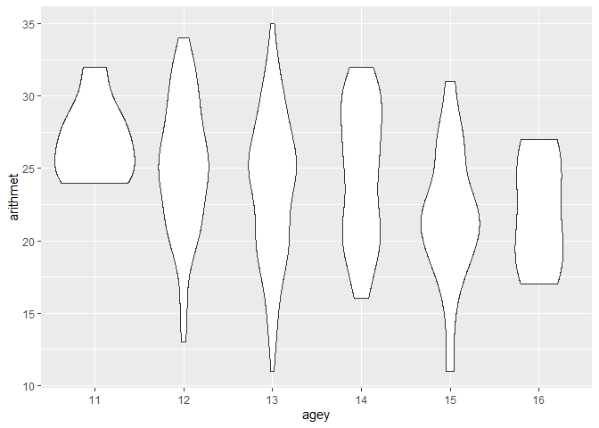

Add in some color into the visual

``` r
violin1 <- violin1+geom_violin(alpha=0.5, color="gray")+geom_jitter(alpha=0.5, aes(color=agey),
      position = position_jitter(width = 0.1))+coord_flip()
violin1
```

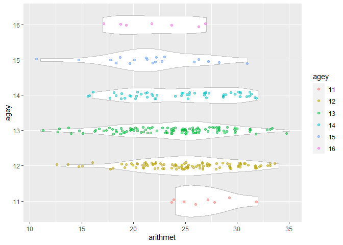

Rename variable in legend

``` r
violin1 <- violin1 + scale_color_discrete(name = "Age")
violin1
```

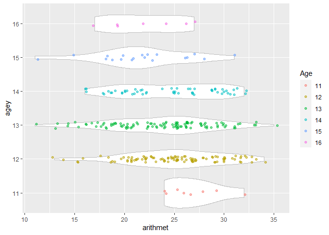

Rename y-axis title

``` r
violin1 <- violin1 + scale_x_discrete(name = "Age Groups of Students")
violin1
```

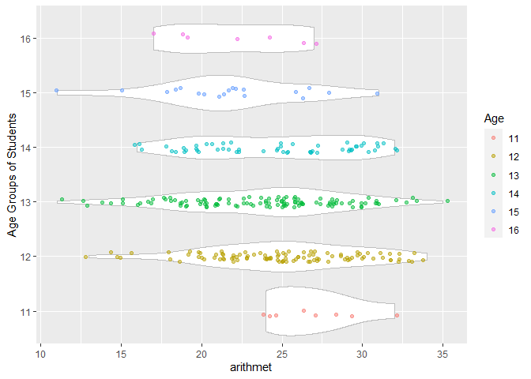

# Creating Scatterplots

Basic scatterplot

``` r
scatter1 <- ggplot(HS.data, aes(cubes, visual))
scatter1 <- scatter1 + geom_point(size = 2)
scatter1
```

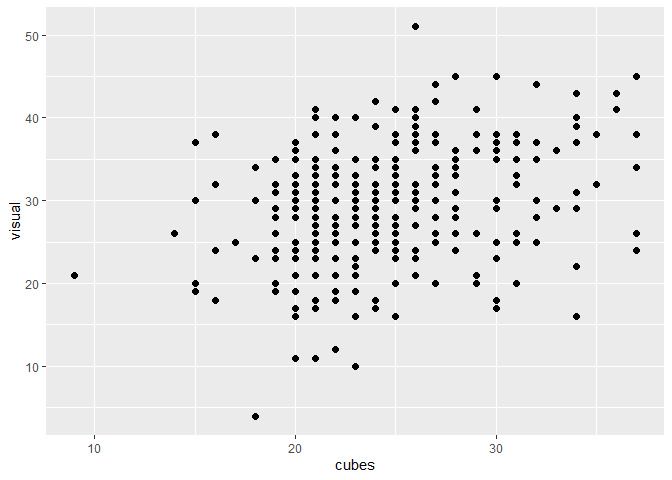

Change the background

``` r
scatter1 <- scatter1 + theme_bw()
scatter1
```

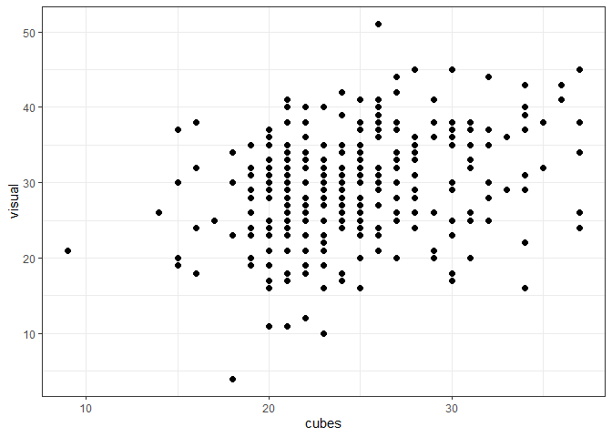

Remove the background grid

``` r
scatter1 <- scatter1 +  theme(axis.line = element_line(colour = "black"),
                                panel.grid.major = element_blank(),
                                panel.grid.minor = element_blank(),
                                panel.border = element_blank(),
                                panel.background = element_blank()) 
scatter1
```


Add a title for the y-axis

``` r
scatter1 <- scatter1 + scale_y_continuous(name = "Score on the Visual", breaks = seq(0, 50, 5),
                                            limits = c(0, 50))
scatter1
```

    Warning: Removed 1 rows containing missing values (geom_point).

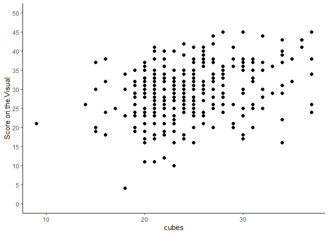

Add a title for the x-axis and place on the same metric range

``` r
scatter1 <-scatter1 + scale_x_continuous(name = "Score on the Cubes", breaks = seq(0, 50, 5),
                                          limits = c(0, 50))
scatter1
```

    Warning: Removed 1 rows containing missing values (geom_point).

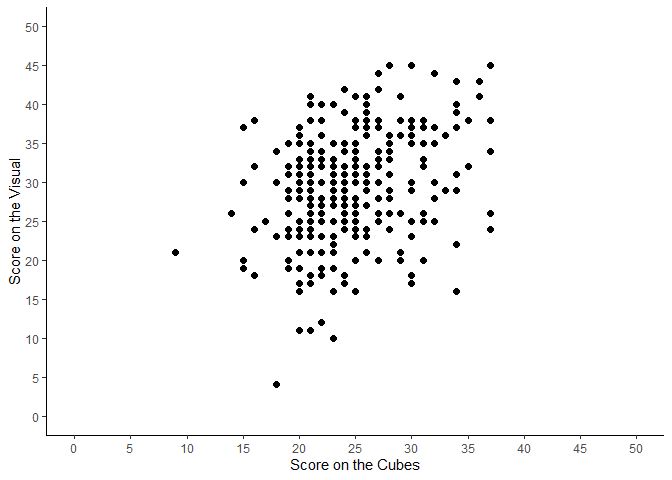

Overlay by school type

``` r
scatter1 <- scatter1 + geom_point(aes(colour = factor(school)))
scatter1
```

    Warning: Removed 1 rows containing missing values (geom_point).
    Removed 1 rows containing missing values (geom_point).

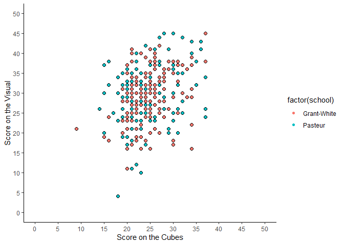

Add a title

``` r
scatter1 <- scatter1 + ggtitle("Scatterplot of Visual and Cube Scores")
scatter1
```

    Warning: Removed 1 rows containing missing values (geom_point).
    Removed 1 rows containing missing values (geom_point).

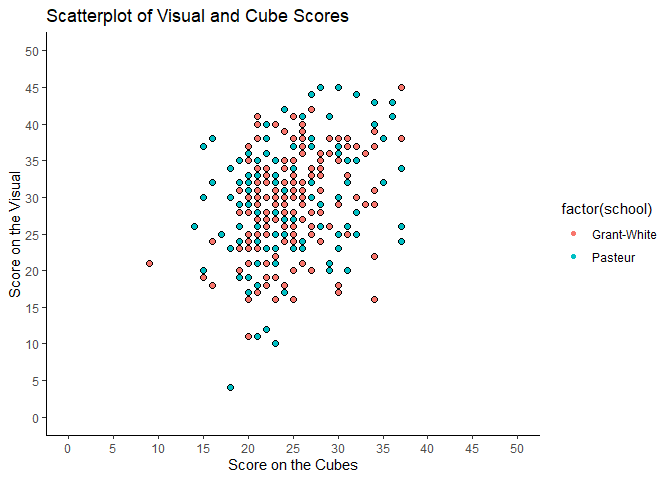

Edit the legend

``` r
scatter2 <- scatter1 + theme(legend.position = "bottom")
scatter2
```

    Warning: Removed 1 rows containing missing values (geom_point).
    Removed 1 rows containing missing values (geom_point).


``` r
scatter1 <- scatter1 + scale_color_discrete(name = "School",
                                            labels = c("Grant-White", "Pasteur"))
scatter1
```

    Warning: Removed 1 rows containing missing values (geom_point).
    Removed 1 rows containing missing values (geom_point).

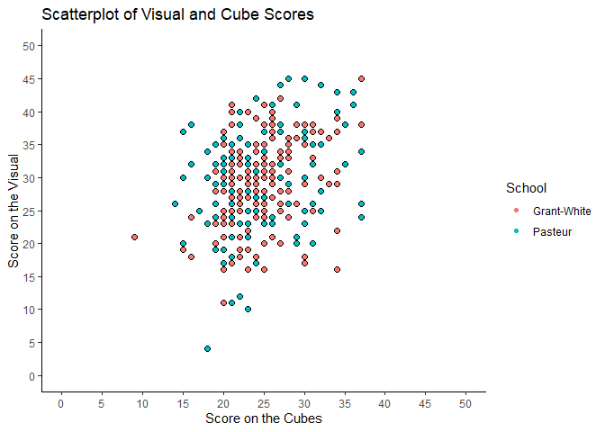

import the data

``` r
data(HS.data)
```

Standard Scatterplots

``` r
plot(HS.data$visual, HS.data$cubes)
abline(lm(HS.data$cubes ~ HS.data$visual, data = HS.data), col = "blue")
```

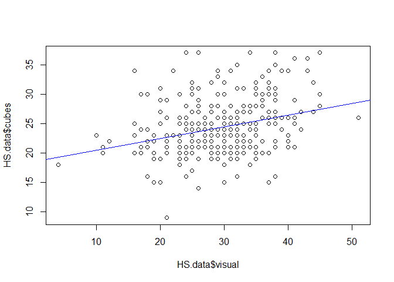

``` r
plot(HS.data$wordc, HS.data$cubes)
abline(lm(HS.data$cubes ~ HS.data$wordc, data = HS.data), col = "blue")
```

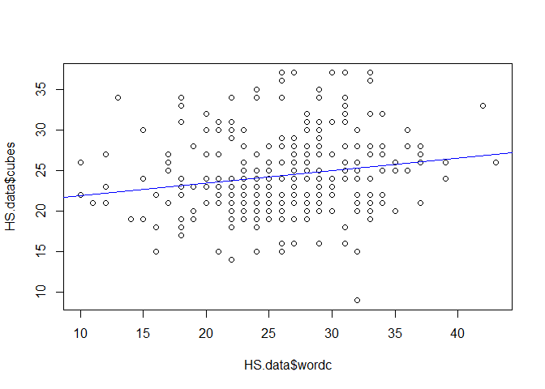

# Creating bar charts, histograms

Bar Charts

``` r
barchart1 <- ggplot(HS.data, aes(agey))
barchart1 <- barchart1 + geom_bar()
barchart1
```


Histograms

``` r
hist <- ggplot(HS.data, aes(visual))
hist1 <- hist + geom_histogram(binwidth = 4)
hist1
```

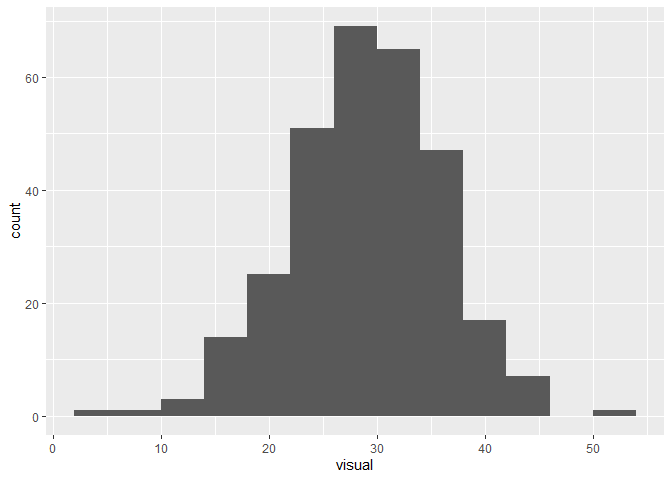

change the colors

``` r
hist2 <- hist +geom_histogram(color = "red", fill = "white")
hist2
```

    `stat_bin()` using `bins = 30`. Pick better value with `binwidth`.

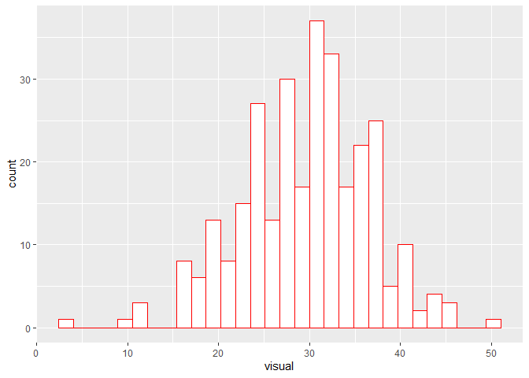

Linegraphs for experiments

Let’s grab some archival data

``` r
tg <-ToothGrowth
```

From:
http://www.cookbook-r.com/Graphs/Plotting_means_and_error_bars\_(ggplot2)/

Step 1 run the helper function to store summary information (between
groups) Gives count, mean, standard deviation, standard error of the
mean, and confidence interval (default 95%).

- data: a data frame.
- measurevar: the name of a column that contains the variable to be
  summariezed
- groupvars: a vector containing names of columns that contain grouping
  variables
- na.rm: a boolean that indicates whether to ignore NA’s
- conf.interval: the percent range of the confidence interval (default
  is 95%)

First we need to detach dplyr for conflicts

``` r
detach(package:dplyr)
```

create the helper function

``` r
summarySE <- function(data=NULL, measurevar, groupvars=NULL, na.rm=FALSE,
                      conf.interval=.95, .drop=TRUE) {
  library(plyr)
  
  # New version of length which can handle NA's: if na.rm==T, don't count them
  length2 <- function (x, na.rm=FALSE) {
    if (na.rm) sum(!is.na(x))
    else       length(x)
  }
  
  # This does the summary. For each group's data frame, return a vector with
  # N, mean, and sd
  datac <- ddply(data, groupvars, .drop=.drop,
                 .fun = function(xx, col) {
                   c(N    = length2(xx[[col]], na.rm=na.rm),
                     mean = mean   (xx[[col]], na.rm=na.rm),
                     sd   = sd     (xx[[col]], na.rm=na.rm)
                   )
                 },
                 measurevar
  )
  
  # Rename the "mean" column    
  datac <- rename(datac, c("mean" = measurevar))
  
  datac$se <- datac$sd / sqrt(datac$N)  # Calculate standard error of the mean
  
  # Confidence interval multiplier for standard error
  # Calculate t-statistic for confidence interval: 
  # e.g., if conf.interval is .95, use .975 (above/below), and use df=N-1
  ciMult <- qt(conf.interval/2 + .5, datac$N-1)
  datac$ci <- datac$se * ciMult
  
  return(datac)
}
```

summarySE provides the standard deviation, standard error of the mean,
and a (default 95%) confidence interval

``` r
tgc <- summarySE(tg, measurevar="len", groupvars=c("supp","dose"))
```


    Attaching package: 'plyr'

    The following objects are masked from 'package:reshape':

        rename, round_any

``` r
tgc
```

      supp dose  N   len       sd        se       ci
    1   OJ  0.5 10 13.23 4.459709 1.4102837 3.190283
    2   OJ  1.0 10 22.70 3.910953 1.2367520 2.797727
    3   OJ  2.0 10 26.06 2.655058 0.8396031 1.899314
    4   VC  0.5 10  7.98 2.746634 0.8685620 1.964824
    5   VC  1.0 10 16.77 2.515309 0.7954104 1.799343
    6   VC  2.0 10 26.14 4.797731 1.5171757 3.432090

Standard error of the mean

``` r
ggplot(tgc, aes(x=dose, y=len, colour=supp)) + 
  geom_errorbar(aes(ymin=len-se, ymax=len+se), width=.1) +
  geom_line() +
  geom_point()
```

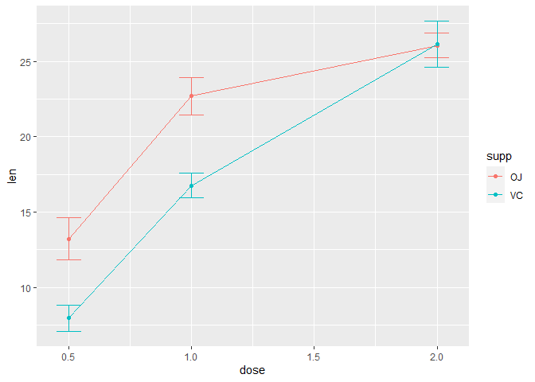

The errorbars overlapped, so use position_dodge to move them
horizontally

``` r
pd <- position_dodge(0.1) # move them .05 to the left and right
```

``` r
ggplot(tgc, aes(x=dose, y=len, colour=supp)) + 
  geom_errorbar(aes(ymin=len-se, ymax=len+se), width=.1, position=pd) +
  geom_line(position=pd) +
  geom_point(position=pd)
```

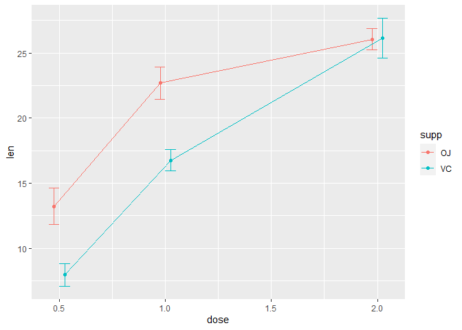

Use 95% confidence interval instead of SEM

``` r
ggplot(tgc, aes(x=dose, y=len, colour=supp)) + 
  geom_errorbar(aes(ymin=len-ci, ymax=len+ci), width=.1, position=pd) +
  geom_line(position=pd) +
  geom_point(position=pd)
```

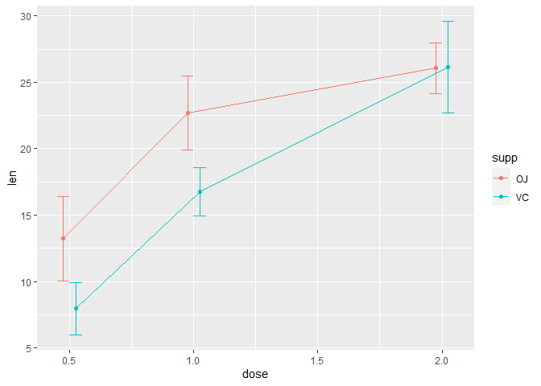

Black error bars - notice the mapping of ‘group=supp’ – without it, the
error bars won’t be dodged!

``` r
ggplot(tgc, aes(x=dose, y=len, colour=supp, group=supp)) + 
  geom_errorbar(aes(ymin=len-ci, ymax=len+ci), colour="black", width=.1, position=pd) +
  geom_line(position=pd) +
  geom_point(position=pd, size=3)
```

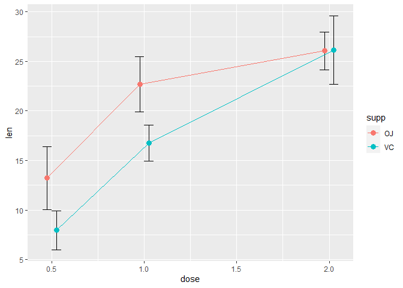

``` r
exp <- ggplot(tgc, aes(x=dose, y=len, colour=supp, group=supp)) + 
        geom_errorbar(aes(ymin=len-se, ymax=len+se), colour="black", width=.1, position=pd) +
        geom_line(position=pd) +
        geom_point(position=pd, size=3, shape=21, fill="white") + # 21 is filled circle
        xlab("Dose (mg)") +
        ylab("Tooth length") +
        scale_colour_hue(name="Supplement type",    # Legend label, use darker colors
                         breaks=c("OJ", "VC"),
                         labels=c("Orange juice", "Ascorbic acid"),
                         l=40) +                    # Use darker colors, lightness=40
        ggtitle("The Effect of Vitamin C on\nTooth Growth in Guinea Pigs") +
        expand_limits(y=0) +                        # Expand y range
        scale_y_continuous(breaks=0:20*4) +         # Set tick every 4
        theme_bw() +
        theme(legend.justification=c(1,0),
              legend.position=c(1,0))               # Position legend in bottom right

exp
```

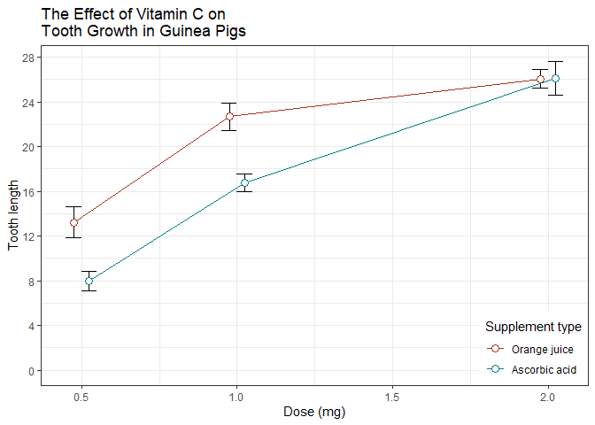

# Color Schemes in ggplots2

from:
https://rstudio-pubs-static.s3.amazonaws.com/177286_826aed2f00794640b301aeb42533c6f1.html
Default colors

``` r
ggplot(diamonds, aes(carat, price)) + geom_point(aes(color = cut)) + 
  scale_color_brewer(type = 'div', palette = 4, direction = 1) + 
  xlab('Carats') + ylab('Price') + ggtitle('Diamonds')
```

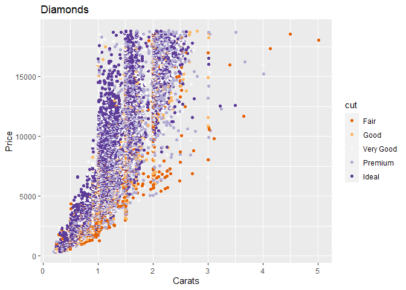

Flipping the direction so red/orange stands out

``` r
ggplot(diamonds, aes(carat, price, color = cut)) + geom_point() + 
  scale_color_brewer(type = 'div', palette = 4, direction = -1) + 
  xlab('Carats') + ylab('Price') + ggtitle('Diamonds')
```

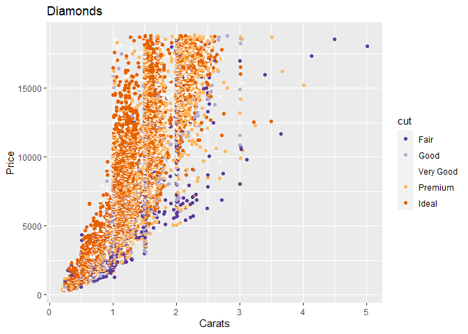

``` r
ggplot(diamonds, aes(carat, price, color = cut)) + geom_point() + 
  scale_color_brewer(type = 'div', palette = 'Spectral', direction = 1) + 
  xlab('Carats') + ylab('Price') + ggtitle('Diamonds')
```

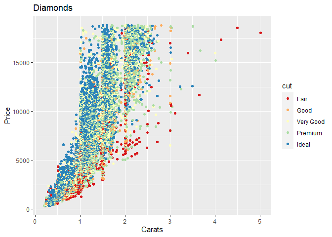

``` r
ggplot(diamonds, aes(carat, price, color = cut)) + geom_point() + 
  scale_color_brewer(type = 'div', palette = 'Set3', direction = 1) + 
  xlab('Carats') + ylab('Price') + ggtitle('Diamonds')
```

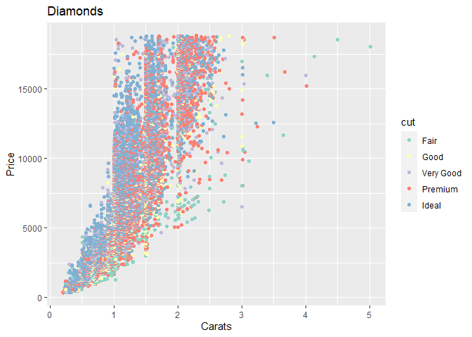

# Plots for Regression

Load in the World Band data

``` r
cs<-read.csv("cs.csv", header=TRUE)
```

Recode corruption

``` r
cs$corrup2 <- 10 - cs$corrup
```

Run a simple regression and plot with line of best fit

``` r
plot(cs$corrup2, cs$gdppc, main = "Gross Domestic Product Per Capita by Corruption",
     ylab = "GDP Per Capita", xlab = "Corruption")
abline(lm(cs$gdppc~cs$corrup2), col = "red", lwd = 2, lty = 1)
```

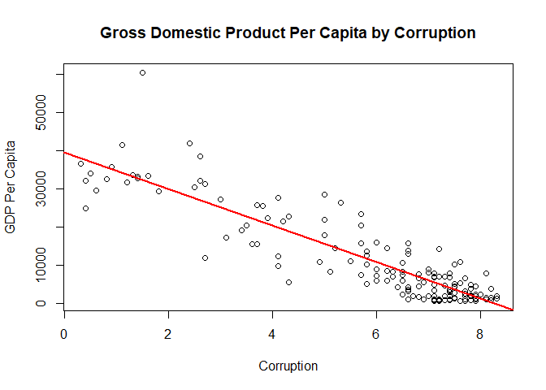

This will run a multiple regresson and store the results

``` r
model1 <- lm(cs$gdppc ~ cs$corrup2 + cs$oecd)
summary(model1)
```


    Call:
    lm(formula = cs$gdppc ~ cs$corrup2 + cs$oecd)

    Residuals:
         Min       1Q   Median       3Q      Max 
    -13275.1  -2770.0   -435.9   1954.0  26043.9 

    Coefficients:
                Estimate Std. Error t value             Pr(>|t|)    
    (Intercept)    31604       1698  18.617 < 0.0000000000000002 ***
    cs$corrup2     -3716        247 -15.041 < 0.0000000000000002 ***
    cs$oecd         8153       1344   6.068         0.0000000104 ***
    ---
    Signif. codes:  0 '***' 0.001 '**' 0.01 '*' 0.05 '.' 0.1 ' ' 1

    Residual standard error: 4718 on 148 degrees of freedom
      (66 observations deleted due to missingness)
    Multiple R-squared:  0.8372,    Adjusted R-squared:  0.835 
    F-statistic: 380.6 on 2 and 148 DF,  p-value: < 0.00000000000000022

Here are some commands to run regression diagnostics

``` r
par(mar=c(2,2,2,2), #number of lines of margin
    mfrow=c(2,2))   #two figures per row, two per column
plot(model1)        #the summary has the diagnostics already stored
```

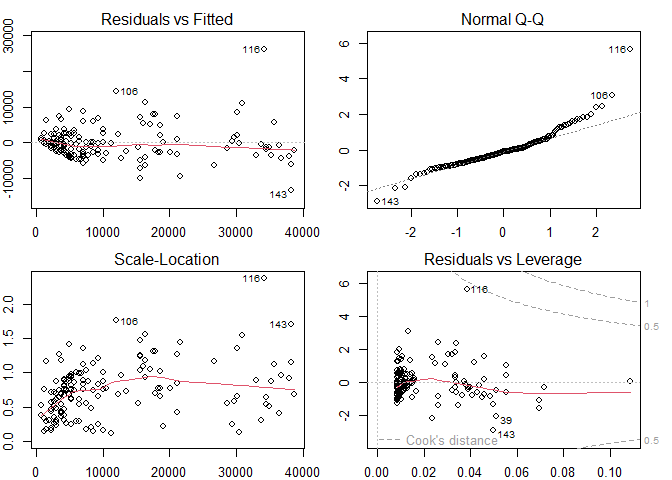

change it so they are stacked

``` r
par(mar=c(2,2,2,2), #number of lines of margin
    mfrow=c(4,1))   #two figures per row, two per column
plot(model1)        #the summary has the diagnostics already stored
```

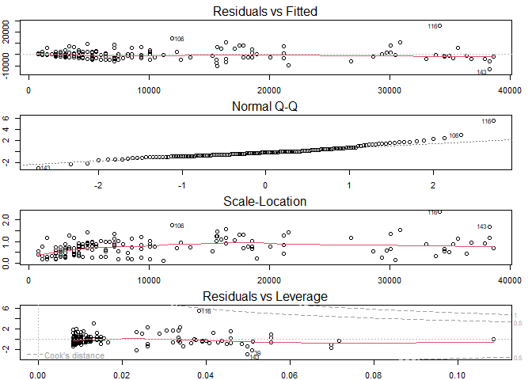

change it so they are in columns

``` r
par(mar=c(2,2,2,2), #number of lines of margin
    mfrow=c(1,4))   #two figures per row, two per column
plot(model1)        #the summary has the diagnostics already stored
```

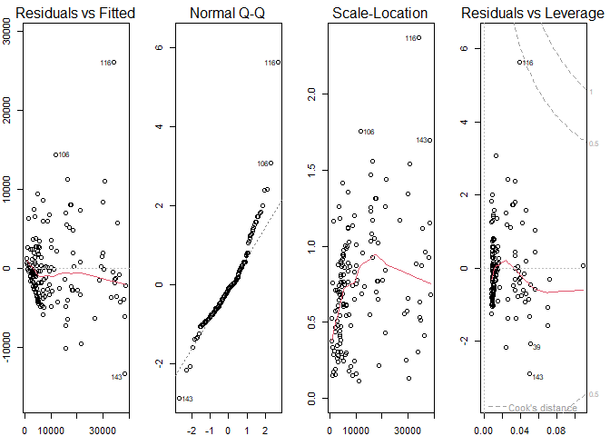

example of regression visuals
http://www.sthda.com/english/wiki/print.php?id=188

``` r
data("mtcars")
```

change cylinder as factor

``` r
mtcars$cyl <- as.factor(mtcars$cyl)
```

Add the regression line

``` r
ggplot(mtcars, aes(x=wt, y=mpg)) + 
  geom_point()+
  geom_smooth(method=lm)
```

    `geom_smooth()` using formula 'y ~ x'

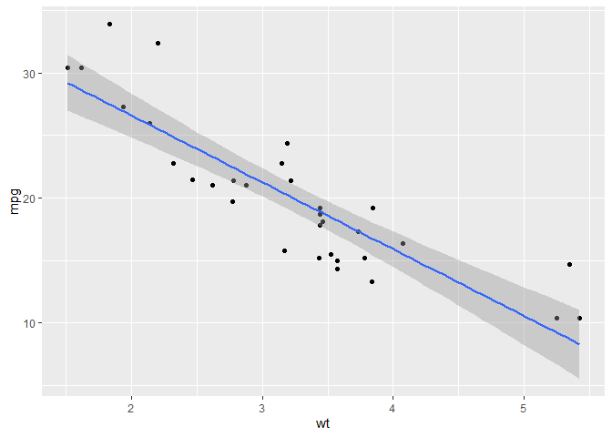

Remove the confidence interval

``` r
ggplot(mtcars, aes(x=wt, y=mpg)) + 
  geom_point()+
  geom_smooth(method=lm, se=FALSE)
```

    `geom_smooth()` using formula 'y ~ x'


Loess method

``` r
ggplot(mtcars, aes(x=wt, y=mpg)) + 
  geom_point()+
  geom_smooth()
```

    `geom_smooth()` using method = 'loess' and formula 'y ~ x'

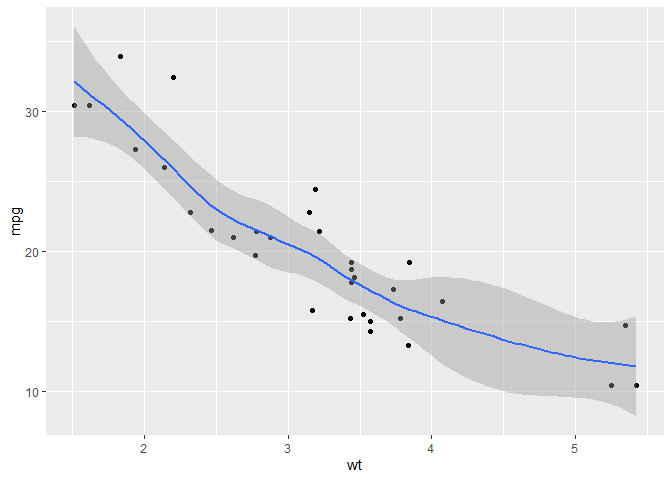

Extend the regression lines

``` r
ggplot(mtcars, aes(x=wt, y=mpg, color=cyl, shape=cyl)) +
  geom_point() + 
  geom_smooth(method=lm, se=FALSE, fullrange=TRUE)
```

    `geom_smooth()` using formula 'y ~ x'

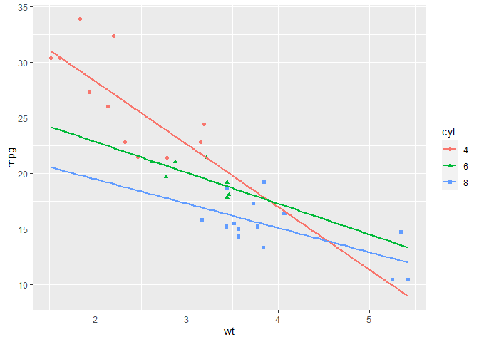

# Heat Maps in R

Heat map for correlational tables

Tutorial from:
http://www.sthda.com/english/wiki/ggplot2-quick-correlation-matrix-heatmap-r-software-and-data-visualization

``` r
mydata <- mtcars[, c(1,3,4,5,6,7)]
head(mydata)
```

                       mpg disp  hp drat    wt  qsec
    Mazda RX4         21.0  160 110 3.90 2.620 16.46
    Mazda RX4 Wag     21.0  160 110 3.90 2.875 17.02
    Datsun 710        22.8  108  93 3.85 2.320 18.61
    Hornet 4 Drive    21.4  258 110 3.08 3.215 19.44
    Hornet Sportabout 18.7  360 175 3.15 3.440 17.02
    Valiant           18.1  225 105 2.76 3.460 20.22

extract correlational table and round to two decimal places

``` r
cormat <- round(cor(mydata),2)
head(cormat)
```

           mpg  disp    hp  drat    wt  qsec
    mpg   1.00 -0.85 -0.78  0.68 -0.87  0.42
    disp -0.85  1.00  0.79 -0.71  0.89 -0.43
    hp   -0.78  0.79  1.00 -0.45  0.66 -0.71
    drat  0.68 -0.71 -0.45  1.00 -0.71  0.09
    wt   -0.87  0.89  0.66 -0.71  1.00 -0.17
    qsec  0.42 -0.43 -0.71  0.09 -0.17  1.00

reconfigure the data

``` r
melted_cormat <- melt(cormat)
```

    Warning in type.convert.default(X[[i]], ...): 'as.is' should be specified by the
    caller; using TRUE

    Warning in type.convert.default(X[[i]], ...): 'as.is' should be specified by the
    caller; using TRUE

``` r
head(melted_cormat)
```

        X1  X2 value
    1  mpg mpg  1.00
    2 disp mpg -0.85
    3   hp mpg -0.78
    4 drat mpg  0.68
    5   wt mpg -0.87
    6 qsec mpg  0.42

plot the correlations

``` r
ggplot(data = melted_cormat, aes(x=X1, y=X2, fill=value)) + 
  geom_tile()
```

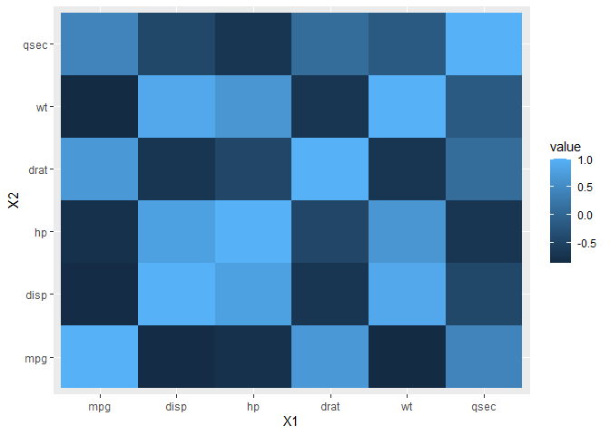

Functions to get lower triangle of the correlation matrix

``` r
get_lower_tri<-function(cormat){
  cormat[upper.tri(cormat)] <- NA
  return(cormat)
}
# Get upper triangle of the correlation matrix
get_upper_tri <- function(cormat){
  cormat[lower.tri(cormat)]<- NA
  return(cormat)
}
```

Let’s extract the upper diagonal

``` r
upper_tri <- get_upper_tri(cormat)
upper_tri
```

         mpg  disp    hp  drat    wt  qsec
    mpg    1 -0.85 -0.78  0.68 -0.87  0.42
    disp  NA  1.00  0.79 -0.71  0.89 -0.43
    hp    NA    NA  1.00 -0.45  0.66 -0.71
    drat  NA    NA    NA  1.00 -0.71  0.09
    wt    NA    NA    NA    NA  1.00 -0.17
    qsec  NA    NA    NA    NA    NA  1.00

``` r
melted_cormat <- melt(upper_tri, na.rm = TRUE)
```

    Warning in type.convert.default(X[[i]], ...): 'as.is' should be specified by the
    caller; using TRUE

    Warning in type.convert.default(X[[i]], ...): 'as.is' should be specified by the
    caller; using TRUE

``` r
melted_cormat
```

         X1   X2 value
    1   mpg  mpg  1.00
    2  disp  mpg    NA
    3    hp  mpg    NA
    4  drat  mpg    NA
    5    wt  mpg    NA
    6  qsec  mpg    NA
    7   mpg disp -0.85
    8  disp disp  1.00
    9    hp disp    NA
    10 drat disp    NA
    11   wt disp    NA
    12 qsec disp    NA
    13  mpg   hp -0.78
    14 disp   hp  0.79
    15   hp   hp  1.00
    16 drat   hp    NA
    17   wt   hp    NA
    18 qsec   hp    NA
    19  mpg drat  0.68
    20 disp drat -0.71
    21   hp drat -0.45
    22 drat drat  1.00
    23   wt drat    NA
    24 qsec drat    NA
    25  mpg   wt -0.87
    26 disp   wt  0.89
    27   hp   wt  0.66
    28 drat   wt -0.71
    29   wt   wt  1.00
    30 qsec   wt    NA
    31  mpg qsec  0.42
    32 disp qsec -0.43
    33   hp qsec -0.71
    34 drat qsec  0.09
    35   wt qsec -0.17
    36 qsec qsec  1.00

Plot it

``` r
ggplot(data = melted_cormat, aes(x=X1, y=X2, fill=value)) + 
  geom_tile()
```

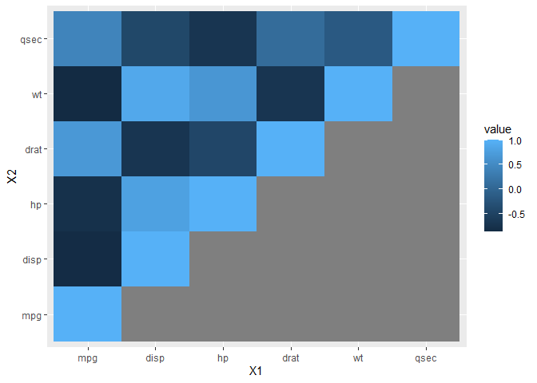

Heatmap

``` r
ggplot(data = melted_cormat, aes(X2, X1, fill = value))+
  geom_tile(color = "white")+
  scale_fill_gradient2(low = "blue", high = "red", mid = "white", 
                       midpoint = 0, limit = c(-1,1), space = "Lab", 
                       name="Pearson\nCorrelation") +
  theme_minimal()+ 
  theme(axis.text.x = element_text(angle = 45, vjust = 1, 
                                   size = 12, hjust = 1))+
  coord_fixed()
```


Reorder the correlations

``` r
reorder_cormat <- function(cormat){
  # Use correlation between variables as distance
  dd <- as.dist((1-cormat)/2)
  hc <- hclust(dd)
  cormat <-cormat[hc$order, hc$order]
}

# Reorder the correlation matrix
cormat <- reorder_cormat(cormat)
upper_tri <- get_upper_tri(cormat)
# Melt the correlation matrix
melted_cormat <- melt(upper_tri, na.rm = TRUE)
```

    Warning in type.convert.default(X[[i]], ...): 'as.is' should be specified by the
    caller; using TRUE

    Warning in type.convert.default(X[[i]], ...): 'as.is' should be specified by the
    caller; using TRUE

Create a ggheatmap

``` r
ggheatmap <- ggplot(melted_cormat, aes(X2, X1, fill = value))+
  geom_tile(color = "white")+
  scale_fill_gradient2(low = "blue", high = "red", mid = "white", 
                       midpoint = 0, limit = c(-1,1), space = "Lab", 
                       name="Pearson\nCorrelation") +
  theme_minimal()+ # minimal theme
  theme(axis.text.x = element_text(angle = 45, vjust = 1, 
                                   size = 12, hjust = 1))+
  coord_fixed()
```

Print the heatmap

``` r
print(ggheatmap)
```

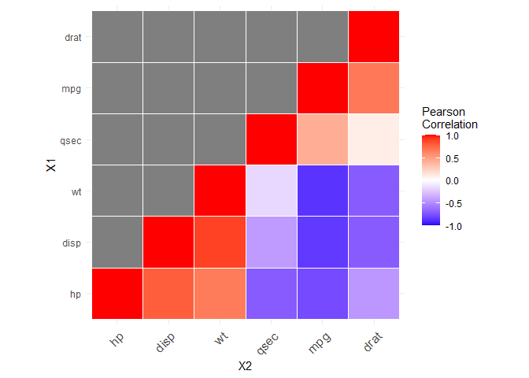

``` r
ggheatmap + 
  geom_text(aes(X2, X1, label = value), color = "black", size = 4) +
  theme(
    axis.title.x = element_blank(),
    axis.title.y = element_blank(),
    panel.grid.major = element_blank(),
    panel.border = element_blank(),
    panel.background = element_blank(),
    axis.ticks = element_blank(),
    legend.justification = c(1, 0),
    legend.position = c(0.6, 0.7),
    legend.direction = "horizontal")+
  guides(fill = guide_colorbar(barwidth = 7, barheight = 1,
                               title.position = "top", title.hjust = 0.5))
```

    Warning: Removed 15 rows containing missing values (geom_text).

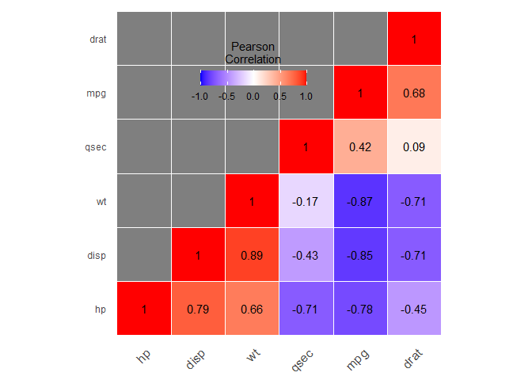

# Time Series Visualizations

Import some sample time series data from ggplots2

``` r
econ <- economics[, c("date", "psavert", "uempmed")]
econ <- econ[lubridate::year(econ$date) %in% c(1990:2015), ]
```

labels and breaks for X axis text

``` r
brks <- econ$date[seq(1, length(econ$date), 12)]
lbls <- lubridate::year(brks)
```

Plot the time series and add titles, caption, and legend

``` r
timeseries <-ggplot(econ, aes(x=date)) + 
                geom_line(aes(y=psavert, col="Personal Savings Rate")) + 
                geom_line(aes(y=uempmed, col="Median Duration of Unemployment")) + 
                labs(title="Figure 2", 
                     subtitle="Time Series of Returns Percentage from 1990 to 2015", 
                     caption="Source: Economics (ggplots2)", y="Returns %") +  # title and caption
                scale_x_date(labels = lbls, breaks = brks) +  # change to monthly ticks and labels
                scale_color_manual(name="", 
                                   values = c("Personal Savings Rate"="red4", 
                                              "Median Duration of Unemployment"="navyblue")) +  # line color
                theme(panel.grid.minor = element_blank())  # turn off minor grid

timeseries
```

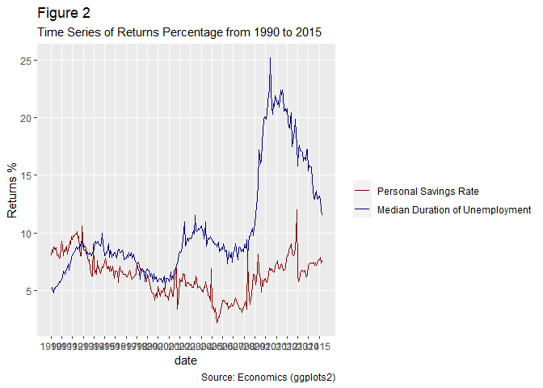

# How to save figures and export out of R

As a .pdf

``` r
pdf("MyExperiment.pdf")
exp
dev.off()
```

    png 
      2 

As a jpeg

``` r
jpeg("Timeseries.jpg", width = 1300, height = 500)
timeseries
dev.off()
```

    png 
      2 

*Great resources:*

- https://www.rstudio.com/wp-content/uploads/2015/03/ggplot2-cheatsheet.pdf
- https://ggplot2.tidyverse.org/
- https://cran.r-project.org/package=ggplot2/ggplot2.pdf
- http://zevross.com/blog/2014/08/04/beautiful-plotting-in-r-a-ggplot2-cheatsheet-3/
- http://www.cookbook-r.com/Graphs/Bar_and_line_graphs\_(ggplot2)/
