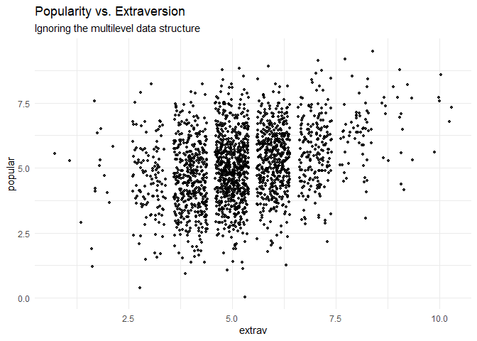

Introduction to Multilevel Modeling in R
================
Eric R. Schuler, Ph.D.
2022-10-17

<script src="Introduction to MLM in R 2022_files/libs/kePrint-0.0.1/kePrint.js"></script>
<link href="Introduction to MLM in R 2022_files/libs/lightable-0.0.1/lightable.css" rel="stylesheet" />


**Title:** Basics of Multilevel Modeling in R

**Speaker:** Eric R. Schuler

**Description:** This workshop will cover the basics of multilevel
modeling in R when working with nested data. Specifically, we will
cover:

1.  What exactly is multilevel modeling
2.  Assess the degree of nestedness
3.  Running some basic two-level multilevel models
4.  Calculate the effect size in multilevel models
5.  How to check assumptions
6.  How to store the results in a table

This workshop assumes familiarity with R (if not, please see our
On-Demand Workshop on Using R). Additional resources will be provided.
The code for this workshop has been adapted from the *LME4 Tutorial:
Popularity Data* by Laurent Smeets and Rens van de Shoot (see:
https://www.rensvandeschoot.com/tutorials/lme4/)

Set Working Directory

``` r
setwd("C:/Users/eschuler/Documents/GitHub/R-Learning-Modules/6. Multilevel Modeling")
```

We will now check to see if the packages we need are already installed
(if any are missing they will be added)

# What is multilevel modeling?

Multilevel modeling (MLM) is a analytical method to run regressions with
data that has a nested structure to it. For example students nested
within classrooms or daily responses nested within participants. By not
accounting for the nested data structure, it is possible that there may
be violations to the independence of observations assumption that
regression has. Sometimes the data can be nested but that nestedness
does not carry heavy influence, this is something that needs to be
assessed prior to running the model. Multilevel regression models are
sometimes called random coefficient models, variance component models,
hierarchical linear models, or mixed effects models (Hox, Moerbeekk, &
van de Schoot, 2010 p.11). All these models assume a single outcome that
is measured as the lowest level and independent variables all existing
levels (level 1 and level 2 for a two-level MLM). It is important to
note that these different models are not exactly the same though. For
this workshop we are going to be using a basic two-level regression
model.

For this tutorial we will be using data from the book Multilevel
Analysis: Techniques and Applications (Second Edition) by Joop J. Hox.
The data can be located on GitHub as an SPSS .sav datafile (we will read
it directly in to R):
https://github.com/MultiLevelAnalysis/Datasets-third-edition-Multilevel-book/blob/master/chapter%202/popularity/SPSS/popular2.sav

*Please note that these data sets are for educational/teaching purposes
only.*

Our data consists of students nested within classrooms and have
variables at the student level and classroom (teacher) level. There are
100 classrooms and approximately 20 students per classroom (the average
class size is 20 students, this is information later).

Here is a description of the dataset from Hox (2010, Appendix A,
p. 352):

*“The popularity data in popular2.csv are simulated data for 2000 pupils
in 100 schools. The purpose is to offer a very simple example for
multilevel regression analysis. The main outcome variable is the pupil
popularity, a popularity rating on a scale of 1–10 derived by a
sociometric procedure. Typically, a sociometric procedure asks all
pupils in a class to rate all the other pupils, and then assigns the
average received popularity rating to each pupil. Because of the
sociometric procedure, group effects as apparent from higher-level
variance components are rather strong. There is a second outcome
variable: pupil popularity as rated by their teacher, on a scale from 1
to 10. The explanatory variables are pupil sex (boy = 0, girl = 1),
pupil extraversion (10-point scale), and teacher experience in
years….The popularity data have been generated to be a ‘nice’
wellbehaved data set: the sample sizes at both levels are sufficient,
the residuals have a normal distribution, and the multilevel effects are
strong.”*

Our outcomes is popularity, measured at the student level.

We have a level 1 independent variable of student sex (dummy coded) and
student extraversion (self-reported ranging from 1 to 10, so we will
treat it as continuous). We also have a level 2 independent variable of
teacher experience (ranging from 2 to 25 years).

Our multilevel equation is going to look like:

$$y_{ij} = b_{0j} + b_{1j}x_{ij} + b_{2j}x_{ij} +  e_{it}$$

The notation $i$ represents individual students (i = 1, …, 2000), $j$
represents the classes (j = 1, …,100).

In this equation, our outcome variable of popularity ($y_{it}$) is a
function of the person specific intercept,$b_{0i}$ , a class-specific
slope ($b_{1i}$), which will indicate the within-class association of
popularity, and the residual error, $e_{it}$.

The class-specific equation for the intercept ($b_{0i}$) can be written
as:

$$b_{0i} = \gamma_{00} + \gamma_{01}z_{i} + u_{0i}$$

Where the $\gamma_{00}$ is fixed effect of the average class’ intercept,
$\gamma_{01}$ is used to represent the class differences in the
class-specific intercepts related to the between-class differences in
the variable $z_{1i}$. $u_{0i}$ is a random effect and residual of
unexplained differences in the intercepts.

The class-specific equation for the class specific slope ($b_{1i}$):

$$b_{1i} = \gamma_{10} + \gamma_{11}z_{i} + u_{1i}$$ Where the
$\gamma_{10}$ is fixed effect of the average class’ slope, $\gamma_{11}$
is used to represent the class differences in the class-specific slopes
related to the between-class differences in the variable $z_{1i}$.
$u_{1i}$ is a random effect and residual of unexplained differences in
the slopes.

When we rearrange the equations into one complex equation it will look
like:

$$Y_{ij} = \gamma_{00} + \gamma_{10}X_{1ij} + \gamma_{20}X_{2ij} + \gamma_{01}Z_{1j} + \\ \gamma_{11}X_{1ij}Z_j + \gamma_{21}X_{2ij}Z_j + u_{1j}X_{1ij} + u_{2j}X_{2ij} + u_{0j} + e_{ij}$$

With variable labels the equation is:

$$popularity_{ij} = \gamma_{00} + \gamma_{10}sex_{ij} + \gamma_{20}extraversion_{ij} + \gamma_{01}experience_{j} + \\ \gamma_{11}gender_{1ij} *experience_j + \gamma_{21}extraversion_{ij}*experience_j + \\ u_{1j}gender_{ij} + u_{2j}extraversion_{ij} + u_{0j} + e_{ij}$$
\# Load the dataset

We will now pull the data set directly from GitHub and import the SPSS
file into R.

``` r
popular_data <- haven::read_sav(file ="https://github.com/MultiLevelAnalysis/Datasets-third-edition-Multilevel-book/blob/master/chapter%202/popularity/SPSS/popular2.sav?raw=true")
```

There are some variables that will not be used in the dataset, so we
will subset them to only the variables of interest

``` r
popular_data <- popular_data[,c("pupil","class",
                                "extrav","sex",
                                "texp","popular")]
popular_data$pupil <- as.numeric(popular_data$pupil)
popular_data$extrav <- as.numeric(popular_data$extrav)
popular_data$sex <- as.numeric(popular_data$sex)
popular_data$texp <- as.numeric(popular_data$texp)
popular_data$popular <- as.numeric(popular_data$popular)
```

Let’s look at the descriptive statistics of the dataset

``` r
psych::describe(popular_data)
```

            vars    n  mean    sd median trimmed   mad min   max range  skew
    pupil      1 2000 10.65  5.97   11.0   10.56  7.41   1  26.0  25.0  0.10
    class      2 2000 50.37 29.08   51.0   50.33 37.81   1 100.0  99.0  0.01
    extrav     3 2000  5.22  1.26    5.0    5.17  1.48   1  10.0   9.0  0.37
    sex        4 2000  0.51  0.50    1.0    0.51  0.00   0   1.0   1.0 -0.02
    texp       5 2000 14.26  6.55   15.0   14.40  8.15   2  25.0  23.0 -0.14
    popular    6 2000  5.08  1.38    5.1    5.08  1.33   0   9.5   9.5 -0.05
            kurtosis   se
    pupil      -1.06 0.13
    class      -1.22 0.65
    extrav      0.66 0.03
    sex        -2.00 0.01
    texp       -1.04 0.15
    popular    -0.06 0.03

We can also look at descriptives by classroom

``` r
means <- psych::describeBy(popular_data$popular, group = as.factor(popular_data$class), mat = TRUE)
means <- means[,c("group1","n","mean","sd","median", "skew","kurtosis","se")]
rownames(means) <-NULL
htmlTable::htmlTable(format(means, digits = 2)) 
```

<table class='gmisc_table' style='border-collapse: collapse; margin-top: 1em; margin-bottom: 1em;' >
<thead>
<tr><th style='border-bottom: 1px solid grey; border-top: 2px solid grey;'></th>
<th style='font-weight: 900; border-bottom: 1px solid grey; border-top: 2px solid grey; text-align: center;'>group1</th>
<th style='font-weight: 900; border-bottom: 1px solid grey; border-top: 2px solid grey; text-align: center;'>n</th>
<th style='font-weight: 900; border-bottom: 1px solid grey; border-top: 2px solid grey; text-align: center;'>mean</th>
<th style='font-weight: 900; border-bottom: 1px solid grey; border-top: 2px solid grey; text-align: center;'>sd</th>
<th style='font-weight: 900; border-bottom: 1px solid grey; border-top: 2px solid grey; text-align: center;'>median</th>
<th style='font-weight: 900; border-bottom: 1px solid grey; border-top: 2px solid grey; text-align: center;'>skew</th>
<th style='font-weight: 900; border-bottom: 1px solid grey; border-top: 2px solid grey; text-align: center;'>kurtosis</th>
<th style='font-weight: 900; border-bottom: 1px solid grey; border-top: 2px solid grey; text-align: center;'>se</th>
</tr>
</thead>
<tbody>
<tr>
<td style='text-align: left;'>1</td>
<td style='text-align: center;'>1</td>
<td style='text-align: center;'>20</td>
<td style='text-align: center;'>5.1</td>
<td style='text-align: center;'>0.95</td>
<td style='text-align: center;'>5.1</td>
<td style='text-align: center;'>-0.498</td>
<td style='text-align: center;'>-0.578</td>
<td style='text-align: center;'>0.21</td>
</tr>
<tr>
<td style='text-align: left;'>2</td>
<td style='text-align: center;'>2</td>
<td style='text-align: center;'>20</td>
<td style='text-align: center;'>4.1</td>
<td style='text-align: center;'>1.00</td>
<td style='text-align: center;'>4.0</td>
<td style='text-align: center;'> 0.618</td>
<td style='text-align: center;'>-0.095</td>
<td style='text-align: center;'>0.22</td>
</tr>
<tr>
<td style='text-align: left;'>3</td>
<td style='text-align: center;'>3</td>
<td style='text-align: center;'>18</td>
<td style='text-align: center;'>4.7</td>
<td style='text-align: center;'>1.16</td>
<td style='text-align: center;'>4.8</td>
<td style='text-align: center;'>-0.175</td>
<td style='text-align: center;'>-0.912</td>
<td style='text-align: center;'>0.27</td>
</tr>
<tr>
<td style='text-align: left;'>4</td>
<td style='text-align: center;'>4</td>
<td style='text-align: center;'>23</td>
<td style='text-align: center;'>5.4</td>
<td style='text-align: center;'>0.81</td>
<td style='text-align: center;'>5.4</td>
<td style='text-align: center;'>-0.336</td>
<td style='text-align: center;'>-0.975</td>
<td style='text-align: center;'>0.17</td>
</tr>
<tr>
<td style='text-align: left;'>5</td>
<td style='text-align: center;'>5</td>
<td style='text-align: center;'>21</td>
<td style='text-align: center;'>5.3</td>
<td style='text-align: center;'>0.95</td>
<td style='text-align: center;'>5.3</td>
<td style='text-align: center;'> 0.330</td>
<td style='text-align: center;'>-0.766</td>
<td style='text-align: center;'>0.21</td>
</tr>
<tr>
<td style='text-align: left;'>6</td>
<td style='text-align: center;'>6</td>
<td style='text-align: center;'>20</td>
<td style='text-align: center;'>4.3</td>
<td style='text-align: center;'>0.97</td>
<td style='text-align: center;'>4.2</td>
<td style='text-align: center;'> 0.425</td>
<td style='text-align: center;'>-0.640</td>
<td style='text-align: center;'>0.22</td>
</tr>
<tr>
<td style='text-align: left;'>7</td>
<td style='text-align: center;'>7</td>
<td style='text-align: center;'>21</td>
<td style='text-align: center;'>4.2</td>
<td style='text-align: center;'>1.09</td>
<td style='text-align: center;'>4.1</td>
<td style='text-align: center;'>-0.288</td>
<td style='text-align: center;'>-0.556</td>
<td style='text-align: center;'>0.24</td>
</tr>
<tr>
<td style='text-align: left;'>8</td>
<td style='text-align: center;'>8</td>
<td style='text-align: center;'>20</td>
<td style='text-align: center;'>4.0</td>
<td style='text-align: center;'>1.16</td>
<td style='text-align: center;'>4.0</td>
<td style='text-align: center;'>-0.134</td>
<td style='text-align: center;'>-0.604</td>
<td style='text-align: center;'>0.26</td>
</tr>
<tr>
<td style='text-align: left;'>9</td>
<td style='text-align: center;'>9</td>
<td style='text-align: center;'>20</td>
<td style='text-align: center;'>4.7</td>
<td style='text-align: center;'>1.27</td>
<td style='text-align: center;'>4.5</td>
<td style='text-align: center;'> 0.459</td>
<td style='text-align: center;'>-0.726</td>
<td style='text-align: center;'>0.28</td>
</tr>
<tr>
<td style='text-align: left;'>10</td>
<td style='text-align: center;'>10</td>
<td style='text-align: center;'>24</td>
<td style='text-align: center;'>5.3</td>
<td style='text-align: center;'>0.83</td>
<td style='text-align: center;'>5.3</td>
<td style='text-align: center;'>-0.301</td>
<td style='text-align: center;'> 0.086</td>
<td style='text-align: center;'>0.17</td>
</tr>
<tr>
<td style='text-align: left;'>11</td>
<td style='text-align: center;'>11</td>
<td style='text-align: center;'>22</td>
<td style='text-align: center;'>4.4</td>
<td style='text-align: center;'>0.91</td>
<td style='text-align: center;'>4.6</td>
<td style='text-align: center;'>-1.230</td>
<td style='text-align: center;'> 1.898</td>
<td style='text-align: center;'>0.19</td>
</tr>
<tr>
<td style='text-align: left;'>12</td>
<td style='text-align: center;'>12</td>
<td style='text-align: center;'>17</td>
<td style='text-align: center;'>4.2</td>
<td style='text-align: center;'>0.96</td>
<td style='text-align: center;'>4.5</td>
<td style='text-align: center;'>-0.232</td>
<td style='text-align: center;'>-0.975</td>
<td style='text-align: center;'>0.23</td>
</tr>
<tr>
<td style='text-align: left;'>13</td>
<td style='text-align: center;'>13</td>
<td style='text-align: center;'>20</td>
<td style='text-align: center;'>6.1</td>
<td style='text-align: center;'>0.85</td>
<td style='text-align: center;'>6.2</td>
<td style='text-align: center;'> 0.242</td>
<td style='text-align: center;'> 0.057</td>
<td style='text-align: center;'>0.19</td>
</tr>
<tr>
<td style='text-align: left;'>14</td>
<td style='text-align: center;'>14</td>
<td style='text-align: center;'>17</td>
<td style='text-align: center;'>3.6</td>
<td style='text-align: center;'>1.24</td>
<td style='text-align: center;'>3.3</td>
<td style='text-align: center;'> 0.418</td>
<td style='text-align: center;'>-0.272</td>
<td style='text-align: center;'>0.30</td>
</tr>
<tr>
<td style='text-align: left;'>15</td>
<td style='text-align: center;'>15</td>
<td style='text-align: center;'>24</td>
<td style='text-align: center;'>4.7</td>
<td style='text-align: center;'>1.23</td>
<td style='text-align: center;'>4.5</td>
<td style='text-align: center;'> 0.553</td>
<td style='text-align: center;'>-0.052</td>
<td style='text-align: center;'>0.25</td>
</tr>
<tr>
<td style='text-align: left;'>16</td>
<td style='text-align: center;'>16</td>
<td style='text-align: center;'>17</td>
<td style='text-align: center;'>4.9</td>
<td style='text-align: center;'>1.22</td>
<td style='text-align: center;'>5.1</td>
<td style='text-align: center;'>-0.197</td>
<td style='text-align: center;'>-1.062</td>
<td style='text-align: center;'>0.30</td>
</tr>
<tr>
<td style='text-align: left;'>17</td>
<td style='text-align: center;'>17</td>
<td style='text-align: center;'>26</td>
<td style='text-align: center;'>5.1</td>
<td style='text-align: center;'>1.18</td>
<td style='text-align: center;'>5.3</td>
<td style='text-align: center;'>-0.089</td>
<td style='text-align: center;'>-1.371</td>
<td style='text-align: center;'>0.23</td>
</tr>
<tr>
<td style='text-align: left;'>18</td>
<td style='text-align: center;'>18</td>
<td style='text-align: center;'>21</td>
<td style='text-align: center;'>6.2</td>
<td style='text-align: center;'>0.98</td>
<td style='text-align: center;'>6.6</td>
<td style='text-align: center;'>-0.150</td>
<td style='text-align: center;'>-1.059</td>
<td style='text-align: center;'>0.21</td>
</tr>
<tr>
<td style='text-align: left;'>19</td>
<td style='text-align: center;'>19</td>
<td style='text-align: center;'>20</td>
<td style='text-align: center;'>5.5</td>
<td style='text-align: center;'>1.14</td>
<td style='text-align: center;'>5.6</td>
<td style='text-align: center;'>-0.311</td>
<td style='text-align: center;'>-0.930</td>
<td style='text-align: center;'>0.25</td>
</tr>
<tr>
<td style='text-align: left;'>20</td>
<td style='text-align: center;'>20</td>
<td style='text-align: center;'>20</td>
<td style='text-align: center;'>5.4</td>
<td style='text-align: center;'>1.39</td>
<td style='text-align: center;'>5.8</td>
<td style='text-align: center;'>-0.813</td>
<td style='text-align: center;'>-0.800</td>
<td style='text-align: center;'>0.31</td>
</tr>
<tr>
<td style='text-align: left;'>21</td>
<td style='text-align: center;'>21</td>
<td style='text-align: center;'>23</td>
<td style='text-align: center;'>4.8</td>
<td style='text-align: center;'>0.89</td>
<td style='text-align: center;'>4.7</td>
<td style='text-align: center;'> 0.329</td>
<td style='text-align: center;'>-0.969</td>
<td style='text-align: center;'>0.19</td>
</tr>
<tr>
<td style='text-align: left;'>22</td>
<td style='text-align: center;'>22</td>
<td style='text-align: center;'>20</td>
<td style='text-align: center;'>6.3</td>
<td style='text-align: center;'>0.76</td>
<td style='text-align: center;'>6.2</td>
<td style='text-align: center;'> 0.377</td>
<td style='text-align: center;'>-1.300</td>
<td style='text-align: center;'>0.17</td>
</tr>
<tr>
<td style='text-align: left;'>23</td>
<td style='text-align: center;'>23</td>
<td style='text-align: center;'>22</td>
<td style='text-align: center;'>5.3</td>
<td style='text-align: center;'>1.07</td>
<td style='text-align: center;'>5.5</td>
<td style='text-align: center;'>-0.362</td>
<td style='text-align: center;'>-1.105</td>
<td style='text-align: center;'>0.23</td>
</tr>
<tr>
<td style='text-align: left;'>24</td>
<td style='text-align: center;'>24</td>
<td style='text-align: center;'>19</td>
<td style='text-align: center;'>4.6</td>
<td style='text-align: center;'>1.27</td>
<td style='text-align: center;'>4.5</td>
<td style='text-align: center;'> 0.499</td>
<td style='text-align: center;'>-0.815</td>
<td style='text-align: center;'>0.29</td>
</tr>
<tr>
<td style='text-align: left;'>25</td>
<td style='text-align: center;'>25</td>
<td style='text-align: center;'>20</td>
<td style='text-align: center;'>4.8</td>
<td style='text-align: center;'>1.12</td>
<td style='text-align: center;'>4.9</td>
<td style='text-align: center;'> 0.072</td>
<td style='text-align: center;'>-1.136</td>
<td style='text-align: center;'>0.25</td>
</tr>
<tr>
<td style='text-align: left;'>26</td>
<td style='text-align: center;'>26</td>
<td style='text-align: center;'>21</td>
<td style='text-align: center;'>4.1</td>
<td style='text-align: center;'>1.09</td>
<td style='text-align: center;'>3.8</td>
<td style='text-align: center;'> 0.723</td>
<td style='text-align: center;'>-0.742</td>
<td style='text-align: center;'>0.24</td>
</tr>
<tr>
<td style='text-align: left;'>27</td>
<td style='text-align: center;'>27</td>
<td style='text-align: center;'>20</td>
<td style='text-align: center;'>4.4</td>
<td style='text-align: center;'>1.10</td>
<td style='text-align: center;'>4.6</td>
<td style='text-align: center;'> 0.041</td>
<td style='text-align: center;'>-1.008</td>
<td style='text-align: center;'>0.25</td>
</tr>
<tr>
<td style='text-align: left;'>28</td>
<td style='text-align: center;'>28</td>
<td style='text-align: center;'>20</td>
<td style='text-align: center;'>4.5</td>
<td style='text-align: center;'>0.76</td>
<td style='text-align: center;'>4.4</td>
<td style='text-align: center;'> 0.180</td>
<td style='text-align: center;'>-1.066</td>
<td style='text-align: center;'>0.17</td>
</tr>
<tr>
<td style='text-align: left;'>29</td>
<td style='text-align: center;'>29</td>
<td style='text-align: center;'>17</td>
<td style='text-align: center;'>5.9</td>
<td style='text-align: center;'>0.88</td>
<td style='text-align: center;'>6.0</td>
<td style='text-align: center;'>-0.550</td>
<td style='text-align: center;'>-0.167</td>
<td style='text-align: center;'>0.21</td>
</tr>
<tr>
<td style='text-align: left;'>30</td>
<td style='text-align: center;'>30</td>
<td style='text-align: center;'>17</td>
<td style='text-align: center;'>4.5</td>
<td style='text-align: center;'>1.21</td>
<td style='text-align: center;'>4.3</td>
<td style='text-align: center;'> 0.543</td>
<td style='text-align: center;'>-0.677</td>
<td style='text-align: center;'>0.29</td>
</tr>
<tr>
<td style='text-align: left;'>31</td>
<td style='text-align: center;'>31</td>
<td style='text-align: center;'>19</td>
<td style='text-align: center;'>4.3</td>
<td style='text-align: center;'>1.72</td>
<td style='text-align: center;'>4.6</td>
<td style='text-align: center;'>-0.583</td>
<td style='text-align: center;'>-0.404</td>
<td style='text-align: center;'>0.39</td>
</tr>
<tr>
<td style='text-align: left;'>32</td>
<td style='text-align: center;'>32</td>
<td style='text-align: center;'>23</td>
<td style='text-align: center;'>4.9</td>
<td style='text-align: center;'>1.18</td>
<td style='text-align: center;'>4.8</td>
<td style='text-align: center;'>-0.014</td>
<td style='text-align: center;'>-0.435</td>
<td style='text-align: center;'>0.25</td>
</tr>
<tr>
<td style='text-align: left;'>33</td>
<td style='text-align: center;'>33</td>
<td style='text-align: center;'>19</td>
<td style='text-align: center;'>7.3</td>
<td style='text-align: center;'>1.34</td>
<td style='text-align: center;'>7.4</td>
<td style='text-align: center;'>-0.197</td>
<td style='text-align: center;'>-1.076</td>
<td style='text-align: center;'>0.31</td>
</tr>
<tr>
<td style='text-align: left;'>34</td>
<td style='text-align: center;'>34</td>
<td style='text-align: center;'>22</td>
<td style='text-align: center;'>4.8</td>
<td style='text-align: center;'>1.25</td>
<td style='text-align: center;'>4.5</td>
<td style='text-align: center;'> 1.160</td>
<td style='text-align: center;'> 1.156</td>
<td style='text-align: center;'>0.27</td>
</tr>
<tr>
<td style='text-align: left;'>35</td>
<td style='text-align: center;'>35</td>
<td style='text-align: center;'>20</td>
<td style='text-align: center;'>7.0</td>
<td style='text-align: center;'>0.62</td>
<td style='text-align: center;'>7.0</td>
<td style='text-align: center;'>-0.449</td>
<td style='text-align: center;'>-0.281</td>
<td style='text-align: center;'>0.14</td>
</tr>
<tr>
<td style='text-align: left;'>36</td>
<td style='text-align: center;'>36</td>
<td style='text-align: center;'>19</td>
<td style='text-align: center;'>5.0</td>
<td style='text-align: center;'>1.04</td>
<td style='text-align: center;'>5.2</td>
<td style='text-align: center;'> 0.393</td>
<td style='text-align: center;'>-0.389</td>
<td style='text-align: center;'>0.24</td>
</tr>
<tr>
<td style='text-align: left;'>37</td>
<td style='text-align: center;'>37</td>
<td style='text-align: center;'>19</td>
<td style='text-align: center;'>5.4</td>
<td style='text-align: center;'>1.20</td>
<td style='text-align: center;'>4.9</td>
<td style='text-align: center;'> 0.258</td>
<td style='text-align: center;'>-1.545</td>
<td style='text-align: center;'>0.28</td>
</tr>
<tr>
<td style='text-align: left;'>38</td>
<td style='text-align: center;'>38</td>
<td style='text-align: center;'>17</td>
<td style='text-align: center;'>4.6</td>
<td style='text-align: center;'>1.03</td>
<td style='text-align: center;'>4.5</td>
<td style='text-align: center;'> 0.325</td>
<td style='text-align: center;'>-1.172</td>
<td style='text-align: center;'>0.25</td>
</tr>
<tr>
<td style='text-align: left;'>39</td>
<td style='text-align: center;'>39</td>
<td style='text-align: center;'>16</td>
<td style='text-align: center;'>5.1</td>
<td style='text-align: center;'>0.72</td>
<td style='text-align: center;'>5.2</td>
<td style='text-align: center;'>-0.311</td>
<td style='text-align: center;'>-0.426</td>
<td style='text-align: center;'>0.18</td>
</tr>
<tr>
<td style='text-align: left;'>40</td>
<td style='text-align: center;'>40</td>
<td style='text-align: center;'>20</td>
<td style='text-align: center;'>6.6</td>
<td style='text-align: center;'>1.33</td>
<td style='text-align: center;'>6.8</td>
<td style='text-align: center;'>-0.629</td>
<td style='text-align: center;'>-0.726</td>
<td style='text-align: center;'>0.30</td>
</tr>
<tr>
<td style='text-align: left;'>41</td>
<td style='text-align: center;'>41</td>
<td style='text-align: center;'>19</td>
<td style='text-align: center;'>3.8</td>
<td style='text-align: center;'>0.79</td>
<td style='text-align: center;'>3.6</td>
<td style='text-align: center;'> 0.408</td>
<td style='text-align: center;'>-0.907</td>
<td style='text-align: center;'>0.18</td>
</tr>
<tr>
<td style='text-align: left;'>42</td>
<td style='text-align: center;'>42</td>
<td style='text-align: center;'>21</td>
<td style='text-align: center;'>5.3</td>
<td style='text-align: center;'>1.16</td>
<td style='text-align: center;'>5.2</td>
<td style='text-align: center;'> 0.417</td>
<td style='text-align: center;'>-1.159</td>
<td style='text-align: center;'>0.25</td>
</tr>
<tr>
<td style='text-align: left;'>43</td>
<td style='text-align: center;'>43</td>
<td style='text-align: center;'>17</td>
<td style='text-align: center;'>5.4</td>
<td style='text-align: center;'>0.76</td>
<td style='text-align: center;'>5.5</td>
<td style='text-align: center;'> 0.160</td>
<td style='text-align: center;'>-1.074</td>
<td style='text-align: center;'>0.19</td>
</tr>
<tr>
<td style='text-align: left;'>44</td>
<td style='text-align: center;'>44</td>
<td style='text-align: center;'>19</td>
<td style='text-align: center;'>4.9</td>
<td style='text-align: center;'>1.03</td>
<td style='text-align: center;'>5.1</td>
<td style='text-align: center;'> 0.091</td>
<td style='text-align: center;'>-1.344</td>
<td style='text-align: center;'>0.24</td>
</tr>
<tr>
<td style='text-align: left;'>45</td>
<td style='text-align: center;'>45</td>
<td style='text-align: center;'>19</td>
<td style='text-align: center;'>5.8</td>
<td style='text-align: center;'>1.16</td>
<td style='text-align: center;'>5.5</td>
<td style='text-align: center;'> 0.644</td>
<td style='text-align: center;'>-0.988</td>
<td style='text-align: center;'>0.27</td>
</tr>
<tr>
<td style='text-align: left;'>46</td>
<td style='text-align: center;'>46</td>
<td style='text-align: center;'>23</td>
<td style='text-align: center;'>5.0</td>
<td style='text-align: center;'>1.31</td>
<td style='text-align: center;'>5.2</td>
<td style='text-align: center;'> 0.410</td>
<td style='text-align: center;'>-0.281</td>
<td style='text-align: center;'>0.27</td>
</tr>
<tr>
<td style='text-align: left;'>47</td>
<td style='text-align: center;'>47</td>
<td style='text-align: center;'>17</td>
<td style='text-align: center;'>4.9</td>
<td style='text-align: center;'>0.88</td>
<td style='text-align: center;'>5.2</td>
<td style='text-align: center;'>-0.465</td>
<td style='text-align: center;'>-0.989</td>
<td style='text-align: center;'>0.21</td>
</tr>
<tr>
<td style='text-align: left;'>48</td>
<td style='text-align: center;'>48</td>
<td style='text-align: center;'>19</td>
<td style='text-align: center;'>4.2</td>
<td style='text-align: center;'>1.56</td>
<td style='text-align: center;'>4.2</td>
<td style='text-align: center;'> 0.130</td>
<td style='text-align: center;'>-0.950</td>
<td style='text-align: center;'>0.36</td>
</tr>
<tr>
<td style='text-align: left;'>49</td>
<td style='text-align: center;'>49</td>
<td style='text-align: center;'>20</td>
<td style='text-align: center;'>4.8</td>
<td style='text-align: center;'>0.93</td>
<td style='text-align: center;'>4.8</td>
<td style='text-align: center;'> 0.335</td>
<td style='text-align: center;'>-0.373</td>
<td style='text-align: center;'>0.21</td>
</tr>
<tr>
<td style='text-align: left;'>50</td>
<td style='text-align: center;'>50</td>
<td style='text-align: center;'>20</td>
<td style='text-align: center;'>6.2</td>
<td style='text-align: center;'>0.80</td>
<td style='text-align: center;'>6.3</td>
<td style='text-align: center;'> 0.083</td>
<td style='text-align: center;'>-1.349</td>
<td style='text-align: center;'>0.18</td>
</tr>
<tr>
<td style='text-align: left;'>51</td>
<td style='text-align: center;'>51</td>
<td style='text-align: center;'>23</td>
<td style='text-align: center;'>4.4</td>
<td style='text-align: center;'>1.05</td>
<td style='text-align: center;'>4.3</td>
<td style='text-align: center;'>-0.166</td>
<td style='text-align: center;'>-0.747</td>
<td style='text-align: center;'>0.22</td>
</tr>
<tr>
<td style='text-align: left;'>52</td>
<td style='text-align: center;'>52</td>
<td style='text-align: center;'>23</td>
<td style='text-align: center;'>4.4</td>
<td style='text-align: center;'>1.09</td>
<td style='text-align: center;'>4.4</td>
<td style='text-align: center;'>-0.243</td>
<td style='text-align: center;'>-0.651</td>
<td style='text-align: center;'>0.23</td>
</tr>
<tr>
<td style='text-align: left;'>53</td>
<td style='text-align: center;'>53</td>
<td style='text-align: center;'>19</td>
<td style='text-align: center;'>6.6</td>
<td style='text-align: center;'>0.87</td>
<td style='text-align: center;'>6.8</td>
<td style='text-align: center;'>-0.182</td>
<td style='text-align: center;'>-0.701</td>
<td style='text-align: center;'>0.20</td>
</tr>
<tr>
<td style='text-align: left;'>54</td>
<td style='text-align: center;'>54</td>
<td style='text-align: center;'>19</td>
<td style='text-align: center;'>5.2</td>
<td style='text-align: center;'>1.00</td>
<td style='text-align: center;'>5.4</td>
<td style='text-align: center;'>-0.190</td>
<td style='text-align: center;'>-1.015</td>
<td style='text-align: center;'>0.23</td>
</tr>
<tr>
<td style='text-align: left;'>55</td>
<td style='text-align: center;'>55</td>
<td style='text-align: center;'>21</td>
<td style='text-align: center;'>3.6</td>
<td style='text-align: center;'>0.98</td>
<td style='text-align: center;'>3.8</td>
<td style='text-align: center;'>-0.240</td>
<td style='text-align: center;'>-1.472</td>
<td style='text-align: center;'>0.21</td>
</tr>
<tr>
<td style='text-align: left;'>56</td>
<td style='text-align: center;'>56</td>
<td style='text-align: center;'>19</td>
<td style='text-align: center;'>4.7</td>
<td style='text-align: center;'>1.18</td>
<td style='text-align: center;'>4.4</td>
<td style='text-align: center;'>-0.055</td>
<td style='text-align: center;'>-1.246</td>
<td style='text-align: center;'>0.27</td>
</tr>
<tr>
<td style='text-align: left;'>57</td>
<td style='text-align: center;'>57</td>
<td style='text-align: center;'>18</td>
<td style='text-align: center;'>3.9</td>
<td style='text-align: center;'>1.47</td>
<td style='text-align: center;'>4.3</td>
<td style='text-align: center;'>-0.122</td>
<td style='text-align: center;'>-1.097</td>
<td style='text-align: center;'>0.35</td>
</tr>
<tr>
<td style='text-align: left;'>58</td>
<td style='text-align: center;'>58</td>
<td style='text-align: center;'>20</td>
<td style='text-align: center;'>6.0</td>
<td style='text-align: center;'>1.16</td>
<td style='text-align: center;'>6.3</td>
<td style='text-align: center;'>-0.223</td>
<td style='text-align: center;'>-1.097</td>
<td style='text-align: center;'>0.26</td>
</tr>
<tr>
<td style='text-align: left;'>59</td>
<td style='text-align: center;'>59</td>
<td style='text-align: center;'>17</td>
<td style='text-align: center;'>4.2</td>
<td style='text-align: center;'>1.12</td>
<td style='text-align: center;'>4.3</td>
<td style='text-align: center;'>-0.311</td>
<td style='text-align: center;'>-0.674</td>
<td style='text-align: center;'>0.27</td>
</tr>
<tr>
<td style='text-align: left;'>60</td>
<td style='text-align: center;'>60</td>
<td style='text-align: center;'>21</td>
<td style='text-align: center;'>4.4</td>
<td style='text-align: center;'>1.51</td>
<td style='text-align: center;'>4.5</td>
<td style='text-align: center;'>-0.441</td>
<td style='text-align: center;'>-1.117</td>
<td style='text-align: center;'>0.33</td>
</tr>
<tr>
<td style='text-align: left;'>61</td>
<td style='text-align: center;'>61</td>
<td style='text-align: center;'>19</td>
<td style='text-align: center;'>5.8</td>
<td style='text-align: center;'>1.03</td>
<td style='text-align: center;'>5.7</td>
<td style='text-align: center;'> 0.578</td>
<td style='text-align: center;'>-0.261</td>
<td style='text-align: center;'>0.24</td>
</tr>
<tr>
<td style='text-align: left;'>62</td>
<td style='text-align: center;'>62</td>
<td style='text-align: center;'>20</td>
<td style='text-align: center;'>5.7</td>
<td style='text-align: center;'>1.06</td>
<td style='text-align: center;'>5.3</td>
<td style='text-align: center;'> 0.963</td>
<td style='text-align: center;'>-0.161</td>
<td style='text-align: center;'>0.24</td>
</tr>
<tr>
<td style='text-align: left;'>63</td>
<td style='text-align: center;'>63</td>
<td style='text-align: center;'>25</td>
<td style='text-align: center;'>5.3</td>
<td style='text-align: center;'>1.15</td>
<td style='text-align: center;'>5.3</td>
<td style='text-align: center;'> 0.165</td>
<td style='text-align: center;'>-0.702</td>
<td style='text-align: center;'>0.23</td>
</tr>
<tr>
<td style='text-align: left;'>64</td>
<td style='text-align: center;'>64</td>
<td style='text-align: center;'>19</td>
<td style='text-align: center;'>7.2</td>
<td style='text-align: center;'>1.22</td>
<td style='text-align: center;'>6.9</td>
<td style='text-align: center;'> 0.168</td>
<td style='text-align: center;'>-1.511</td>
<td style='text-align: center;'>0.28</td>
</tr>
<tr>
<td style='text-align: left;'>65</td>
<td style='text-align: center;'>65</td>
<td style='text-align: center;'>22</td>
<td style='text-align: center;'>6.2</td>
<td style='text-align: center;'>1.07</td>
<td style='text-align: center;'>6.2</td>
<td style='text-align: center;'> 0.400</td>
<td style='text-align: center;'>-1.082</td>
<td style='text-align: center;'>0.23</td>
</tr>
<tr>
<td style='text-align: left;'>66</td>
<td style='text-align: center;'>66</td>
<td style='text-align: center;'>20</td>
<td style='text-align: center;'>6.0</td>
<td style='text-align: center;'>1.21</td>
<td style='text-align: center;'>6.2</td>
<td style='text-align: center;'> 0.194</td>
<td style='text-align: center;'>-0.934</td>
<td style='text-align: center;'>0.27</td>
</tr>
<tr>
<td style='text-align: left;'>67</td>
<td style='text-align: center;'>67</td>
<td style='text-align: center;'>21</td>
<td style='text-align: center;'>6.5</td>
<td style='text-align: center;'>0.91</td>
<td style='text-align: center;'>6.4</td>
<td style='text-align: center;'> 0.551</td>
<td style='text-align: center;'>-0.887</td>
<td style='text-align: center;'>0.20</td>
</tr>
<tr>
<td style='text-align: left;'>68</td>
<td style='text-align: center;'>68</td>
<td style='text-align: center;'>17</td>
<td style='text-align: center;'>5.7</td>
<td style='text-align: center;'>0.94</td>
<td style='text-align: center;'>5.7</td>
<td style='text-align: center;'> 0.115</td>
<td style='text-align: center;'>-1.054</td>
<td style='text-align: center;'>0.23</td>
</tr>
<tr>
<td style='text-align: left;'>69</td>
<td style='text-align: center;'>69</td>
<td style='text-align: center;'>18</td>
<td style='text-align: center;'>5.7</td>
<td style='text-align: center;'>0.96</td>
<td style='text-align: center;'>5.5</td>
<td style='text-align: center;'> 0.289</td>
<td style='text-align: center;'>-1.113</td>
<td style='text-align: center;'>0.23</td>
</tr>
<tr>
<td style='text-align: left;'>70</td>
<td style='text-align: center;'>70</td>
<td style='text-align: center;'>21</td>
<td style='text-align: center;'>4.9</td>
<td style='text-align: center;'>1.13</td>
<td style='text-align: center;'>4.9</td>
<td style='text-align: center;'> 0.070</td>
<td style='text-align: center;'>-0.484</td>
<td style='text-align: center;'>0.25</td>
</tr>
<tr>
<td style='text-align: left;'>71</td>
<td style='text-align: center;'>71</td>
<td style='text-align: center;'>22</td>
<td style='text-align: center;'>4.4</td>
<td style='text-align: center;'>1.25</td>
<td style='text-align: center;'>4.6</td>
<td style='text-align: center;'>-0.225</td>
<td style='text-align: center;'>-0.597</td>
<td style='text-align: center;'>0.27</td>
</tr>
<tr>
<td style='text-align: left;'>72</td>
<td style='text-align: center;'>72</td>
<td style='text-align: center;'>21</td>
<td style='text-align: center;'>5.8</td>
<td style='text-align: center;'>1.03</td>
<td style='text-align: center;'>5.9</td>
<td style='text-align: center;'> 0.373</td>
<td style='text-align: center;'> 0.031</td>
<td style='text-align: center;'>0.22</td>
</tr>
<tr>
<td style='text-align: left;'>73</td>
<td style='text-align: center;'>73</td>
<td style='text-align: center;'>20</td>
<td style='text-align: center;'>5.2</td>
<td style='text-align: center;'>1.03</td>
<td style='text-align: center;'>5.2</td>
<td style='text-align: center;'> 0.012</td>
<td style='text-align: center;'>-1.271</td>
<td style='text-align: center;'>0.23</td>
</tr>
<tr>
<td style='text-align: left;'>74</td>
<td style='text-align: center;'>74</td>
<td style='text-align: center;'>17</td>
<td style='text-align: center;'>5.1</td>
<td style='text-align: center;'>1.00</td>
<td style='text-align: center;'>4.8</td>
<td style='text-align: center;'> 0.206</td>
<td style='text-align: center;'>-0.993</td>
<td style='text-align: center;'>0.24</td>
</tr>
<tr>
<td style='text-align: left;'>75</td>
<td style='text-align: center;'>75</td>
<td style='text-align: center;'>17</td>
<td style='text-align: center;'>6.8</td>
<td style='text-align: center;'>0.88</td>
<td style='text-align: center;'>6.6</td>
<td style='text-align: center;'> 0.097</td>
<td style='text-align: center;'>-1.456</td>
<td style='text-align: center;'>0.21</td>
</tr>
<tr>
<td style='text-align: left;'>76</td>
<td style='text-align: center;'>76</td>
<td style='text-align: center;'>18</td>
<td style='text-align: center;'>4.6</td>
<td style='text-align: center;'>0.85</td>
<td style='text-align: center;'>4.5</td>
<td style='text-align: center;'> 0.193</td>
<td style='text-align: center;'>-1.150</td>
<td style='text-align: center;'>0.20</td>
</tr>
<tr>
<td style='text-align: left;'>77</td>
<td style='text-align: center;'>77</td>
<td style='text-align: center;'>19</td>
<td style='text-align: center;'>4.7</td>
<td style='text-align: center;'>1.30</td>
<td style='text-align: center;'>4.5</td>
<td style='text-align: center;'>-0.012</td>
<td style='text-align: center;'>-1.387</td>
<td style='text-align: center;'>0.30</td>
</tr>
<tr>
<td style='text-align: left;'>78</td>
<td style='text-align: center;'>78</td>
<td style='text-align: center;'>18</td>
<td style='text-align: center;'>5.0</td>
<td style='text-align: center;'>1.00</td>
<td style='text-align: center;'>5.2</td>
<td style='text-align: center;'> 0.263</td>
<td style='text-align: center;'>-0.988</td>
<td style='text-align: center;'>0.24</td>
</tr>
<tr>
<td style='text-align: left;'>79</td>
<td style='text-align: center;'>79</td>
<td style='text-align: center;'>20</td>
<td style='text-align: center;'>5.2</td>
<td style='text-align: center;'>1.25</td>
<td style='text-align: center;'>5.0</td>
<td style='text-align: center;'> 0.263</td>
<td style='text-align: center;'>-1.164</td>
<td style='text-align: center;'>0.28</td>
</tr>
<tr>
<td style='text-align: left;'>80</td>
<td style='text-align: center;'>80</td>
<td style='text-align: center;'>20</td>
<td style='text-align: center;'>4.3</td>
<td style='text-align: center;'>1.07</td>
<td style='text-align: center;'>4.5</td>
<td style='text-align: center;'>-0.460</td>
<td style='text-align: center;'>-0.903</td>
<td style='text-align: center;'>0.24</td>
</tr>
<tr>
<td style='text-align: left;'>81</td>
<td style='text-align: center;'>81</td>
<td style='text-align: center;'>21</td>
<td style='text-align: center;'>4.3</td>
<td style='text-align: center;'>0.98</td>
<td style='text-align: center;'>4.5</td>
<td style='text-align: center;'>-0.232</td>
<td style='text-align: center;'>-0.623</td>
<td style='text-align: center;'>0.21</td>
</tr>
<tr>
<td style='text-align: left;'>82</td>
<td style='text-align: center;'>82</td>
<td style='text-align: center;'>21</td>
<td style='text-align: center;'>2.6</td>
<td style='text-align: center;'>1.26</td>
<td style='text-align: center;'>2.5</td>
<td style='text-align: center;'>-0.245</td>
<td style='text-align: center;'>-1.164</td>
<td style='text-align: center;'>0.27</td>
</tr>
<tr>
<td style='text-align: left;'>83</td>
<td style='text-align: center;'>83</td>
<td style='text-align: center;'>18</td>
<td style='text-align: center;'>6.1</td>
<td style='text-align: center;'>0.84</td>
<td style='text-align: center;'>6.0</td>
<td style='text-align: center;'> 0.101</td>
<td style='text-align: center;'>-0.761</td>
<td style='text-align: center;'>0.20</td>
</tr>
<tr>
<td style='text-align: left;'>84</td>
<td style='text-align: center;'>84</td>
<td style='text-align: center;'>21</td>
<td style='text-align: center;'>6.3</td>
<td style='text-align: center;'>0.98</td>
<td style='text-align: center;'>6.4</td>
<td style='text-align: center;'>-0.106</td>
<td style='text-align: center;'>-0.887</td>
<td style='text-align: center;'>0.21</td>
</tr>
<tr>
<td style='text-align: left;'>85</td>
<td style='text-align: center;'>85</td>
<td style='text-align: center;'>22</td>
<td style='text-align: center;'>6.4</td>
<td style='text-align: center;'>0.88</td>
<td style='text-align: center;'>6.5</td>
<td style='text-align: center;'>-0.177</td>
<td style='text-align: center;'>-0.914</td>
<td style='text-align: center;'>0.19</td>
</tr>
<tr>
<td style='text-align: left;'>86</td>
<td style='text-align: center;'>86</td>
<td style='text-align: center;'>22</td>
<td style='text-align: center;'>4.0</td>
<td style='text-align: center;'>1.18</td>
<td style='text-align: center;'>4.2</td>
<td style='text-align: center;'> 0.056</td>
<td style='text-align: center;'>-1.149</td>
<td style='text-align: center;'>0.25</td>
</tr>
<tr>
<td style='text-align: left;'>87</td>
<td style='text-align: center;'>87</td>
<td style='text-align: center;'>21</td>
<td style='text-align: center;'>5.6</td>
<td style='text-align: center;'>1.50</td>
<td style='text-align: center;'>6.1</td>
<td style='text-align: center;'>-0.774</td>
<td style='text-align: center;'>-0.327</td>
<td style='text-align: center;'>0.33</td>
</tr>
<tr>
<td style='text-align: left;'>88</td>
<td style='text-align: center;'>88</td>
<td style='text-align: center;'>23</td>
<td style='text-align: center;'>4.6</td>
<td style='text-align: center;'>1.21</td>
<td style='text-align: center;'>4.6</td>
<td style='text-align: center;'>-0.070</td>
<td style='text-align: center;'>-1.401</td>
<td style='text-align: center;'>0.25</td>
</tr>
<tr>
<td style='text-align: left;'>89</td>
<td style='text-align: center;'>89</td>
<td style='text-align: center;'>18</td>
<td style='text-align: center;'>5.0</td>
<td style='text-align: center;'>1.29</td>
<td style='text-align: center;'>5.3</td>
<td style='text-align: center;'>-0.607</td>
<td style='text-align: center;'>-0.403</td>
<td style='text-align: center;'>0.30</td>
</tr>
<tr>
<td style='text-align: left;'>90</td>
<td style='text-align: center;'>90</td>
<td style='text-align: center;'>23</td>
<td style='text-align: center;'>5.5</td>
<td style='text-align: center;'>0.95</td>
<td style='text-align: center;'>5.3</td>
<td style='text-align: center;'> 0.348</td>
<td style='text-align: center;'>-0.405</td>
<td style='text-align: center;'>0.20</td>
</tr>
<tr>
<td style='text-align: left;'>91</td>
<td style='text-align: center;'>91</td>
<td style='text-align: center;'>18</td>
<td style='text-align: center;'>5.1</td>
<td style='text-align: center;'>1.14</td>
<td style='text-align: center;'>5.0</td>
<td style='text-align: center;'> 0.725</td>
<td style='text-align: center;'>-0.293</td>
<td style='text-align: center;'>0.27</td>
</tr>
<tr>
<td style='text-align: left;'>92</td>
<td style='text-align: center;'>92</td>
<td style='text-align: center;'>17</td>
<td style='text-align: center;'>4.0</td>
<td style='text-align: center;'>0.94</td>
<td style='text-align: center;'>4.0</td>
<td style='text-align: center;'>-0.072</td>
<td style='text-align: center;'>-0.529</td>
<td style='text-align: center;'>0.23</td>
</tr>
<tr>
<td style='text-align: left;'>93</td>
<td style='text-align: center;'>93</td>
<td style='text-align: center;'>20</td>
<td style='text-align: center;'>4.6</td>
<td style='text-align: center;'>1.07</td>
<td style='text-align: center;'>4.4</td>
<td style='text-align: center;'> 0.092</td>
<td style='text-align: center;'>-1.100</td>
<td style='text-align: center;'>0.24</td>
</tr>
<tr>
<td style='text-align: left;'>94</td>
<td style='text-align: center;'>94</td>
<td style='text-align: center;'>16</td>
<td style='text-align: center;'>5.4</td>
<td style='text-align: center;'>1.02</td>
<td style='text-align: center;'>5.6</td>
<td style='text-align: center;'>-0.091</td>
<td style='text-align: center;'>-1.279</td>
<td style='text-align: center;'>0.25</td>
</tr>
<tr>
<td style='text-align: left;'>95</td>
<td style='text-align: center;'>95</td>
<td style='text-align: center;'>21</td>
<td style='text-align: center;'>5.0</td>
<td style='text-align: center;'>0.96</td>
<td style='text-align: center;'>4.9</td>
<td style='text-align: center;'> 0.520</td>
<td style='text-align: center;'> 0.361</td>
<td style='text-align: center;'>0.21</td>
</tr>
<tr>
<td style='text-align: left;'>96</td>
<td style='text-align: center;'>96</td>
<td style='text-align: center;'>21</td>
<td style='text-align: center;'>5.4</td>
<td style='text-align: center;'>1.21</td>
<td style='text-align: center;'>5.0</td>
<td style='text-align: center;'> 0.184</td>
<td style='text-align: center;'>-1.202</td>
<td style='text-align: center;'>0.26</td>
</tr>
<tr>
<td style='text-align: left;'>97</td>
<td style='text-align: center;'>97</td>
<td style='text-align: center;'>21</td>
<td style='text-align: center;'>3.5</td>
<td style='text-align: center;'>1.15</td>
<td style='text-align: center;'>3.4</td>
<td style='text-align: center;'> 0.582</td>
<td style='text-align: center;'>-0.328</td>
<td style='text-align: center;'>0.25</td>
</tr>
<tr>
<td style='text-align: left;'>98</td>
<td style='text-align: center;'>98</td>
<td style='text-align: center;'>21</td>
<td style='text-align: center;'>6.3</td>
<td style='text-align: center;'>0.88</td>
<td style='text-align: center;'>6.4</td>
<td style='text-align: center;'> 0.043</td>
<td style='text-align: center;'>-0.581</td>
<td style='text-align: center;'>0.19</td>
</tr>
<tr>
<td style='text-align: left;'>99</td>
<td style='text-align: center;'>99</td>
<td style='text-align: center;'>23</td>
<td style='text-align: center;'>4.9</td>
<td style='text-align: center;'>1.24</td>
<td style='text-align: center;'>4.6</td>
<td style='text-align: center;'> 0.798</td>
<td style='text-align: center;'> 0.230</td>
<td style='text-align: center;'>0.26</td>
</tr>
<tr>
<td style='border-bottom: 2px solid grey; text-align: left;'>100</td>
<td style='border-bottom: 2px solid grey; text-align: center;'>100</td>
<td style='border-bottom: 2px solid grey; text-align: center;'>20</td>
<td style='border-bottom: 2px solid grey; text-align: center;'>4.1</td>
<td style='border-bottom: 2px solid grey; text-align: center;'>1.75</td>
<td style='border-bottom: 2px solid grey; text-align: center;'>4.1</td>
<td style='border-bottom: 2px solid grey; text-align: center;'>-0.191</td>
<td style='border-bottom: 2px solid grey; text-align: center;'>-1.270</td>
<td style='border-bottom: 2px solid grey; text-align: center;'>0.39</td>
</tr>
</tbody>
</table>

Now we will look at the histogram of popularity scores (ignoring the
multilevel data structure)

``` r
ggplot(data=popular_data, aes(x = popular)) +
    geom_histogram(fill = "light blue", color = "black", bins = 20)+
    labs(x = "Popularity Schores (Higher Scores = More Popular)")
```


We can also look at the relationship with extraversion and popularity
(ignoring the multilevel data structure)

``` r
ggplot(data  = popular_data,
       aes(x = extrav,
           y = popular))+
  geom_point(size = 1.2,
             alpha = .8,
             position = "jitter")+# to add some random noise for plotting purposes
  theme_minimal()+
  labs(title = "Popularity vs. Extraversion",
   subtitle ="Ignoring the multilevel data structure")
```



We can now shade the data points for each classroom

``` r
ggplot(data    = popular_data,
       aes(x   = extrav,
           y   = popular,
           col = class))+ 
  geom_point(size     = 1.2,
             alpha    = .8,
             position = "jitter")+ #to add some random noise for plotting purposes
  theme_minimal()+
  theme(legend.position = "none")+
  scale_color_gradientn(colours = rainbow(100))+
  labs(title    = "Popularity vs. Extraversion")
```


If we wanted to draw a regression line for each of the 100 classrooms in
the data, it would look like this:

``` r
ggplot(data      = popular_data,
       aes(x     = extrav,
           y     = popular,
           col   = class,
           group = class))+ 
  geom_point(size     = 1.2,
             alpha    = .8,
             position = "jitter")+ 
  theme_minimal()+
  theme(legend.position = "none")+
  scale_color_gradientn(colours = rainbow(100))+
  geom_smooth(method = lm,
              se     = FALSE,
              size   = .5, 
              alpha  = .8)+ 
  labs(title    = "Popularity vs. Extraversion")
```

    `geom_smooth()` using formula 'y ~ x'


We can also isolate the simple regression lines by taking a subset of
the classrooms

``` r
ggplot(data=popular_data[which(popular_data$class <=12),],
       aes(x = extrav, y = popular)) +
  geom_point()+
  stat_smooth(method = "lm", fullrange = TRUE)+
  xlab("Extraversion")+
  ylab("Popularity")+
  facet_wrap(~class)+
  theme(axis.title = element_text(size=16),
        axis.text = element_text(size = 14),
        strip.text = element_text(size = 14))
```

    `geom_smooth()` using formula 'y ~ x'


# A note on centering

In our example we are not going to center the level 1 variables.
Centering is important to note as it will change the interpretation of
the results and it really depends on what the multilevel research
question is (Peugh, 2010, p. 87).

There are two primary ways to center multilevel data. The first is
cluster centering, which means that the individual response of a
variable is centered based on the mean of each cluster. There is also
grand mean centering, which is centering based on the mean of the entire
sample.

Cluster (group-mean) centering is used when the research question is
focusing on the relationship of the independent variables on the
dependent variable at the level 1 or if the level 1 independent variable
interactions with another predictor. This allows for an unbiased
estimate (Peugh, 2010, p. 91). Specifically, the new score captures the
student’s score in relation to the cluster/classroom (McCoach, 2010).

Grand mean centering is used when the research question is focusing on
the influence of the independent variable at the level 2 or “grand-mean
centering level-1 predictors adjusts response variable means for the
influence of the predictor in a manner similar to analysis of covariance
(ANCOVA), but it also results in level-1 slope estimates that are an
uninterpretable mix of the level-1 and level-2 relationships (Peugh,
2010, p. 91-92). With grand mean centering the new score captures the
student’s score in relation to the entire sample (McCoach, 2010).

# Assessing the degree of nestedness (or do I really need to use MLM?)

Prior to running any meaningful MLM model with independent variables it
is important to assess the degree of nestedness to determine if MLM is
needed. If it is not needed an ordinary least squares regression could
suffice. We will start with the intercept only model, which allows us to
extract the between classroom variability and total variability in
popularity.

Model 0: Intercept-Only Model

In the code below, the ‘1’ indicates the intercept, since we are running
an intercept only model, no other independent variables are included.
The (1\|class) signifies that there are random effects, there is a slope
and the variables to the right of $|$ is the grouping, specifically
students nested within classrooms. This model simply is the outcome
variable of $popular$ statistically predicted by an intercept and a
random error term for the intercept.

``` r
model0 <- lmer(formula = popular ~ 1 + (1|class), 
                         data = popular_data,
                         na.action = na.exclude)

summary(model0)
```

    Linear mixed model fit by REML. t-tests use Satterthwaite's method [
    lmerModLmerTest]
    Formula: popular ~ 1 + (1 | class)
       Data: popular_data

    REML criterion at convergence: 6330.5

    Scaled residuals: 
        Min      1Q  Median      3Q     Max 
    -3.5655 -0.6975  0.0020  0.6758  3.3175 

    Random effects:
     Groups   Name        Variance Std.Dev.
     class    (Intercept) 0.7021   0.8379  
     Residual             1.2218   1.1053  
    Number of obs: 2000, groups:  class, 100

    Fixed effects:
                Estimate Std. Error       df t value Pr(>|t|)    
    (Intercept)  5.07786    0.08739 98.90973    58.1   <2e-16 ***
    ---
    Signif. codes:  0 '***' 0.001 '**' 0.01 '*' 0.05 '.' 0.1 ' ' 1

``` r
deviance(model0,REML=FALSE)
```

    [1] 6327.473

We can also look at the intercepts for each classroom

``` r
coef(model0)
```

    $class
        (Intercept)
    1      5.075229
    2      4.182872
    3      4.728244
    4      5.409677
    5      5.269808
    6      4.394462
    7      4.271575
    8      4.058678
    9      4.693447
    10     5.300522
    11     4.487598
    12     4.270845
    13     6.054981
    14     3.769249
    15     4.725546
    16     4.905844
    17     5.131055
    18     6.109731
    19     5.470810
    20     5.374214
    21     4.851880
    22     6.243572
    23     5.245806
    24     4.596700
    25     4.859039
    26     4.139650
    27     4.500257
    28     4.555454
    29     5.828993
    30     4.585676
    31     4.341158
    32     4.928678
    33     7.137661
    34     4.833004
    35     6.823144
    36     5.045105
    37     5.334399
    38     4.601684
    39     5.092191
    40     6.468961
    41     3.863824
    42     5.283001
    43     5.343406
    44     4.953496
    45     5.715302
    46     5.037813
    47     4.895171
    48     4.235084
    49     4.794643
    50     6.105579
    51     4.443638
    52     4.455764
    53     6.501216
    54     5.218681
    55     3.708695
    56     4.775098
    57     4.008899
    58     5.949186
    59     4.276181
    60     4.438681
    61     5.720123
    62     5.659401
    63     5.300502
    64     6.997836
    65     6.138807
    66     5.912388
    67     6.426351
    68     5.604876
    69     5.665419
    70     4.913611
    71     4.483386
    72     5.779918
    73     5.148825
    74     5.076600
    75     6.613404
    76     4.616796
    77     4.707596
    78     4.991666
    79     5.181024
    80     4.380663
    81     4.363923
    82     2.785220
    83     6.040289
    84     6.188886
    85     6.328359
    86     4.045310
    87     5.542453
    88     4.593192
    89     5.022061
    90     5.474349
    91     5.057522
    92     4.137441
    93     4.624451
    94     5.351490
    95     4.983971
    96     5.375348
    97     3.603155
    98     6.197681
    99     4.868048
    100    4.182872

    attr(,"class")
    [1] "coef.mer"

We can also view the histogram of the classroom intercepts

``` r
x <- coef(model0)$class
hist(x$`(Intercept)`)
```


Extract the random effects

``` r
VarCorr(model0)
```

     Groups   Name        Std.Dev.
     class    (Intercept) 0.83792 
     Residual             1.10535 

The intraclass correlation coefficient (ICC) is a way to calculate the
degree of nestedness within the data. Specifically it is the proportion
of variation in the outcome that occurs between the groups versus the
total variation present (Finch, Bolin, and Kelley, 2014, p. 24). The ICC
ranges from 0 (no variance among clusters) to 1 (variance among clusters
but no variance within-cluster). The $ICC$ is calculated by taking the
proportion of taking the variance across clusters ($\tau_{00}$) divided
by the variance across clusters plus the variation within clusters
($\tau_{00} + \sigma^2$)

$$ICC = \tau_{00} / (\tau_{00} + \sigma^2)$$

It is important to note that there are no set benchmarks or thresholds
of the ICC to determine with using MLM is warranted. There have been
numerous simulations on the design effect, which provides a means to
empirically assess if the use of MLM is warranted. The design effect is
a means to quantify the effects of the violation of independence on the
standard error estimates, which is an estimate of the multiplier that
needs to be applied to the standard errors to correct for the negative
bias from having nested data (Peugh, 2010, p. 91).

$$Design Effect = 1 + (n_c -1)*ICC$$

Where $n_c$ is the average number of responses within the cluster. If
the design effect estimate is greater than 2.0, then MLM should be
utilized (see: Muthén, 1991, 1994; Muthén & Satorra, 1989, 1995)

We will now begin to calculate the ICC by extracting the variances and
store as a data frame

``` r
random_effects <- as.data.frame(VarCorr(model0))

random_effects
```

           grp        var1 var2      vcov     sdcor
    1    class (Intercept) <NA> 0.7021047 0.8379169
    2 Residual        <NA> <NA> 1.2217935 1.1053477

Compute the ICC

``` r
icc_between <- random_effects[1,4]/(random_effects[1,4]+random_effects[2,4])

icc_between
```

    [1] 0.3649386

Alternatively we can use the performance package

``` r
performance::icc(model0)
```

    # Intraclass Correlation Coefficient

         Adjusted ICC: 0.365
      Conditional ICC: 0.365

Calculate the design effect

``` r
icc_m2 <- Hmisc::deff(popular_data$popular,popular_data$class)
icc_m2
```

               n     clusters          rho         deff 
    2000.0000000  100.0000000    0.3604681    7.9238722 

Difference is in the rounding.

``` r
de <- 1 + ((20-1)*icc_between)
de
```

    [1] 7.933834

``` r
de2 <- 1 + (((icc_m2[1]/icc_m2[2])-1)*icc_m2[3])
de2
```

           n 
    7.848895 

Based on the design effect of 7.92 being larger than 2, running an MLM
model is warranted.

# Model building

Hox (2010) takes a modeling building approach where independent
variables are added sequentially in blocks within the model and the
deviance score is assessed. Deviance is produced by the maximum
likelihood procedure and it indicated how well the model fits the data.
Deviance is a log0likelihood test of the current model minus the
saturated model. The lower the deviance the better the model fits. So we
are looking to have an reduction in deviance as we include more
meaningful independent variables. If this approach is utilized, it is
good practice to report each of the models that were run in the analyses
and what criteria was used to determine which model was retained as a
final model for interpretation.

Model 1: with level 2 independent variables (extraversion and sex)

Before running the model, let’s visualize the relationship between
extraversion and popularity with a regression line for each sex. Note
that this is ignoring the multilevel data structure.

``` r
ggplot(data = popular_data, 
       aes(x   = extrav,
           y   = popular, 
           col = as.factor(sex)))+
  geom_point(size     = 1, 
             alpha    = .7, 
             position = "jitter")+
  geom_smooth(method   = lm,
              se       = T, 
              size     = 1.5, 
              linetype = 1, 
              alpha    = .7)+
  theme_minimal()+
  labs(title    = "Linear Relationship Between Popularity and Extraversion for the 2 Sexes")+
  scale_color_manual(name   ="Sex",
                     labels = c("Boys", "Girls"),
                     values = c("Green", "Red"))
```

    `geom_smooth()` using formula 'y ~ x'


``` r
model1 <- lmer(formula = popular ~ 1 + sex + 
                 extrav + (1|class), 
                         data = popular_data,
                         na.action = na.exclude)

summary(model1)
```

    Linear mixed model fit by REML. t-tests use Satterthwaite's method [
    lmerModLmerTest]
    Formula: popular ~ 1 + sex + extrav + (1 | class)
       Data: popular_data

    REML criterion at convergence: 4948.3

    Scaled residuals: 
        Min      1Q  Median      3Q     Max 
    -3.2091 -0.6575 -0.0044  0.6732  2.9755 

    Random effects:
     Groups   Name        Variance Std.Dev.
     class    (Intercept) 0.6272   0.7919  
     Residual             0.5921   0.7695  
    Number of obs: 2000, groups:  class, 100

    Fixed effects:
                 Estimate Std. Error        df t value Pr(>|t|)    
    (Intercept) 2.141e+00  1.173e-01 3.908e+02   18.25   <2e-16 ***
    sex         1.253e+00  3.743e-02 1.927e+03   33.48   <2e-16 ***
    extrav      4.416e-01  1.616e-02 1.957e+03   27.33   <2e-16 ***
    ---
    Signif. codes:  0 '***' 0.001 '**' 0.01 '*' 0.05 '.' 0.1 ' ' 1

    Correlation of Fixed Effects:
           (Intr) sex   
    sex    -0.100       
    extrav -0.705 -0.085

``` r
deviance(model1, REML=FALSE)
```

    [1] 4933.956

We can note that the deviance in model 1 (4933.96) is less than the
intercept only model (6327.47), meaning that the model 1 does a better
job as deviance is a measure of model badness. This is the approach used
in Gelman and Hill (2007, p. 526). For nested models, the deviance
scores can be used to compare models (i.e. null model versus a model
with independent variables) and the deviance scores can be compared
using a chi-squared difference test (McCoach, 2010, p. 135). For
example:

``` r
anova(model0, model1)
```

    refitting model(s) with ML (instead of REML)

    Data: popular_data
    Models:
    model0: popular ~ 1 + (1 | class)
    model1: popular ~ 1 + sex + extrav + (1 | class)
           npar    AIC    BIC  logLik deviance  Chisq Df Pr(>Chisq)    
    model0    3 6333.5 6350.3 -3163.7   6327.5                         
    model1    5 4944.0 4972.0 -2467.0   4934.0 1393.5  2  < 2.2e-16 ***
    ---
    Signif. codes:  0 '***' 0.001 '**' 0.01 '*' 0.05 '.' 0.1 ' ' 1

After looking at the deviance, we can then look at the coefficients by
classroom

``` r
coef(model1)
```

    $class
        (Intercept)      sex    extrav
    1     2.2992356 1.253002 0.4416067
    2     1.3729580 1.253002 0.4416067
    3     1.5822445 1.253002 0.4416067
    4     2.8051821 1.253002 0.4416067
    5     2.1041480 1.253002 0.4416067
    6     1.5293357 1.253002 0.4416067
    7     1.4689104 1.253002 0.4416067
    8     0.8890259 1.253002 0.4416067
    9     1.9171685 1.253002 0.4416067
    10    2.4338122 1.253002 0.4416067
    11    1.6059932 1.253002 0.4416067
    12    1.7951839 1.253002 0.4416067
    13    3.0911534 1.253002 0.4416067
    14    0.7018921 1.253002 0.4416067
    15    1.8820792 1.253002 0.4416067
    16    1.3050830 1.253002 0.4416067
    17    2.3764546 1.253002 0.4416067
    18    3.4945004 1.253002 0.4416067
    19    2.7941938 1.253002 0.4416067
    20    2.1383459 1.253002 0.4416067
    21    2.0010735 1.253002 0.4416067
    22    3.3079982 1.253002 0.4416067
    23    2.3712633 1.253002 0.4416067
    24    1.4595342 1.253002 0.4416067
    25    1.9904879 1.253002 0.4416067
    26    1.3186205 1.253002 0.4416067
    27    1.7730313 1.253002 0.4416067
    28    1.6155364 1.253002 0.4416067
    29    3.1883696 1.253002 0.4416067
    30    1.3198516 1.253002 0.4416067
    31    1.5444663 1.253002 0.4416067
    32    2.0744263 1.253002 0.4416067
    33    2.8536843 1.253002 0.4416067
    34    1.9539939 1.253002 0.4416067
    35    3.5575024 1.253002 0.4416067
    36    2.4979372 1.253002 0.4416067
    37    2.5073281 1.253002 0.4416067
    38    1.8946003 1.253002 0.4416067
    39    2.2089788 1.253002 0.4416067
    40    1.5873906 1.253002 0.4416067
    41    1.0109950 1.253002 0.4416067
    42    2.2886313 1.253002 0.4416067
    43    2.6612258 1.253002 0.4416067
    44    1.8969991 1.253002 0.4416067
    45    3.0326890 1.253002 0.4416067
    46    2.1623004 1.253002 0.4416067
    47    1.9384011 1.253002 0.4416067
    48    1.1684502 1.253002 0.4416067
    49    1.7162214 1.253002 0.4416067
    50    3.3653229 1.253002 0.4416067
    51    1.5423702 1.253002 0.4416067
    52    1.5489006 1.253002 0.4416067
    53    3.2768046 1.253002 0.4416067
    54    2.4127348 1.253002 0.4416067
    55    1.2183893 1.253002 0.4416067
    56    1.9993298 1.253002 0.4416067
    57    0.6190776 1.253002 0.4416067
    58    3.2309288 1.253002 0.4416067
    59    1.3085526 1.253002 0.4416067
    60    0.9241519 1.253002 0.4416067
    61    3.0557081 1.253002 0.4416067
    62    2.9266983 1.253002 0.4416067
    63    2.4932235 1.253002 0.4416067
    64    3.8153918 1.253002 0.4416067
    65    3.5262157 1.253002 0.4416067
    66    2.7146333 1.253002 0.4416067
    67    2.9965400 1.253002 0.4416067
    68    3.1557888 1.253002 0.4416067
    69    3.1264181 1.253002 0.4416067
    70    2.2582570 1.253002 0.4416067
    71    1.8196134 1.253002 0.4416067
    72    3.3174760 1.253002 0.4416067
    73    2.3545446 1.253002 0.4416067
    74    2.2675355 1.253002 0.4416067
    75    3.3219033 1.253002 0.4416067
    76    1.8705487 1.253002 0.4416067
    77    1.3941176 1.253002 0.4416067
    78    2.1679283 1.253002 0.4416067
    79    2.4198499 1.253002 0.4416067
    80    1.6802633 1.253002 0.4416067
    81    1.3633662 1.253002 0.4416067
    82    0.2010373 1.253002 0.4416067
    83    3.0155710 1.253002 0.4416067
    84    3.4824517 1.253002 0.4416067
    85    2.8937867 1.253002 0.4416067
    86    0.8019100 1.253002 0.4416067
    87    1.4071438 1.253002 0.4416067
    88    1.8200012 1.253002 0.4416067
    89    1.9973827 1.253002 0.4416067
    90    1.5959722 1.253002 0.4416067
    91    2.1237870 1.253002 0.4416067
    92    1.8653468 1.253002 0.4416067
    93    1.7612088 1.253002 0.4416067
    94    2.5762340 1.253002 0.4416067
    95    2.1500518 1.253002 0.4416067
    96    2.5153804 1.253002 0.4416067
    97    1.4108835 1.253002 0.4416067
    98    3.1793968 1.253002 0.4416067
    99    2.2639873 1.253002 0.4416067
    100   1.0532529 1.253002 0.4416067

    attr(,"class")
    [1] "coef.mer"

We can also examine the fixed effects separately.

``` r
fixef(model1)
```

    (Intercept)         sex      extrav 
      2.1409626   1.2530016   0.4416067 

And the random effects of the model (will be just intercepts since that
is our only random effect).

``` r
ranef(model1)
```

    $class
         (Intercept)
    1    0.158273021
    2   -0.768004548
    3   -0.558718050
    4    0.664219556
    5   -0.036814567
    6   -0.611626942
    7   -0.672052193
    8   -1.251936644
    9   -0.223794057
    10   0.292849650
    11  -0.534969396
    12  -0.345778649
    13   0.950190829
    14  -1.439070461
    15  -0.258883382
    16  -0.835879578
    17   0.235492030
    18   1.353537823
    19   0.653231205
    20  -0.002616655
    21  -0.139889044
    22   1.167035594
    23   0.230300742
    24  -0.681428396
    25  -0.150474725
    26  -0.822342142
    27  -0.367931295
    28  -0.525426233
    29   1.047407054
    30  -0.821110991
    31  -0.596496315
    32  -0.066536244
    33   0.712721753
    34  -0.186968689
    35   1.416539789
    36   0.356974583
    37   0.366365542
    38  -0.246362244
    39   0.068016190
    40  -0.553572034
    41  -1.129967623
    42   0.147668721
    43   0.520263233
    44  -0.243963489
    45   0.891726438
    46   0.021337830
    47  -0.202561476
    48  -0.972512343
    49  -0.424741161
    50   1.224360319
    51  -0.598592368
    52  -0.592062026
    53   1.135842043
    54   0.271772165
    55  -0.922573265
    56  -0.141632814
    57  -1.521885016
    58   1.089966226
    59  -0.832409975
    60  -1.216810696
    61   0.914745487
    62   0.785735678
    63   0.352260874
    64   1.674429186
    65   1.385253141
    66   0.573670666
    67   0.855577377
    68   1.014826204
    69   0.985455474
    70   0.117294451
    71  -0.321349209
    72   1.176513392
    73   0.213581974
    74   0.126572950
    75   1.180940737
    76  -0.270413902
    77  -0.746845040
    78   0.026965709
    79   0.278887298
    80  -0.460699305
    81  -0.777596424
    82  -1.939925318
    83   0.874608371
    84   1.341489154
    85   0.752824125
    86  -1.339052574
    87  -0.733818817
    88  -0.320961343
    89  -0.143579882
    90  -0.544990417
    91  -0.017175608
    92  -0.275615826
    93  -0.379753749
    94   0.435271437
    95   0.009089214
    96   0.374417764
    97  -0.730079083
    98   1.038434187
    99   0.123024753
    100 -1.087709717

    with conditional variances for "class" 

Then we can also look at the standard errors of the coefficients

``` r
se.fixef(model1) # for the fixed effects
```

    (Intercept)         sex      extrav 
     0.11728987  0.03742661  0.01616023 

``` r
se.ranef(model1) # for the intercept of each classroom
```

    $class
        (Intercept)
    1     0.1681340
    2     0.1681340
    3     0.1767867
    4     0.1572487
    5     0.1642584
    6     0.1681340
    7     0.1642584
    8     0.1681340
    9     0.1681340
    10    0.1540644
    11    0.1606390
    12    0.1816459
    13    0.1681340
    14    0.1816459
    15    0.1540644
    16    0.1816459
    17    0.1482363
    18    0.1642584
    19    0.1681340
    20    0.1681340
    21    0.1572487
    22    0.1681340
    23    0.1606390
    24    0.1722976
    25    0.1681340
    26    0.1642584
    27    0.1681340
    28    0.1681340
    29    0.1816459
    30    0.1816459
    31    0.1722976
    32    0.1572487
    33    0.1722976
    34    0.1606390
    35    0.1681340
    36    0.1722976
    37    0.1722976
    38    0.1816459
    39    0.1869293
    40    0.1681340
    41    0.1722976
    42    0.1642584
    43    0.1816459
    44    0.1722976
    45    0.1722976
    46    0.1572487
    47    0.1816459
    48    0.1722976
    49    0.1681340
    50    0.1681340
    51    0.1572487
    52    0.1572487
    53    0.1722976
    54    0.1722976
    55    0.1642584
    56    0.1722976
    57    0.1767867
    58    0.1681340
    59    0.1816459
    60    0.1642584
    61    0.1722976
    62    0.1681340
    63    0.1510661
    64    0.1722976
    65    0.1606390
    66    0.1681340
    67    0.1642584
    68    0.1816459
    69    0.1767867
    70    0.1642584
    71    0.1606390
    72    0.1642584
    73    0.1681340
    74    0.1816459
    75    0.1816459
    76    0.1767867
    77    0.1722976
    78    0.1767867
    79    0.1681340
    80    0.1681340
    81    0.1642584
    82    0.1642584
    83    0.1767867
    84    0.1642584
    85    0.1606390
    86    0.1606390
    87    0.1642584
    88    0.1572487
    89    0.1767867
    90    0.1572487
    91    0.1767867
    92    0.1816459
    93    0.1681340
    94    0.1869293
    95    0.1642584
    96    0.1642584
    97    0.1642584
    98    0.1642584
    99    0.1572487
    100   0.1681340

Model 2: Including a second level independent variable (teacher
experience)

``` r
model2 <- lmer(formula = popular ~ 1 + sex + 
                 extrav + texp + (1|class), 
                         data = popular_data,
                         na.action = na.exclude)

summary(model2)
```

    Linear mixed model fit by REML. t-tests use Satterthwaite's method [
    lmerModLmerTest]
    Formula: popular ~ 1 + sex + extrav + texp + (1 | class)
       Data: popular_data

    REML criterion at convergence: 4885

    Scaled residuals: 
        Min      1Q  Median      3Q     Max 
    -3.1745 -0.6491 -0.0075  0.6705  3.0078 

    Random effects:
     Groups   Name        Variance Std.Dev.
     class    (Intercept) 0.2954   0.5435  
     Residual             0.5920   0.7694  
    Number of obs: 2000, groups:  class, 100

    Fixed effects:
                 Estimate Std. Error        df t value Pr(>|t|)    
    (Intercept) 8.098e-01  1.700e-01 2.264e+02   4.764  3.4e-06 ***
    sex         1.254e+00  3.729e-02 1.948e+03  33.623  < 2e-16 ***
    extrav      4.544e-01  1.616e-02 1.955e+03  28.112  < 2e-16 ***
    texp        8.841e-02  8.764e-03 1.016e+02  10.087  < 2e-16 ***
    ---
    Signif. codes:  0 '***' 0.001 '**' 0.01 '*' 0.05 '.' 0.1 ' ' 1

    Correlation of Fixed Effects:
           (Intr) sex    extrav
    sex    -0.040              
    extrav -0.589 -0.090       
    texp   -0.802 -0.036  0.139

``` r
deviance(model2, REML=FALSE)
```

    [1] 4862.314

Now we are going to add random slopes for the variables. This is done by
adding variables to the left of the $|$.

Model 3: Random slopes

``` r
model3 <- lmer(formula = popular ~ 1 + sex + 
                 extrav + texp + 
                 (1 + sex + extrav | class),
               data    = popular_data)
```

    Warning in checkConv(attr(opt, "derivs"), opt$par, ctrl = control$checkConv, :
    Model failed to converge with max|grad| = 0.00597328 (tol = 0.002, component 1)

``` r
summary(model3)
```

    Linear mixed model fit by REML. t-tests use Satterthwaite's method [
    lmerModLmerTest]
    Formula: popular ~ 1 + sex + extrav + texp + (1 + sex + extrav | class)
       Data: popular_data

    REML criterion at convergence: 4833.3

    Scaled residuals: 
        Min      1Q  Median      3Q     Max 
    -3.1643 -0.6554 -0.0246  0.6711  2.9570 

    Random effects:
     Groups   Name        Variance Std.Dev. Corr       
     class    (Intercept) 1.342020 1.15846             
              sex         0.002404 0.04903  -0.39      
              extrav      0.034742 0.18639  -0.88 -0.09
     Residual             0.551435 0.74259             
    Number of obs: 2000, groups:  class, 100

    Fixed effects:
                 Estimate Std. Error        df t value Pr(>|t|)    
    (Intercept) 7.585e-01  1.973e-01 1.811e+02   3.844 0.000167 ***
    sex         1.251e+00  3.694e-02 9.861e+02  33.859  < 2e-16 ***
    extrav      4.529e-01  2.465e-02 9.621e+01  18.375  < 2e-16 ***
    texp        8.952e-02  8.618e-03 1.013e+02  10.388  < 2e-16 ***
    ---
    Signif. codes:  0 '***' 0.001 '**' 0.01 '*' 0.05 '.' 0.1 ' ' 1

    Correlation of Fixed Effects:
           (Intr) sex    extrav
    sex    -0.062              
    extrav -0.718 -0.066       
    texp   -0.684 -0.039  0.089
    optimizer (nloptwrap) convergence code: 0 (OK)
    Model failed to converge with max|grad| = 0.00597328 (tol = 0.002, component 1)

``` r
deviance(model3, REML=FALSE)
```

    [1] 4811.308

As the random slope for sex was not statistically significant we can
remove it as part of the model trimming (if we were to write up the
results we would have a table with each model reported and discuss the
decision points for transparency)

Model 4: Omit the random slope for sex

``` r
model4 <- lmer(formula = popular ~ 1 + sex + 
                 extrav + texp + 
                 (1 + extrav | class),
               data    = popular_data)

summary(model4)
```

    Linear mixed model fit by REML. t-tests use Satterthwaite's method [
    lmerModLmerTest]
    Formula: popular ~ 1 + sex + extrav + texp + (1 + extrav | class)
       Data: popular_data

    REML criterion at convergence: 4834.8

    Scaled residuals: 
        Min      1Q  Median      3Q     Max 
    -3.1768 -0.6475 -0.0235  0.6648  2.9684 

    Random effects:
     Groups   Name        Variance Std.Dev. Corr 
     class    (Intercept) 1.30299  1.1415        
              extrav      0.03455  0.1859   -0.89
     Residual             0.55209  0.7430        
    Number of obs: 2000, groups:  class, 100

    Fixed effects:
                 Estimate Std. Error        df t value Pr(>|t|)    
    (Intercept) 7.361e-01  1.966e-01 1.821e+02   3.745 0.000242 ***
    sex         1.252e+00  3.657e-02 1.913e+03  34.240  < 2e-16 ***
    extrav      4.526e-01  2.461e-02 9.754e+01  18.389  < 2e-16 ***
    texp        9.098e-02  8.685e-03 1.017e+02  10.475  < 2e-16 ***
    ---
    Signif. codes:  0 '***' 0.001 '**' 0.01 '*' 0.05 '.' 0.1 ' ' 1

    Correlation of Fixed Effects:
           (Intr) sex    extrav
    sex    -0.031              
    extrav -0.717 -0.057       
    texp   -0.688 -0.039  0.086

``` r
deviance(model4, REML=FALSE)
```

    [1] 4812.829

We can also examine a crosslevel interaction between teacher’s
experience and extraversion. Specifically are the differences in the
relationship between extraversion and popularity explained by teacher’s
experience? This would mean that teacher’s experience is a moderator in
the relationship. To be able to create the interaction term between
extraversion and teacher’s experience we would write extrav:texp.

``` r
model5<-lmer(formula = popular ~ 1 + sex + extrav + texp+ extrav:texp + (1 + extrav | class), 
             data    = popular_data, REML = FALSE)
summary(model5)
```

    Linear mixed model fit by maximum likelihood . t-tests use Satterthwaite's
      method [lmerModLmerTest]
    Formula: popular ~ 1 + sex + extrav + texp + extrav:texp + (1 + extrav |  
        class)
       Data: popular_data

         AIC      BIC   logLik deviance df.resid 
      4765.6   4816.0  -2373.8   4747.6     1991 

    Scaled residuals: 
         Min       1Q   Median       3Q      Max 
    -3.13247 -0.63772 -0.01114  0.68211  3.05164 

    Random effects:
     Groups   Name        Variance Std.Dev. Corr 
     class    (Intercept) 0.453806 0.67365       
              extrav      0.004703 0.06858  -0.63
     Residual             0.552589 0.74336       
    Number of obs: 2000, groups:  class, 100

    Fixed effects:
                  Estimate Std. Error         df t value Pr(>|t|)    
    (Intercept) -1.207e+00  2.689e-01  1.116e+02  -4.488 1.76e-05 ***
    sex          1.241e+00  3.620e-02  1.945e+03  34.268  < 2e-16 ***
    extrav       8.031e-01  3.954e-02  7.236e+01  20.312  < 2e-16 ***
    texp         2.260e-01  1.662e-02  1.003e+02  13.603  < 2e-16 ***
    extrav:texp -2.470e-02  2.518e-03  7.229e+01  -9.808 6.39e-15 ***
    ---
    Signif. codes:  0 '***' 0.001 '**' 0.01 '*' 0.05 '.' 0.1 ' ' 1

    Correlation of Fixed Effects:
                (Intr) sex    extrav texp  
    sex          0.002                     
    extrav      -0.868 -0.066              
    texp        -0.916 -0.047  0.801       
    extrav:texp  0.773  0.034 -0.901 -0.858

``` r
deviance(model5, REML=FALSE)
```

    [1] 4747.624

Based on the deviance score of 4747.62, we would retain and interpret
this final model.

We can also run the chi-squared test:

``` r
anova(model4, model5)
```

    refitting model(s) with ML (instead of REML)

    Data: popular_data
    Models:
    model4: popular ~ 1 + sex + extrav + texp + (1 + extrav | class)
    model5: popular ~ 1 + sex + extrav + texp + extrav:texp + (1 + extrav | class)
           npar    AIC    BIC  logLik deviance  Chisq Df Pr(>Chisq)    
    model4    8 4828.8 4873.6 -2406.4   4812.8                         
    model5    9 4765.6 4816.0 -2373.8   4747.6 65.183  1  6.827e-16 ***
    ---
    Signif. codes:  0 '***' 0.001 '**' 0.01 '*' 0.05 '.' 0.1 ' ' 1

Obtain coefficients for intercept/slope for each classroom

``` r
coef(model5)$class
```

         (Intercept)      sex    extrav      texp extrav:texp
    1   -2.109213119 1.240606 0.8414217 0.2260292   -0.024698
    2   -1.872650322 1.240606 0.8107228 0.2260292   -0.024698
    3   -1.749502399 1.240606 0.8406264 0.2260292   -0.024698
    4   -1.114441274 1.240606 0.8137448 0.2260292   -0.024698
    5   -0.604547807 1.240606 0.8234616 0.2260292   -0.024698
    6   -1.103761756 1.240606 0.7981696 0.2260292   -0.024698
    7   -1.933242599 1.240606 0.7851420 0.2260292   -0.024698
    8   -2.388157166 1.240606 0.8468190 0.2260292   -0.024698
    9   -0.802904150 1.240606 0.7908060 0.2260292   -0.024698
    10  -1.378813312 1.240606 0.7847048 0.2260292   -0.024698
    11  -1.208263493 1.240606 0.7761705 0.2260292   -0.024698
    12  -1.744385843 1.240606 0.8264107 0.2260292   -0.024698
    13  -0.805143908 1.240606 0.8316702 0.2260292   -0.024698
    14  -2.055406772 1.240606 0.8290402 0.2260292   -0.024698
    15  -0.869860843 1.240606 0.8055801 0.2260292   -0.024698
    16  -1.567568322 1.240606 0.7825766 0.2260292   -0.024698
    17  -1.154890642 1.240606 0.8196656 0.2260292   -0.024698
    18  -0.565516797 1.240606 0.8155667 0.2260292   -0.024698
    19  -0.554563406 1.240606 0.7766138 0.2260292   -0.024698
    20  -0.782385857 1.240606 0.8044366 0.2260292   -0.024698
    21  -1.393003102 1.240606 0.7752792 0.2260292   -0.024698
    22   0.718088455 1.240606 0.7183143 0.2260292   -0.024698
    23  -0.869347269 1.240606 0.7826874 0.2260292   -0.024698
    24  -1.069600102 1.240606 0.7885049 0.2260292   -0.024698
    25  -1.657377143 1.240606 0.7928358 0.2260292   -0.024698
    26  -1.642363146 1.240606 0.8329389 0.2260292   -0.024698
    27  -1.356281998 1.240606 0.8489724 0.2260292   -0.024698
    28  -1.392081564 1.240606 0.7794070 0.2260292   -0.024698
    29  -0.900355980 1.240606 0.7906987 0.2260292   -0.024698
    30  -1.148050047 1.240606 0.7745048 0.2260292   -0.024698
    31  -1.304631920 1.240606 0.8734288 0.2260292   -0.024698
    32  -1.082522738 1.240606 0.8218944 0.2260292   -0.024698
    33  -0.107434063 1.240606 0.8212223 0.2260292   -0.024698
    34  -1.077755168 1.240606 0.8504407 0.2260292   -0.024698
    35  -0.664325895 1.240606 0.7680256 0.2260292   -0.024698
    36  -0.587912056 1.240606 0.7439185 0.2260292   -0.024698
    37  -1.420038724 1.240606 0.8302154 0.2260292   -0.024698
    38  -1.836070984 1.240606 0.8268829 0.2260292   -0.024698
    39  -1.497966126 1.240606 0.7981291 0.2260292   -0.024698
    40  -1.652394842 1.240606 0.8194891 0.2260292   -0.024698
    41  -2.685044859 1.240606 0.8278991 0.2260292   -0.024698
    42  -0.958351449 1.240606 0.8379686 0.2260292   -0.024698
    43  -0.317154254 1.240606 0.7783878 0.2260292   -0.024698
    44  -1.345781961 1.240606 0.8029525 0.2260292   -0.024698
    45  -0.643864207 1.240606 0.7749408 0.2260292   -0.024698
    46  -1.690870804 1.240606 0.8459344 0.2260292   -0.024698
    47  -1.262683083 1.240606 0.8124806 0.2260292   -0.024698
    48  -1.503548747 1.240606 0.8175568 0.2260292   -0.024698
    49  -0.667081947 1.240606 0.7557803 0.2260292   -0.024698
    50  -0.955871677 1.240606 0.8010425 0.2260292   -0.024698
    51  -1.846239104 1.240606 0.7986582 0.2260292   -0.024698
    52  -0.685855575 1.240606 0.7353184 0.2260292   -0.024698
    53  -0.764606188 1.240606 0.8115920 0.2260292   -0.024698
    54  -0.816211147 1.240606 0.7624058 0.2260292   -0.024698
    55  -1.289259050 1.240606 0.7798484 0.2260292   -0.024698
    56  -0.931258709 1.240606 0.7795181 0.2260292   -0.024698
    57  -1.824769752 1.240606 0.8014779 0.2260292   -0.024698
    58  -0.895304772 1.240606 0.8080864 0.2260292   -0.024698
    59  -1.169462898 1.240606 0.8031510 0.2260292   -0.024698
    60  -1.628804878 1.240606 0.8039091 0.2260292   -0.024698
    61  -1.418234000 1.240606 0.8550456 0.2260292   -0.024698
    62  -1.462827321 1.240606 0.8098091 0.2260292   -0.024698
    63  -0.944212434 1.240606 0.8194913 0.2260292   -0.024698
    64  -0.678262203 1.240606 0.8135634 0.2260292   -0.024698
    65  -0.366620773 1.240606 0.7573467 0.2260292   -0.024698
    66  -0.009221049 1.240606 0.7915146 0.2260292   -0.024698
    67  -1.126862324 1.240606 0.8066930 0.2260292   -0.024698
    68  -0.679655830 1.240606 0.7913228 0.2260292   -0.024698
    69  -1.147032236 1.240606 0.7915191 0.2260292   -0.024698
    70  -1.965930514 1.240606 0.8367575 0.2260292   -0.024698
    71  -1.901042728 1.240606 0.8181219 0.2260292   -0.024698
    72  -0.334910090 1.240606 0.7807006 0.2260292   -0.024698
    73  -0.965154405 1.240606 0.8158389 0.2260292   -0.024698
    74  -1.360083824 1.240606 0.8230047 0.2260292   -0.024698
    75  -0.463843226 1.240606 0.7648160 0.2260292   -0.024698
    76  -1.648434626 1.240606 0.8224154 0.2260292   -0.024698
    77  -1.182792713 1.240606 0.8101684 0.2260292   -0.024698
    78  -2.035454652 1.240606 0.8306529 0.2260292   -0.024698
    79  -0.991988126 1.240606 0.8140884 0.2260292   -0.024698
    80  -2.327014336 1.240606 0.7818541 0.2260292   -0.024698
    81  -1.361457489 1.240606 0.8024963 0.2260292   -0.024698
    82  -2.617261331 1.240606 0.8251025 0.2260292   -0.024698
    83  -1.158361094 1.240606 0.8039386 0.2260292   -0.024698
    84  -0.632847850 1.240606 0.8053579 0.2260292   -0.024698
    85  -0.267312921 1.240606 0.7456190 0.2260292   -0.024698
    86  -1.436383380 1.240606 0.7615049 0.2260292   -0.024698
    87  -1.300385524 1.240606 0.7761891 0.2260292   -0.024698
    88  -1.267420532 1.240606 0.7938991 0.2260292   -0.024698
    89  -1.209535517 1.240606 0.8122997 0.2260292   -0.024698
    90  -1.009444029 1.240606 0.7815085 0.2260292   -0.024698
    91  -1.223587003 1.240606 0.7885319 0.2260292   -0.024698
    92  -1.589007490 1.240606 0.8061267 0.2260292   -0.024698
    93  -1.147736296 1.240606 0.8069587 0.2260292   -0.024698
    94  -1.243407569 1.240606 0.7810830 0.2260292   -0.024698
    95  -1.031402336 1.240606 0.7722045 0.2260292   -0.024698
    96  -0.711865979 1.240606 0.8129485 0.2260292   -0.024698
    97  -1.584576381 1.240606 0.8594622 0.2260292   -0.024698
    98  -0.969351617 1.240606 0.7715604 0.2260292   -0.024698
    99  -1.956624706 1.240606 0.8588437 0.2260292   -0.024698
    100 -1.784106919 1.240606 0.8318074 0.2260292   -0.024698

``` r
coef_1<-coef(model5)$class
```

extract fixed effects

``` r
coef(summary(model5))[,"Estimate"]
```

    (Intercept)         sex      extrav        texp extrav:texp 
     -1.2070032   1.2406064   0.8031222   0.2260292  -0.0246980 

extract random effects

``` r
random_e <-ranef(model5)$class
```

we will now bind this into a table

``` r
names(random_e) <- c("Inter_RE", "Extra_RE")
coef_table<-cbind(coef_1, random_e)
coef_table
```

         (Intercept)      sex    extrav      texp extrav:texp     Inter_RE
    1   -2.109213119 1.240606 0.8414217 0.2260292   -0.024698 -0.902209892
    2   -1.872650322 1.240606 0.8107228 0.2260292   -0.024698 -0.665647096
    3   -1.749502399 1.240606 0.8406264 0.2260292   -0.024698 -0.542499173
    4   -1.114441274 1.240606 0.8137448 0.2260292   -0.024698  0.092561952
    5   -0.604547807 1.240606 0.8234616 0.2260292   -0.024698  0.602455419
    6   -1.103761756 1.240606 0.7981696 0.2260292   -0.024698  0.103241470
    7   -1.933242599 1.240606 0.7851420 0.2260292   -0.024698 -0.726239373
    8   -2.388157166 1.240606 0.8468190 0.2260292   -0.024698 -1.181153939
    9   -0.802904150 1.240606 0.7908060 0.2260292   -0.024698  0.404099076
    10  -1.378813312 1.240606 0.7847048 0.2260292   -0.024698 -0.171810086
    11  -1.208263493 1.240606 0.7761705 0.2260292   -0.024698 -0.001260267
    12  -1.744385843 1.240606 0.8264107 0.2260292   -0.024698 -0.537382617
    13  -0.805143908 1.240606 0.8316702 0.2260292   -0.024698  0.401859319
    14  -2.055406772 1.240606 0.8290402 0.2260292   -0.024698 -0.848403546
    15  -0.869860843 1.240606 0.8055801 0.2260292   -0.024698  0.337142383
    16  -1.567568322 1.240606 0.7825766 0.2260292   -0.024698 -0.360565096
    17  -1.154890642 1.240606 0.8196656 0.2260292   -0.024698  0.052112584
    18  -0.565516797 1.240606 0.8155667 0.2260292   -0.024698  0.641486429
    19  -0.554563406 1.240606 0.7766138 0.2260292   -0.024698  0.652439821
    20  -0.782385857 1.240606 0.8044366 0.2260292   -0.024698  0.424617369
    21  -1.393003102 1.240606 0.7752792 0.2260292   -0.024698 -0.185999876
    22   0.718088455 1.240606 0.7183143 0.2260292   -0.024698  1.925091682
    23  -0.869347269 1.240606 0.7826874 0.2260292   -0.024698  0.337655957
    24  -1.069600102 1.240606 0.7885049 0.2260292   -0.024698  0.137403124
    25  -1.657377143 1.240606 0.7928358 0.2260292   -0.024698 -0.450373916
    26  -1.642363146 1.240606 0.8329389 0.2260292   -0.024698 -0.435359920
    27  -1.356281998 1.240606 0.8489724 0.2260292   -0.024698 -0.149278772
    28  -1.392081564 1.240606 0.7794070 0.2260292   -0.024698 -0.185078337
    29  -0.900355980 1.240606 0.7906987 0.2260292   -0.024698  0.306647246
    30  -1.148050047 1.240606 0.7745048 0.2260292   -0.024698  0.058953179
    31  -1.304631920 1.240606 0.8734288 0.2260292   -0.024698 -0.097628694
    32  -1.082522738 1.240606 0.8218944 0.2260292   -0.024698  0.124480489
    33  -0.107434063 1.240606 0.8212223 0.2260292   -0.024698  1.099569163
    34  -1.077755168 1.240606 0.8504407 0.2260292   -0.024698  0.129248058
    35  -0.664325895 1.240606 0.7680256 0.2260292   -0.024698  0.542677332
    36  -0.587912056 1.240606 0.7439185 0.2260292   -0.024698  0.619091171
    37  -1.420038724 1.240606 0.8302154 0.2260292   -0.024698 -0.213035498
    38  -1.836070984 1.240606 0.8268829 0.2260292   -0.024698 -0.629067757
    39  -1.497966126 1.240606 0.7981291 0.2260292   -0.024698 -0.290962900
    40  -1.652394842 1.240606 0.8194891 0.2260292   -0.024698 -0.445391616
    41  -2.685044859 1.240606 0.8278991 0.2260292   -0.024698 -1.478041633
    42  -0.958351449 1.240606 0.8379686 0.2260292   -0.024698  0.248651778
    43  -0.317154254 1.240606 0.7783878 0.2260292   -0.024698  0.889848972
    44  -1.345781961 1.240606 0.8029525 0.2260292   -0.024698 -0.138778735
    45  -0.643864207 1.240606 0.7749408 0.2260292   -0.024698  0.563139020
    46  -1.690870804 1.240606 0.8459344 0.2260292   -0.024698 -0.483867578
    47  -1.262683083 1.240606 0.8124806 0.2260292   -0.024698 -0.055679857
    48  -1.503548747 1.240606 0.8175568 0.2260292   -0.024698 -0.296545521
    49  -0.667081947 1.240606 0.7557803 0.2260292   -0.024698  0.539921280
    50  -0.955871677 1.240606 0.8010425 0.2260292   -0.024698  0.251131549
    51  -1.846239104 1.240606 0.7986582 0.2260292   -0.024698 -0.639235877
    52  -0.685855575 1.240606 0.7353184 0.2260292   -0.024698  0.521147651
    53  -0.764606188 1.240606 0.8115920 0.2260292   -0.024698  0.442397039
    54  -0.816211147 1.240606 0.7624058 0.2260292   -0.024698  0.390792080
    55  -1.289259050 1.240606 0.7798484 0.2260292   -0.024698 -0.082255823
    56  -0.931258709 1.240606 0.7795181 0.2260292   -0.024698  0.275744517
    57  -1.824769752 1.240606 0.8014779 0.2260292   -0.024698 -0.617766526
    58  -0.895304772 1.240606 0.8080864 0.2260292   -0.024698  0.311698454
    59  -1.169462898 1.240606 0.8031510 0.2260292   -0.024698  0.037540328
    60  -1.628804878 1.240606 0.8039091 0.2260292   -0.024698 -0.421801651
    61  -1.418234000 1.240606 0.8550456 0.2260292   -0.024698 -0.211230774
    62  -1.462827321 1.240606 0.8098091 0.2260292   -0.024698 -0.255824095
    63  -0.944212434 1.240606 0.8194913 0.2260292   -0.024698  0.262790792
    64  -0.678262203 1.240606 0.8135634 0.2260292   -0.024698  0.528741023
    65  -0.366620773 1.240606 0.7573467 0.2260292   -0.024698  0.840382453
    66  -0.009221049 1.240606 0.7915146 0.2260292   -0.024698  1.197782177
    67  -1.126862324 1.240606 0.8066930 0.2260292   -0.024698  0.080140903
    68  -0.679655830 1.240606 0.7913228 0.2260292   -0.024698  0.527347396
    69  -1.147032236 1.240606 0.7915191 0.2260292   -0.024698  0.059970990
    70  -1.965930514 1.240606 0.8367575 0.2260292   -0.024698 -0.758927288
    71  -1.901042728 1.240606 0.8181219 0.2260292   -0.024698 -0.694039502
    72  -0.334910090 1.240606 0.7807006 0.2260292   -0.024698  0.872093137
    73  -0.965154405 1.240606 0.8158389 0.2260292   -0.024698  0.241848821
    74  -1.360083824 1.240606 0.8230047 0.2260292   -0.024698 -0.153080598
    75  -0.463843226 1.240606 0.7648160 0.2260292   -0.024698  0.743160000
    76  -1.648434626 1.240606 0.8224154 0.2260292   -0.024698 -0.441431400
    77  -1.182792713 1.240606 0.8101684 0.2260292   -0.024698  0.024210513
    78  -2.035454652 1.240606 0.8306529 0.2260292   -0.024698 -0.828451426
    79  -0.991988126 1.240606 0.8140884 0.2260292   -0.024698  0.215015100
    80  -2.327014336 1.240606 0.7818541 0.2260292   -0.024698 -1.120011109
    81  -1.361457489 1.240606 0.8024963 0.2260292   -0.024698 -0.154454262
    82  -2.617261331 1.240606 0.8251025 0.2260292   -0.024698 -1.410258104
    83  -1.158361094 1.240606 0.8039386 0.2260292   -0.024698  0.048642133
    84  -0.632847850 1.240606 0.8053579 0.2260292   -0.024698  0.574155377
    85  -0.267312921 1.240606 0.7456190 0.2260292   -0.024698  0.939690305
    86  -1.436383380 1.240606 0.7615049 0.2260292   -0.024698 -0.229380153
    87  -1.300385524 1.240606 0.7761891 0.2260292   -0.024698 -0.093382298
    88  -1.267420532 1.240606 0.7938991 0.2260292   -0.024698 -0.060417306
    89  -1.209535517 1.240606 0.8122997 0.2260292   -0.024698 -0.002532290
    90  -1.009444029 1.240606 0.7815085 0.2260292   -0.024698  0.197559198
    91  -1.223587003 1.240606 0.7885319 0.2260292   -0.024698 -0.016583777
    92  -1.589007490 1.240606 0.8061267 0.2260292   -0.024698 -0.382004264
    93  -1.147736296 1.240606 0.8069587 0.2260292   -0.024698  0.059266931
    94  -1.243407569 1.240606 0.7810830 0.2260292   -0.024698 -0.036404343
    95  -1.031402336 1.240606 0.7722045 0.2260292   -0.024698  0.175600890
    96  -0.711865979 1.240606 0.8129485 0.2260292   -0.024698  0.495137248
    97  -1.584576381 1.240606 0.8594622 0.2260292   -0.024698 -0.377573155
    98  -0.969351617 1.240606 0.7715604 0.2260292   -0.024698  0.237651610
    99  -1.956624706 1.240606 0.8588437 0.2260292   -0.024698 -0.749621480
    100 -1.784106919 1.240606 0.8318074 0.2260292   -0.024698 -0.577103693
             Extra_RE
    1    3.829956e-02
    2    7.600675e-03
    3    3.750422e-02
    4    1.062262e-02
    5    2.033939e-02
    6   -4.952523e-03
    7   -1.798017e-02
    8    4.369683e-02
    9   -1.231612e-02
    10  -1.841734e-02
    11  -2.695163e-02
    12   2.328851e-02
    13   2.854804e-02
    14   2.591809e-02
    15   2.457907e-03
    16  -2.054552e-02
    17   1.654340e-02
    18   1.244451e-02
    19  -2.650836e-02
    20   1.314419e-03
    21  -2.784292e-02
    22  -8.480787e-02
    23  -2.043475e-02
    24  -1.461722e-02
    25  -1.028634e-02
    26   2.981675e-02
    27   4.585020e-02
    28  -2.371520e-02
    29  -1.242342e-02
    30  -2.861733e-02
    31   7.030663e-02
    32   1.877224e-02
    33   1.810018e-02
    34   4.731850e-02
    35  -3.509658e-02
    36  -5.920363e-02
    37   2.709326e-02
    38   2.376073e-02
    39  -4.993048e-03
    40   1.636692e-02
    41   2.477698e-02
    42   3.484645e-02
    43  -2.473437e-02
    44  -1.696873e-04
    45  -2.818135e-02
    46   4.281222e-02
    47   9.358467e-03
    48   1.443461e-02
    49  -4.734183e-02
    50  -2.079621e-03
    51  -4.463944e-03
    52  -6.780372e-02
    53   8.469882e-03
    54  -4.071634e-02
    55  -2.327371e-02
    56  -2.360401e-02
    57  -1.644217e-03
    58   4.964285e-03
    59   2.885108e-05
    60   7.869574e-04
    61   5.192349e-02
    62   6.686941e-03
    63   1.636913e-02
    64   1.044126e-02
    65  -4.577544e-02
    66  -1.160758e-02
    67   3.570837e-03
    68  -1.179935e-02
    69  -1.160304e-02
    70   3.363535e-02
    71   1.499970e-02
    72  -2.242154e-02
    73   1.271678e-02
    74   1.988254e-02
    75  -3.830618e-02
    76   1.929326e-02
    77   7.046236e-03
    78   2.753071e-02
    79   1.096620e-02
    80  -2.126806e-02
    81  -6.258606e-04
    82   2.198036e-02
    83   8.163985e-04
    84   2.235716e-03
    85  -5.750315e-02
    86  -4.161727e-02
    87  -2.693304e-02
    88  -9.223075e-03
    89   9.177512e-03
    90  -2.161365e-02
    91  -1.459024e-02
    92   3.004494e-03
    93   3.836497e-03
    94  -2.203914e-02
    95  -3.091766e-02
    96   9.826318e-03
    97   5.634001e-02
    98  -3.156174e-02
    99   5.572158e-02
    100  2.868520e-02

Let’s visualize the final model we will be retaining and interpreting

``` r
ggplot(data = popular_data,
       aes(x = extrav, 
           y = popular, 
           col = as.factor(texp)))+
  viridis::scale_color_viridis(discrete = TRUE)+
  geom_point(size     = .7,
             alpha    = .8, 
             position = "jitter")+
  geom_smooth(method = lm,
              se     = FALSE,
              size   = 2,
              alpha  = .8)+
  theme_minimal()+
  labs(title    = "Linear Relationship for Different Years of Teacher Experience as Observed", 
       subtitle = "The linear relationship between the two is not the same for all classes", 
       col      = "Years of\nTeacher\nExperience")
```

    `geom_smooth()` using formula 'y ~ x'


We can also look at the random effects visually (code from:
https://stackoverflow.com/questions/13847936/in-r-plotting-random-effects-from-lmer-lme4-package-using-qqmath-or-dotplot)

We will add the function to our workspace *Note, re = object of class
ranef.mer*

``` r
ggCaterpillar <- function(re, QQ=TRUE, likeDotplot=TRUE) {
  require(ggplot2)
  f <- function(x) {
    pv   <- attr(x, "postVar")
    cols <- 1:(dim(pv)[1])
    se   <- unlist(lapply(cols, function(i) sqrt(pv[i, i, ])))
    ord  <- unlist(lapply(x, order)) + rep((0:(ncol(x) - 1)) * nrow(x), each=nrow(x))
    pDf  <- data.frame(y=unlist(x)[ord],
                       ci=1.96*se[ord],
                       nQQ=rep(qnorm(ppoints(nrow(x))), ncol(x)),
                       ID=factor(rep(rownames(x), ncol(x))[ord], levels=rownames(x)[ord]),
                       ind=gl(ncol(x), nrow(x), labels=names(x)))
    
    if(QQ) {  ## normal QQ-plot
      p <- ggplot(pDf, aes(nQQ, y))
      p <- p + facet_wrap(~ ind, scales="free")
      p <- p + xlab("Standard normal quantiles") + ylab("Random effect quantiles")
    } else {  ## caterpillar dotplot
      p <- ggplot(pDf, aes(ID, y)) + coord_flip()
      if(likeDotplot) {  ## imitate dotplot() -> same scales for random effects
        p <- p + facet_wrap(~ ind)
      } else {           ## different scales for random effects
        p <- p + facet_grid(ind ~ ., scales="free_y")
      }
      p <- p + xlab("Levels") + ylab("Random effects")
    }
    
    p <- p + theme(legend.position="none")
    p <- p + geom_hline(yintercept=0)
    p <- p + geom_errorbar(aes(ymin=y-ci, ymax=y+ci), width=0, colour="black")
    p <- p + geom_point(aes(size=1.2), colour="blue") 
    return(p)
  }
  
  lapply(re, f)
}
```

Once the function is in the workspace, we will run it with model 5

``` r
ggCaterpillar(ranef(model5, condVar=TRUE))  ## using ggplot2
```

    $class


Similar visual but with the lattice package

``` r
lattice::qqmath(ranef(model5, condVar=TRUE)) 
```

    $class


# Effect size calculation in MLM

There are two ways to calculate effect sizes for mlm. The first are
analogues for $R^2$ that are variance accounted of the dependent
variable for each level (done separately). The second is a proportional
reduction in variance, which is used to estimate the variance explained
for any variance component in the model compared to a baseline model
(McCoach, 2010, p. 136). As it is a comparison from one model to
another, the statistic cannot be interpreted as an absolute variance
accounted for of the dependent variable (McCoach, 2010, p. 137). It is
more common to see the proportional reduction in variance than the $R^2$
analogue for level-1 and level-2. Both are presented below though
starting with the $R^2$ analogues. We will start with the analogue of
$R^2$ using Snijders and Bosker (1999, p. 102-103) and then return to
proportional reduction method.

Based on Snijders and Bosker (1999), level 1 variance accounted for can
be calculated as:

$$R^2_{level1} = 1 - (\sigma^2_{model1} + \tau^2_{model1})/(\sigma^2_{model0} + \tau^2_{model0})$$

Level 2 variance accounted for can be calculated as (where $n_c$ is the
average number of responses within the clusters, in our sample it is 20:

$$R^2_{level2} = 1 - (\sigma^2_{model1} / n_c + \tau^2_{model1})/(\sigma^2_{model0} / n_c +  \tau^2_{model0})$$

Note that these equations are the same as Snijder and Bosker (2012) as
cited in Lorah (2018).

First we will extract the variance covariance information from the
retained model (model 5)

``` r
random_effects_m1 <- as.data.frame(VarCorr(model5))
random_effects_m1
```

           grp        var1   var2         vcov       sdcor
    1    class (Intercept)   <NA>  0.453806080  0.67365130
    2    class      extrav   <NA>  0.004703149  0.06857951
    3    class (Intercept) extrav -0.028962535 -0.62691270
    4 Residual        <NA>   <NA>  0.552589399  0.74336357

As a refresher, here are the information for the intercept-only model
and our final model, which we saved as an object in R previously.

``` r
random_effects
```

           grp        var1 var2      vcov     sdcor
    1    class (Intercept) <NA> 0.7021047 0.8379169
    2 Residual        <NA> <NA> 1.2217935 1.1053477

Now we can plug that into our $R^2$ analogue equations from Snijders and
Bosker (1999).

For level-1 $R^2$:

``` r
rsquared_lvl1 <- 1-((random_effects_m1[4,4] + random_effects_m1[1,4])/(random_effects[2,4] + random_effects[1,4]))
round(rsquared_lvl1,2) 
```

    [1] 0.48

For level-2 $R^2$:

``` r
rsquared_lvl2 <- 1-(((random_effects_m1[4,4]/20) + random_effects_m1[1,4])/((random_effects[2,4]/20) + random_effects[1,4]))
round(rsquared_lvl2,2)
```

    [1] 0.37

Based on the Snijders and Bosker (1999) equations above, our
$R^2_{level1}$ for our final model was 0.48, while the level-2 variance
accounted for was 0.37.

Recently there have been further recommendations for the calculations of
changes to the calculations of $R^2$ for multilevel models (Rights &
Sterba, 2019). Rights and Sterba (2019) created an R package to aid in
the calculations. Using the mitml package, we can request the $R^2$ for
level 1 (RB1), the $R^2$ for level 2 (RB2) (using Raudenbush & Bryk,
2002), the SB is the total variance accounted for based on Snijders and
Bosker (2012, p. 112) and the MVP is using the multilevel variance
partitioning (LaHuis, Hartman, Hakoyama, & Clarm, 2014).

``` r
mitml::multilevelR2(model5, print=c("RB1","RB2","SB","MVP"))
```

          RB1       RB2        SB       MVP 
    0.5477229 0.3465343 0.4748111 0.5534999 

``` r
library(r2mlm)
```

    Loading required package: nlme


    Attaching package: 'nlme'

    The following object is masked from 'package:lme4':

        lmList

    The following object is masked from 'package:dplyr':

        collapse

``` r
r2mlm(model5)
```


    $Decompositions
                         total
    fixed           0.55349990
    slope variation 0.00398518
    mean variation  0.14868896
    sigma2          0.29382596

    $R2s
             total
    f   0.55349990
    v   0.00398518
    m   0.14868896
    fv  0.55748508
    fvm 0.70617404

It is important to note that these are analogues of $R^2$ and these are
for accounting for variance explained at level-1 and level-2 separately
(McCoach, 2010). However, Xu (2013) does provide a function to calculate
overall $R^2$ for mixed models. This uses the variance of the full model
residual variance and the variance of the null model residual variance.

``` r
performance::r2_xu(model5)
```

      Xu's R2 
    0.7261455 

Another common statistic to estimate variance accounted for is the
proportional reduction in variance statistics, which can be calculated
for any variance component in the model (McCoach, 2010, p. 136). This
can be calculated at both the level-1 and level-2 variances.

$$ (\sigma^2_{baseline} - \sigma^2_{f})/ \sigma^2_{baseline}$$ Where
$\sigma^2_f$ is the estimated level-1 variance for the fitted model.

In our example, let’s calculate the proportional variance reduction for
the residual

``` r
pvr_residual <- (random_effects[2,4] - random_effects_m1[4,4]) / random_effects[2,4]
pvr_residual
```

    [1] 0.5477227

For level-2, the variance components are represented by $\tau_{bb}$ and
can be estimated for each of the intercepts ($b_{0j}$) and each slope
that that is allowed to vary randomly across the groups ($b_{1j}$).
McCoach (2010, p. 137) notes that “the proportional reduction in the
variance for a given slope, $b_{qj}$, where $\tau_{qq_b})$ is the
estimated variance of slope q in the base model and $\tau_{qq_f})$ is
the estimated variance of slope q in the fitted model.

$$ (\tau_{qq_b} - \tau_{qq_f})/ \tau_{qq_b}$$

Now let’s calculate the proportional variance reduction for the
intercept $b_{0j}$:

``` r
pvr_intercept <- (random_effects[1,4] - random_effects_m1[1,4])/random_effects[1,4]
pvr_intercept
```

    [1] 0.353649

It is important to note that the proportion reduction in variance does
not behave like $R^2$ as it compares one model to another rather than
the amount of of variance explained of the dependent variable (McCoach,
2010, p. 137).

# Coefficient Tables

Some fields prefer interpreting the standardized beta weights

``` r
MuMIn::std.coef(model5,partial = TRUE) 
```

                Estimate* Std. Error*   df
    (Intercept)  0.000000    0.000000 1991
    sex          0.617611    0.018023 1991
    extrav       0.435764    0.021454 1991
    texp         0.753316    0.055378 1991
    extrav:texp -0.311981    0.031809 1991

We can also create a coefficient table with the unstandardized
coefficients

``` r
MuMIn::coefTable(model5)
```

                  Estimate Std. Error   df
    (Intercept) -1.2070032  0.2689482 1991
    sex          1.2406064  0.0362030 1991
    extrav       0.8031222  0.0395395 1991
    texp         0.2260292  0.0166160 1991
    extrav:texp -0.0246980  0.0025181 1991

# Some Assumption Checking

It is important to check the residuals of the model to ensure that the
residuals are normally distributed at both levels.

Check for heteroskedasticity

``` r
plot(fitted(model5), resid(model5, type = "pearson"))# this will create the plot
abline(0,0, col="red")
```


Check the normality of the residuals

``` r
qqnorm(resid(model5)) 
qqline(resid(model5), col = "red") # add a perfect fit line
```


We will now inspect the normality of the random effects of extraversion
and the intercept for the classrooms

For the intercept:

``` r
qqnorm(ranef(model5)$class[,1] )
qqline(ranef(model5)$class[,1], col = "red")
```


For extraversion:

``` r
qqnorm(ranef(model5)$class[,2])
qqline(ranef(model5)$class[,2], col = "red")
```


We can run the assumption checks separately

``` r
performance::check_collinearity(model5)
```

    # Check for Multicollinearity

    Low Correlation

     Term  VIF Increased SE Tolerance
      sex 1.01         1.00      0.99
     texp 3.86         1.97      0.26

    Moderate Correlation

            Term  VIF Increased SE Tolerance
          extrav 5.41         2.33      0.18
     extrav:texp 7.34         2.71      0.14

``` r
performance::check_heteroscedasticity(model5)
```

    OK: Error variance appears to be homoscedastic (p = 0.762).

``` r
performance::check_normality(model5)
```

    OK: residuals appear as normally distributed (p = 0.470).

``` r
performance::check_outliers(model5)
```

    OK: No outliers detected.

# Writing out the equation (implied by the model)

The following code will write out the equations based on the lme4 code
(see:https://github.com/datalorax/equatiomatic &
https://cran.r-project.org/web/packages/equatiomatic/vignettes/lme4-lmer.html)

``` r
library(texPreview)
library(equatiomatic)
```

We will extract the model fit without p-values (so the function in the
equatiomatic package can read the object)

``` r
model5_fit_eq <- lme4::lmer(formula = popular ~ 1 + sex + extrav + texp+ extrav:texp + (1 + extrav | class), 
             data    = popular_data)
```

To view the equation it as we go (not in the knitted R markdown file):

``` r
tex_preview(extract_eq(model5_fit_eq))
```

To write the equation in an R markdown file

``` r
extract_eq(model5_fit_eq)
```

    NULL

# Reporting MLM Results

Checklist for reporting Multilevel Models (Excerpt from: McCoach,2010,
p. 124-125)

1.  Model theory and variables included in the model are consistent with
    the purposes of the study and the research questions or study
    hypotheses.
2.  The decision to include/exclude random effects should be justified
    theoretically. The number of random effects to include should be as
    realistic and yet as parsimonious as possible. If random effects are
    eliminated during the model-building process, this decision should
    be justified both empirically and theoretically.
3.  Statistical model is presented, preferably using equations.
    Otherwise, minimally, the statistical model is described in enough
    verbal detail to be replicable by other researchers, and for the
    reader to determine the fixed effects and the random effects at each
    level for each model.
4.  Sample size is specified at each level, and is sufficient for
    conducting the proposed analysis. Sampling strategy and mode(s) of
    data collection are identified and justified. If appropriate,
    weighting methods are described and justified.
5.  Measurement of the outcome/response variable is described and
    justified. Measurement of all explanatory variables is described and
    justified; evidence of reliability and validity is provided.
6.  Scaling and centering of predictor variables are described and
    justified. Coding of all categorical predictors is fully described.
    Special attention must be paid to the centering/coding of all
    lower-level independent variables and to the implications of these
    centering decisions for interpretation of the model results.
7.  Extent of missing data is clearly reported for all variables at all
    levels, and methods for accommodating missing data are described.
    Special attention is paid to the issue of missing data at higher
    levels of analysis, as higher level units with missing data are
    eliminated from the analysis by default. The final analytical sample
    is described.
8.  For longitudinal models, the shape of the growth trajectory is
    described, and the modeling of this trajectory is described and
    justified.
9.  The software or program used to run the models should be identified.
    Parameter estimation strategy (e.g., REML, ML) is identified and
    justified.
10. Assumptions of the model are described and checked. This may include
    discussions of normality, outliers, multicollinearity, homogeneity
    or heterogeneity of variances, and residual diagnostics.
11. The assumed error covariance structure should be described, and any
    plausible alternative error covariance structures should be
    described and tested. This is especially important for longitudinal
    models.
12. Descriptive statistics for variables at each level of the analysis
    should be reported. These should include means, standard deviations,
    and correlations.
13. The intraclass correlation coefficient for the unconditional model
    should be reported and interpreted.
14. Generally, multilevel models are built sequentially, using a series
    of models: an unconditional model, a random coefficients model
    (containing lower-level predictors), and a full model (containing
    predictors at all level of the analysis). This series of models is
    described.
15. The write-up includes a table that presents the results of the
    analysis. These results should include both fixed effect parameter
    estimates and variance components.
16. Model fit issues are addressed. Deviance is reported for any
    estimated models. Additionally, other measures of model fit (e.g.,
    AIC, BIC) are reported for all estimated models. Competing nested
    models are compared using the likelihood ratio/chi-square difference
    test.

Creating the model table:
https://vincentarelbundock.github.io/modelsummary/articles/modelsummary.html#gof-omit-map

First we are going to create an object that lists all the models that we
will be reporting in our table

``` r
models <- list()
models[['Intercept Only']] <- model0
models[['Model 1']] <- model1
models[['Model 2']] <- model2
models[['Model 3']] <- model3
models[['Model 4']] <- model4
models[['Model 5']] <- model5
```

Next we can use the msummary() to create an html table and have stars to
denote statistical significance. *Please note that the REMLcrit row is
actually our deviance.*

``` r
msummary(models, stars = c('*' = .050, '**' = .010, '***' = .001), output = 'html')
```

<table style="NAborder-bottom: 0; width: auto !important; margin-left: auto; margin-right: auto;" class="table">
 <thead>
  <tr>
   <th style="text-align:left;">   </th>
   <th style="text-align:center;"> Intercept Only </th>
   <th style="text-align:center;"> Model 1 </th>
   <th style="text-align:center;"> Model 2 </th>
   <th style="text-align:center;"> Model 3 </th>
   <th style="text-align:center;"> Model 4 </th>
   <th style="text-align:center;"> Model 5 </th>
  </tr>
 </thead>
<tbody>
  <tr>
   <td style="text-align:left;"> (Intercept) </td>
   <td style="text-align:center;"> 5.078*** </td>
   <td style="text-align:center;"> 2.141*** </td>
   <td style="text-align:center;"> 0.810*** </td>
   <td style="text-align:center;"> 0.759*** </td>
   <td style="text-align:center;"> 0.736*** </td>
   <td style="text-align:center;"> −1.207*** </td>
  </tr>
  <tr>
   <td style="text-align:left;">  </td>
   <td style="text-align:center;"> (0.087) </td>
   <td style="text-align:center;"> (0.117) </td>
   <td style="text-align:center;"> (0.170) </td>
   <td style="text-align:center;"> (0.197) </td>
   <td style="text-align:center;"> (0.197) </td>
   <td style="text-align:center;"> (0.269) </td>
  </tr>
  <tr>
   <td style="text-align:left;"> sd__(Intercept) </td>
   <td style="text-align:center;"> 0.838 </td>
   <td style="text-align:center;"> 0.792 </td>
   <td style="text-align:center;"> 0.543 </td>
   <td style="text-align:center;"> 1.158 </td>
   <td style="text-align:center;"> 1.141 </td>
   <td style="text-align:center;"> 0.674 </td>
  </tr>
  <tr>
   <td style="text-align:left;"> sd__Observation </td>
   <td style="text-align:center;"> 1.105 </td>
   <td style="text-align:center;"> 0.769 </td>
   <td style="text-align:center;"> 0.769 </td>
   <td style="text-align:center;"> 0.743 </td>
   <td style="text-align:center;"> 0.743 </td>
   <td style="text-align:center;"> 0.743 </td>
  </tr>
  <tr>
   <td style="text-align:left;"> sex </td>
   <td style="text-align:center;">  </td>
   <td style="text-align:center;"> 1.253*** </td>
   <td style="text-align:center;"> 1.254*** </td>
   <td style="text-align:center;"> 1.251*** </td>
   <td style="text-align:center;"> 1.252*** </td>
   <td style="text-align:center;"> 1.241*** </td>
  </tr>
  <tr>
   <td style="text-align:left;">  </td>
   <td style="text-align:center;">  </td>
   <td style="text-align:center;"> (0.037) </td>
   <td style="text-align:center;"> (0.037) </td>
   <td style="text-align:center;"> (0.037) </td>
   <td style="text-align:center;"> (0.037) </td>
   <td style="text-align:center;"> (0.036) </td>
  </tr>
  <tr>
   <td style="text-align:left;"> extrav </td>
   <td style="text-align:center;">  </td>
   <td style="text-align:center;"> 0.442*** </td>
   <td style="text-align:center;"> 0.454*** </td>
   <td style="text-align:center;"> 0.453*** </td>
   <td style="text-align:center;"> 0.453*** </td>
   <td style="text-align:center;"> 0.803*** </td>
  </tr>
  <tr>
   <td style="text-align:left;">  </td>
   <td style="text-align:center;">  </td>
   <td style="text-align:center;"> (0.016) </td>
   <td style="text-align:center;"> (0.016) </td>
   <td style="text-align:center;"> (0.025) </td>
   <td style="text-align:center;"> (0.025) </td>
   <td style="text-align:center;"> (0.040) </td>
  </tr>
  <tr>
   <td style="text-align:left;"> texp </td>
   <td style="text-align:center;">  </td>
   <td style="text-align:center;">  </td>
   <td style="text-align:center;"> 0.088*** </td>
   <td style="text-align:center;"> 0.090*** </td>
   <td style="text-align:center;"> 0.091*** </td>
   <td style="text-align:center;"> 0.226*** </td>
  </tr>
  <tr>
   <td style="text-align:left;">  </td>
   <td style="text-align:center;">  </td>
   <td style="text-align:center;">  </td>
   <td style="text-align:center;"> (0.009) </td>
   <td style="text-align:center;"> (0.009) </td>
   <td style="text-align:center;"> (0.009) </td>
   <td style="text-align:center;"> (0.017) </td>
  </tr>
  <tr>
   <td style="text-align:left;"> cor__(Intercept).sex </td>
   <td style="text-align:center;">  </td>
   <td style="text-align:center;">  </td>
   <td style="text-align:center;">  </td>
   <td style="text-align:center;"> −0.394 </td>
   <td style="text-align:center;">  </td>
   <td style="text-align:center;">  </td>
  </tr>
  <tr>
   <td style="text-align:left;"> cor__(Intercept).extrav </td>
   <td style="text-align:center;">  </td>
   <td style="text-align:center;">  </td>
   <td style="text-align:center;">  </td>
   <td style="text-align:center;"> −0.877 </td>
   <td style="text-align:center;"> −0.885 </td>
   <td style="text-align:center;"> −0.627 </td>
  </tr>
  <tr>
   <td style="text-align:left;"> sd__sex </td>
   <td style="text-align:center;">  </td>
   <td style="text-align:center;">  </td>
   <td style="text-align:center;">  </td>
   <td style="text-align:center;"> 0.049 </td>
   <td style="text-align:center;">  </td>
   <td style="text-align:center;">  </td>
  </tr>
  <tr>
   <td style="text-align:left;"> cor__sex.extrav </td>
   <td style="text-align:center;">  </td>
   <td style="text-align:center;">  </td>
   <td style="text-align:center;">  </td>
   <td style="text-align:center;"> −0.095 </td>
   <td style="text-align:center;">  </td>
   <td style="text-align:center;">  </td>
  </tr>
  <tr>
   <td style="text-align:left;"> sd__extrav </td>
   <td style="text-align:center;">  </td>
   <td style="text-align:center;">  </td>
   <td style="text-align:center;">  </td>
   <td style="text-align:center;"> 0.186 </td>
   <td style="text-align:center;"> 0.186 </td>
   <td style="text-align:center;"> 0.069 </td>
  </tr>
  <tr>
   <td style="text-align:left;"> extrav × texp </td>
   <td style="text-align:center;">  </td>
   <td style="text-align:center;">  </td>
   <td style="text-align:center;">  </td>
   <td style="text-align:center;">  </td>
   <td style="text-align:center;">  </td>
   <td style="text-align:center;"> −0.025*** </td>
  </tr>
  <tr>
   <td style="text-align:left;box-shadow: 0px 1px">  </td>
   <td style="text-align:center;box-shadow: 0px 1px">  </td>
   <td style="text-align:center;box-shadow: 0px 1px">  </td>
   <td style="text-align:center;box-shadow: 0px 1px">  </td>
   <td style="text-align:center;box-shadow: 0px 1px">  </td>
   <td style="text-align:center;box-shadow: 0px 1px">  </td>
   <td style="text-align:center;box-shadow: 0px 1px"> (0.003) </td>
  </tr>
  <tr>
   <td style="text-align:left;"> Num.Obs. </td>
   <td style="text-align:center;"> 2000 </td>
   <td style="text-align:center;"> 2000 </td>
   <td style="text-align:center;"> 2000 </td>
   <td style="text-align:center;"> 2000 </td>
   <td style="text-align:center;"> 2000 </td>
   <td style="text-align:center;"> 2000 </td>
  </tr>
  <tr>
   <td style="text-align:left;"> AIC </td>
   <td style="text-align:center;"> 6336.5 </td>
   <td style="text-align:center;"> 4958.3 </td>
   <td style="text-align:center;"> 4897.0 </td>
   <td style="text-align:center;"> 4855.3 </td>
   <td style="text-align:center;"> 4850.8 </td>
   <td style="text-align:center;"> 4765.6 </td>
  </tr>
  <tr>
   <td style="text-align:left;"> BIC </td>
   <td style="text-align:center;"> 6353.3 </td>
   <td style="text-align:center;"> 4986.3 </td>
   <td style="text-align:center;"> 4930.6 </td>
   <td style="text-align:center;"> 4916.9 </td>
   <td style="text-align:center;"> 4895.6 </td>
   <td style="text-align:center;"> 4816.0 </td>
  </tr>
  <tr>
   <td style="text-align:left;"> Log.Lik. </td>
   <td style="text-align:center;"> −3165.255 </td>
   <td style="text-align:center;"> −2474.149 </td>
   <td style="text-align:center;"> −2442.512 </td>
   <td style="text-align:center;"> −2416.628 </td>
   <td style="text-align:center;"> −2417.384 </td>
   <td style="text-align:center;"> −2373.812 </td>
  </tr>
  <tr>
   <td style="text-align:left;"> REMLcrit </td>
   <td style="text-align:center;"> 6330.510 </td>
   <td style="text-align:center;"> 4948.299 </td>
   <td style="text-align:center;"> 4885.025 </td>
   <td style="text-align:center;"> 4833.255 </td>
   <td style="text-align:center;"> 4834.768 </td>
   <td style="text-align:center;">  </td>
  </tr>
</tbody>
<tfoot><tr><td style="padding: 0; " colspan="100%">
<sup></sup> * p &lt; 0.05, ** p &lt; 0.01, *** p &lt; 0.001</td></tr></tfoot>
</table>

We can also write this table as a word document

``` r
msummary(models, stars = c('*' = .050, '**' = .010, '***' = .001), output = 'mlm_table.docx')
```

Note some of the $NA$ next to some of the variance components and empty
() for the se. We would want to remove those in the document, it is a
function of requesting the asterisks to denote statistical significance.
Additionally, we would want to change REMLcritical to Deviance and also
reformat the p-values in the notes section.

# Citations:

- Gelman, A., & Hill, J. (2006). Data analysis using regression and
  multilevel/hierarchical models. Cambridge university press.
- Finch, W. H., Bolin, J. E., & Kelley, K. (2019). Multilevel modeling
  using R. Crc Press.
- Hox, J. J., Moerbeek, M., & van de Schoot, R. (2010). Multilevel
  Analysis: Techniques and Applications. Routledge.
- Hox, J. J., Moerbeek, M., & Van de Schoot, R. (2017). Multilevel
  analysis: Techniques and Applications. Routledge.
- LaHuis, D. M., Hartman, M. J., Hakoyama, S., & Clark, P. C. (2014).
  Explained variance measures for multilevel models. Organizational
  Research Methods, 17, 433-451.
- Lorah, J. (2018). Effect size measures for multilevel models:
  Definition, interpretation, and TIMSS example. Large-Scale Assessments
  in Education, 6(1), 1-11.
- McCoach, D. B. (2010). Hierarchical linear modeling. The reviewer’s
  guide to quantitative methods in the social sciences, 123-140.
- Muthén, B. O. (1991). Multilevel factor analysis of class and student
  achievement components. Journal of Educational Measurement, 28(4),
  338-354.
- Muthén, B. O. (1994). Multilevel covariance structure analysis.
  Sociological Methods & Research, 22(3), 376-398.
- Muthén, B., & Satorra, A. (1989). Multilevel aspects of varying
  parameters in structural models. In Multilevel analysis of educational
  data (pp. 87-99). Academic Press.
- Muthén, B. O., & Satorra, A. (1995). Complex sample data in structural
  equation modeling. Sociological Methodology, 267-316.
- Peugh, J. L. (2010). A practical guide to multilevel modeling. Journal
  of School Psychology, 48(1), 85-112. -Raudenbush, S. W., & Bryk, A. S.
  (2002). Hierarchical linear models: Applications and data analysis
  methods (Vol. 1). sage.
- Rights, J. D., & Sterba, S. K. (2019). Quantifying explained variance
  in multilevel models: An integrative framework for defining R-squared
  measures. Psychological methods, 24(3), 309.
- Snijders, T. A. B., & Bosker, R. J. (2012). Multilevel analysis: An
  introduction to basic and advanced multilevel modeling. Thousand Oaks,
  CA: Sage.
- Xu, R. (2003). Measuring explained variation in linear mixed effects
  models. Statistics in Medicine, 22(22), 3527–3541. doi:
  10.1002/sim.1572

# Resources:

- https://psu-psychology.github.io/psy-597-SEM/15_multilevel/multilevel_sem.html
- https://quantdev.ssri.psu.edu/tutorials/r-bootcamp-introduction-multilevel-model-and-interactions
- https://rpsychologist.com/r-guide-longitudinal-lme-lmer/
- https://ase.tufts.edu/gsc/gradresources/guidetomixedmodelsinr/mixed%20model%20guide.html
- https://benwhalley.github.io/just-enough-r/index.html
- https://www.rensvandeschoot.com/tutorials/lme4/
- https://quantdev.ssri.psu.edu/tutorials
- http://mfviz.com/hierarchical-models/

Highly recommend the LEMMA Online MLM Course (it is *FREE*) from the
Centre for Multilevel Modeling at the University of Bristol:
http://www.bristol.ac.uk/cmm/learning/online-course/
