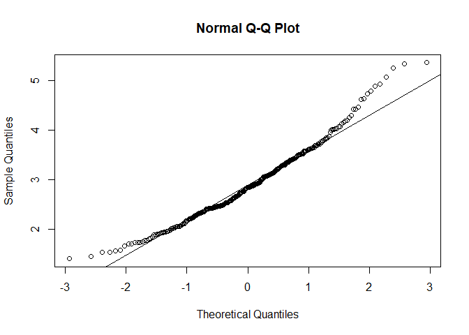
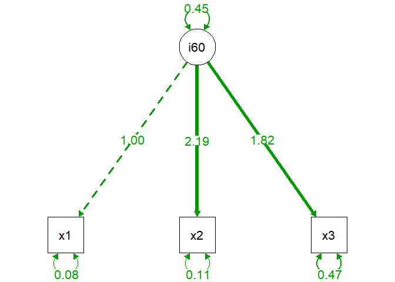
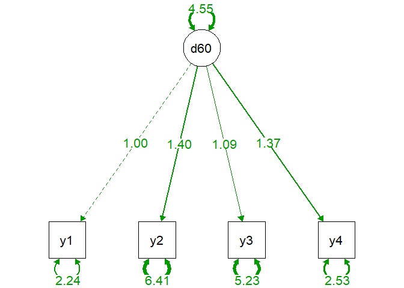
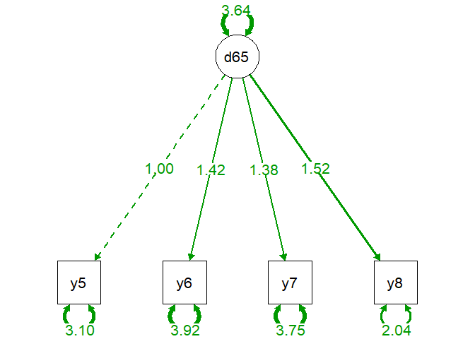
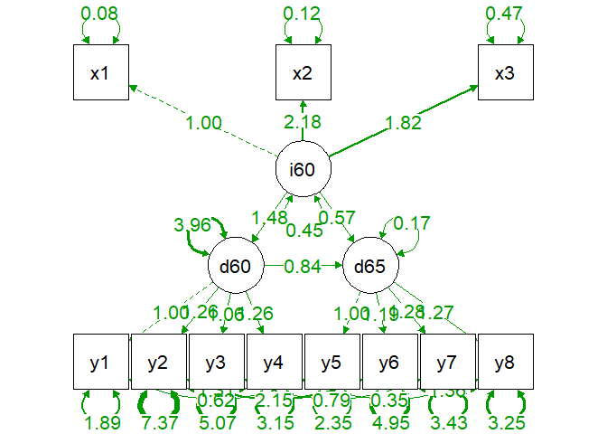

Module 7 Latent Variable Modeling
================
Eric R. Schuler, Ph.D.
2022-09-16

This module will cover the basics of Latent Variable modeling.
Specifically, how to conduct:

- A confirmatory factor analysis (CFA)
- Multigroup CFA for measurement invariance
- Structural regression model (regression with latent variables)

Set-up and Load Packages

# **Basic Confirmatory Factor Analysis in R**

Set working directory

``` r
setwd("C:/Users/eschuler/Desktop/r short course/")
```

Read in Data

``` r
data <- read.csv("hs1939_cleaned.csv")
data$school <- as.factor(data$school)
plyr::count(data$school)
```

                x freq
    1 Grant-White  145
    2     Pasteur  156

Describe Data

Overall

``` r
describe(data)
```

                            vars   n   mean     sd median trimmed    mad   min
    id                         1 301 176.55 105.94 163.00  176.78 140.85  1.00
    sex*                       2 301   1.49   0.50   1.00    1.48   0.00  1.00
    age_years                  3 301  13.00   1.05  13.00   12.89   1.48 11.00
    age_months                 4 301   5.38   3.45   5.00    5.32   4.45  0.00
    school*                    5 301   1.52   0.50   2.00    1.52   0.00  1.00
    grade*                     6 300   1.48   0.50   1.00    1.47   0.00  1.00
    visual_perception          7 301   4.93   1.16   5.00    4.96   1.24  0.67
    cubes                      8 300   6.09   1.18   6.00    6.02   1.11  2.25
    lozenges                   9 301   2.25   1.13   2.12    2.20   1.30  0.25
    paragraph_completion      10 301   3.06   1.16   3.00    3.02   0.99  0.00
    sentence_completion       11 301   4.34   1.29   4.50    4.40   1.48  1.00
    word_meaning              12 301   2.19   1.10   2.00    2.09   1.06  0.14
    speeded_addition          13 301   4.19   1.09   4.09    4.16   1.10  1.30
    speeded_counting          14 301   5.53   1.01   5.50    5.49   0.96  3.05
    speeded_discrimination    15 301   5.37   1.01   5.42    5.37   0.99  2.78
    visual_perception_mnctr   16 301   0.00   1.16   0.07    0.03   1.24 -4.26
    vis_cat*                  17 301   2.14   0.84   2.00    2.18   1.48  1.00
                               max  range  skew kurtosis   se
    id                      351.00 350.00 -0.01    -1.36 6.11
    sex*                      2.00   1.00  0.06    -2.00 0.03
    age_years                16.00   5.00  0.69     0.20 0.06
    age_months               11.00  11.00  0.09    -1.22 0.20
    school*                   2.00   1.00 -0.07    -2.00 0.03
    grade*                    2.00   1.00  0.09    -2.00 0.03
    visual_perception         8.50   7.83 -0.26     0.34 0.07
    cubes                     9.25   7.00  0.47     0.34 0.07
    lozenges                  4.50   4.25  0.38    -0.91 0.07
    paragraph_completion      6.33   6.33  0.27     0.08 0.07
    sentence_completion       7.00   6.00 -0.35    -0.55 0.07
    word_meaning              6.14   6.00  0.86     0.82 0.06
    speeded_addition          7.43   6.13  0.25    -0.31 0.06
    speeded_counting         10.00   6.95  0.53     1.17 0.06
    speeded_discrimination    9.25   6.47  0.20     0.29 0.06
    visual_perception_mnctr   3.57   7.83 -0.26     0.34 0.07
    vis_cat*                  3.00   2.00 -0.27    -1.54 0.05

By school

``` r
describeBy(data, group = data$school)
```


     Descriptive statistics by group 
    group: Grant-White
                            vars   n   mean    sd median trimmed   mad    min
    id                         1 145 275.26 43.34 275.00  275.12 54.86 201.00
    sex*                       2 145   1.50  0.50   1.00    1.50  0.00   1.00
    age_years                  3 145  12.72  0.97  13.00   12.67  1.48  11.00
    age_months                 4 145   5.34  3.48   5.00    5.31  4.45   0.00
    school*                    5 145   1.00  0.00   1.00    1.00  0.00   1.00
    grade*                     6 144   1.45  0.50   1.00    1.44  0.00   1.00
    visual_perception          7 145   4.93  1.15   5.00    4.96  1.24   1.83
    cubes                      8 145   6.20  1.11   6.25    6.14  1.11   2.25
    lozenges                   9 145   2.00  1.04   1.88    1.92  1.11   0.38
    paragraph_completion      10 145   3.32  1.13   3.00    3.27  0.99   0.33
    sentence_completion       11 145   4.71  1.16   4.75    4.78  1.11   1.00
    word_meaning              12 145   2.47  1.14   2.29    2.38  1.06   0.29
    speeded_addition          13 145   3.92  1.03   3.87    3.90  1.10   1.30
    speeded_counting          14 145   5.49  1.05   5.50    5.45  0.89   3.05
    speeded_discrimination    15 145   5.33  1.03   5.31    5.33  1.15   3.11
    visual_perception_mnctr   16 145   0.00  1.15   0.07    0.03  1.24  -3.10
    vis_cat*                  17 145   2.12  0.85   2.00    2.15  1.48   1.00
                               max  range  skew kurtosis   se
    id                      351.00 150.00  0.02    -1.21 3.60
    sex*                      2.00   1.00  0.01    -2.01 0.04
    age_years                16.00   5.00  0.70     0.63 0.08
    age_months               11.00  11.00  0.06    -1.23 0.29
    school*                   1.00   0.00   NaN      NaN 0.00
    grade*                    2.00   1.00  0.19    -1.98 0.04
    visual_perception         8.50   6.67 -0.12    -0.13 0.10
    cubes                     9.25   7.00  0.23     0.75 0.09
    lozenges                  4.50   4.12  0.61    -0.51 0.09
    paragraph_completion      6.33   6.00  0.40     0.16 0.09
    sentence_completion       7.00   6.00 -0.54     0.13 0.10
    word_meaning              5.86   5.57  0.71     0.14 0.09
    speeded_addition          6.48   5.17  0.16    -0.42 0.09
    speeded_counting         10.00   6.95  0.68     2.09 0.09
    speeded_discrimination    9.25   6.14  0.20     0.41 0.09
    visual_perception_mnctr   3.57   6.67 -0.12    -0.13 0.10
    vis_cat*                  3.00   2.00 -0.24    -1.58 0.07
    ------------------------------------------------------------ 
    group: Pasteur
                            vars   n  mean    sd median trimmed   mad   min    max
    id                         1 156 84.81 48.91  85.50   84.90 62.27  1.00 168.00
    sex*                       2 156  1.47  0.50   1.00    1.47  0.00  1.00   2.00
    age_years                  3 156 13.25  1.06  13.00   13.15  1.48 12.00  16.00
    age_months                 4 156  5.40  3.44   5.00    5.33  4.45  0.00  11.00
    school*                    5 156  2.00  0.00   2.00    2.00  0.00  2.00   2.00
    grade*                     6 156  1.50  0.50   1.50    1.50  0.74  1.00   2.00
    visual_perception          7 156  4.93  1.17   5.00    4.96  1.11  0.67   7.50
    cubes                      8 155  5.99  1.23   5.75    5.90  1.11  3.50   9.25
    lozenges                   9 156  2.49  1.16   2.38    2.48  1.30  0.25   4.50
    paragraph_completion      10 156  2.82  1.15   2.67    2.80  0.99  0.00   6.00
    sentence_completion       11 156  4.00  1.31   4.00    4.02  1.48  1.00   6.75
    word_meaning              12 156  1.92  0.99   1.86    1.85  1.06  0.14   6.14
    speeded_addition          13 156  4.43  1.09   4.37    4.40  1.19  2.04   7.43
    speeded_counting          14 156  5.56  0.98   5.47    5.53  0.93  3.50   8.30
    speeded_discrimination    15 156  5.42  0.99   5.42    5.40  0.95  2.78   8.61
    visual_perception_mnctr   16 156  0.00  1.17   0.07    0.03  1.11 -4.26   2.57
    vis_cat*                  17 156  2.16  0.84   2.00    2.20  1.48  1.00   3.00
                             range  skew kurtosis   se
    id                      167.00 -0.02    -1.23 3.92
    sex*                      1.00  0.10    -2.00 0.04
    age_years                 4.00  0.68    -0.21 0.09
    age_months               11.00  0.11    -1.23 0.28
    school*                   0.00   NaN      NaN 0.00
    grade*                    1.00  0.00    -2.01 0.04
    visual_perception         6.83 -0.38     0.69 0.09
    cubes                     5.75  0.67     0.16 0.10
    lozenges                  4.25  0.15    -1.10 0.09
    paragraph_completion      6.00  0.22    -0.13 0.09
    sentence_completion       5.75 -0.13    -0.88 0.10
    word_meaning              6.00  0.99     1.87 0.08
    speeded_addition          5.39  0.30    -0.45 0.09
    speeded_counting          4.80  0.35     0.01 0.08
    speeded_discrimination    5.83  0.22     0.11 0.08
    visual_perception_mnctr   6.83 -0.38     0.69 0.09
    vis_cat*                  2.00 -0.30    -1.52 0.07

Check normality (multivariate)

``` r
mardia(data[,7:15])
```



    Call: mardia(x = data[, 7:15])

    Mardia tests of multivariate skew and kurtosis
    Use describe(x) the to get univariate tests
    n.obs = 300   num.vars =  9 
    b1p =  6.92   skew =  346.19  with probability  <=  6.3e-15
     small sample skew =  350.35  with probability <=  2.1e-15
    b2p =  103.17   kurtosis =  2.57  with probability <=  0.01

Lavaan CFA code

``` r
hs.model <- '  visual =~ visual_perception + cubes + lozenges
              textual =~ paragraph_completion + sentence_completion + word_meaning
              speed   =~ speeded_addition + speeded_counting + speeded_discrimination '
```

Method 1:

Run overall CFA

``` r
fit_overall <- cfa(hs.model, data = data)
summary(fit_overall, fit.measures = TRUE, rsquare=TRUE)
```

    lavaan 0.6-11 ended normally after 36 iterations

      Estimator                                         ML
      Optimization method                           NLMINB
      Number of model parameters                        21
                                                          
                                                      Used       Total
      Number of observations                           300         301
                                                                      
    Model Test User Model:
                                                          
      Test statistic                                87.428
      Degrees of freedom                                24
      P-value (Chi-square)                           0.000

    Model Test Baseline Model:

      Test statistic                               922.275
      Degrees of freedom                                36
      P-value                                        0.000

    User Model versus Baseline Model:

      Comparative Fit Index (CFI)                    0.928
      Tucker-Lewis Index (TLI)                       0.893

    Loglikelihood and Information Criteria:

      Loglikelihood user model (H0)              -3724.117
      Loglikelihood unrestricted model (H1)      -3680.403
                                                          
      Akaike (AIC)                                7490.235
      Bayesian (BIC)                              7568.014
      Sample-size adjusted Bayesian (BIC)         7501.415

    Root Mean Square Error of Approximation:

      RMSEA                                          0.094
      90 Percent confidence interval - lower         0.073
      90 Percent confidence interval - upper         0.115
      P-value RMSEA <= 0.05                          0.000

    Standardized Root Mean Square Residual:

      SRMR                                           0.066

    Parameter Estimates:

      Standard errors                             Standard
      Information                                 Expected
      Information saturated (h1) model          Structured

    Latent Variables:
                       Estimate  Std.Err  z-value  P(>|z|)
      visual =~                                           
        visual_percptn    1.000                           
        cubes             0.543    0.098    5.542    0.000
        lozenges          0.719    0.107    6.719    0.000
      textual =~                                          
        pargrph_cmpltn    1.000                           
        sentenc_cmpltn    1.112    0.065   16.995    0.000
        word_meaning      0.927    0.055   16.712    0.000
      speed =~                                            
        speeded_additn    1.000                           
        speeded_contng    1.177    0.164    7.159    0.000
        spedd_dscrmntn    1.083    0.151    7.157    0.000

    Covariances:
                       Estimate  Std.Err  z-value  P(>|z|)
      visual ~~                                           
        textual           0.416    0.074    5.627    0.000
        speed             0.268    0.057    4.719    0.000
      textual ~~                                          
        speed             0.175    0.050    3.521    0.000

    Variances:
                       Estimate  Std.Err  z-value  P(>|z|)
       .visual_percptn    0.525    0.113    4.632    0.000
       .cubes             1.137    0.102   11.183    0.000
       .lozenges          0.847    0.090    9.408    0.000
       .pargrph_cmpltn    0.372    0.048    7.767    0.000
       .sentenc_cmpltn    0.449    0.059    7.665    0.000
       .word_meaning      0.355    0.043    8.238    0.000
       .speeded_additn    0.801    0.082    9.814    0.000
       .speeded_contng    0.490    0.074    6.611    0.000
       .spedd_dscrmntn    0.565    0.071    7.976    0.000
        visual            0.823    0.146    5.642    0.000
        textual           0.983    0.113    8.729    0.000
        speed             0.385    0.087    4.450    0.000

    R-Square:
                       Estimate
        visual_percptn    0.611
        cubes             0.176
        lozenges          0.334
        pargrph_cmpltn    0.726
        sentenc_cmpltn    0.730
        word_meaning      0.704
        speeded_additn    0.325
        speeded_contng    0.521
        spedd_dscrmntn    0.444

Look at the compact model fit indices

``` r
broom::glance(fit_overall)
```

    # A tibble: 1 × 17
       agfi   AIC   BIC   cfi chisq  npar  rmsea rmsea.conf.high   srmr   tli
      <dbl> <dbl> <dbl> <dbl> <dbl> <dbl>  <dbl>           <dbl>  <dbl> <dbl>
    1 0.891 7490. 7568. 0.928  87.4    21 0.0939           0.115 0.0657 0.893
    # … with 7 more variables: converged <lgl>, estimator <chr>, ngroups <int>,
    #   missing_method <chr>, nobs <int>, norig <int>, nexcluded <int>

Obtain additional fit indices (optional)

``` r
moreFitIndices(fit_overall)
```

    Warning in moreFitIndices(fit_overall): AICc (aic.smallN) was developed for
    univariate linear models. It is probably not appropriate to use AICc to compare
    SEMs.

          gammaHat    adjGammaHat baseline.rmsea     aic.smallN     bic.priorN 
             0.955          0.916          0.286       7493.559       7568.084 
             spbic           hbic           ibic            sic            hqc 
          7458.825       7409.639       7522.345       7560.941       7521.362 

Extract parameters

``` r
parameterEstimates(fit_overall, boot.ci.type="bca.simple")
```

                          lhs op                    rhs   est    se      z pvalue
    1                  visual =~      visual_perception 1.000 0.000     NA     NA
    2                  visual =~                  cubes 0.543 0.098  5.542      0
    3                  visual =~               lozenges 0.719 0.107  6.719      0
    4                 textual =~   paragraph_completion 1.000 0.000     NA     NA
    5                 textual =~    sentence_completion 1.112 0.065 16.995      0
    6                 textual =~           word_meaning 0.927 0.055 16.712      0
    7                   speed =~       speeded_addition 1.000 0.000     NA     NA
    8                   speed =~       speeded_counting 1.177 0.164  7.159      0
    9                   speed =~ speeded_discrimination 1.083 0.151  7.157      0
    10      visual_perception ~~      visual_perception 0.525 0.113  4.632      0
    11                  cubes ~~                  cubes 1.137 0.102 11.183      0
    12               lozenges ~~               lozenges 0.847 0.090  9.408      0
    13   paragraph_completion ~~   paragraph_completion 0.372 0.048  7.767      0
    14    sentence_completion ~~    sentence_completion 0.449 0.059  7.665      0
    15           word_meaning ~~           word_meaning 0.355 0.043  8.238      0
    16       speeded_addition ~~       speeded_addition 0.801 0.082  9.814      0
    17       speeded_counting ~~       speeded_counting 0.490 0.074  6.611      0
    18 speeded_discrimination ~~ speeded_discrimination 0.565 0.071  7.976      0
    19                 visual ~~                 visual 0.823 0.146  5.642      0
    20                textual ~~                textual 0.983 0.113  8.729      0
    21                  speed ~~                  speed 0.385 0.087  4.450      0
    22                 visual ~~                textual 0.416 0.074  5.627      0
    23                 visual ~~                  speed 0.268 0.057  4.719      0
    24                textual ~~                  speed 0.175 0.050  3.521      0
       ci.lower ci.upper
    1     1.000    1.000
    2     0.351    0.736
    3     0.509    0.928
    4     1.000    1.000
    5     0.984    1.240
    6     0.818    1.036
    7     1.000    1.000
    8     0.855    1.499
    9     0.787    1.380
    10    0.303    0.747
    11    0.938    1.337
    12    0.671    1.024
    13    0.278    0.465
    14    0.335    0.564
    15    0.271    0.440
    16    0.641    0.961
    17    0.345    0.635
    18    0.426    0.704
    19    0.537    1.109
    20    0.762    1.204
    21    0.215    0.555
    22    0.271    0.561
    23    0.157    0.379
    24    0.077    0.272

Visualize model

``` r
semPaths(fit_overall,curvePivot = TRUE, thresholds = FALSE)
```


Inspect modification indices Any modifications need to be based on
theory not model fit improvement, modification indiced are purely a
theoretical.

``` r
mi_overall <- modificationIndices(fit_overall)
mi_overall
```

                        lhs op                    rhs     mi    epc sepc.lv
    25               visual =~   paragraph_completion  1.293  0.078   0.071
    26               visual =~    sentence_completion  7.963 -0.215  -0.196
    27               visual =~           word_meaning  3.023  0.114   0.103
    28               visual =~       speeded_addition 19.215 -0.426  -0.387
    29               visual =~       speeded_counting  4.277 -0.209  -0.190
    30               visual =~ speeded_discrimination 37.076  0.581   0.527
    31              textual =~      visual_perception  8.828  0.353   0.350
    32              textual =~                  cubes  0.016 -0.011  -0.011
    33              textual =~               lozenges  9.131 -0.271  -0.269
    34              textual =~       speeded_addition  0.109 -0.022  -0.022
    35              textual =~       speeded_counting  3.293 -0.119  -0.118
    36              textual =~ speeded_discrimination  4.763  0.138   0.137
    37                speed =~      visual_perception  0.000  0.005   0.003
    38                speed =~                  cubes  1.443 -0.190  -0.118
    39                speed =~               lozenges  0.808  0.145   0.090
    40                speed =~   paragraph_completion  0.001 -0.003  -0.002
    41                speed =~    sentence_completion  0.203 -0.044  -0.027
    42                speed =~           word_meaning  0.248  0.042   0.026
    43    visual_perception ~~                  cubes  3.482 -0.180  -0.180
    44    visual_perception ~~               lozenges  0.860 -0.133  -0.133
    45    visual_perception ~~   paragraph_completion  3.916  0.082   0.082
    46    visual_perception ~~    sentence_completion  0.767 -0.040  -0.040
    47    visual_perception ~~           word_meaning  0.064  0.010   0.010
    48    visual_perception ~~       speeded_addition  5.418 -0.128  -0.128
    49    visual_perception ~~       speeded_counting  0.772 -0.045  -0.045
    50    visual_perception ~~ speeded_discrimination  7.471  0.139   0.139
    51                cubes ~~               lozenges  8.252  0.212   0.212
    52                cubes ~~   paragraph_completion  0.616 -0.036  -0.036
    53                cubes ~~    sentence_completion  0.022 -0.008  -0.008
    54                cubes ~~           word_meaning  0.880  0.042   0.042
    55                cubes ~~       speeded_addition  9.262 -0.187  -0.187
    56                cubes ~~       speeded_counting  0.029 -0.009  -0.009
    57                cubes ~~ speeded_discrimination  1.986  0.077   0.077
    58             lozenges ~~   paragraph_completion  0.212 -0.019  -0.019
    59             lozenges ~~    sentence_completion  7.706 -0.129  -0.129
    60             lozenges ~~           word_meaning  1.983  0.057   0.057
    61             lozenges ~~       speeded_addition  0.763 -0.049  -0.049
    62             lozenges ~~       speeded_counting  0.029 -0.008  -0.008
    63             lozenges ~~ speeded_discrimination  4.193  0.103   0.103
    64 paragraph_completion ~~    sentence_completion  2.686  0.189   0.189
    65 paragraph_completion ~~           word_meaning  6.712 -0.243  -0.243
    66 paragraph_completion ~~       speeded_addition  5.775  0.097   0.097
    67 paragraph_completion ~~       speeded_counting  3.706 -0.068  -0.068
    68 paragraph_completion ~~ speeded_discrimination  0.200 -0.016  -0.016
    69  sentence_completion ~~           word_meaning  1.004  0.105   0.105
    70  sentence_completion ~~       speeded_addition  1.223 -0.049  -0.049
    71  sentence_completion ~~       speeded_counting  0.395  0.025   0.025
    72  sentence_completion ~~ speeded_discrimination  1.044  0.041   0.041
    73         word_meaning ~~       speeded_addition  0.216 -0.018  -0.018
    74         word_meaning ~~       speeded_counting  0.222  0.016   0.016
    75         word_meaning ~~ speeded_discrimination  0.130 -0.012  -0.012
    76     speeded_addition ~~       speeded_counting 34.880  0.537   0.537
    77     speeded_addition ~~ speeded_discrimination  5.103 -0.184  -0.184
    78     speeded_counting ~~ speeded_discrimination 15.663 -0.429  -0.429
       sepc.all sepc.nox
    25    0.061    0.061
    26   -0.152   -0.152
    27    0.094    0.094
    28   -0.355   -0.355
    29   -0.187   -0.187
    30    0.522    0.522
    31    0.301    0.301
    32   -0.009   -0.009
    33   -0.238   -0.238
    34   -0.020   -0.020
    35   -0.117   -0.117
    36    0.136    0.136
    37    0.003    0.003
    38   -0.100   -0.100
    39    0.079    0.079
    40   -0.002   -0.002
    41   -0.021   -0.021
    42    0.024    0.024
    43   -0.233   -0.233
    44   -0.199   -0.199
    45    0.185    0.185
    46   -0.082   -0.082
    47    0.023    0.023
    48   -0.198   -0.198
    49   -0.089   -0.089
    50    0.255    0.255
    51    0.216    0.216
    52   -0.056   -0.056
    53   -0.011   -0.011
    54    0.065    0.065
    55   -0.196   -0.196
    56   -0.012   -0.012
    57    0.096    0.096
    58   -0.034   -0.034
    59   -0.209   -0.209
    60    0.103    0.103
    61   -0.059   -0.059
    62   -0.013   -0.013
    63    0.148    0.148
    64    0.464    0.464
    65   -0.668   -0.668
    66    0.178    0.178
    67   -0.160   -0.160
    68   -0.035   -0.035
    69    0.262    0.262
    70   -0.082   -0.082
    71    0.053    0.053
    72    0.081    0.081
    73   -0.034   -0.034
    74    0.038    0.038
    75   -0.028   -0.028
    76    0.857    0.857
    77   -0.274   -0.274
    78   -0.816   -0.816

Other options:

Parameter Estimates

``` r
parameterEstimates(fit_overall)
```

                          lhs op                    rhs   est    se      z pvalue
    1                  visual =~      visual_perception 1.000 0.000     NA     NA
    2                  visual =~                  cubes 0.543 0.098  5.542      0
    3                  visual =~               lozenges 0.719 0.107  6.719      0
    4                 textual =~   paragraph_completion 1.000 0.000     NA     NA
    5                 textual =~    sentence_completion 1.112 0.065 16.995      0
    6                 textual =~           word_meaning 0.927 0.055 16.712      0
    7                   speed =~       speeded_addition 1.000 0.000     NA     NA
    8                   speed =~       speeded_counting 1.177 0.164  7.159      0
    9                   speed =~ speeded_discrimination 1.083 0.151  7.157      0
    10      visual_perception ~~      visual_perception 0.525 0.113  4.632      0
    11                  cubes ~~                  cubes 1.137 0.102 11.183      0
    12               lozenges ~~               lozenges 0.847 0.090  9.408      0
    13   paragraph_completion ~~   paragraph_completion 0.372 0.048  7.767      0
    14    sentence_completion ~~    sentence_completion 0.449 0.059  7.665      0
    15           word_meaning ~~           word_meaning 0.355 0.043  8.238      0
    16       speeded_addition ~~       speeded_addition 0.801 0.082  9.814      0
    17       speeded_counting ~~       speeded_counting 0.490 0.074  6.611      0
    18 speeded_discrimination ~~ speeded_discrimination 0.565 0.071  7.976      0
    19                 visual ~~                 visual 0.823 0.146  5.642      0
    20                textual ~~                textual 0.983 0.113  8.729      0
    21                  speed ~~                  speed 0.385 0.087  4.450      0
    22                 visual ~~                textual 0.416 0.074  5.627      0
    23                 visual ~~                  speed 0.268 0.057  4.719      0
    24                textual ~~                  speed 0.175 0.050  3.521      0
       ci.lower ci.upper
    1     1.000    1.000
    2     0.351    0.736
    3     0.509    0.928
    4     1.000    1.000
    5     0.984    1.240
    6     0.818    1.036
    7     1.000    1.000
    8     0.855    1.499
    9     0.787    1.380
    10    0.303    0.747
    11    0.938    1.337
    12    0.671    1.024
    13    0.278    0.465
    14    0.335    0.564
    15    0.271    0.440
    16    0.641    0.961
    17    0.345    0.635
    18    0.426    0.704
    19    0.537    1.109
    20    0.762    1.204
    21    0.215    0.555
    22    0.271    0.561
    23    0.157    0.379
    24    0.077    0.272

Standardized Solution

``` r
standardizedSolution(fit_overall)
```

                          lhs op                    rhs est.std    se      z pvalue
    1                  visual =~      visual_perception   0.781 0.055 14.300      0
    2                  visual =~                  cubes   0.420 0.060  7.052      0
    3                  visual =~               lozenges   0.578 0.055 10.533      0
    4                 textual =~   paragraph_completion   0.852 0.023 37.795      0
    5                 textual =~    sentence_completion   0.854 0.022 38.168      0
    6                 textual =~           word_meaning   0.839 0.023 35.998      0
    7                   speed =~       speeded_addition   0.570 0.053 10.717      0
    8                   speed =~       speeded_counting   0.722 0.050 14.315      0
    9                   speed =~ speeded_discrimination   0.667 0.051 13.065      0
    10      visual_perception ~~      visual_perception   0.389 0.085  4.560      0
    11                  cubes ~~                  cubes   0.824 0.050 16.490      0
    12               lozenges ~~               lozenges   0.666 0.063 10.490      0
    13   paragraph_completion ~~   paragraph_completion   0.274 0.038  7.146      0
    14    sentence_completion ~~    sentence_completion   0.270 0.038  7.056      0
    15           word_meaning ~~           word_meaning   0.296 0.039  7.569      0
    16       speeded_addition ~~       speeded_addition   0.675 0.061 11.149      0
    17       speeded_counting ~~       speeded_counting   0.479 0.073  6.570      0
    18 speeded_discrimination ~~ speeded_discrimination   0.556 0.068  8.171      0
    19                 visual ~~                 visual   1.000 0.000     NA     NA
    20                textual ~~                textual   1.000 0.000     NA     NA
    21                  speed ~~                  speed   1.000 0.000     NA     NA
    22                 visual ~~                textual   0.462 0.063  7.295      0
    23                 visual ~~                  speed   0.476 0.072  6.578      0
    24                textual ~~                  speed   0.284 0.069  4.122      0
       ci.lower ci.upper
    1     0.674    0.888
    2     0.303    0.536
    3     0.471    0.686
    4     0.808    0.896
    5     0.811    0.898
    6     0.793    0.885
    7     0.466    0.674
    8     0.623    0.821
    9     0.567    0.767
    10    0.222    0.557
    11    0.726    0.922
    12    0.541    0.790
    13    0.199    0.350
    14    0.195    0.345
    15    0.219    0.373
    16    0.557    0.794
    17    0.336    0.621
    18    0.422    0.689
    19    1.000    1.000
    20    1.000    1.000
    21    1.000    1.000
    22    0.338    0.587
    23    0.334    0.618
    24    0.149    0.419

Return the model-implied (fitted) covariance matrix

``` r
fitted(fit_overall)
```

    $cov
                           vsl_pr cubes lozngs prgrp_ sntnc_ wrd_mn spdd_dd spdd_c
    visual_perception      1.349                                                  
    cubes                  0.447  1.380                                           
    lozenges               0.592  0.322 1.273                                     
    paragraph_completion   0.416  0.226 0.299  1.355                              
    sentence_completion    0.463  0.251 0.333  1.093  1.665                       
    word_meaning           0.386  0.210 0.277  0.911  1.013  1.200                
    speeded_addition       0.268  0.146 0.193  0.175  0.194  0.162  1.186         
    speeded_counting       0.315  0.171 0.227  0.205  0.228  0.190  0.453   1.023 
    speeded_discrimination 0.290  0.158 0.209  0.189  0.210  0.175  0.417   0.491 
                           spdd_ds
    visual_perception             
    cubes                         
    lozenges                      
    paragraph_completion          
    sentence_completion           
    word_meaning                  
    speeded_addition              
    speeded_counting              
    speeded_discrimination 1.017  

Inspect the residuals

``` r
resid(fit_overall, type = "standardized")
```

    $type
    [1] "standardized"

    $cov
                           vsl_pr cubes  lozngs prgrp_ sntnc_ wrd_mn spdd_dd spdd_c
    visual_perception       0.000                                                  
    cubes                  -1.963  0.000                                           
    lozenges               -0.957  2.653  0.000                                    
    paragraph_completion    2.694 -0.303 -1.937  0.000                             
    sentence_completion    -0.579 -0.598 -4.166  1.588  0.000                      
    word_meaning            2.173  0.718 -0.682 -2.692  0.985  0.000               
    speeded_addition       -3.868 -3.682 -1.911  0.845 -0.856 -0.325  0.000        
    speeded_counting       -1.478 -1.048 -0.226 -1.992 -1.070 -0.673  4.856   0.000
    speeded_discrimination  4.110  1.650  3.555  1.224  1.699  1.389 -2.303  -4.235
                           spdd_ds
    visual_perception             
    cubes                         
    lozenges                      
    paragraph_completion          
    sentence_completion           
    word_meaning                  
    speeded_addition              
    speeded_counting              
    speeded_discrimination  0.000 

Return the covariance matrix of the paramter estimates

``` r
vcov(fit_overall)
```

                                                   vsl=~c vsl=~l txtl=~s_ txtl=~w_
    visual=~cubes                                   0.010                         
    visual=~lozenges                                0.004  0.011                  
    textual=~sentence_completion                    0.000  0.000  0.004           
    textual=~word_meaning                           0.000  0.000  0.002    0.003  
    speed=~speeded_counting                         0.000  0.000  0.000    0.000  
    speed=~speeded_discrimination                   0.000  0.000  0.000    0.000  
    visual_perception~~visual_perception            0.005  0.008  0.000    0.000  
    cubes~~cubes                                   -0.002 -0.001  0.000    0.000  
    lozenges~~lozenges                             -0.001 -0.004  0.000    0.000  
    paragraph_completion~~paragraph_completion      0.000  0.000  0.001    0.001  
    sentence_completion~~sentence_completion        0.000  0.000 -0.001    0.000  
    word_meaning~~word_meaning                      0.000  0.000  0.000   -0.001  
    speeded_addition~~speeded_addition              0.000  0.000  0.000    0.000  
    speeded_counting~~speeded_counting              0.000  0.000  0.000    0.000  
    speeded_discrimination~~speeded_discrimination  0.000  0.000  0.000    0.000  
    visual~~visual                                 -0.007 -0.010  0.000    0.000  
    textual~~textual                                0.000  0.000 -0.004   -0.003  
    speed~~speed                                    0.000  0.000  0.000    0.000  
    visual~~textual                                -0.001 -0.002 -0.001   -0.001  
    visual~~speed                                  -0.001 -0.001  0.000    0.000  
    textual~~speed                                  0.000  0.000  0.000    0.000  
                                                   spd=~spdd_c spd=~spdd_d vs_~~_
    visual=~cubes                                                                
    visual=~lozenges                                                             
    textual=~sentence_completion                                                 
    textual=~word_meaning                                                        
    speed=~speeded_counting                         0.027                        
    speed=~speeded_discrimination                   0.014       0.023            
    visual_perception~~visual_perception            0.000       0.000       0.013
    cubes~~cubes                                    0.000       0.000      -0.001
    lozenges~~lozenges                              0.000       0.000      -0.003
    paragraph_completion~~paragraph_completion      0.000       0.000       0.000
    sentence_completion~~sentence_completion        0.000       0.000       0.000
    word_meaning~~word_meaning                      0.000       0.000       0.000
    speeded_addition~~speeded_addition              0.005       0.004       0.000
    speeded_counting~~speeded_counting             -0.006       0.001       0.000
    speeded_discrimination~~speeded_discrimination  0.001      -0.004       0.000
    visual~~visual                                  0.000       0.000      -0.011
    textual~~textual                                0.000       0.000       0.000
    speed~~speed                                   -0.011      -0.009       0.000
    visual~~textual                                 0.000       0.000      -0.001
    visual~~speed                                  -0.004      -0.003      -0.001
    textual~~speed                                 -0.003      -0.002       0.000
                                                   cbs~~c lzng~~ pr_~~_ sn_~~_
    visual=~cubes                                                             
    visual=~lozenges                                                          
    textual=~sentence_completion                                              
    textual=~word_meaning                                                     
    speed=~speeded_counting                                                   
    speed=~speeded_discrimination                                             
    visual_perception~~visual_perception                                      
    cubes~~cubes                                    0.010                     
    lozenges~~lozenges                              0.000  0.008              
    paragraph_completion~~paragraph_completion      0.000  0.000  0.002       
    sentence_completion~~sentence_completion        0.000  0.000 -0.001  0.003
    word_meaning~~word_meaning                      0.000  0.000  0.000  0.000
    speeded_addition~~speeded_addition              0.000  0.000  0.000  0.000
    speeded_counting~~speeded_counting              0.000  0.000  0.000  0.000
    speeded_discrimination~~speeded_discrimination  0.000  0.000  0.000  0.000
    visual~~visual                                  0.001  0.003  0.000  0.000
    textual~~textual                                0.000  0.000 -0.001  0.001
    speed~~speed                                    0.000  0.000  0.000  0.000
    visual~~textual                                 0.000  0.001  0.000  0.000
    visual~~speed                                   0.000  0.000  0.000  0.000
    textual~~speed                                  0.000  0.000  0.000  0.000
                                                   wr_~~_ spdd_dd~~_ spdd_c~~_
    visual=~cubes                                                             
    visual=~lozenges                                                          
    textual=~sentence_completion                                              
    textual=~word_meaning                                                     
    speed=~speeded_counting                                                   
    speed=~speeded_discrimination                                             
    visual_perception~~visual_perception                                      
    cubes~~cubes                                                              
    lozenges~~lozenges                                                        
    paragraph_completion~~paragraph_completion                                
    sentence_completion~~sentence_completion                                  
    word_meaning~~word_meaning                      0.002                     
    speeded_addition~~speeded_addition              0.000  0.007              
    speeded_counting~~speeded_counting              0.000 -0.001      0.005   
    speeded_discrimination~~speeded_discrimination  0.000  0.000     -0.002   
    visual~~visual                                  0.000  0.000      0.000   
    textual~~textual                                0.000  0.000      0.000   
    speed~~speed                                    0.000 -0.002      0.001   
    visual~~textual                                 0.000  0.000      0.000   
    visual~~speed                                   0.000 -0.001      0.001   
    textual~~speed                                  0.000 -0.001      0.000   
                                                   spdd_ds~~_ vsl~~v txtl~~t spd~~s
    visual=~cubes                                                                  
    visual=~lozenges                                                               
    textual=~sentence_completion                                                   
    textual=~word_meaning                                                          
    speed=~speeded_counting                                                        
    speed=~speeded_discrimination                                                  
    visual_perception~~visual_perception                                           
    cubes~~cubes                                                                   
    lozenges~~lozenges                                                             
    paragraph_completion~~paragraph_completion                                     
    sentence_completion~~sentence_completion                                       
    word_meaning~~word_meaning                                                     
    speeded_addition~~speeded_addition                                             
    speeded_counting~~speeded_counting                                             
    speeded_discrimination~~speeded_discrimination  0.005                          
    visual~~visual                                  0.000      0.021               
    textual~~textual                                0.000      0.001  0.013        
    speed~~speed                                    0.000      0.000  0.000   0.007
    visual~~textual                                 0.000      0.005  0.004   0.000
    visual~~speed                                   0.000      0.003  0.000   0.003
    textual~~speed                                  0.000      0.001  0.002   0.002
                                                   vsl~~t vsl~~s txtl~~s
    visual=~cubes                                                       
    visual=~lozenges                                                    
    textual=~sentence_completion                                        
    textual=~word_meaning                                               
    speed=~speeded_counting                                             
    speed=~speeded_discrimination                                       
    visual_perception~~visual_perception                                
    cubes~~cubes                                                        
    lozenges~~lozenges                                                  
    paragraph_completion~~paragraph_completion                          
    sentence_completion~~sentence_completion                            
    word_meaning~~word_meaning                                          
    speeded_addition~~speeded_addition                                  
    speeded_counting~~speeded_counting                                  
    speeded_discrimination~~speeded_discrimination                      
    visual~~visual                                                      
    textual~~textual                                                    
    speed~~speed                                                        
    visual~~textual                                 0.005               
    visual~~speed                                   0.001  0.003        
    textual~~speed                                  0.001  0.001  0.002 

Obtain the AIC and BIC

``` r
AIC(fit_overall)
```

    [1] 7490.235

``` r
BIC(fit_overall)
```

    [1] 7568.014

Additional fit measures

``` r
fitMeasures(fit_overall)
```

                   npar                fmin               chisq                  df 
                 21.000               0.146              87.428              24.000 
                 pvalue      baseline.chisq         baseline.df     baseline.pvalue 
                  0.000             922.275              36.000               0.000 
                    cfi                 tli                nnfi                 rfi 
                  0.928               0.893               0.893               0.858 
                    nfi                pnfi                 ifi                 rni 
                  0.905               0.603               0.929               0.928 
                   logl   unrestricted.logl                 aic                 bic 
              -3724.117           -3680.403            7490.235            7568.014 
                 ntotal                bic2               rmsea      rmsea.ci.lower 
                300.000            7501.415               0.094               0.073 
         rmsea.ci.upper        rmsea.pvalue                 rmr          rmr_nomean 
                  0.115               0.000               0.083               0.083 
                   srmr        srmr_bentler srmr_bentler_nomean                crmr 
                  0.066               0.066               0.066               0.073 
            crmr_nomean          srmr_mplus   srmr_mplus_nomean               cn_05 
                  0.073               0.066               0.066             125.954 
                  cn_01                 gfi                agfi                pgfi 
                148.481               0.942               0.891               0.502 
                    mfi                ecvi 
                  0.900               0.431 

To get specific fit measures

``` r
fitMeasures(fit_overall, c("cfi","rmsea","srmr"))
```

      cfi rmsea  srmr 
    0.928 0.094 0.066 

Inspect the starting values of the parameters

``` r
inspect(fit_overall, what = "start")
```

    $lambda
                           visual textul speed
    visual_perception       1.000  0.000 0.000
    cubes                   0.767  0.000 0.000
    lozenges                1.092  0.000 0.000
    paragraph_completion    0.000  1.000 0.000
    sentence_completion     0.000  1.133 0.000
    word_meaning            0.000  0.925 0.000
    speeded_addition        0.000  0.000 1.000
    speeded_counting        0.000  0.000 1.218
    speeded_discrimination  0.000  0.000 0.850

    $theta
                           vsl_pr cubes lozngs prgrp_ sntnc_ wrd_mn spdd_dd spdd_c
    visual_perception      0.674                                                  
    cubes                  0.000  0.690                                           
    lozenges               0.000  0.000 0.636                                     
    paragraph_completion   0.000  0.000 0.000  0.677                              
    sentence_completion    0.000  0.000 0.000  0.000  0.832                       
    word_meaning           0.000  0.000 0.000  0.000  0.000  0.600                
    speeded_addition       0.000  0.000 0.000  0.000  0.000  0.000  0.593         
    speeded_counting       0.000  0.000 0.000  0.000  0.000  0.000  0.000   0.512 
    speeded_discrimination 0.000  0.000 0.000  0.000  0.000  0.000  0.000   0.000 
                           spdd_ds
    visual_perception             
    cubes                         
    lozenges                      
    paragraph_completion          
    sentence_completion           
    word_meaning                  
    speeded_addition              
    speeded_counting              
    speeded_discrimination 0.509  

    $psi
            visual textul speed
    visual  0.05               
    textual 0.00   0.05        
    speed   0.00   0.00   0.05 

Extract model information

``` r
unstand_table <- parameterestimates(fit_overall)
beta_table <- standardizedSolution(fit_overall, type = "std.all", se=TRUE, partable = NULL)
r_sqrd <- round(lavInspect(fit_overall, what = "rsquare"),2)
corr <- lavInspect(fit_overall, what = "cor.lv")
```

combine tables

``` r
table_cfa <- cbind(unstand_table,beta_table)
table_cfa <- table_cfa[,-c(14:18)]
table_cfa <- table_cfa[,-c(10:12)]
table_cfa <- table_cfa[-c(10:24),]
```

round some of the values to two decimal places

``` r
table_cfa$est <- round(table_cfa$est,2)
table_cfa$se <- round(table_cfa$se,2)
table_cfa$z <- round(table_cfa$z,2)
table_cfa$ci.lower <- round(table_cfa$ci.lower,2)
table_cfa$ci.upper <- round(table_cfa$ci.upper,2)
table_cfa$pvalue <- round(table_cfa$pvalue,3)
table_cfa$est.std <- round(table_cfa$est.std,2)
```

Add structure coefficients (correlation times the standardized estimate)

``` r
table_cfa$struct_visual <- NA
table_cfa$struct_textual <- NA
table_cfa$struct_speed <- NA

table_cfa$struct_visual[1:3]<- "."
table_cfa$struct_visual[4:6]<- round(table_cfa$est.std[4:6] * corr[1,2],2)
table_cfa$struct_visual[7:9]<- round(table_cfa$est.std[7:9] * corr[1,3],2)

table_cfa$struct_textual[1:3]<- round(table_cfa$est.std[1:3] * corr[2,1],2)
table_cfa$struct_textual[4:6]<- "."
table_cfa$struct_textual[7:9]<- round(table_cfa$est.std[7:9] * corr[2,3],2)

table_cfa$struct_speed[1:3]<- round(table_cfa$est.std[1:3] * corr[3,1],2)
table_cfa$struct_speed[4:6]<- round(table_cfa$est.std[4:6] * corr[3,2],2)
table_cfa$struct_speed[7:9]<- "."
```

Add the $R^2$ vector to the table

``` r
table_cfa$r_squared <- r_sqrd
```

``` r
table_cfa <- table_cfa[,-c(2,6,7,8,9)]
```

``` r
colnames(table_cfa) <- c("Latent Variable","Indicator","Unstand.","SE","Stand.","Visual","Textual","Speed","R-Squared")
```

Let’s format the table a bit

``` r
library(gt)


table_cfa_pub <-tab_spanner(gt(table_cfa), label = "Structure Coefficients",
                            columns = vars("Visual","Textual","Speed"))
```

    Warning: `columns = vars(...)` has been deprecated in gt 0.3.0:
    * please use `columns = c(...)` instead

``` r
table_cfa_pub <- tab_header(table_cfa_pub,
                            title = "Measurement Model for Three Latent Variables")
table_cfa_pub
```

<div id="iqhborjyqi" style="overflow-x:auto;overflow-y:auto;width:auto;height:auto;">
<style>html {
  font-family: -apple-system, BlinkMacSystemFont, 'Segoe UI', Roboto, Oxygen, Ubuntu, Cantarell, 'Helvetica Neue', 'Fira Sans', 'Droid Sans', Arial, sans-serif;
}

#iqhborjyqi .gt_table {
  display: table;
  border-collapse: collapse;
  margin-left: auto;
  margin-right: auto;
  color: #333333;
  font-size: 16px;
  font-weight: normal;
  font-style: normal;
  background-color: #FFFFFF;
  width: auto;
  border-top-style: solid;
  border-top-width: 2px;
  border-top-color: #A8A8A8;
  border-right-style: none;
  border-right-width: 2px;
  border-right-color: #D3D3D3;
  border-bottom-style: solid;
  border-bottom-width: 2px;
  border-bottom-color: #A8A8A8;
  border-left-style: none;
  border-left-width: 2px;
  border-left-color: #D3D3D3;
}

#iqhborjyqi .gt_heading {
  background-color: #FFFFFF;
  text-align: center;
  border-bottom-color: #FFFFFF;
  border-left-style: none;
  border-left-width: 1px;
  border-left-color: #D3D3D3;
  border-right-style: none;
  border-right-width: 1px;
  border-right-color: #D3D3D3;
}

#iqhborjyqi .gt_title {
  color: #333333;
  font-size: 125%;
  font-weight: initial;
  padding-top: 4px;
  padding-bottom: 4px;
  padding-left: 5px;
  padding-right: 5px;
  border-bottom-color: #FFFFFF;
  border-bottom-width: 0;
}

#iqhborjyqi .gt_subtitle {
  color: #333333;
  font-size: 85%;
  font-weight: initial;
  padding-top: 0;
  padding-bottom: 6px;
  padding-left: 5px;
  padding-right: 5px;
  border-top-color: #FFFFFF;
  border-top-width: 0;
}

#iqhborjyqi .gt_bottom_border {
  border-bottom-style: solid;
  border-bottom-width: 2px;
  border-bottom-color: #D3D3D3;
}

#iqhborjyqi .gt_col_headings {
  border-top-style: solid;
  border-top-width: 2px;
  border-top-color: #D3D3D3;
  border-bottom-style: solid;
  border-bottom-width: 2px;
  border-bottom-color: #D3D3D3;
  border-left-style: none;
  border-left-width: 1px;
  border-left-color: #D3D3D3;
  border-right-style: none;
  border-right-width: 1px;
  border-right-color: #D3D3D3;
}

#iqhborjyqi .gt_col_heading {
  color: #333333;
  background-color: #FFFFFF;
  font-size: 100%;
  font-weight: normal;
  text-transform: inherit;
  border-left-style: none;
  border-left-width: 1px;
  border-left-color: #D3D3D3;
  border-right-style: none;
  border-right-width: 1px;
  border-right-color: #D3D3D3;
  vertical-align: bottom;
  padding-top: 5px;
  padding-bottom: 6px;
  padding-left: 5px;
  padding-right: 5px;
  overflow-x: hidden;
}

#iqhborjyqi .gt_column_spanner_outer {
  color: #333333;
  background-color: #FFFFFF;
  font-size: 100%;
  font-weight: normal;
  text-transform: inherit;
  padding-top: 0;
  padding-bottom: 0;
  padding-left: 4px;
  padding-right: 4px;
}

#iqhborjyqi .gt_column_spanner_outer:first-child {
  padding-left: 0;
}

#iqhborjyqi .gt_column_spanner_outer:last-child {
  padding-right: 0;
}

#iqhborjyqi .gt_column_spanner {
  border-bottom-style: solid;
  border-bottom-width: 2px;
  border-bottom-color: #D3D3D3;
  vertical-align: bottom;
  padding-top: 5px;
  padding-bottom: 5px;
  overflow-x: hidden;
  display: inline-block;
  width: 100%;
}

#iqhborjyqi .gt_group_heading {
  padding-top: 8px;
  padding-bottom: 8px;
  padding-left: 5px;
  padding-right: 5px;
  color: #333333;
  background-color: #FFFFFF;
  font-size: 100%;
  font-weight: initial;
  text-transform: inherit;
  border-top-style: solid;
  border-top-width: 2px;
  border-top-color: #D3D3D3;
  border-bottom-style: solid;
  border-bottom-width: 2px;
  border-bottom-color: #D3D3D3;
  border-left-style: none;
  border-left-width: 1px;
  border-left-color: #D3D3D3;
  border-right-style: none;
  border-right-width: 1px;
  border-right-color: #D3D3D3;
  vertical-align: middle;
}

#iqhborjyqi .gt_empty_group_heading {
  padding: 0.5px;
  color: #333333;
  background-color: #FFFFFF;
  font-size: 100%;
  font-weight: initial;
  border-top-style: solid;
  border-top-width: 2px;
  border-top-color: #D3D3D3;
  border-bottom-style: solid;
  border-bottom-width: 2px;
  border-bottom-color: #D3D3D3;
  vertical-align: middle;
}

#iqhborjyqi .gt_from_md > :first-child {
  margin-top: 0;
}

#iqhborjyqi .gt_from_md > :last-child {
  margin-bottom: 0;
}

#iqhborjyqi .gt_row {
  padding-top: 8px;
  padding-bottom: 8px;
  padding-left: 5px;
  padding-right: 5px;
  margin: 10px;
  border-top-style: solid;
  border-top-width: 1px;
  border-top-color: #D3D3D3;
  border-left-style: none;
  border-left-width: 1px;
  border-left-color: #D3D3D3;
  border-right-style: none;
  border-right-width: 1px;
  border-right-color: #D3D3D3;
  vertical-align: middle;
  overflow-x: hidden;
}

#iqhborjyqi .gt_stub {
  color: #333333;
  background-color: #FFFFFF;
  font-size: 100%;
  font-weight: initial;
  text-transform: inherit;
  border-right-style: solid;
  border-right-width: 2px;
  border-right-color: #D3D3D3;
  padding-left: 5px;
  padding-right: 5px;
}

#iqhborjyqi .gt_stub_row_group {
  color: #333333;
  background-color: #FFFFFF;
  font-size: 100%;
  font-weight: initial;
  text-transform: inherit;
  border-right-style: solid;
  border-right-width: 2px;
  border-right-color: #D3D3D3;
  padding-left: 5px;
  padding-right: 5px;
  vertical-align: top;
}

#iqhborjyqi .gt_row_group_first td {
  border-top-width: 2px;
}

#iqhborjyqi .gt_summary_row {
  color: #333333;
  background-color: #FFFFFF;
  text-transform: inherit;
  padding-top: 8px;
  padding-bottom: 8px;
  padding-left: 5px;
  padding-right: 5px;
}

#iqhborjyqi .gt_first_summary_row {
  border-top-style: solid;
  border-top-color: #D3D3D3;
}

#iqhborjyqi .gt_first_summary_row.thick {
  border-top-width: 2px;
}

#iqhborjyqi .gt_last_summary_row {
  padding-top: 8px;
  padding-bottom: 8px;
  padding-left: 5px;
  padding-right: 5px;
  border-bottom-style: solid;
  border-bottom-width: 2px;
  border-bottom-color: #D3D3D3;
}

#iqhborjyqi .gt_grand_summary_row {
  color: #333333;
  background-color: #FFFFFF;
  text-transform: inherit;
  padding-top: 8px;
  padding-bottom: 8px;
  padding-left: 5px;
  padding-right: 5px;
}

#iqhborjyqi .gt_first_grand_summary_row {
  padding-top: 8px;
  padding-bottom: 8px;
  padding-left: 5px;
  padding-right: 5px;
  border-top-style: double;
  border-top-width: 6px;
  border-top-color: #D3D3D3;
}

#iqhborjyqi .gt_striped {
  background-color: rgba(128, 128, 128, 0.05);
}

#iqhborjyqi .gt_table_body {
  border-top-style: solid;
  border-top-width: 2px;
  border-top-color: #D3D3D3;
  border-bottom-style: solid;
  border-bottom-width: 2px;
  border-bottom-color: #D3D3D3;
}

#iqhborjyqi .gt_footnotes {
  color: #333333;
  background-color: #FFFFFF;
  border-bottom-style: none;
  border-bottom-width: 2px;
  border-bottom-color: #D3D3D3;
  border-left-style: none;
  border-left-width: 2px;
  border-left-color: #D3D3D3;
  border-right-style: none;
  border-right-width: 2px;
  border-right-color: #D3D3D3;
}

#iqhborjyqi .gt_footnote {
  margin: 0px;
  font-size: 90%;
  padding-left: 4px;
  padding-right: 4px;
  padding-left: 5px;
  padding-right: 5px;
}

#iqhborjyqi .gt_sourcenotes {
  color: #333333;
  background-color: #FFFFFF;
  border-bottom-style: none;
  border-bottom-width: 2px;
  border-bottom-color: #D3D3D3;
  border-left-style: none;
  border-left-width: 2px;
  border-left-color: #D3D3D3;
  border-right-style: none;
  border-right-width: 2px;
  border-right-color: #D3D3D3;
}

#iqhborjyqi .gt_sourcenote {
  font-size: 90%;
  padding-top: 4px;
  padding-bottom: 4px;
  padding-left: 5px;
  padding-right: 5px;
}

#iqhborjyqi .gt_left {
  text-align: left;
}

#iqhborjyqi .gt_center {
  text-align: center;
}

#iqhborjyqi .gt_right {
  text-align: right;
  font-variant-numeric: tabular-nums;
}

#iqhborjyqi .gt_font_normal {
  font-weight: normal;
}

#iqhborjyqi .gt_font_bold {
  font-weight: bold;
}

#iqhborjyqi .gt_font_italic {
  font-style: italic;
}

#iqhborjyqi .gt_super {
  font-size: 65%;
}

#iqhborjyqi .gt_two_val_uncert {
  display: inline-block;
  line-height: 1em;
  text-align: right;
  font-size: 60%;
  vertical-align: -0.25em;
  margin-left: 0.1em;
}

#iqhborjyqi .gt_footnote_marks {
  font-style: italic;
  font-weight: normal;
  font-size: 75%;
  vertical-align: 0.4em;
}

#iqhborjyqi .gt_asterisk {
  font-size: 100%;
  vertical-align: 0;
}

#iqhborjyqi .gt_slash_mark {
  font-size: 0.7em;
  line-height: 0.7em;
  vertical-align: 0.15em;
}

#iqhborjyqi .gt_fraction_numerator {
  font-size: 0.6em;
  line-height: 0.6em;
  vertical-align: 0.45em;
}

#iqhborjyqi .gt_fraction_denominator {
  font-size: 0.6em;
  line-height: 0.6em;
  vertical-align: -0.05em;
}
</style>
<table class="gt_table">
  <thead class="gt_header">
    <tr>
      <th colspan="9" class="gt_heading gt_title gt_font_normal gt_bottom_border" style>Measurement Model for Three Latent Variables</th>
    </tr>
    
  </thead>
  <thead class="gt_col_headings">
    <tr>
      <th class="gt_col_heading gt_columns_bottom_border gt_left" rowspan="2" colspan="1">Latent Variable</th>
      <th class="gt_col_heading gt_columns_bottom_border gt_left" rowspan="2" colspan="1">Indicator</th>
      <th class="gt_col_heading gt_columns_bottom_border gt_right" rowspan="2" colspan="1">Unstand.</th>
      <th class="gt_col_heading gt_columns_bottom_border gt_right" rowspan="2" colspan="1">SE</th>
      <th class="gt_col_heading gt_columns_bottom_border gt_right" rowspan="2" colspan="1">Stand.</th>
      <th class="gt_center gt_columns_top_border gt_column_spanner_outer" rowspan="1" colspan="3">
        <span class="gt_column_spanner">Structure Coefficients</span>
      </th>
      <th class="gt_col_heading gt_columns_bottom_border gt_center" rowspan="2" colspan="1">R-Squared</th>
    </tr>
    <tr>
      <th class="gt_col_heading gt_columns_bottom_border gt_left" rowspan="1" colspan="1">Visual</th>
      <th class="gt_col_heading gt_columns_bottom_border gt_left" rowspan="1" colspan="1">Textual</th>
      <th class="gt_col_heading gt_columns_bottom_border gt_left" rowspan="1" colspan="1">Speed</th>
    </tr>
  </thead>
  <tbody class="gt_table_body">
    <tr><td class="gt_row gt_left">visual</td>
<td class="gt_row gt_left">visual_perception</td>
<td class="gt_row gt_right">1.00</td>
<td class="gt_row gt_right">0.00</td>
<td class="gt_row gt_right">0.78</td>
<td class="gt_row gt_left">.</td>
<td class="gt_row gt_left">0.36</td>
<td class="gt_row gt_left">0.37</td>
<td class="gt_row gt_center">0.61</td></tr>
    <tr><td class="gt_row gt_left">visual</td>
<td class="gt_row gt_left">cubes</td>
<td class="gt_row gt_right">0.54</td>
<td class="gt_row gt_right">0.10</td>
<td class="gt_row gt_right">0.42</td>
<td class="gt_row gt_left">.</td>
<td class="gt_row gt_left">0.19</td>
<td class="gt_row gt_left">0.2</td>
<td class="gt_row gt_center">0.18</td></tr>
    <tr><td class="gt_row gt_left">visual</td>
<td class="gt_row gt_left">lozenges</td>
<td class="gt_row gt_right">0.72</td>
<td class="gt_row gt_right">0.11</td>
<td class="gt_row gt_right">0.58</td>
<td class="gt_row gt_left">.</td>
<td class="gt_row gt_left">0.27</td>
<td class="gt_row gt_left">0.28</td>
<td class="gt_row gt_center">0.33</td></tr>
    <tr><td class="gt_row gt_left">textual</td>
<td class="gt_row gt_left">paragraph_completion</td>
<td class="gt_row gt_right">1.00</td>
<td class="gt_row gt_right">0.00</td>
<td class="gt_row gt_right">0.85</td>
<td class="gt_row gt_left">0.39</td>
<td class="gt_row gt_left">.</td>
<td class="gt_row gt_left">0.24</td>
<td class="gt_row gt_center">0.73</td></tr>
    <tr><td class="gt_row gt_left">textual</td>
<td class="gt_row gt_left">sentence_completion</td>
<td class="gt_row gt_right">1.11</td>
<td class="gt_row gt_right">0.07</td>
<td class="gt_row gt_right">0.85</td>
<td class="gt_row gt_left">0.39</td>
<td class="gt_row gt_left">.</td>
<td class="gt_row gt_left">0.24</td>
<td class="gt_row gt_center">0.73</td></tr>
    <tr><td class="gt_row gt_left">textual</td>
<td class="gt_row gt_left">word_meaning</td>
<td class="gt_row gt_right">0.93</td>
<td class="gt_row gt_right">0.06</td>
<td class="gt_row gt_right">0.84</td>
<td class="gt_row gt_left">0.39</td>
<td class="gt_row gt_left">.</td>
<td class="gt_row gt_left">0.24</td>
<td class="gt_row gt_center">0.70</td></tr>
    <tr><td class="gt_row gt_left">speed</td>
<td class="gt_row gt_left">speeded_addition</td>
<td class="gt_row gt_right">1.00</td>
<td class="gt_row gt_right">0.00</td>
<td class="gt_row gt_right">0.57</td>
<td class="gt_row gt_left">0.27</td>
<td class="gt_row gt_left">0.16</td>
<td class="gt_row gt_left">.</td>
<td class="gt_row gt_center">0.32</td></tr>
    <tr><td class="gt_row gt_left">speed</td>
<td class="gt_row gt_left">speeded_counting</td>
<td class="gt_row gt_right">1.18</td>
<td class="gt_row gt_right">0.16</td>
<td class="gt_row gt_right">0.72</td>
<td class="gt_row gt_left">0.34</td>
<td class="gt_row gt_left">0.2</td>
<td class="gt_row gt_left">.</td>
<td class="gt_row gt_center">0.52</td></tr>
    <tr><td class="gt_row gt_left">speed</td>
<td class="gt_row gt_left">speeded_discrimination</td>
<td class="gt_row gt_right">1.08</td>
<td class="gt_row gt_right">0.15</td>
<td class="gt_row gt_right">0.67</td>
<td class="gt_row gt_left">0.32</td>
<td class="gt_row gt_left">0.19</td>
<td class="gt_row gt_left">.</td>
<td class="gt_row gt_center">0.44</td></tr>
  </tbody>
  
  
</table>
</div>

Now we can export it to a .RTF document, change the layout to landscape
and do some cell resizing/font changes

``` r
gtsave(table_cfa_pub, "Formated Measurement Model.rtf")
```

# A Note on Ordinal/Likert Data:

It is important to note that these are for continuous indicators, for
how to run these with ordinal indicators (i.e., Likert), see Hirschfeld
& von Brachel (2014). An additional argument is needed that there are
ordered items. lavaan will automatically switch to the WLSMV estimator:
it will use diagonally weighted least squares (DWLS) to estimate the
model parameters, but it will use the full weight matrix to compute
robust standard errors, and a mean- and variance-adjusted test
stastistic.

Code would look like: \#Note this is commented out as the indicators
with this dataset are continuous and not ordinal

``` r
#fit_config_ord <- cfa(hs.model, 
#                      data = data, 
#                      ordered = c("visual_perception","cubes","lozenges",
#                                  "paragraph_completion","sentence_completion",
#                                  "word_meaning","speeded_addition",
#                                  "speeded_counting","speeded_discrimination"))
#
```

# **Multigroup CFA**

We will go over two methods that will provide the same results. The
first method give you more control and added ability to inspect the
models (which you should do at each and every step)

\#Configural Invariance Configural is that the factor structure is the
same for each group, that the number of factors and indicators are the
same as well as which indicator for each factor

``` r
fit_configural <- cfa(hs.model, data = data, group = "school")
summary(fit_configural,fit.measures = TRUE)
```

    lavaan 0.6-11 ended normally after 57 iterations

      Estimator                                         ML
      Optimization method                           NLMINB
      Number of model parameters                        60
                                                          
      Number of observations per group:               Used       Total
        Pasteur                                        155         156
        Grant-White                                    145         145
                                                                      
    Model Test User Model:
                                                          
      Test statistic                               118.959
      Degrees of freedom                                48
      P-value (Chi-square)                           0.000
      Test statistic for each group:
        Pasteur                                     67.417
        Grant-White                                 51.542

    Model Test Baseline Model:

      Test statistic                               963.023
      Degrees of freedom                                72
      P-value                                        0.000

    User Model versus Baseline Model:

      Comparative Fit Index (CFI)                    0.920
      Tucker-Lewis Index (TLI)                       0.881

    Loglikelihood and Information Criteria:

      Loglikelihood user model (H0)              -3667.996
      Loglikelihood unrestricted model (H1)      -3608.517
                                                          
      Akaike (AIC)                                7455.993
      Bayesian (BIC)                              7678.220
      Sample-size adjusted Bayesian (BIC)         7487.935

    Root Mean Square Error of Approximation:

      RMSEA                                          0.099
      90 Percent confidence interval - lower         0.077
      90 Percent confidence interval - upper         0.122
      P-value RMSEA <= 0.05                          0.000

    Standardized Root Mean Square Residual:

      SRMR                                           0.068

    Parameter Estimates:

      Standard errors                             Standard
      Information                                 Expected
      Information saturated (h1) model          Structured


    Group 1 [Pasteur]:

    Latent Variables:
                       Estimate  Std.Err  z-value  P(>|z|)
      visual =~                                           
        visual_percptn    1.000                           
        cubes             0.380    0.119    3.195    0.001
        lozenges          0.560    0.136    4.111    0.000
      textual =~                                          
        pargrph_cmpltn    1.000                           
        sentenc_cmpltn    1.179    0.102   11.588    0.000
        word_meaning      0.875    0.077   11.439    0.000
      speed =~                                            
        speeded_additn    1.000                           
        speeded_contng    1.113    0.272    4.088    0.000
        spedd_dscrmntn    0.914    0.222    4.122    0.000

    Covariances:
                       Estimate  Std.Err  z-value  P(>|z|)
      visual ~~                                           
        textual           0.491    0.106    4.617    0.000
        speed             0.194    0.078    2.477    0.013
      textual ~~                                          
        speed             0.185    0.070    2.633    0.008

    Intercepts:
                       Estimate  Std.Err  z-value  P(>|z|)
       .visual_percptn    4.929    0.094   52.297    0.000
       .cubes             5.992    0.098   60.838    0.000
       .lozenges          2.498    0.093   26.886    0.000
       .pargrph_cmpltn    2.824    0.093   30.505    0.000
       .sentenc_cmpltn    3.995    0.105   37.938    0.000
       .word_meaning      1.918    0.079   24.146    0.000
       .speeded_additn    4.437    0.087   50.984    0.000
       .speeded_contng    5.558    0.078   70.828    0.000
       .spedd_dscrmntn    5.415    0.080   68.017    0.000
        visual            0.000                           
        textual           0.000                           
        speed             0.000                           

    Variances:
                       Estimate  Std.Err  z-value  P(>|z|)
       .visual_percptn    0.249    0.234    1.066    0.287
       .cubes             1.341    0.158    8.489    0.000
       .lozenges          0.984    0.135    7.305    0.000
       .pargrph_cmpltn    0.426    0.070    6.113    0.000
       .sentenc_cmpltn    0.464    0.087    5.347    0.000
       .word_meaning      0.287    0.050    5.719    0.000
       .speeded_additn    0.816    0.125    6.516    0.000
       .speeded_contng    0.512    0.115    4.438    0.000
       .spedd_dscrmntn    0.683    0.105    6.521    0.000
        visual            1.127    0.278    4.050    0.000
        textual           0.902    0.151    5.956    0.000
        speed             0.358    0.128    2.803    0.005


    Group 2 [Grant-White]:

    Latent Variables:
                       Estimate  Std.Err  z-value  P(>|z|)
      visual =~                                           
        visual_percptn    1.000                           
        cubes             0.736    0.155    4.760    0.000
        lozenges          0.925    0.166    5.583    0.000
      textual =~                                          
        pargrph_cmpltn    1.000                           
        sentenc_cmpltn    0.990    0.087   11.418    0.000
        word_meaning      0.963    0.085   11.377    0.000
      speed =~                                            
        speeded_additn    1.000                           
        speeded_contng    1.226    0.187    6.569    0.000
        spedd_dscrmntn    1.058    0.165    6.429    0.000

    Covariances:
                       Estimate  Std.Err  z-value  P(>|z|)
      visual ~~                                           
        textual           0.408    0.098    4.153    0.000
        speed             0.276    0.076    3.639    0.000
      textual ~~                                          
        speed             0.222    0.073    3.022    0.003

    Intercepts:
                       Estimate  Std.Err  z-value  P(>|z|)
       .visual_percptn    4.930    0.095   51.696    0.000
       .cubes             6.200    0.092   67.416    0.000
       .lozenges          1.996    0.086   23.195    0.000
       .pargrph_cmpltn    3.317    0.093   35.625    0.000
       .sentenc_cmpltn    4.712    0.096   48.986    0.000
       .word_meaning      2.469    0.094   26.277    0.000
       .speeded_additn    3.921    0.086   45.819    0.000
       .speeded_contng    5.488    0.087   63.174    0.000
       .spedd_dscrmntn    5.327    0.085   62.571    0.000
        visual            0.000                           
        textual           0.000                           
        speed             0.000                           

    Variances:
                       Estimate  Std.Err  z-value  P(>|z|)
       .visual_percptn    0.715    0.126    5.676    0.000
       .cubes             0.899    0.123    7.339    0.000
       .lozenges          0.557    0.103    5.409    0.000
       .pargrph_cmpltn    0.315    0.065    4.870    0.000
       .sentenc_cmpltn    0.419    0.072    5.812    0.000
       .word_meaning      0.406    0.069    5.880    0.000
       .speeded_additn    0.600    0.091    6.584    0.000
       .speeded_contng    0.401    0.094    4.249    0.000
       .spedd_dscrmntn    0.535    0.089    6.010    0.000
        visual            0.604    0.160    3.762    0.000
        textual           0.942    0.152    6.177    0.000
        speed             0.461    0.118    3.910    0.000

Look at the compact model fit indices

``` r
broom::glance(fit_configural)
```

    # A tibble: 1 × 17
       agfi   AIC   BIC   cfi chisq  npar  rmsea rmsea.conf.high   srmr   tli
      <dbl> <dbl> <dbl> <dbl> <dbl> <dbl>  <dbl>           <dbl>  <dbl> <dbl>
    1 0.989 7456. 7678. 0.920  119.    60 0.0993           0.122 0.0685 0.881
    # … with 7 more variables: converged <lgl>, estimator <chr>, ngroups <int>,
    #   missing_method <chr>, nobs <int>, norig <int>, nexcluded <int>

\#Metric Invariance (sometimes called weak invariance) Metric is that
the loadings are the same for each group. If they are not, then that
means that the constructs are manifested differently in the groups.

Constrain path coefficients (loadings) to be the same across groups

``` r
fit_metric <- cfa(hs.model, 
           data = data, 
           group = "school",
           group.equal = c("loadings"))
summary(fit_metric,fit.measures = TRUE)
```

    lavaan 0.6-11 ended normally after 42 iterations

      Estimator                                         ML
      Optimization method                           NLMINB
      Number of model parameters                        60
      Number of equality constraints                     6
                                                          
      Number of observations per group:               Used       Total
        Pasteur                                        155         156
        Grant-White                                    145         145
                                                                      
    Model Test User Model:
                                                          
      Test statistic                               127.428
      Degrees of freedom                                54
      P-value (Chi-square)                           0.000
      Test statistic for each group:
        Pasteur                                     72.081
        Grant-White                                 55.347

    Model Test Baseline Model:

      Test statistic                               963.023
      Degrees of freedom                                72
      P-value                                        0.000

    User Model versus Baseline Model:

      Comparative Fit Index (CFI)                    0.918
      Tucker-Lewis Index (TLI)                       0.890

    Loglikelihood and Information Criteria:

      Loglikelihood user model (H0)              -3672.231
      Loglikelihood unrestricted model (H1)      -3608.517
                                                          
      Akaike (AIC)                                7452.462
      Bayesian (BIC)                              7652.466
      Sample-size adjusted Bayesian (BIC)         7481.210

    Root Mean Square Error of Approximation:

      RMSEA                                          0.095
      90 Percent confidence interval - lower         0.074
      90 Percent confidence interval - upper         0.117
      P-value RMSEA <= 0.05                          0.001

    Standardized Root Mean Square Residual:

      SRMR                                           0.072

    Parameter Estimates:

      Standard errors                             Standard
      Information                                 Expected
      Information saturated (h1) model          Structured


    Group 1 [Pasteur]:

    Latent Variables:
                       Estimate  Std.Err  z-value  P(>|z|)
      visual =~                                           
        vsl_prc           1.000                           
        cubes   (.p2.)    0.586    0.098    5.962    0.000
        lozengs (.p3.)    0.773    0.106    7.323    0.000
      textual =~                                          
        prgrph_           1.000                           
        sntnc_c (.p5.)    1.081    0.067   16.023    0.000
        wrd_mnn (.p6.)    0.912    0.058   15.794    0.000
      speed =~                                            
        spdd_dd           1.000                           
        spdd_cn (.p8.)    1.199    0.155    7.750    0.000
        spdd_ds (.p9.)    1.037    0.136    7.639    0.000

    Covariances:
                       Estimate  Std.Err  z-value  P(>|z|)
      visual ~~                                           
        textual           0.431    0.098    4.375    0.000
        speed             0.178    0.065    2.743    0.006
      textual ~~                                          
        speed             0.177    0.062    2.875    0.004

    Intercepts:
                       Estimate  Std.Err  z-value  P(>|z|)
       .visual_percptn    4.929    0.093   53.061    0.000
       .cubes             5.992    0.100   59.895    0.000
       .lozenges          2.498    0.094   26.542    0.000
       .pargrph_cmpltn    2.824    0.094   30.195    0.000
       .sentenc_cmpltn    3.995    0.101   39.455    0.000
       .word_meaning      1.918    0.081   23.554    0.000
       .speeded_additn    4.437    0.086   51.372    0.000
       .speeded_contng    5.558    0.079   70.673    0.000
       .spedd_dscrmntn    5.415    0.080   67.728    0.000
        visual            0.000                           
        textual           0.000                           
        speed             0.000                           

    Variances:
                       Estimate  Std.Err  z-value  P(>|z|)
       .visual_percptn    0.509    0.135    3.760    0.000
       .cubes             1.267    0.156    8.141    0.000
       .lozenges          0.878    0.127    6.933    0.000
       .pargrph_cmpltn    0.437    0.070    6.230    0.000
       .sentenc_cmpltn    0.515    0.082    6.253    0.000
       .word_meaning      0.263    0.050    5.228    0.000
       .speeded_additn    0.848    0.114    7.439    0.000
       .speeded_contng    0.516    0.096    5.402    0.000
       .spedd_dscrmntn    0.659    0.096    6.843    0.000
        visual            0.828    0.172    4.806    0.000
        textual           0.918    0.138    6.634    0.000
        speed             0.308    0.078    3.923    0.000


    Group 2 [Grant-White]:

    Latent Variables:
                       Estimate  Std.Err  z-value  P(>|z|)
      visual =~                                           
        vsl_prc           1.000                           
        cubes   (.p2.)    0.586    0.098    5.962    0.000
        lozengs (.p3.)    0.773    0.106    7.323    0.000
      textual =~                                          
        prgrph_           1.000                           
        sntnc_c (.p5.)    1.081    0.067   16.023    0.000
        wrd_mnn (.p6.)    0.912    0.058   15.794    0.000
      speed =~                                            
        spdd_dd           1.000                           
        spdd_cn (.p8.)    1.199    0.155    7.750    0.000
        spdd_ds (.p9.)    1.037    0.136    7.639    0.000

    Covariances:
                       Estimate  Std.Err  z-value  P(>|z|)
      visual ~~                                           
        textual           0.440    0.099    4.434    0.000
        speed             0.317    0.080    3.973    0.000
      textual ~~                                          
        speed             0.227    0.072    3.147    0.002

    Intercepts:
                       Estimate  Std.Err  z-value  P(>|z|)
       .visual_percptn    4.930    0.097   50.691    0.000
       .cubes             6.200    0.091   68.477    0.000
       .lozenges          1.996    0.085   23.480    0.000
       .pargrph_cmpltn    3.317    0.092   35.941    0.000
       .sentenc_cmpltn    4.712    0.100   47.201    0.000
       .word_meaning      2.469    0.091   27.232    0.000
       .speeded_additn    3.921    0.086   45.534    0.000
       .speeded_contng    5.488    0.087   63.275    0.000
       .spedd_dscrmntn    5.327    0.085   62.787    0.000
        visual            0.000                           
        textual           0.000                           
        speed             0.000                           

    Variances:
                       Estimate  Std.Err  z-value  P(>|z|)
       .visual_percptn    0.638    0.128    5.006    0.000
       .cubes             0.937    0.121    7.760    0.000
       .lozenges          0.610    0.096    6.342    0.000
       .pargrph_cmpltn    0.328    0.062    5.275    0.000
       .sentenc_cmpltn    0.385    0.073    5.281    0.000
       .word_meaning      0.437    0.067    6.569    0.000
       .speeded_additn    0.599    0.090    6.649    0.000
       .speeded_contng    0.407    0.089    4.561    0.000
       .spedd_dscrmntn    0.531    0.086    6.196    0.000
        visual            0.733    0.162    4.518    0.000
        textual           0.907    0.136    6.646    0.000
        speed             0.476    0.109    4.351    0.000

Look at the compact model fit indices

``` r
broom::glance(fit_metric)
```

    # A tibble: 1 × 17
       agfi   AIC   BIC   cfi chisq  npar  rmsea rmsea.conf.high   srmr   tli
      <dbl> <dbl> <dbl> <dbl> <dbl> <dbl>  <dbl>           <dbl>  <dbl> <dbl>
    1 0.989 7452. 7652. 0.918  127.    54 0.0952           0.117 0.0723 0.890
    # … with 7 more variables: converged <lgl>, estimator <chr>, ngroups <int>,
    #   missing_method <chr>, nobs <int>, norig <int>, nexcluded <int>

\#Scalar Invariance (sometimes called strong invariance) Scalar
invariance means that the groups use the same response scale of the
indicator in the same way. If a person from one group has the sample
level of the construct as someone in the other group then they should
have the same score on the indicator.

Constrain intercepts to be the same across groups

``` r
fit_scalar <- cfa(hs.model, 
           data = data, 
           group = "school",
           group.equal = c("loadings","intercepts"))
summary(fit_scalar,fit.measures = TRUE)
```

    lavaan 0.6-11 ended normally after 60 iterations

      Estimator                                         ML
      Optimization method                           NLMINB
      Number of model parameters                        63
      Number of equality constraints                    15
                                                          
      Number of observations per group:               Used       Total
        Pasteur                                        155         156
        Grant-White                                    145         145
                                                                      
    Model Test User Model:
                                                          
      Test statistic                               168.971
      Degrees of freedom                                60
      P-value (Chi-square)                           0.000
      Test statistic for each group:
        Pasteur                                     94.338
        Grant-White                                 74.633

    Model Test Baseline Model:

      Test statistic                               963.023
      Degrees of freedom                                72
      P-value                                        0.000

    User Model versus Baseline Model:

      Comparative Fit Index (CFI)                    0.878
      Tucker-Lewis Index (TLI)                       0.853

    Loglikelihood and Information Criteria:

      Loglikelihood user model (H0)              -3693.002
      Loglikelihood unrestricted model (H1)      -3608.517
                                                          
      Akaike (AIC)                                7482.004
      Bayesian (BIC)                              7659.786
      Sample-size adjusted Bayesian (BIC)         7507.558

    Root Mean Square Error of Approximation:

      RMSEA                                          0.110
      90 Percent confidence interval - lower         0.091
      90 Percent confidence interval - upper         0.130
      P-value RMSEA <= 0.05                          0.000

    Standardized Root Mean Square Residual:

      SRMR                                           0.083

    Parameter Estimates:

      Standard errors                             Standard
      Information                                 Expected
      Information saturated (h1) model          Structured


    Group 1 [Pasteur]:

    Latent Variables:
                       Estimate  Std.Err  z-value  P(>|z|)
      visual =~                                           
        vsl_prc           1.000                           
        cubes   (.p2.)    0.567    0.099    5.713    0.000
        lozengs (.p3.)    0.788    0.110    7.187    0.000
      textual =~                                          
        prgrph_           1.000                           
        sntnc_c (.p5.)    1.119    0.066   16.928    0.000
        wrd_mnn (.p6.)    0.934    0.056   16.617    0.000
      speed =~                                            
        spdd_dd           1.000                           
        spdd_cn (.p8.)    1.127    0.145    7.783    0.000
        spdd_ds (.p9.)    1.011    0.132    7.667    0.000

    Covariances:
                       Estimate  Std.Err  z-value  P(>|z|)
      visual ~~                                           
        textual           0.423    0.096    4.390    0.000
        speed             0.187    0.067    2.787    0.005
      textual ~~                                          
        speed             0.181    0.063    2.893    0.004

    Intercepts:
                       Estimate  Std.Err  z-value  P(>|z|)
       .vsl_prc (.25.)    4.989    0.090   55.574    0.000
       .cubes   (.26.)    6.153    0.077   79.898    0.000
       .lozengs (.27.)    2.272    0.083   27.410    0.000
       .prgrph_ (.28.)    2.778    0.087   31.777    0.000
       .sntnc_c (.29.)    4.035    0.097   41.646    0.000
       .wrd_mnn (.30.)    1.922    0.079   24.252    0.000
       .spdd_dd (.31.)    4.243    0.074   57.710    0.000
       .spdd_cn (.32.)    5.627    0.072   78.146    0.000
       .spdd_ds (.33.)    5.463    0.070   78.546    0.000
        visual            0.000                           
        textual           0.000                           
        speed             0.000                           

    Variances:
                       Estimate  Std.Err  z-value  P(>|z|)
       .visual_percptn    0.517    0.137    3.760    0.000
       .cubes             1.301    0.159    8.194    0.000
       .lozenges          0.944    0.135    6.981    0.000
       .pargrph_cmpltn    0.449    0.070    6.426    0.000
       .sentenc_cmpltn    0.510    0.083    6.164    0.000
       .word_meaning      0.260    0.050    5.188    0.000
       .speeded_additn    0.891    0.120    7.392    0.000
       .speeded_contng    0.543    0.095    5.704    0.000
       .spedd_dscrmntn    0.655    0.097    6.775    0.000
        visual            0.816    0.173    4.723    0.000
        textual           0.884    0.132    6.674    0.000
        speed             0.325    0.083    3.910    0.000


    Group 2 [Grant-White]:

    Latent Variables:
                       Estimate  Std.Err  z-value  P(>|z|)
      visual =~                                           
        vsl_prc           1.000                           
        cubes   (.p2.)    0.567    0.099    5.713    0.000
        lozengs (.p3.)    0.788    0.110    7.187    0.000
      textual =~                                          
        prgrph_           1.000                           
        sntnc_c (.p5.)    1.119    0.066   16.928    0.000
        wrd_mnn (.p6.)    0.934    0.056   16.617    0.000
      speed =~                                            
        spdd_dd           1.000                           
        spdd_cn (.p8.)    1.127    0.145    7.783    0.000
        spdd_ds (.p9.)    1.011    0.132    7.667    0.000

    Covariances:
                       Estimate  Std.Err  z-value  P(>|z|)
      visual ~~                                           
        textual           0.429    0.097    4.425    0.000
        speed             0.332    0.082    4.020    0.000
      textual ~~                                          
        speed             0.237    0.073    3.228    0.001

    Intercepts:
                       Estimate  Std.Err  z-value  P(>|z|)
       .vsl_prc (.25.)    4.989    0.090   55.574    0.000
       .cubes   (.26.)    6.153    0.077   79.898    0.000
       .lozengs (.27.)    2.272    0.083   27.410    0.000
       .prgrph_ (.28.)    2.778    0.087   31.777    0.000
       .sntnc_c (.29.)    4.035    0.097   41.646    0.000
       .wrd_mnn (.30.)    1.922    0.079   24.252    0.000
       .spdd_dd (.31.)    4.243    0.074   57.710    0.000
       .spdd_cn (.32.)    5.627    0.072   78.146    0.000
       .spdd_ds (.33.)    5.463    0.070   78.546    0.000
        visual           -0.141    0.123   -1.153    0.249
        textual           0.577    0.118    4.912    0.000
        speed            -0.176    0.090   -1.944    0.052

    Variances:
                       Estimate  Std.Err  z-value  P(>|z|)
       .visual_percptn    0.650    0.129    5.038    0.000
       .cubes             0.965    0.123    7.826    0.000
       .lozenges          0.648    0.102    6.382    0.000
       .pargrph_cmpltn    0.343    0.062    5.535    0.000
       .sentenc_cmpltn    0.377    0.073    5.144    0.000
       .word_meaning      0.436    0.067    6.548    0.000
       .speeded_additn    0.627    0.095    6.578    0.000
       .speeded_contng    0.436    0.088    4.939    0.000
       .spedd_dscrmntn    0.521    0.086    6.085    0.000
        visual            0.716    0.161    4.435    0.000
        textual           0.870    0.131    6.658    0.000
        speed             0.505    0.115    4.376    0.000

Look at the compact model fit indices

``` r
broom::glance(fit_scalar)
```

    # A tibble: 1 × 17
       agfi   AIC   BIC   cfi chisq  npar rmsea rmsea.conf.high   srmr   tli
      <dbl> <dbl> <dbl> <dbl> <dbl> <dbl> <dbl>           <dbl>  <dbl> <dbl>
    1 0.987 7482. 7660. 0.878  169.    48 0.110           0.130 0.0834 0.853
    # … with 7 more variables: converged <lgl>, estimator <chr>, ngroups <int>,
    #   missing_method <chr>, nobs <int>, norig <int>, nexcluded <int>

\#Strict Invariance This has the error variances and covariances set to
be equal across groups. If this is met then it means that the indicators
measure the same factors in each group with the same degree of
precision.

``` r
fit_strict <- cfa(hs.model, 
           data = data, 
           group = "school",
           group.equal = c("loadings","intercepts", "residuals"))
summary(fit_strict,fit.measures = TRUE)
```

    lavaan 0.6-11 ended normally after 60 iterations

      Estimator                                         ML
      Optimization method                           NLMINB
      Number of model parameters                        63
      Number of equality constraints                    24
                                                          
      Number of observations per group:               Used       Total
        Pasteur                                        155         156
        Grant-White                                    145         145
                                                                      
    Model Test User Model:
                                                          
      Test statistic                               186.787
      Degrees of freedom                                69
      P-value (Chi-square)                           0.000
      Test statistic for each group:
        Pasteur                                     97.472
        Grant-White                                 89.316

    Model Test Baseline Model:

      Test statistic                               963.023
      Degrees of freedom                                72
      P-value                                        0.000

    User Model versus Baseline Model:

      Comparative Fit Index (CFI)                    0.868
      Tucker-Lewis Index (TLI)                       0.862

    Loglikelihood and Information Criteria:

      Loglikelihood user model (H0)              -3701.910
      Loglikelihood unrestricted model (H1)      -3608.517
                                                          
      Akaike (AIC)                                7481.821
      Bayesian (BIC)                              7626.268
      Sample-size adjusted Bayesian (BIC)         7502.583

    Root Mean Square Error of Approximation:

      RMSEA                                          0.107
      90 Percent confidence interval - lower         0.088
      90 Percent confidence interval - upper         0.125
      P-value RMSEA <= 0.05                          0.000

    Standardized Root Mean Square Residual:

      SRMR                                           0.089

    Parameter Estimates:

      Standard errors                             Standard
      Information                                 Expected
      Information saturated (h1) model          Structured


    Group 1 [Pasteur]:

    Latent Variables:
                       Estimate  Std.Err  z-value  P(>|z|)
      visual =~                                           
        vsl_prc           1.000                           
        cubes   (.p2.)    0.584    0.103    5.685    0.000
        lozengs (.p3.)    0.827    0.115    7.211    0.000
      textual =~                                          
        prgrph_           1.000                           
        sntnc_c (.p5.)    1.124    0.066   17.109    0.000
        wrd_mnn (.p6.)    0.935    0.056   16.760    0.000
      speed =~                                            
        spdd_dd           1.000                           
        spdd_cn (.p8.)    1.118    0.151    7.425    0.000
        spdd_ds (.p9.)    1.030    0.140    7.358    0.000

    Covariances:
                       Estimate  Std.Err  z-value  P(>|z|)
      visual ~~                                           
        textual           0.378    0.095    3.984    0.000
        speed             0.183    0.066    2.760    0.006
      textual ~~                                          
        speed             0.177    0.063    2.819    0.005

    Intercepts:
                       Estimate  Std.Err  z-value  P(>|z|)
       .vsl_prc (.25.)    5.003    0.091   55.279    0.000
       .cubes   (.26.)    6.135    0.077   79.903    0.000
       .lozengs (.27.)    2.316    0.082   28.111    0.000
       .prgrph_ (.28.)    2.784    0.087   32.014    0.000
       .sntnc_c (.29.)    4.029    0.097   41.585    0.000
       .wrd_mnn (.30.)    1.924    0.082   23.570    0.000
       .spdd_dd (.31.)    4.272    0.073   58.160    0.000
       .spdd_cn (.32.)    5.619    0.072   78.111    0.000
       .spdd_ds (.33.)    5.459    0.070   77.981    0.000
        visual            0.000                           
        textual           0.000                           
        speed             0.000                           

    Variances:
                       Estimate  Std.Err  z-value  P(>|z|)
       .vsl_prc (.10.)    0.618    0.102    6.078    0.000
       .cubes   (.11.)    1.131    0.102   11.138    0.000
       .lozengs (.12.)    0.774    0.089    8.688    0.000
       .prgrph_ (.13.)    0.384    0.047    8.088    0.000
       .sntnc_c (.14.)    0.438    0.057    7.637    0.000
       .wrd_mnn (.15.)    0.352    0.042    8.296    0.000
       .spdd_dd (.16.)    0.770    0.081    9.558    0.000
       .spdd_cn (.17.)    0.503    0.071    7.038    0.000
       .spdd_ds (.18.)    0.576    0.069    8.323    0.000
        visual            0.775    0.164    4.721    0.000
        textual           0.899    0.132    6.811    0.000
        speed             0.343    0.086    4.013    0.000


    Group 2 [Grant-White]:

    Latent Variables:
                       Estimate  Std.Err  z-value  P(>|z|)
      visual =~                                           
        vsl_prc           1.000                           
        cubes   (.p2.)    0.584    0.103    5.685    0.000
        lozengs (.p3.)    0.827    0.115    7.211    0.000
      textual =~                                          
        prgrph_           1.000                           
        sntnc_c (.p5.)    1.124    0.066   17.109    0.000
        wrd_mnn (.p6.)    0.935    0.056   16.760    0.000
      speed =~                                            
        spdd_dd           1.000                           
        spdd_cn (.p8.)    1.118    0.151    7.425    0.000
        spdd_ds (.p9.)    1.030    0.140    7.358    0.000

    Covariances:
                       Estimate  Std.Err  z-value  P(>|z|)
      visual ~~                                           
        textual           0.424    0.095    4.453    0.000
        speed             0.334    0.082    4.084    0.000
      textual ~~                                          
        speed             0.236    0.074    3.195    0.001

    Intercepts:
                       Estimate  Std.Err  z-value  P(>|z|)
       .vsl_prc (.25.)    5.003    0.091   55.279    0.000
       .cubes   (.26.)    6.135    0.077   79.903    0.000
       .lozengs (.27.)    2.316    0.082   28.111    0.000
       .prgrph_ (.28.)    2.784    0.087   32.014    0.000
       .sntnc_c (.29.)    4.029    0.097   41.585    0.000
       .wrd_mnn (.30.)    1.924    0.082   23.570    0.000
       .spdd_dd (.31.)    4.272    0.073   58.160    0.000
       .spdd_cn (.32.)    5.619    0.072   78.111    0.000
       .spdd_ds (.33.)    5.459    0.070   77.981    0.000
        visual           -0.152    0.120   -1.266    0.205
        textual           0.576    0.118    4.881    0.000
        speed            -0.175    0.090   -1.935    0.053

    Variances:
                       Estimate  Std.Err  z-value  P(>|z|)
       .vsl_prc (.10.)    0.618    0.102    6.078    0.000
       .cubes   (.11.)    1.131    0.102   11.138    0.000
       .lozengs (.12.)    0.774    0.089    8.688    0.000
       .prgrph_ (.13.)    0.384    0.047    8.088    0.000
       .sntnc_c (.14.)    0.438    0.057    7.637    0.000
       .wrd_mnn (.15.)    0.352    0.042    8.296    0.000
       .spdd_dd (.16.)    0.770    0.081    9.558    0.000
       .spdd_cn (.17.)    0.503    0.071    7.038    0.000
       .spdd_ds (.18.)    0.576    0.069    8.323    0.000
        visual            0.670    0.151    4.430    0.000
        textual           0.876    0.132    6.618    0.000
        speed             0.478    0.116    4.137    0.000

Look at the compact model fit indices

``` r
broom::glance(fit_strict)
```

    # A tibble: 1 × 17
       agfi   AIC   BIC   cfi chisq  npar rmsea rmsea.conf.high   srmr   tli
      <dbl> <dbl> <dbl> <dbl> <dbl> <dbl> <dbl>           <dbl>  <dbl> <dbl>
    1 0.987 7482. 7626. 0.868  187.    39 0.107           0.125 0.0892 0.862
    # … with 7 more variables: converged <lgl>, estimator <chr>, ngroups <int>,
    #   missing_method <chr>, nobs <int>, norig <int>, nexcluded <int>

Compare the models

``` r
compareFit(fit_configural, fit_metric, fit_scalar, fit_strict)
```

    The following lavaan models were compared:
        fit_configural
        fit_metric
        fit_scalar
        fit_strict
    To view results, assign the compareFit() output to an object and  use the summary() method; see the class?FitDiff help page.

Could also run as an ANOVA (different function but does the same thing)

``` r
anova(fit_configural,fit_metric,fit_scalar,fit_strict)
```

    Chi-Squared Difference Test

                   Df    AIC    BIC  Chisq Chisq diff Df diff Pr(>Chisq)    
    fit_configural 48 7456.0 7678.2 118.96                                  
    fit_metric     54 7452.5 7652.5 127.43      8.469       6    0.20572    
    fit_scalar     60 7482.0 7659.8 168.97     41.543       6  2.263e-07 ***
    fit_strict     69 7481.8 7626.3 186.79     17.816       9    0.03736 *  
    ---
    Signif. codes:  0 '***' 0.001 '**' 0.01 '*' 0.05 '.' 0.1 ' ' 1

Here is a different approach (Method 2):

Let’s try with the built in function from semTools

``` r
measurementInvariance(model = hs.model,
                      data = data,
                      group = "school")
```

    Warning: The measurementInvariance function is deprecated, and it will cease to
    be included in future versions of semTools. See help('semTools-deprecated) for
    details.

    Warning in lavaan::lavTestLRT(...): lavaan WARNING: method = "satorra.bentler.2001"
         but no robust test statistics were used;
         switching to the standard chi-square difference test


    Measurement invariance models:

    Model 1 : fit.configural
    Model 2 : fit.loadings
    Model 3 : fit.intercepts
    Model 4 : fit.means

    Chi-Squared Difference Test

                   Df    AIC    BIC  Chisq Chisq diff Df diff Pr(>Chisq)    
    fit.configural 48 7456.0 7678.2 118.96                                  
    fit.loadings   54 7452.5 7652.5 127.43      8.469       6     0.2057    
    fit.intercepts 60 7482.0 7659.8 168.97     41.543       6  2.263e-07 ***
    fit.means      63 7516.1 7682.7 209.04     40.070       3  1.030e-08 ***
    ---
    Signif. codes:  0 '***' 0.001 '**' 0.01 '*' 0.05 '.' 0.1 ' ' 1


    Fit measures:

                     cfi rmsea cfi.delta rmsea.delta
    fit.configural 0.920 0.099        NA          NA
    fit.loadings   0.918 0.095     0.003       0.004
    fit.intercepts 0.878 0.110     0.040       0.015
    fit.means      0.836 0.124     0.042       0.014

# Tables

Let’s create an almost publication ready table with the different fit
indices

``` r
#First we will extract the model fit indices
config <- broom::glance(fit_configural)
metric <- broom::glance(fit_metric)
scalar <- broom::glance(fit_scalar)
strict <- broom::glance(fit_strict)
#create a column to identify the model
model <- c("Configural","Metric","Scalar","Strict")
#Bind everything together
mi_table <- rbind(config,metric,scalar,strict)
mi_table <- cbind(model,mi_table)
#remove some columns
mi_table <- mi_table[,-c(2,3,4,9,12:18)]

#Create change scores for determination based on Chen, 2007
mi_table$delta_cfi <- ave(mi_table$cfi, FUN=function(x) c(0,diff(x)))
mi_table$delta_tli <- ave(mi_table$tli, FUN=function(x) c(0,diff(x)))
mi_table$delta_srmr <- ave(mi_table$srmr, FUN=function(x) c(0,diff(x)))
mi_table$delta_rmsea <- ave(mi_table$rmsea, FUN=function(x) c(0,diff(x)))

#Round model fit scores to two decimal places
mi_table$cfi <- round(mi_table$cfi,2)
mi_table$delta_cfi <- round(mi_table$delta_cfi,2)
mi_table$rmsea <- round(mi_table$rmsea,2)
mi_table$delta_rmsea <- round(mi_table$delta_rmsea,2)
mi_table$srmr <- round(mi_table$srmr,2)
mi_table$delta_srmr <- round(mi_table$delta_srmr,2)
mi_table$tli <- round(mi_table$tli,2)
mi_table$delta_tli <- round(mi_table$delta_tli,2)
mi_table$chisq <- round(mi_table$chisq,2)

#reorder the columns
mi_table <- select(mi_table, "model","cfi","delta_cfi", "rmsea","delta_rmsea","srmr",
                   "delta_srmr", "tli", "delta_tli","chisq","npar")
#change the first values of the delta columns to '.' rather than 0
mi_table[1,3] <- "."
mi_table[1,5] <- "."
mi_table[1,7] <- "."
mi_table[1,9] <- "."
```

Let’s view the table

``` r
gt(mi_table)
```

<div id="ftqomifcyt" style="overflow-x:auto;overflow-y:auto;width:auto;height:auto;">
<style>html {
  font-family: -apple-system, BlinkMacSystemFont, 'Segoe UI', Roboto, Oxygen, Ubuntu, Cantarell, 'Helvetica Neue', 'Fira Sans', 'Droid Sans', Arial, sans-serif;
}

#ftqomifcyt .gt_table {
  display: table;
  border-collapse: collapse;
  margin-left: auto;
  margin-right: auto;
  color: #333333;
  font-size: 16px;
  font-weight: normal;
  font-style: normal;
  background-color: #FFFFFF;
  width: auto;
  border-top-style: solid;
  border-top-width: 2px;
  border-top-color: #A8A8A8;
  border-right-style: none;
  border-right-width: 2px;
  border-right-color: #D3D3D3;
  border-bottom-style: solid;
  border-bottom-width: 2px;
  border-bottom-color: #A8A8A8;
  border-left-style: none;
  border-left-width: 2px;
  border-left-color: #D3D3D3;
}

#ftqomifcyt .gt_heading {
  background-color: #FFFFFF;
  text-align: center;
  border-bottom-color: #FFFFFF;
  border-left-style: none;
  border-left-width: 1px;
  border-left-color: #D3D3D3;
  border-right-style: none;
  border-right-width: 1px;
  border-right-color: #D3D3D3;
}

#ftqomifcyt .gt_title {
  color: #333333;
  font-size: 125%;
  font-weight: initial;
  padding-top: 4px;
  padding-bottom: 4px;
  padding-left: 5px;
  padding-right: 5px;
  border-bottom-color: #FFFFFF;
  border-bottom-width: 0;
}

#ftqomifcyt .gt_subtitle {
  color: #333333;
  font-size: 85%;
  font-weight: initial;
  padding-top: 0;
  padding-bottom: 6px;
  padding-left: 5px;
  padding-right: 5px;
  border-top-color: #FFFFFF;
  border-top-width: 0;
}

#ftqomifcyt .gt_bottom_border {
  border-bottom-style: solid;
  border-bottom-width: 2px;
  border-bottom-color: #D3D3D3;
}

#ftqomifcyt .gt_col_headings {
  border-top-style: solid;
  border-top-width: 2px;
  border-top-color: #D3D3D3;
  border-bottom-style: solid;
  border-bottom-width: 2px;
  border-bottom-color: #D3D3D3;
  border-left-style: none;
  border-left-width: 1px;
  border-left-color: #D3D3D3;
  border-right-style: none;
  border-right-width: 1px;
  border-right-color: #D3D3D3;
}

#ftqomifcyt .gt_col_heading {
  color: #333333;
  background-color: #FFFFFF;
  font-size: 100%;
  font-weight: normal;
  text-transform: inherit;
  border-left-style: none;
  border-left-width: 1px;
  border-left-color: #D3D3D3;
  border-right-style: none;
  border-right-width: 1px;
  border-right-color: #D3D3D3;
  vertical-align: bottom;
  padding-top: 5px;
  padding-bottom: 6px;
  padding-left: 5px;
  padding-right: 5px;
  overflow-x: hidden;
}

#ftqomifcyt .gt_column_spanner_outer {
  color: #333333;
  background-color: #FFFFFF;
  font-size: 100%;
  font-weight: normal;
  text-transform: inherit;
  padding-top: 0;
  padding-bottom: 0;
  padding-left: 4px;
  padding-right: 4px;
}

#ftqomifcyt .gt_column_spanner_outer:first-child {
  padding-left: 0;
}

#ftqomifcyt .gt_column_spanner_outer:last-child {
  padding-right: 0;
}

#ftqomifcyt .gt_column_spanner {
  border-bottom-style: solid;
  border-bottom-width: 2px;
  border-bottom-color: #D3D3D3;
  vertical-align: bottom;
  padding-top: 5px;
  padding-bottom: 5px;
  overflow-x: hidden;
  display: inline-block;
  width: 100%;
}

#ftqomifcyt .gt_group_heading {
  padding-top: 8px;
  padding-bottom: 8px;
  padding-left: 5px;
  padding-right: 5px;
  color: #333333;
  background-color: #FFFFFF;
  font-size: 100%;
  font-weight: initial;
  text-transform: inherit;
  border-top-style: solid;
  border-top-width: 2px;
  border-top-color: #D3D3D3;
  border-bottom-style: solid;
  border-bottom-width: 2px;
  border-bottom-color: #D3D3D3;
  border-left-style: none;
  border-left-width: 1px;
  border-left-color: #D3D3D3;
  border-right-style: none;
  border-right-width: 1px;
  border-right-color: #D3D3D3;
  vertical-align: middle;
}

#ftqomifcyt .gt_empty_group_heading {
  padding: 0.5px;
  color: #333333;
  background-color: #FFFFFF;
  font-size: 100%;
  font-weight: initial;
  border-top-style: solid;
  border-top-width: 2px;
  border-top-color: #D3D3D3;
  border-bottom-style: solid;
  border-bottom-width: 2px;
  border-bottom-color: #D3D3D3;
  vertical-align: middle;
}

#ftqomifcyt .gt_from_md > :first-child {
  margin-top: 0;
}

#ftqomifcyt .gt_from_md > :last-child {
  margin-bottom: 0;
}

#ftqomifcyt .gt_row {
  padding-top: 8px;
  padding-bottom: 8px;
  padding-left: 5px;
  padding-right: 5px;
  margin: 10px;
  border-top-style: solid;
  border-top-width: 1px;
  border-top-color: #D3D3D3;
  border-left-style: none;
  border-left-width: 1px;
  border-left-color: #D3D3D3;
  border-right-style: none;
  border-right-width: 1px;
  border-right-color: #D3D3D3;
  vertical-align: middle;
  overflow-x: hidden;
}

#ftqomifcyt .gt_stub {
  color: #333333;
  background-color: #FFFFFF;
  font-size: 100%;
  font-weight: initial;
  text-transform: inherit;
  border-right-style: solid;
  border-right-width: 2px;
  border-right-color: #D3D3D3;
  padding-left: 5px;
  padding-right: 5px;
}

#ftqomifcyt .gt_stub_row_group {
  color: #333333;
  background-color: #FFFFFF;
  font-size: 100%;
  font-weight: initial;
  text-transform: inherit;
  border-right-style: solid;
  border-right-width: 2px;
  border-right-color: #D3D3D3;
  padding-left: 5px;
  padding-right: 5px;
  vertical-align: top;
}

#ftqomifcyt .gt_row_group_first td {
  border-top-width: 2px;
}

#ftqomifcyt .gt_summary_row {
  color: #333333;
  background-color: #FFFFFF;
  text-transform: inherit;
  padding-top: 8px;
  padding-bottom: 8px;
  padding-left: 5px;
  padding-right: 5px;
}

#ftqomifcyt .gt_first_summary_row {
  border-top-style: solid;
  border-top-color: #D3D3D3;
}

#ftqomifcyt .gt_first_summary_row.thick {
  border-top-width: 2px;
}

#ftqomifcyt .gt_last_summary_row {
  padding-top: 8px;
  padding-bottom: 8px;
  padding-left: 5px;
  padding-right: 5px;
  border-bottom-style: solid;
  border-bottom-width: 2px;
  border-bottom-color: #D3D3D3;
}

#ftqomifcyt .gt_grand_summary_row {
  color: #333333;
  background-color: #FFFFFF;
  text-transform: inherit;
  padding-top: 8px;
  padding-bottom: 8px;
  padding-left: 5px;
  padding-right: 5px;
}

#ftqomifcyt .gt_first_grand_summary_row {
  padding-top: 8px;
  padding-bottom: 8px;
  padding-left: 5px;
  padding-right: 5px;
  border-top-style: double;
  border-top-width: 6px;
  border-top-color: #D3D3D3;
}

#ftqomifcyt .gt_striped {
  background-color: rgba(128, 128, 128, 0.05);
}

#ftqomifcyt .gt_table_body {
  border-top-style: solid;
  border-top-width: 2px;
  border-top-color: #D3D3D3;
  border-bottom-style: solid;
  border-bottom-width: 2px;
  border-bottom-color: #D3D3D3;
}

#ftqomifcyt .gt_footnotes {
  color: #333333;
  background-color: #FFFFFF;
  border-bottom-style: none;
  border-bottom-width: 2px;
  border-bottom-color: #D3D3D3;
  border-left-style: none;
  border-left-width: 2px;
  border-left-color: #D3D3D3;
  border-right-style: none;
  border-right-width: 2px;
  border-right-color: #D3D3D3;
}

#ftqomifcyt .gt_footnote {
  margin: 0px;
  font-size: 90%;
  padding-left: 4px;
  padding-right: 4px;
  padding-left: 5px;
  padding-right: 5px;
}

#ftqomifcyt .gt_sourcenotes {
  color: #333333;
  background-color: #FFFFFF;
  border-bottom-style: none;
  border-bottom-width: 2px;
  border-bottom-color: #D3D3D3;
  border-left-style: none;
  border-left-width: 2px;
  border-left-color: #D3D3D3;
  border-right-style: none;
  border-right-width: 2px;
  border-right-color: #D3D3D3;
}

#ftqomifcyt .gt_sourcenote {
  font-size: 90%;
  padding-top: 4px;
  padding-bottom: 4px;
  padding-left: 5px;
  padding-right: 5px;
}

#ftqomifcyt .gt_left {
  text-align: left;
}

#ftqomifcyt .gt_center {
  text-align: center;
}

#ftqomifcyt .gt_right {
  text-align: right;
  font-variant-numeric: tabular-nums;
}

#ftqomifcyt .gt_font_normal {
  font-weight: normal;
}

#ftqomifcyt .gt_font_bold {
  font-weight: bold;
}

#ftqomifcyt .gt_font_italic {
  font-style: italic;
}

#ftqomifcyt .gt_super {
  font-size: 65%;
}

#ftqomifcyt .gt_two_val_uncert {
  display: inline-block;
  line-height: 1em;
  text-align: right;
  font-size: 60%;
  vertical-align: -0.25em;
  margin-left: 0.1em;
}

#ftqomifcyt .gt_footnote_marks {
  font-style: italic;
  font-weight: normal;
  font-size: 75%;
  vertical-align: 0.4em;
}

#ftqomifcyt .gt_asterisk {
  font-size: 100%;
  vertical-align: 0;
}

#ftqomifcyt .gt_slash_mark {
  font-size: 0.7em;
  line-height: 0.7em;
  vertical-align: 0.15em;
}

#ftqomifcyt .gt_fraction_numerator {
  font-size: 0.6em;
  line-height: 0.6em;
  vertical-align: 0.45em;
}

#ftqomifcyt .gt_fraction_denominator {
  font-size: 0.6em;
  line-height: 0.6em;
  vertical-align: -0.05em;
}
</style>
<table class="gt_table">
  
  <thead class="gt_col_headings">
    <tr>
      <th class="gt_col_heading gt_columns_bottom_border gt_left" rowspan="1" colspan="1">model</th>
      <th class="gt_col_heading gt_columns_bottom_border gt_right" rowspan="1" colspan="1">cfi</th>
      <th class="gt_col_heading gt_columns_bottom_border gt_left" rowspan="1" colspan="1">delta_cfi</th>
      <th class="gt_col_heading gt_columns_bottom_border gt_right" rowspan="1" colspan="1">rmsea</th>
      <th class="gt_col_heading gt_columns_bottom_border gt_left" rowspan="1" colspan="1">delta_rmsea</th>
      <th class="gt_col_heading gt_columns_bottom_border gt_right" rowspan="1" colspan="1">srmr</th>
      <th class="gt_col_heading gt_columns_bottom_border gt_left" rowspan="1" colspan="1">delta_srmr</th>
      <th class="gt_col_heading gt_columns_bottom_border gt_right" rowspan="1" colspan="1">tli</th>
      <th class="gt_col_heading gt_columns_bottom_border gt_left" rowspan="1" colspan="1">delta_tli</th>
      <th class="gt_col_heading gt_columns_bottom_border gt_right" rowspan="1" colspan="1">chisq</th>
      <th class="gt_col_heading gt_columns_bottom_border gt_right" rowspan="1" colspan="1">npar</th>
    </tr>
  </thead>
  <tbody class="gt_table_body">
    <tr><td class="gt_row gt_left">Configural</td>
<td class="gt_row gt_right">0.92</td>
<td class="gt_row gt_left">.</td>
<td class="gt_row gt_right">0.10</td>
<td class="gt_row gt_left">.</td>
<td class="gt_row gt_right">0.07</td>
<td class="gt_row gt_left">.</td>
<td class="gt_row gt_right">0.88</td>
<td class="gt_row gt_left">.</td>
<td class="gt_row gt_right">118.96</td>
<td class="gt_row gt_right">60</td></tr>
    <tr><td class="gt_row gt_left">Metric</td>
<td class="gt_row gt_right">0.92</td>
<td class="gt_row gt_left">0</td>
<td class="gt_row gt_right">0.10</td>
<td class="gt_row gt_left">0</td>
<td class="gt_row gt_right">0.07</td>
<td class="gt_row gt_left">0</td>
<td class="gt_row gt_right">0.89</td>
<td class="gt_row gt_left">0.01</td>
<td class="gt_row gt_right">127.43</td>
<td class="gt_row gt_right">54</td></tr>
    <tr><td class="gt_row gt_left">Scalar</td>
<td class="gt_row gt_right">0.88</td>
<td class="gt_row gt_left">-0.04</td>
<td class="gt_row gt_right">0.11</td>
<td class="gt_row gt_left">0.01</td>
<td class="gt_row gt_right">0.08</td>
<td class="gt_row gt_left">0.01</td>
<td class="gt_row gt_right">0.85</td>
<td class="gt_row gt_left">-0.04</td>
<td class="gt_row gt_right">168.97</td>
<td class="gt_row gt_right">48</td></tr>
    <tr><td class="gt_row gt_left">Strict</td>
<td class="gt_row gt_right">0.87</td>
<td class="gt_row gt_left">-0.01</td>
<td class="gt_row gt_right">0.11</td>
<td class="gt_row gt_left">0</td>
<td class="gt_row gt_right">0.09</td>
<td class="gt_row gt_left">0.01</td>
<td class="gt_row gt_right">0.86</td>
<td class="gt_row gt_left">0.01</td>
<td class="gt_row gt_right">186.79</td>
<td class="gt_row gt_right">39</td></tr>
  </tbody>
  
  
</table>
</div>

Now we can export it to a .RTF document, change the layout to landscape
and do some cell resizing/font changes

``` r
gtsave(gt(mi_table), "Formated Measurement Invariance Table.rtf")
```

# Measurement Invariance Resources

semTools reference:
https://cran.r-project.org/web/packages/semTools/semTools.pdf Lavaan
project: https://lavaan.ugent.be/tutorial/groups.html Testing for
Measurement Invariance: https://bookdown.org/content/5737/ For
equavalence testing:
https://cran.r-project.org/web/packages/equaltestMI/equaltestMI.pdf

# For assessing measurement invariance, please use the folllowing criteria:

Citation: Chen, F. F. (2007). Sensitivity of goodness of fit indexes to
lack of measurement invariance. Structural equation modeling: a
multidisciplinary journal, 14(3), 464-504.

Link:
https://www.tandfonline.com/doi/pdf/10.1080/10705510701301834?casa_token=QKB7027I3GkAAAAA:Sb-3DMNuG5C0p2SvJc6I-ks8DK6mwh3x0_besE-6WqDIYtyj7RL6JucWFWmqSjo-kdQb1ohg4axA

# **Structural Regression Models**

Here we will use another dataset from Bollen (1989)

Read in data from the Lavaan vignette

``` r
PoliticalDemocracy <- PoliticalDemocracy
```

Now we will build the measurement models

ind60 measurement model

``` r
ind60_model <- '
    ind60 =~ x1 + x2 + x3
  '
```

Run the model

``` r
ind60_fit <- sem(ind60_model, data=PoliticalDemocracy)
summary(ind60_fit, standardized=TRUE,fit.measures = TRUE)
```

    lavaan 0.6-11 ended normally after 22 iterations

      Estimator                                         ML
      Optimization method                           NLMINB
      Number of model parameters                         6
                                                          
      Number of observations                            75
                                                          
    Model Test User Model:
                                                          
      Test statistic                                 0.000
      Degrees of freedom                                 0

    Model Test Baseline Model:

      Test statistic                               219.165
      Degrees of freedom                                 3
      P-value                                        0.000

    User Model versus Baseline Model:

      Comparative Fit Index (CFI)                    1.000
      Tucker-Lewis Index (TLI)                       1.000

    Loglikelihood and Information Criteria:

      Loglikelihood user model (H0)               -241.345
      Loglikelihood unrestricted model (H1)       -241.345
                                                          
      Akaike (AIC)                                 494.690
      Bayesian (BIC)                               508.595
      Sample-size adjusted Bayesian (BIC)          489.684

    Root Mean Square Error of Approximation:

      RMSEA                                          0.000
      90 Percent confidence interval - lower         0.000
      90 Percent confidence interval - upper         0.000
      P-value RMSEA <= 0.05                             NA

    Standardized Root Mean Square Residual:

      SRMR                                           0.000

    Parameter Estimates:

      Standard errors                             Standard
      Information                                 Expected
      Information saturated (h1) model          Structured

    Latent Variables:
                       Estimate  Std.Err  z-value  P(>|z|)   Std.lv  Std.all
      ind60 =~                                                              
        x1                1.000                               0.667    0.917
        x2                2.193    0.142   15.403    0.000    1.464    0.976
        x3                1.824    0.153   11.883    0.000    1.217    0.872

    Variances:
                       Estimate  Std.Err  z-value  P(>|z|)   Std.lv  Std.all
       .x1                0.084    0.020    4.140    0.000    0.084    0.159
       .x2                0.108    0.074    1.455    0.146    0.108    0.048
       .x3                0.468    0.091    5.124    0.000    0.468    0.240
        ind60             0.446    0.087    5.135    0.000    1.000    1.000

Look at the compact model fit indices

``` r
broom::glance(ind60_fit)
```

    # A tibble: 1 × 17
       agfi   AIC   BIC   cfi    chisq  npar rmsea rmsea.conf.high        srmr   tli
      <dbl> <dbl> <dbl> <dbl>    <dbl> <dbl> <dbl>           <dbl>       <dbl> <dbl>
    1     1  495.  509.     1 9.99e-14     6     0               0     9.62e-9     1
    # … with 7 more variables: converged <lgl>, estimator <chr>, ngroups <int>,
    #   missing_method <chr>, nobs <int>, norig <int>, nexcluded <int>

View the model

``` r
semPlot::semPaths(ind60_fit, "est",
                  sizeMan = 10, sizeInt = 10, sizeLat = 10,
                  edge.label.cex=1.5,
                  fade=FALSE)
```



dem60 measurement model

``` r
dem60_model <- '
    dem60 =~ y1 + y2 + y3 + y4
  '
```

Run the model

``` r
dem60_fit <- sem(dem60_model, data=PoliticalDemocracy)
summary(dem60_fit, standardized=TRUE,fit.measures = TRUE)
```

    lavaan 0.6-11 ended normally after 26 iterations

      Estimator                                         ML
      Optimization method                           NLMINB
      Number of model parameters                         8
                                                          
      Number of observations                            75
                                                          
    Model Test User Model:
                                                          
      Test statistic                                10.006
      Degrees of freedom                                 2
      P-value (Chi-square)                           0.007

    Model Test Baseline Model:

      Test statistic                               159.183
      Degrees of freedom                                 6
      P-value                                        0.000

    User Model versus Baseline Model:

      Comparative Fit Index (CFI)                    0.948
      Tucker-Lewis Index (TLI)                       0.843

    Loglikelihood and Information Criteria:

      Loglikelihood user model (H0)               -704.138
      Loglikelihood unrestricted model (H1)       -699.135
                                                          
      Akaike (AIC)                                1424.275
      Bayesian (BIC)                              1442.815
      Sample-size adjusted Bayesian (BIC)         1417.601

    Root Mean Square Error of Approximation:

      RMSEA                                          0.231
      90 Percent confidence interval - lower         0.103
      90 Percent confidence interval - upper         0.382
      P-value RMSEA <= 0.05                          0.014

    Standardized Root Mean Square Residual:

      SRMR                                           0.046

    Parameter Estimates:

      Standard errors                             Standard
      Information                                 Expected
      Information saturated (h1) model          Structured

    Latent Variables:
                       Estimate  Std.Err  z-value  P(>|z|)   Std.lv  Std.all
      dem60 =~                                                              
        y1                1.000                               2.133    0.819
        y2                1.404    0.197    7.119    0.000    2.993    0.763
        y3                1.089    0.167    6.529    0.000    2.322    0.712
        y4                1.370    0.167    8.228    0.000    2.922    0.878

    Variances:
                       Estimate  Std.Err  z-value  P(>|z|)   Std.lv  Std.all
       .y1                2.239    0.512    4.371    0.000    2.239    0.330
       .y2                6.412    1.293    4.960    0.000    6.412    0.417
       .y3                5.229    0.990    5.281    0.000    5.229    0.492
       .y4                2.530    0.765    3.306    0.001    2.530    0.229
        dem60             4.548    1.106    4.112    0.000    1.000    1.000

Look at the compact model fit indices

``` r
broom::glance(dem60_fit)
```

    # A tibble: 1 × 17
       agfi   AIC   BIC   cfi chisq  npar rmsea rmsea.conf.high   srmr   tli
      <dbl> <dbl> <dbl> <dbl> <dbl> <dbl> <dbl>           <dbl>  <dbl> <dbl>
    1 0.678 1424. 1443. 0.948  10.0     8 0.231           0.382 0.0464 0.843
    # … with 7 more variables: converged <lgl>, estimator <chr>, ngroups <int>,
    #   missing_method <chr>, nobs <int>, norig <int>, nexcluded <int>

View the model

``` r
semPlot::semPaths(dem60_fit, "est",
                  sizeMan = 10, sizeInt = 10, sizeLat = 10,
                  edge.label.cex=1.5,
                  fade=FALSE)
```



dem65 measurement model

``` r
dem65_model <- '
    dem65 =~ y5 + y6 + y7 + y8
  '
```

Run the model

``` r
dem65_fit <- sem(dem65_model, data=PoliticalDemocracy)
summary(dem65_fit, standardized=TRUE,fit.measures = TRUE)
```

    lavaan 0.6-11 ended normally after 23 iterations

      Estimator                                         ML
      Optimization method                           NLMINB
      Number of model parameters                         8
                                                          
      Number of observations                            75
                                                          
    Model Test User Model:
                                                          
      Test statistic                                 6.329
      Degrees of freedom                                 2
      P-value (Chi-square)                           0.042

    Model Test Baseline Model:

      Test statistic                               171.430
      Degrees of freedom                                 6
      P-value                                        0.000

    User Model versus Baseline Model:

      Comparative Fit Index (CFI)                    0.974
      Tucker-Lewis Index (TLI)                       0.921

    Loglikelihood and Information Criteria:

      Loglikelihood user model (H0)               -681.851
      Loglikelihood unrestricted model (H1)       -678.686
                                                          
      Akaike (AIC)                                1379.702
      Bayesian (BIC)                              1398.242
      Sample-size adjusted Bayesian (BIC)         1373.028

    Root Mean Square Error of Approximation:

      RMSEA                                          0.170
      90 Percent confidence interval - lower         0.028
      90 Percent confidence interval - upper         0.327
      P-value RMSEA <= 0.05                          0.069

    Standardized Root Mean Square Residual:

      SRMR                                           0.034

    Parameter Estimates:

      Standard errors                             Standard
      Information                                 Expected
      Information saturated (h1) model          Structured

    Latent Variables:
                       Estimate  Std.Err  z-value  P(>|z|)   Std.lv  Std.all
      dem65 =~                                                              
        y5                1.000                               1.907    0.735
        y6                1.418    0.208    6.806    0.000    2.703    0.807
        y7                1.378    0.203    6.789    0.000    2.627    0.805
        y8                1.516    0.204    7.431    0.000    2.891    0.897

    Variances:
                       Estimate  Std.Err  z-value  P(>|z|)   Std.lv  Std.all
       .y5                3.099    0.587    5.281    0.000    3.099    0.460
       .y6                3.919    0.828    4.732    0.000    3.919    0.349
       .y7                3.754    0.790    4.753    0.000    3.754    0.352
       .y8                2.035    0.646    3.150    0.002    2.035    0.196
        dem65             3.635    1.021    3.562    0.000    1.000    1.000

Look at the compact model fit indices

``` r
broom::glance(dem65_fit)
```

    # A tibble: 1 × 17
       agfi   AIC   BIC   cfi chisq  npar rmsea rmsea.conf.high   srmr   tli
      <dbl> <dbl> <dbl> <dbl> <dbl> <dbl> <dbl>           <dbl>  <dbl> <dbl>
    1 0.788 1380. 1398. 0.974  6.33     8 0.170           0.327 0.0343 0.921
    # … with 7 more variables: converged <lgl>, estimator <chr>, ngroups <int>,
    #   missing_method <chr>, nobs <int>, norig <int>, nexcluded <int>

View the model

``` r
semPlot::semPaths(dem65_fit, "est",
                  sizeMan = 10, sizeInt = 10, sizeLat = 10,
                  edge.label.cex=1.5,
                  fade=FALSE)
```



Let’s put it all together

``` r
model <- '
  # measurement model
    ind60 =~ x1 + x2 + x3
    dem60 =~ y1 + y2 + y3 + y4
    dem65 =~ y5 + y6 + y7 + y8
  # regressions
    dem60 ~ ind60
    dem65 ~ ind60 + dem60
  # residual correlations
    y1 ~~ y5
    y2 ~~ y4 + y6
    y3 ~~ y7
    y4 ~~ y8
    y6 ~~ y8
'
```

Run the model

``` r
sr_fit <- sem(model, data=PoliticalDemocracy)
summary(sr_fit, standardized=TRUE,fit.measures = TRUE)
```

    lavaan 0.6-11 ended normally after 68 iterations

      Estimator                                         ML
      Optimization method                           NLMINB
      Number of model parameters                        31
                                                          
      Number of observations                            75
                                                          
    Model Test User Model:
                                                          
      Test statistic                                38.125
      Degrees of freedom                                35
      P-value (Chi-square)                           0.329

    Model Test Baseline Model:

      Test statistic                               730.654
      Degrees of freedom                                55
      P-value                                        0.000

    User Model versus Baseline Model:

      Comparative Fit Index (CFI)                    0.995
      Tucker-Lewis Index (TLI)                       0.993

    Loglikelihood and Information Criteria:

      Loglikelihood user model (H0)              -1547.791
      Loglikelihood unrestricted model (H1)      -1528.728
                                                          
      Akaike (AIC)                                3157.582
      Bayesian (BIC)                              3229.424
      Sample-size adjusted Bayesian (BIC)         3131.720

    Root Mean Square Error of Approximation:

      RMSEA                                          0.035
      90 Percent confidence interval - lower         0.000
      90 Percent confidence interval - upper         0.092
      P-value RMSEA <= 0.05                          0.611

    Standardized Root Mean Square Residual:

      SRMR                                           0.044

    Parameter Estimates:

      Standard errors                             Standard
      Information                                 Expected
      Information saturated (h1) model          Structured

    Latent Variables:
                       Estimate  Std.Err  z-value  P(>|z|)   Std.lv  Std.all
      ind60 =~                                                              
        x1                1.000                               0.670    0.920
        x2                2.180    0.139   15.742    0.000    1.460    0.973
        x3                1.819    0.152   11.967    0.000    1.218    0.872
      dem60 =~                                                              
        y1                1.000                               2.223    0.850
        y2                1.257    0.182    6.889    0.000    2.794    0.717
        y3                1.058    0.151    6.987    0.000    2.351    0.722
        y4                1.265    0.145    8.722    0.000    2.812    0.846
      dem65 =~                                                              
        y5                1.000                               2.103    0.808
        y6                1.186    0.169    7.024    0.000    2.493    0.746
        y7                1.280    0.160    8.002    0.000    2.691    0.824
        y8                1.266    0.158    8.007    0.000    2.662    0.828

    Regressions:
                       Estimate  Std.Err  z-value  P(>|z|)   Std.lv  Std.all
      dem60 ~                                                               
        ind60             1.483    0.399    3.715    0.000    0.447    0.447
      dem65 ~                                                               
        ind60             0.572    0.221    2.586    0.010    0.182    0.182
        dem60             0.837    0.098    8.514    0.000    0.885    0.885

    Covariances:
                       Estimate  Std.Err  z-value  P(>|z|)   Std.lv  Std.all
     .y1 ~~                                                                 
       .y5                0.624    0.358    1.741    0.082    0.624    0.296
     .y2 ~~                                                                 
       .y4                1.313    0.702    1.871    0.061    1.313    0.273
       .y6                2.153    0.734    2.934    0.003    2.153    0.356
     .y3 ~~                                                                 
       .y7                0.795    0.608    1.308    0.191    0.795    0.191
     .y4 ~~                                                                 
       .y8                0.348    0.442    0.787    0.431    0.348    0.109
     .y6 ~~                                                                 
       .y8                1.356    0.568    2.386    0.017    1.356    0.338

    Variances:
                       Estimate  Std.Err  z-value  P(>|z|)   Std.lv  Std.all
       .x1                0.082    0.019    4.184    0.000    0.082    0.154
       .x2                0.120    0.070    1.718    0.086    0.120    0.053
       .x3                0.467    0.090    5.177    0.000    0.467    0.239
       .y1                1.891    0.444    4.256    0.000    1.891    0.277
       .y2                7.373    1.374    5.366    0.000    7.373    0.486
       .y3                5.067    0.952    5.324    0.000    5.067    0.478
       .y4                3.148    0.739    4.261    0.000    3.148    0.285
       .y5                2.351    0.480    4.895    0.000    2.351    0.347
       .y6                4.954    0.914    5.419    0.000    4.954    0.443
       .y7                3.431    0.713    4.814    0.000    3.431    0.322
       .y8                3.254    0.695    4.685    0.000    3.254    0.315
        ind60             0.448    0.087    5.173    0.000    1.000    1.000
       .dem60             3.956    0.921    4.295    0.000    0.800    0.800
       .dem65             0.172    0.215    0.803    0.422    0.039    0.039

Look at the compact model fit indices

``` r
broom::glance(sr_fit)
```

    # A tibble: 1 × 17
       agfi   AIC   BIC   cfi chisq  npar  rmsea rmsea.conf.high   srmr   tli
      <dbl> <dbl> <dbl> <dbl> <dbl> <dbl>  <dbl>           <dbl>  <dbl> <dbl>
    1 0.854 3158. 3229. 0.995  38.1    31 0.0345          0.0922 0.0444 0.993
    # … with 7 more variables: converged <lgl>, estimator <chr>, ngroups <int>,
    #   missing_method <chr>, nobs <int>, norig <int>, nexcluded <int>

View the model

``` r
semPlot::semPaths(sr_fit, "est",
                  sizeMan = 10, sizeInt = 10, sizeLat = 10,
                  edge.label.cex=1.5,
                  fade=FALSE)
```



**Resources:**

Online Tutorials:

- Lavaan Tutorial: https://lavaan.ugent.be/tutorial/index.html
- Structural Equation Modling in R for Ecology and Evolution:
  https://jslefche.github.io/sem_book/index.html
- Latent Variable Moding Using R: A Step-By-Step Guide:
  https://blogs.baylor.edu/rlatentvariable/sample-page/r-syntax/
- Bayesian SEM: https://faculty.missouri.edu/\~merklee/blavaan/
- UCLA IDRE Workshop: https://stats.idre.ucla.edu/r/seminars/rcfa/
- https://benwhalley.github.io/just-enough-r/cfa.html

Books:

- Bollen, K. A. (1989). Measurement models: The relation between latent
  and observed variables. Structural equations with latent variables,
  179-225.
- Finch, W. H., & French, B. F. (2015). Latent variable modeling with R.
  Routledge.
- Kline, R. B. (2015). Principles and practice of structural equation
  modeling. Guilford publications.
